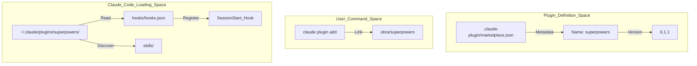
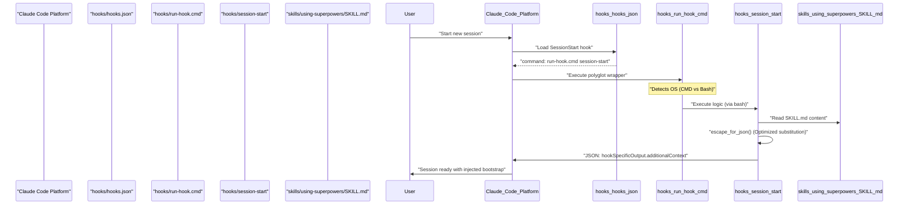
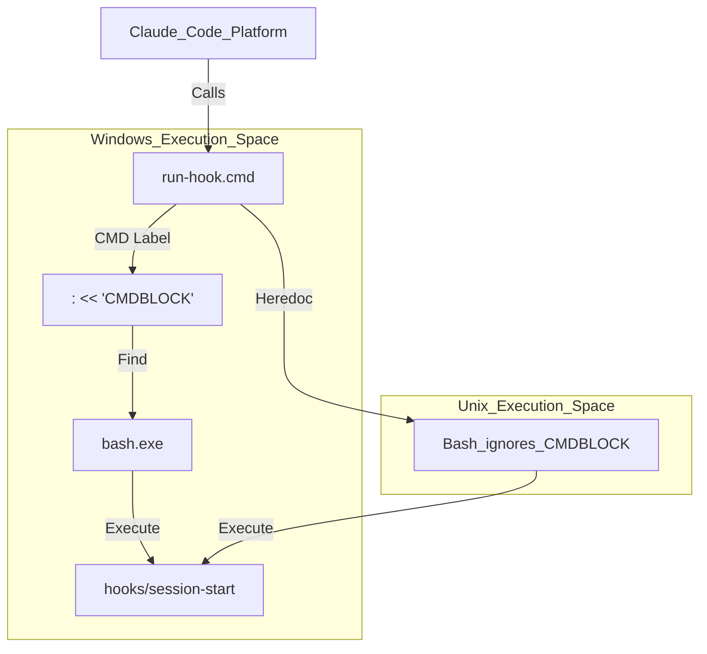

# Claude Code Integration

<details>
<summary>Relevant source files</summary>

The following files were used as context for generating this wiki page:

- [.claude-plugin/marketplace.json](https://github.com/obra/superpowers/blob/HEAD/.claude-plugin/marketplace.json)
- [.gitattributes](https://github.com/obra/superpowers/blob/HEAD/.gitattributes)
- [LICENSE](https://github.com/obra/superpowers/blob/HEAD/LICENSE)
- [hooks/hooks-cursor.json](https://github.com/obra/superpowers/blob/HEAD/hooks/hooks-cursor.json)
- [hooks/hooks.json](https://github.com/obra/superpowers/blob/HEAD/hooks/hooks.json)
- [hooks/run-hook.cmd](https://github.com/obra/superpowers/blob/HEAD/hooks/run-hook.cmd)
- [hooks/session-start](https://github.com/obra/superpowers/blob/HEAD/hooks/session-start)

</details>


Claude Code integration for Superpowers utilizes a native plugin manifest system with marketplace-based installation. The integration centers on a synchronous `SessionStart` hook that injects the `using-superpowers` skill content as bootstrap context before the agent's first turn.

## Overview

Claude Code provides native support for plugins through its manifest system. The Superpowers integration consists of:

**Core components:**
- **Plugin manifest**: `.claude-plugin/marketplace.json` defines the plugin metadata and marketplace configuration for Claude Code [[.claude-plugin/marketplace.json:1-20](https://github.com/obra/superpowers/blob/HEAD/[.claude-plugin/marketplace.json:1-20)].
- **Hooks configuration**: `hooks/hooks.json` registers lifecycle hooks using a cross-platform polyglot wrapper [[hooks/hooks.json:1-16](https://github.com/obra/superpowers/blob/HEAD/[hooks/hooks.json:1-16)].
- **Bootstrap injection**: `hooks/session-start` is an extensionless bash script that injects context into the session [[hooks/session-start:1-50](https://github.com/obra/superpowers/blob/HEAD/[hooks/session-start:1-50)].
- **Skills directory**: `skills/` contains skill definitions in `SKILL.md` format, which Claude Code discovers natively.

**Native tools Claude Code provides:**
- `Skill` tool: Browse, search, and invoke skills.
- `Task` tool: Dispatch subagents for parallel work.
- `TodoWrite` tool: Track implementation progress.

Sources: [[.claude-plugin/marketplace.json:1-20](https://github.com/obra/superpowers/blob/HEAD/[.claude-plugin/marketplace.json:1-20), [hooks/hooks.json:1-16](https://github.com/obra/superpowers/blob/HEAD/hooks/hooks.json#L1-L16), [hooks/session-start:1-50](https://github.com/obra/superpowers/blob/HEAD/hooks/session-start#L1-L50)]

## Plugin Manifest Structure

The plugin is defined in the marketplace manifest at [[.claude-plugin/marketplace.json:1-20](https://github.com/obra/superpowers/blob/HEAD/[.claude-plugin/marketplace.json:1-20)]:

```json
{
  "name": "superpowers-dev",
  "description": "Development marketplace for Superpowers core skills library",
  "plugins": [
    {
      "name": "superpowers",
      "description": "Core skills library for Claude Code: TDD, debugging, collaboration patterns, and proven techniques",
      "version": "6.1.1",
      "source": "./"
    }
  ]
}
```

**Convention-based discovery:**
Claude Code automatically detects plugin resources by directory name:
- `skills/`: Skill definitions (`SKILL.md` files with frontmatter).
- `hooks/hooks.json`: Lifecycle hook registration [[hooks/hooks.json:1-16](https://github.com/obra/superpowers/blob/HEAD/[hooks/hooks.json:1-16)].

Sources: [[.claude-plugin/marketplace.json:1-20](https://github.com/obra/superpowers/blob/HEAD/[.claude-plugin/marketplace.json:1-20), [hooks/hooks.json:1-16](https://github.com/obra/superpowers/blob/HEAD/hooks/hooks.json#L1-L16)]

## Installation and Discovery Flow

**Title: Plugin Registration and Discovery Flow**



The manifest at [[.claude-plugin/marketplace.json:1-20](https://github.com/obra/superpowers/blob/HEAD/[.claude-plugin/marketplace.json:1-20)] defines plugin metadata. When installed, Claude Code monitors the `skills/` directory for any `SKILL.md` files to populate its internal `Skill` tool.

Sources: [[.claude-plugin/marketplace.json:1-20](https://github.com/obra/superpowers/blob/HEAD/[.claude-plugin/marketplace.json:1-20)]

## Hooks System Configuration

### hooks.json Structure

Claude Code requires a `hooks.json` file to register lifecycle hooks. The `SessionStart` hook runs **synchronously** (`"async": false`) to ensure bootstrap context is injected before the agent's first response [[hooks/hooks.json:10-10](https://github.com/obra/superpowers/blob/HEAD/[hooks/hooks.json:10-10)].

```json
{
  "hooks": {
    "SessionStart": [
      {
        "matcher": "startup|clear|compact",
        "hooks": [
          {
            "type": "command",
            "command": "\"${CLAUDE_PLUGIN_ROOT}/hooks/run-hook.cmd\" session-start",
            "async": false
          }
        ]
      }
    ]
  }
}
```

The hook fires on `startup`, `clear`, and `compact` events [[hooks/hooks.json:5-5](https://github.com/obra/superpowers/blob/HEAD/[hooks/hooks.json:5-5)]. It uses a polyglot wrapper `run-hook.cmd` to handle cross-platform execution [[hooks/hooks.json:9-9](https://github.com/obra/superpowers/blob/HEAD/[hooks/hooks.json:9-9)].

Sources: [[hooks/hooks.json:1-16](https://github.com/obra/superpowers/blob/HEAD/[hooks/hooks.json:1-16)]

### Hook Execution Flow

**Title: SessionStart Hook Execution Sequence**



Sources: [[hooks/hooks.json:1-16](https://github.com/obra/superpowers/blob/HEAD/[hooks/hooks.json:1-16), [hooks/session-start:1-50](https://github.com/obra/superpowers/blob/HEAD/hooks/session-start#L1-L50), [hooks/run-hook.cmd:1-47](https://github.com/obra/superpowers/blob/HEAD/hooks/run-hook.cmd#L1-L47)]

## Bootstrap Injection Mechanism

### session-start Script Implementation

The hook script `hooks/session-start` performs bootstrap injection. It is extensionless to prevent Windows from attempting to open it in a text editor [[hooks/run-hook.cmd:7-9](https://github.com/obra/superpowers/blob/HEAD/[hooks/run-hook.cmd:7-9)].

**Path Resolution and Environment Detection:**
The script determines the `PLUGIN_ROOT` [[hooks/session-start:7-8](https://github.com/obra/superpowers/blob/HEAD/[hooks/session-start:7-8)] and reads the `using-superpowers` skill content [[hooks/session-start:11-11](https://github.com/obra/superpowers/blob/HEAD/[hooks/session-start:11-11)].

**JSON Escaping Optimization:**
The `escape_for_json()` function uses bash parameter substitution (`${s//old/new}`) instead of character-by-character loops, which is significantly faster for large skill files [[hooks/session-start:16-24](https://github.com/obra/superpowers/blob/HEAD/[hooks/session-start:16-24)].

**Platform-Specific Output:**
The script detects the environment via variables like `CLAUDE_PLUGIN_ROOT` and `CURSOR_PLUGIN_ROOT` to emit the correct JSON structure:
- **Claude Code**: Expects `hookSpecificOutput.additionalContext` [[hooks/session-start:41-43](https://github.com/obra/superpowers/blob/HEAD/[hooks/session-start:41-43)].
- **Cursor**: Expects `additional_context` [[hooks/session-start:38-40](https://github.com/obra/superpowers/blob/HEAD/[hooks/session-start:38-40)].
- **Copilot CLI**: Expects `additionalContext` at the top level [[hooks/session-start:44-46](https://github.com/obra/superpowers/blob/HEAD/[hooks/session-start:44-46)].

Sources: [[hooks/session-start:1-50](https://github.com/obra/superpowers/blob/HEAD/[hooks/session-start:1-50), [hooks/run-hook.cmd:7-9](https://github.com/obra/superpowers/blob/HEAD/hooks/run-hook.cmd#L7-L9)]

### Polyglot Hook Wrapper

To support Windows, macOS, and Linux, Superpowers uses a polyglot wrapper `hooks/run-hook.cmd`.

**Title: Cross-Platform Hook Resolution (run-hook.cmd)**



This wrapper ensures that even on Windows, the bash-based `session-start` logic executes correctly by locating a `bash.exe` instance from Git for Windows standard locations [[hooks/run-hook.cmd:21-28](https://github.com/obra/superpowers/blob/HEAD/[hooks/run-hook.cmd:21-28)] or the system `PATH` [[hooks/run-hook.cmd:31-35](https://github.com/obra/superpowers/blob/HEAD/[hooks/run-hook.cmd:31-35)].

Sources: [[hooks/run-hook.cmd:1-47](https://github.com/obra/superpowers/blob/HEAD/[hooks/run-hook.cmd:1-47)]

## Compatibility and Line Endings

- **Line Endings**: `.gitattributes` enforces `eol=lf` for all shell and polyglot scripts to prevent execution errors on Windows when CMD or Bash parses them [[.gitattributes:1-6](https://github.com/obra/superpowers/blob/HEAD/[.gitattributes:1-6)].
- **Bash Hang Prevention**: The `session-start` hook uses `printf` instead of heredocs (`cat <<EOF`) to avoid a known hang in bash 5.3+ when expanding large variables [[hooks/session-start:36-37](https://github.com/obra/superpowers/blob/HEAD/[hooks/session-start:36-37)].

Sources: [[.gitattributes:1-19](https://github.com/obra/superpowers/blob/HEAD/[.gitattributes:1-19), [hooks/session-start:36-37](https://github.com/obra/superpowers/blob/HEAD/hooks/session-start#L36-L37)]