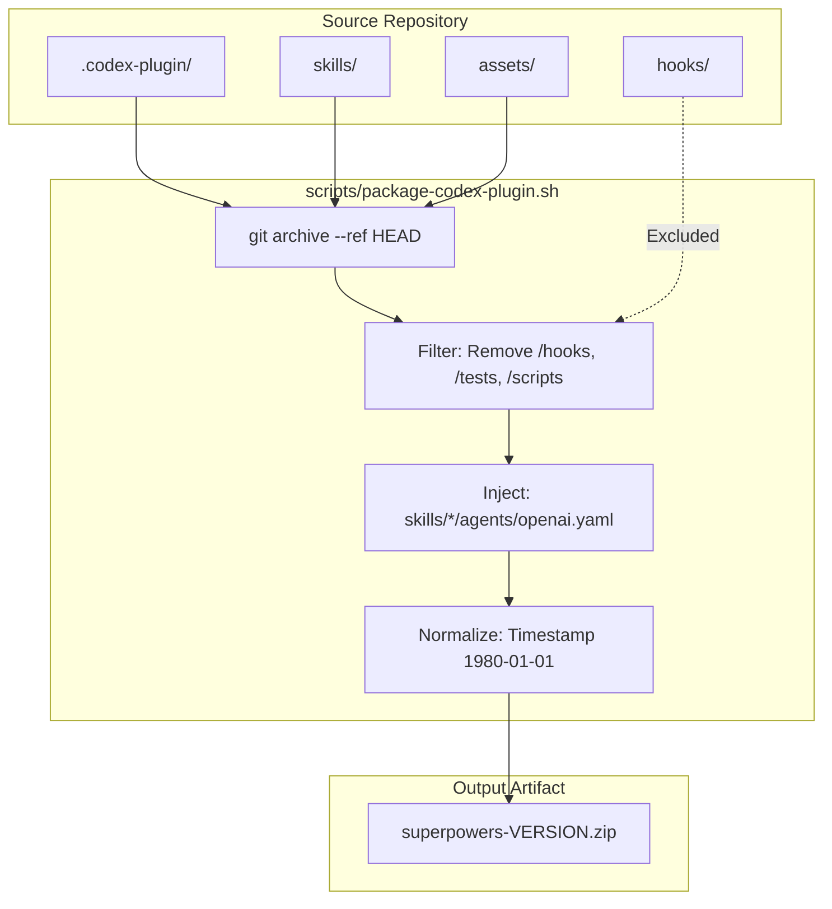
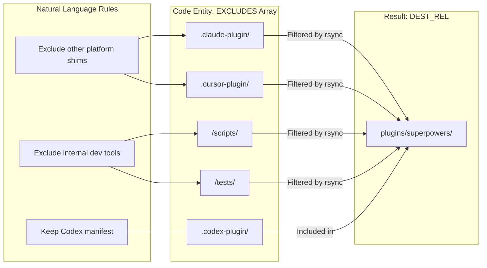

# Codex Integration

Relevant source files

The following files were used as context for generating this wiki page:

- [.agents/plugins/marketplace.json](https://github.com/obra/superpowers/blob/HEAD/.agents/plugins/marketplace.json)
- [.codex-plugin/plugin.json](https://github.com/obra/superpowers/blob/HEAD/.codex-plugin/plugin.json)
- [.version-bump.json](https://github.com/obra/superpowers/blob/HEAD/.version-bump.json)
- [docs/README.kimi.md](https://github.com/obra/superpowers/blob/HEAD/docs/README.kimi.md)
- [scripts/package-codex-plugin.sh](https://github.com/obra/superpowers/blob/HEAD/scripts/package-codex-plugin.sh)
- [scripts/sync-to-codex-plugin.sh](https://github.com/obra/superpowers/blob/HEAD/scripts/sync-to-codex-plugin.sh)
- [tests/codex-plugin-sync/test-sync-to-codex-plugin.sh](https://github.com/obra/superpowers/blob/HEAD/tests/codex-plugin-sync/test-sync-to-codex-plugin.sh)
- [tests/codex/test-marketplace-manifest.sh](https://github.com/obra/superpowers/blob/HEAD/tests/codex/test-marketplace-manifest.sh)
- [tests/codex/test-package-codex-plugin.sh](https://github.com/obra/superpowers/blob/HEAD/tests/codex/test-package-codex-plugin.sh)
- [tests/kimi/run-tests.sh](https://github.com/obra/superpowers/blob/HEAD/tests/kimi/run-tests.sh)
- [tests/kimi/test-plugin-manifest.sh](https://github.com/obra/superpowers/blob/HEAD/tests/kimi/test-plugin-manifest.sh)

This document covers Codex-specific integration mechanisms for the Superpowers plugin. It explains native skill discovery, manifest configuration, tool mappings, and the infrastructure for packaging and synchronizing the plugin with the Codex ecosystem.

## Overview

Codex integration leverages a combination of a dedicated manifest in `.codex-plugin/plugin.json` and native skill discovery. Unlike other platforms that might rely on complex hook systems, Codex primarily uses the manifest to define the plugin's identity and point to the shared `skills/` directory.

**Key characteristics:**
- **Manifest-driven**: Uses `.codex-plugin/plugin.json` for name, version, and skill path definitions [[.codex-plugin/plugin.json:1-48]]().
- **Skill Discovery**: Points Codex to the `./skills/` directory for agentic capability discovery [[.codex-plugin/plugin.json:23-23]]().
- **Hook Suppression**: Explicitly declares an empty `hooks` object `{}` to prevent Codex from auto-discovering and executing local `hooks/hooks.json` files intended for other platforms [[.codex-plugin/plugin.json:24-24]](), [[tests/codex/test-marketplace-manifest.sh:69-73]]().
- **Tool Mapping**: Skills written for Claude Code are mapped to Codex native capabilities (Interactive, Read, Write) [[.codex-plugin/plugin.json:31-35]]().

**Sources:** [[.codex-plugin/plugin.json:1-48]](), [[tests/codex/test-marketplace-manifest.sh:55-73]]()

## Manifest Configuration

The `.codex-plugin/plugin.json` file serves as the primary integration point. It defines how the Codex environment perceives the Superpowers framework.

### Manifest Structure

| Field | Value | Purpose |
|-------|-------|---------|
| `name` | `superpowers` | Unique identifier for the plugin [[.codex-plugin/plugin.json:2-2]]() |
| `skills` | `./skills/` | Path to the directory containing `SKILL.md` files [[.codex-plugin/plugin.json:23-23]]() |
| `hooks` | `{}` | Explicitly empty to suppress auto-discovery of generic hooks [[.codex-plugin/plugin.json:24-24]]() |
| `capabilities` | `["Interactive", "Read", "Write"]` | Declared runtime permissions [[.codex-plugin/plugin.json:31-35]]() |

### Hook Auto-Discovery Prevention
Codex has a default behavior where it searches for `hooks/hooks.json` if the `hooks` field is missing from the manifest. Because Superpowers includes a `hooks/hooks.json` for Claude Code compatibility, the Codex manifest must explicitly set `"hooks": {}` to avoid triggering install-time trust prompts for hooks it does not use [[tests/codex/test-marketplace-manifest.sh:55-64]]().

**Sources:** [[.codex-plugin/plugin.json:1-48]](), [[tests/codex/test-marketplace-manifest.sh:65-74]]()

## Packaging and Artifacts

For portal uploads and distribution, the plugin is packaged into rootless archives. This process ensures that only the necessary runtime files are included while stripping development-only assets.

### Packaging Pipeline

Title: Codex Packaging Data Flow (Code Entity Space)

**Key Packaging Details:**
- **Rootless Archive**: The archive contains `.codex-plugin/`, `assets/`, and `skills/` at the root, excluding the repository wrapper [[scripts/package-codex-plugin.sh:42-45]]().
- **Metadata Seeding**: The script `package-codex-plugin.sh` seeds OpenAI-specific metadata (`openai.yaml`) from a `--metadata-source` into the `skills/` subdirectories [[scripts/package-codex-plugin.sh:7-9]]().
- **Determinism**: Timestamps are normalized to `1980-01-01` to ensure identical source trees produce identical archive hashes [[tests/codex/test-package-codex-plugin.sh:188-196]]().

**Sources:** [[scripts/package-codex-plugin.sh:1-45]](), [[tests/codex/test-package-codex-plugin.sh:165-173]]()

## Synchronization and Maintenance

The framework maintains parity with the official `openai-codex-plugins` repository via a specialized synchronization script.

### Sync Workflow (`sync-to-codex-plugin.sh`)

This script manages the lifecycle of updating the plugin within the larger Codex ecosystem.

1. **Upstream Detection**: Automatically detects the fork at `prime-radiant-inc/openai-codex-plugins` [[scripts/sync-to-codex-plugin.sh:35-35]]().
2. **Path Filtering**: Uses an `EXCLUDES` array to prevent infrastructure files (like `.claude-plugin/`, `.cursor-plugin/`, `.opencode/`, and `scripts/`) from landing in the embedded plugin directory [[scripts/sync-to-codex-plugin.sh:45-81]]().
3. **Version Extraction**: Uses `python3` to parse the current version directly from the manifest to ensure consistency [[scripts/sync-to-codex-plugin.sh:180-181]]().

Title: Codex Sync Exclusion Logic (Natural Language to Code Entity)

**Sources:** [[scripts/sync-to-codex-plugin.sh:31-81]](), [[scripts/sync-to-codex-plugin.sh:180-185]]()

## Testing and Validation

Codex integration is verified through two primary test suites:

1. **Manifest Validation**: `tests/codex/test-marketplace-manifest.sh` ensures the `marketplace.json` correctly points to the local directory and that the `plugin.json` manifest suppresses hooks [[tests/codex/test-marketplace-manifest.sh:1-76]]().
2. **Package Validation**: `tests/codex/test-package-codex-plugin.sh` verifies that the generated `.zip` or `.tar.gz` archives contain the correct file structure, preserve executable permissions for scripts, and include required OpenAI metadata [[tests/codex/test-package-codex-plugin.sh:165-186]]().

**Sources:** [[tests/codex/test-marketplace-manifest.sh:1-76]](), [[tests/codex/test-package-codex-plugin.sh:1-215]]()