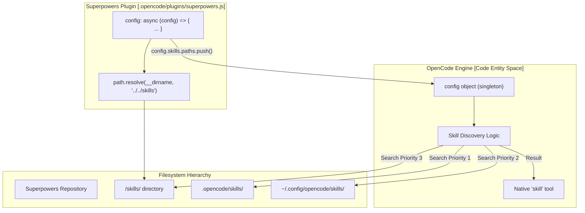
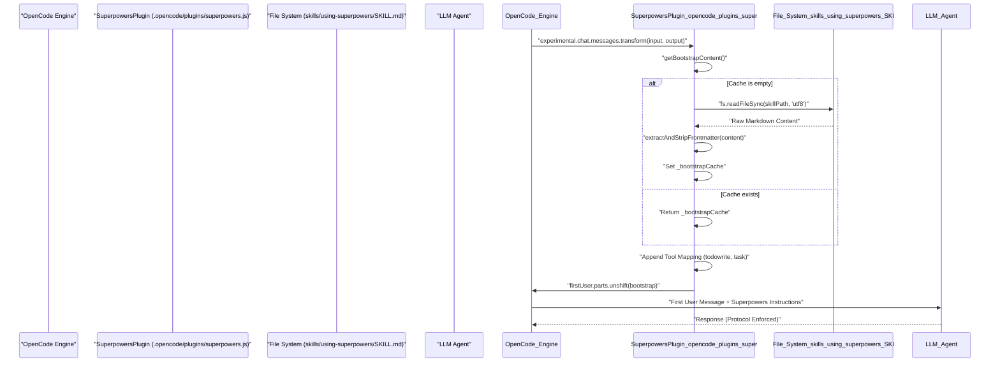

# OpenCode Integration

Relevant source files

The following files were used as context for generating this wiki page:

- [.opencode/INSTALL.md](https://github.com/obra/superpowers/blob/HEAD/.opencode/INSTALL.md)
- [.opencode/plugins/superpowers.js](https://github.com/obra/superpowers/blob/HEAD/.opencode/plugins/superpowers.js)
- [docs/README.opencode.md](https://github.com/obra/superpowers/blob/HEAD/docs/README.opencode.md)
- [docs/testing.md](https://github.com/obra/superpowers/blob/HEAD/docs/testing.md)
- [tests/opencode/run-tests.sh](https://github.com/obra/superpowers/blob/HEAD/tests/opencode/run-tests.sh)
- [tests/opencode/setup.sh](https://github.com/obra/superpowers/blob/HEAD/tests/opencode/setup.sh)
- [tests/opencode/test-plugin-loading.sh](https://github.com/obra/superpowers/blob/HEAD/tests/opencode/test-plugin-loading.sh)
- [tests/opencode/test-priority.sh](https://github.com/obra/superpowers/blob/HEAD/tests/opencode/test-priority.sh)
- [tests/opencode/test-tools.sh](https://github.com/obra/superpowers/blob/HEAD/tests/opencode/test-tools.sh)

## Purpose and Scope

This page documents the technical implementation of Superpowers integration with [OpenCode.ai](https://opencode.ai). It covers the JavaScript plugin architecture, the automated registration mechanism via the `config` hook, session-start bootstrap injection via the `experimental.chat.messages.transform` hook, and the native tool mapping layer.

For installation instructions, see [Installing on OpenCode (2.3)](). For the shared skill resolution logic used across platforms, see [skills-core.js Shared Module (5.5)]().

---

## Plugin Architecture Overview

The OpenCode integration is implemented as a native JavaScript plugin located at [.opencode/plugins/superpowers.js:1-140](https://github.com/obra/superpowers/blob/HEAD/.opencode/plugins/superpowers.js#L1-L140). The current architecture uses OpenCode's internal configuration hooks to self-register the skills path and transform chat messages to include protocol instructions.

### Core Components

| Component | Location | Purpose |
|-----------|----------|---------|
| `SuperpowersPlugin` | [.opencode/plugins/superpowers.js:55-139](https://github.com/obra/superpowers/blob/HEAD/.opencode/plugins/superpowers.js#L55-L139) | Main entry point exporting `config` and `experimental.chat.messages.transform` hooks. |
| `getBootstrapContent` | [.opencode/plugins/superpowers.js:62-100](https://github.com/obra/superpowers/blob/HEAD/.opencode/plugins/superpowers.js#L62-L100) | Generates the system context by reading the `using-superpowers` skill and appending tool mappings. Includes a module-level cache `_bootstrapCache` [.opencode/plugins/superpowers.js:53](https://github.com/obra/superpowers/blob/HEAD/.opencode/plugins/superpowers.js#L53) to eliminate redundant disk I/O. |
| `extractAndStripFrontmatter` | [.opencode/plugins/superpowers.js:16-34](https://github.com/obra/superpowers/blob/HEAD/.opencode/plugins/superpowers.js#L16-L34) | Internal utility to parse `SKILL.md` files without external dependencies. |
| Registration Hook | [.opencode/plugins/superpowers.js:107-113](https://github.com/obra/superpowers/blob/HEAD/.opencode/plugins/superpowers.js#L107-L113) | Injects the skills directory into OpenCode's search path dynamically. |
| Message Transform | [.opencode/plugins/superpowers.js:124-137](https://github.com/obra/superpowers/blob/HEAD/.opencode/plugins/superpowers.js#L124-L137) | Injects bootstrap into the first user message of each session. |

**Key Architecture Decision:** The plugin uses the `config` hook to modify the live configuration object. This allows OpenCode to discover Superpowers skills automatically without requiring users to edit `opencode.json` or create manual symlinks in `~/.config/opencode/skills/` [.opencode/plugins/superpowers.js:103-106](https://github.com/obra/superpowers/blob/HEAD/.opencode/plugins/superpowers.js#L103-L106).

Sources: [.opencode/plugins/superpowers.js:1-140](https://github.com/obra/superpowers/blob/HEAD/.opencode/plugins/superpowers.js#L1-L140), [docs/README.opencode.md:98-104](https://github.com/obra/superpowers/blob/HEAD/docs/README.opencode.md#L98-L104)

---

## Skill Discovery and Registration

OpenCode maintains a list of directories where it searches for skills. The Superpowers plugin automates this registration during the initialization phase.

### Automated Path Injection

The plugin implements the `config` hook [.opencode/plugins/superpowers.js:107-113](https://github.com/obra/superpowers/blob/HEAD/.opencode/plugins/superpowers.js#L107-L113). When OpenCode loads the plugin, it passes the current configuration object to this function. The plugin then appends the absolute path of the Superpowers `skills/` directory to `config.skills.paths`.

**Diagram: Skill Discovery Architecture**

Sources: [.opencode/plugins/superpowers.js:107-113](https://github.com/obra/superpowers/blob/HEAD/.opencode/plugins/superpowers.js#L107-L113), [docs/README.opencode.md:81-82](https://github.com/obra/superpowers/blob/HEAD/docs/README.opencode.md#L81-L82), [tests/opencode/test-priority.sh:20-63](https://github.com/obra/superpowers/blob/HEAD/tests/opencode/test-priority.sh#L20-L63)

---

## Bootstrap Injection Mechanism

To ensure the AI agent follows the "Superpowers Protocol" from the first message, the plugin injects the `using-superpowers` meta-skill directly into the conversation stream.

### Message Transform Hook

The plugin utilizes the `experimental.chat.messages.transform` hook [.opencode/plugins/superpowers.js:124-137](https://github.com/obra/superpowers/blob/HEAD/.opencode/plugins/superpowers.js#L124-L137). This hook is called before LLM requests, allowing the plugin to modify the message history. 

**Implementation Details:**
1. **Targeting:** It finds the first message where `role === 'user'` [.opencode/plugins/superpowers.js:127](https://github.com/obra/superpowers/blob/HEAD/.opencode/plugins/superpowers.js#L127).
2. **Idempotency:** It checks for the string `EXTREMELY_IMPORTANT` to ensure it only injects once per session [.opencode/plugins/superpowers.js:133](https://github.com/obra/superpowers/blob/HEAD/.opencode/plugins/superpowers.js#L133).
3. **Model Compatibility:** Using a user message transform instead of a system message avoids token bloat from repeated system messages and prevents breaking models like Qwen that struggle with multiple system messages [.opencode/plugins/superpowers.js:116-118](https://github.com/obra/superpowers/blob/HEAD/.opencode/plugins/superpowers.js#L116-L118).
4. **Caching:** The `_bootstrapCache` variable [.opencode/plugins/superpowers.js:53](https://github.com/obra/superpowers/blob/HEAD/.opencode/plugins/superpowers.js#L53) ensures that `getBootstrapContent()` [.opencode/plugins/superpowers.js:62](https://github.com/obra/superpowers/blob/HEAD/.opencode/plugins/superpowers.js#L62) does not perform redundant disk reads on every agent step [.opencode/plugins/superpowers.js:120-123](https://github.com/obra/superpowers/blob/HEAD/.opencode/plugins/superpowers.js#L120-L123).

**Diagram: Bootstrap Data Flow**

Sources: [.opencode/plugins/superpowers.js:124-137](https://github.com/obra/superpowers/blob/HEAD/.opencode/plugins/superpowers.js#L124-L137), [.opencode/plugins/superpowers.js:62-100](https://github.com/obra/superpowers/blob/HEAD/.opencode/plugins/superpowers.js#L62-L100), [tests/opencode/test-plugin-loading.sh:47-52](https://github.com/obra/superpowers/blob/HEAD/tests/opencode/test-plugin-loading.sh#L47-L52)

---

## Tool Mapping Layer

Since Superpowers skills are primarily authored for Claude Code, they often reference tools like `TodoWrite` or `Task`. The OpenCode integration provides a translation layer via the bootstrap instructions to map these to native OpenCode capabilities.

### Tool Substitution Reference

| Claude Code Tool | OpenCode Equivalent | Implementation Note |
|------------------|---------------------|---------------------|
| `TodoWrite` | `todowrite` | Native OpenCode tool for plan updates [.opencode/plugins/superpowers.js:78](https://github.com/obra/superpowers/blob/HEAD/.opencode/plugins/superpowers.js#L78). |
| `Task` (Subagents) | `task` | OpenCode's native subagent tool with `subagent_type: "general"` [.opencode/plugins/superpowers.js:79](https://github.com/obra/superpowers/blob/HEAD/.opencode/plugins/superpowers.js#L79). |
| `Skill` | `skill` | OpenCode's native skill discovery tool [.opencode/plugins/superpowers.js:80](https://github.com/obra/superpowers/blob/HEAD/.opencode/plugins/superpowers.js#L80). |
| `Read` | `read` | Native file reading [.opencode/plugins/superpowers.js:81](https://github.com/obra/superpowers/blob/HEAD/.opencode/plugins/superpowers.js#L81). |
| `Edit`/`Write` | `apply_patch` | Native file modification [.opencode/plugins/superpowers.js:82](https://github.com/obra/superpowers/blob/HEAD/.opencode/plugins/superpowers.js#L82). |
| `Bash` | `bash` | Native shell execution [.opencode/plugins/superpowers.js:83](https://github.com/obra/superpowers/blob/HEAD/.opencode/plugins/superpowers.js#L83). |

These mappings are explicitly defined in the `getBootstrapContent` function [.opencode/plugins/superpowers.js:76-85](https://github.com/obra/superpowers/blob/HEAD/.opencode/plugins/superpowers.js#L76-L85) and injected into the first user message of every session.

Sources: [.opencode/plugins/superpowers.js:76-85](https://github.com/obra/superpowers/blob/HEAD/.opencode/plugins/superpowers.js#L76-L85), [.opencode/INSTALL.md:99-111](https://github.com/obra/superpowers/blob/HEAD/.opencode/INSTALL.md#L99-L111), [tests/opencode/test-tools.sh:69-93](https://github.com/obra/superpowers/blob/HEAD/tests/opencode/test-tools.sh#L69-L93)

---

## Testing and Verification

The repository includes a dedicated test runner for verifying the OpenCode integration.

### Test Runner

The `run-tests.sh` script [tests/opencode/run-tests.sh:1-166](https://github.com/obra/superpowers/blob/HEAD/tests/opencode/run-tests.sh#L1-L166) coordinates the execution of the OpenCode test suite. It supports both unit-style checks and full integration tests.

- **Plugin Loading:** `test-plugin-loading.sh` verifies the plugin installation and internal structure [tests/opencode/run-tests.sh:62](https://github.com/obra/superpowers/blob/HEAD/tests/opencode/run-tests.sh#L62). It specifically checks for valid JavaScript syntax [tests/opencode/test-plugin-loading.sh:56-61](https://github.com/obra/superpowers/blob/HEAD/tests/opencode/test-plugin-loading.sh#L56-L61) and the existence of the critical `using-superpowers` skill [tests/opencode/test-plugin-loading.sh:47-52](https://github.com/obra/superpowers/blob/HEAD/tests/opencode/test-plugin-loading.sh#L47-L52).
- **Integration Tests:** When run with the `--integration` flag, it executes tests that require a functional `opencode` environment [tests/opencode/run-tests.sh:24-27](https://github.com/obra/superpowers/blob/HEAD/tests/opencode/run-tests.sh#L24-L27).
  - `test-tools.sh`: Verifies the native `skill` tool functionality across personal, project, and bundled skills [tests/opencode/test-tools.sh:1-96](https://github.com/obra/superpowers/blob/HEAD/tests/opencode/test-tools.sh#L1-L96).
  - `test-priority.sh`: Validates the skill priority resolution (Project > Personal > Superpowers) [tests/opencode/test-priority.sh:1-214](https://github.com/obra/superpowers/blob/HEAD/tests/opencode/test-priority.sh#L1-L214). Note that current OpenCode behavior may load bundled versions over local versions for duplicate native names [tests/opencode/test-priority.sh:163-164](https://github.com/obra/superpowers/blob/HEAD/tests/opencode/test-priority.sh#L163-L164).

### Verification Commands
Users can manually verify the integration by checking logs or listing skills:
- **Log Check:** `opencode run --print-logs "hello" 2>&1 | grep -i superpowers` [.opencode/INSTALL.md:70](https://github.com/obra/superpowers/blob/HEAD/.opencode/INSTALL.md#L70).
- **Skill Discovery:** `use skill tool to list skills` [.opencode/INSTALL.md:47](https://github.com/obra/superpowers/blob/HEAD/.opencode/INSTALL.md#L47).

Sources: [tests/opencode/run-tests.sh:1-166](https://github.com/obra/superpowers/blob/HEAD/tests/opencode/run-tests.sh#L1-L166), [.opencode/INSTALL.md:68-72](https://github.com/obra/superpowers/blob/HEAD/.opencode/INSTALL.md#L68-L72), [tests/opencode/setup.sh:1-81](https://github.com/obra/superpowers/blob/HEAD/tests/opencode/setup.sh#L1-L81), [tests/opencode/test-priority.sh:162-170](https://github.com/obra/superpowers/blob/HEAD/tests/opencode/test-priority.sh#L162-L170)