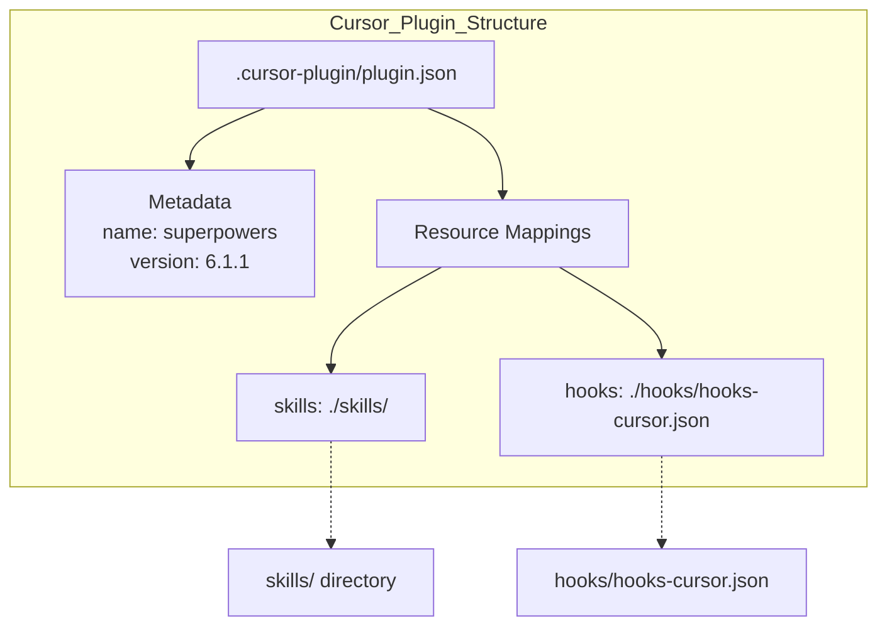
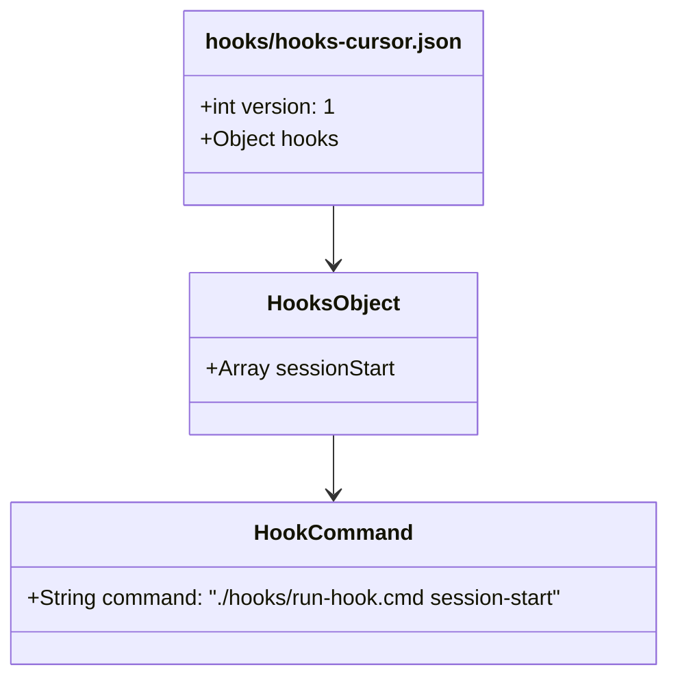
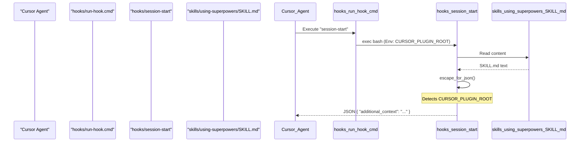

# Cursor Integration

<details>
<summary>Relevant source files</summary>

The following files were used as context for generating this wiki page:

- [.cursor-plugin/plugin.json](https://github.com/obra/superpowers/blob/HEAD/.cursor-plugin/plugin.json)
- [gemini-extension.json](https://github.com/obra/superpowers/blob/HEAD/gemini-extension.json)
- [hooks/hooks-cursor.json](https://github.com/obra/superpowers/blob/HEAD/hooks/hooks-cursor.json)
- [hooks/session-start](https://github.com/obra/superpowers/blob/HEAD/hooks/session-start)

</details>


## Purpose and Scope

This page documents Cursor-specific integration for the Superpowers plugin system. It covers the `.cursor-plugin/` manifest structure, the `hooks-cursor.json` configuration, tool compatibility, and the cross-platform hook execution logic. For general platform integration concepts, see **4.3 Multi-Platform Integration**. For session lifecycle mechanics, see **4.4 Session Lifecycle and Bootstrap**.

## Overview

Cursor support provides a native plugin integration that allows Cursor's AI agent to utilize the Superpowers skill library. Unlike OpenCode or Codex, which may require manual configuration, Cursor uses a structured plugin manifest and a specific hook format.

The integration handles Cursor-specific environmental variables and camelCase hook formats. Cursor executes the `session-start` hook to inject the `using-superpowers` meta-skill context into the conversation history.

**Sources:** [.cursor-plugin/plugin.json:1-23](https://github.com/obra/superpowers/blob/HEAD/.cursor-plugin/plugin.json#L1-L23), [hooks/hooks-cursor.json:1-11](https://github.com/obra/superpowers/blob/HEAD/hooks/hooks-cursor.json#L1-L11), [hooks/session-start:38-40](https://github.com/obra/superpowers/blob/HEAD/hooks/session-start#L38-L40)

## Plugin Manifest Structure

### plugin.json Configuration

The Cursor plugin manifest defines plugin metadata and identifies the location of resources like skills and hooks.

Title: Cursor Plugin Resource Mapping


**Sources:** [.cursor-plugin/plugin.json:1-23](https://github.com/obra/superpowers/blob/HEAD/.cursor-plugin/plugin.json#L1-L23)

### Manifest Fields

| Field | Value | Purpose |
|-------|-------|---------|
| `name` | `"superpowers"` | Internal plugin identifier [[.cursor-plugin/plugin.json:2](https://github.com/obra/superpowers/blob/HEAD/[.cursor-plugin/plugin.json:2)] |
| `displayName` | `"Superpowers"` | UI name in Cursor [[.cursor-plugin/plugin.json:3](https://github.com/obra/superpowers/blob/HEAD/[.cursor-plugin/plugin.json:3)] |
| `version` | `"6.1.1"` | Plugin version [[.cursor-plugin/plugin.json:5](https://github.com/obra/superpowers/blob/HEAD/[.cursor-plugin/plugin.json:5)] |
| `skills` | `"./skills/"` | Path to the directory containing `SKILL.md` files [[.cursor-plugin/plugin.json:21](https://github.com/obra/superpowers/blob/HEAD/[.cursor-plugin/plugin.json:21)] |
| `hooks` | `"./hooks/hooks-cursor.json"` | Pointer to the Cursor-specific hook manifest [[.cursor-plugin/plugin.json:22](https://github.com/obra/superpowers/blob/HEAD/[.cursor-plugin/plugin.json:22)] |

**Sources:** [.cursor-plugin/plugin.json:1-23](https://github.com/obra/superpowers/blob/HEAD/.cursor-plugin/plugin.json#L1-L23)

## Hook System Integration

### hooks-cursor.json Format

Cursor utilizes a specific JSON format for hooks that differs from Claude Code. It uses `camelCase` for event names (e.g., `sessionStart`) and requires a `version` field.

Title: Cursor Hook Manifest Schema


**Sources:** [hooks/hooks-cursor.json:1-11](https://github.com/obra/superpowers/blob/HEAD/hooks/hooks-cursor.json#L1-L11)

### SessionStart Hook Execution

When a session begins, Cursor triggers the `sessionStart` hook. This executes the `hooks/run-hook.cmd` wrapper with the `session-start` argument. The script performs platform detection to ensure the output format matches what Cursor expects.

Title: Cursor Session Initialization Flow


**Sources:** [hooks/session-start:1-49](https://github.com/obra/superpowers/blob/HEAD/hooks/session-start#L1-L49), [hooks/hooks-cursor.json:4-8](https://github.com/obra/superpowers/blob/HEAD/hooks/hooks-cursor.json#L4-L8)

### Platform Detection and Output

The `session-start` script uses environment variables to determine if it is running within Cursor. If `CURSOR_PLUGIN_ROOT` is set, it emits a JSON object where the context is placed in the `additional_context` field.

| Platform | Detected Variable | JSON Output Field |
|----------|-------------------|-------------------|
| **Cursor** | `CURSOR_PLUGIN_ROOT` | `additional_context` [[hooks/session-start:38-40](https://github.com/obra/superpowers/blob/HEAD/[hooks/session-start:38-40)] |
| **Claude Code** | `CLAUDE_PLUGIN_ROOT` | `hookSpecificOutput.additionalContext` [[hooks/session-start:41-43](https://github.com/obra/superpowers/blob/HEAD/[hooks/session-start:41-43)] |
| **Other / Copilot** | `COPILOT_CLI` or fallback | `additionalContext` [[hooks/session-start:44-47](https://github.com/obra/superpowers/blob/HEAD/[hooks/session-start:44-47)] |

**Sources:** [hooks/session-start:38-47](https://github.com/obra/superpowers/blob/HEAD/hooks/session-start#L38-L47)

## Technical Implementation Details

### JSON Escaping and Output

The `session-start` hook includes a robust `escape_for_json` function to ensure that skill content (which often contains quotes, backslashes, and newlines) can be safely embedded in the JSON response sent back to Cursor.

```bash
escape_for_json() {
    local s="$1"
    s="${s//\\/\\\\}"
    s="${s//\"/\\\"}"
    s="${s//$'\n'/\\n}"
    s="${s//$'\r'/\\r}"
    s="${s//$'\t'/\\t}"
    printf '%s' "$s"
}
```

**Sources:** [hooks/session-start:16-24](https://github.com/obra/superpowers/blob/HEAD/hooks/session-start#L16-L24)

### Hook Response Formatting

Cursor specifically requires the `additional_context` key at the top level of the JSON response. The script uses `printf` instead of heredocs to avoid a known bash 5.3+ hang issue.

```bash
if [ -n "${CURSOR_PLUGIN_ROOT:-}" ]; then
  # Cursor sets CURSOR_PLUGIN_ROOT
  printf '{\n  "additional_context": "%s"\n}\n' "$session_context" | cat
fi
```

**Sources:** [hooks/session-start:36-40](https://github.com/obra/superpowers/blob/HEAD/hooks/session-start#L36-L40)

## Installation and Setup

Users install the integration by adding the Superpowers repository as a plugin in Cursor.

1. **Add Plugin**: Point Cursor to the root of the Superpowers repository.
2. **Manifest Loading**: Cursor automatically detects `.cursor-plugin/plugin.json` [[.cursor-plugin/plugin.json:1-23](https://github.com/obra/superpowers/blob/HEAD/[.cursor-plugin/plugin.json:1-23)].
3. **Initialization**: On the next session start, the `sessionStart` hook defined in `hooks-cursor.json` runs [[hooks/hooks-cursor.json:4-8](https://github.com/obra/superpowers/blob/HEAD/[hooks/hooks-cursor.json:4-8)].
4. **Context Injection**: The `session-start` script reads the `using-superpowers` skill and injects it as `additional_context` to guide the AI's behavior [[hooks/session-start:10-40](https://github.com/obra/superpowers/blob/HEAD/[hooks/session-start:10-40)].

**Sources:** [.cursor-plugin/plugin.json:22](https://github.com/obra/superpowers/blob/HEAD/.cursor-plugin/plugin.json#L22), [hooks/hooks-cursor.json:4-8](https://github.com/obra/superpowers/blob/HEAD/hooks/hooks-cursor.json#L4-L8), [hooks/session-start:38-40](https://github.com/obra/superpowers/blob/HEAD/hooks/session-start#L38-L40)