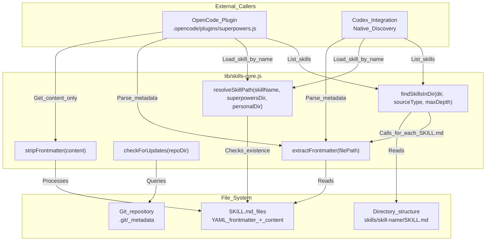
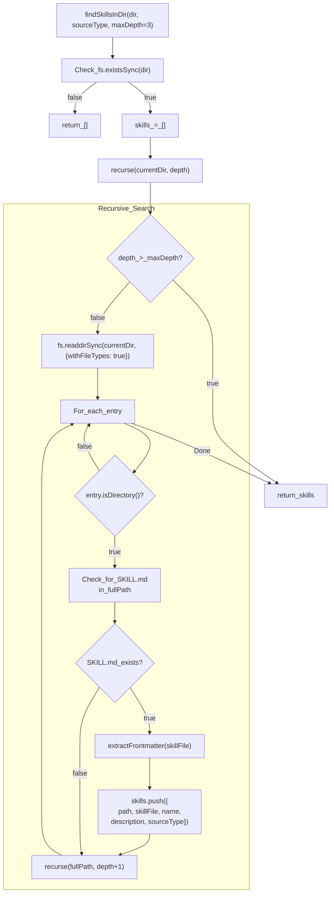
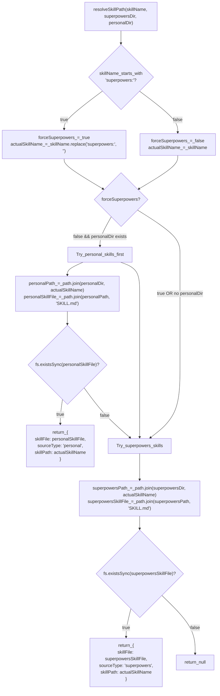
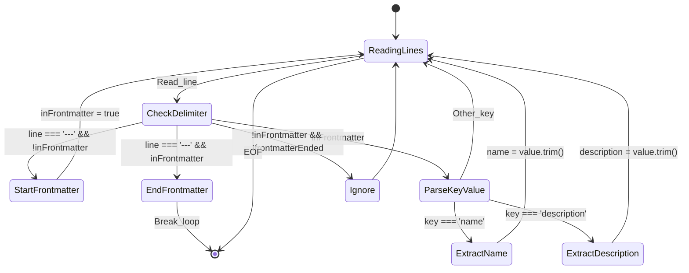
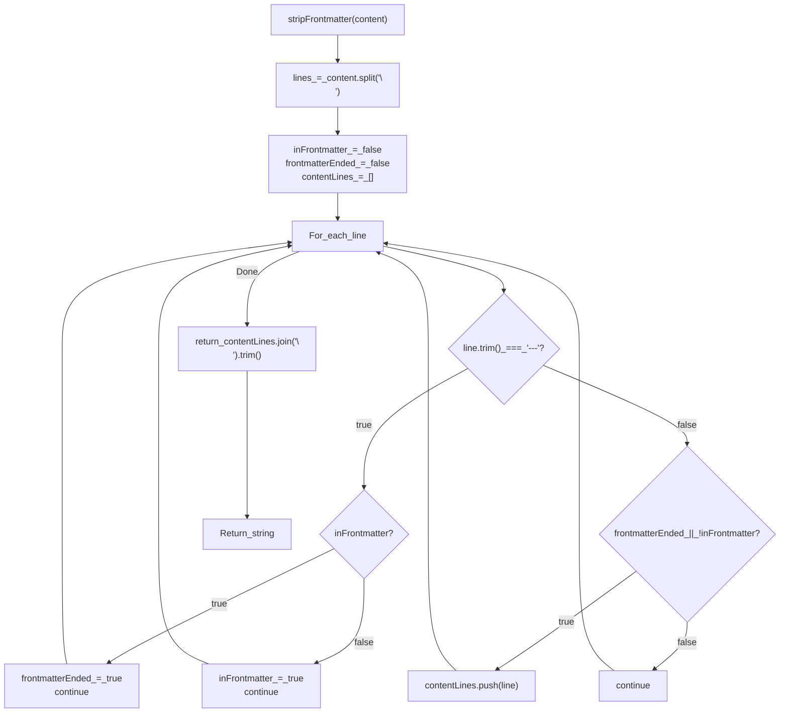

# skills-core.js Shared Module

<details>
<summary>Relevant source files</summary>

The following files were used as context for generating this wiki page:

- [.agents/plugins/marketplace.json](https://github.com/obra/superpowers/blob/HEAD/.agents/plugins/marketplace.json)
- [.codex-plugin/plugin.json](https://github.com/obra/superpowers/blob/HEAD/.codex-plugin/plugin.json)
- [.opencode/INSTALL.md](https://github.com/obra/superpowers/blob/HEAD/.opencode/INSTALL.md)
- [.opencode/plugins/superpowers.js](https://github.com/obra/superpowers/blob/HEAD/.opencode/plugins/superpowers.js)
- [docs/README.opencode.md](https://github.com/obra/superpowers/blob/HEAD/docs/README.opencode.md)
- [docs/testing.md](https://github.com/obra/superpowers/blob/HEAD/docs/testing.md)
- [tests/codex/test-marketplace-manifest.sh](https://github.com/obra/superpowers/blob/HEAD/tests/codex/test-marketplace-manifest.sh)

</details>


## Purpose and Scope

This document describes the shared skill discovery and resolution logic used by the Superpowers framework. While platform-specific shims (like the OpenCode plugin) handle runtime integration, they rely on a consistent logic for locating and parsing skills from the file system. This ensures that the three-tier priority system (Project → Personal → Superpowers) and frontmatter-based metadata extraction work identically across Claude Code, Codex, and OpenCode. [lib/skills-core.js:1-209](https://github.com/obra/superpowers/blob/HEAD/lib/skills-core.js#L1-L209), [.opencode/plugins/superpowers.js:1-139](https://github.com/obra/superpowers/blob/HEAD/.opencode/plugins/superpowers.js#L1-L139)

---

## Module Overview

The shared logic provides five primary functions that handle core skill management operations:

| Function | Purpose | Return Type |
|----------|---------|-------------|
| `extractFrontmatter()` | Parse YAML frontmatter from `SKILL.md` files | `{name, description}` |
| `findSkillsInDir()` | Recursively discover all `SKILL.md` files in a directory | `Array<SkillMetadata>` |
| `resolveSkillPath()` | Resolve a skill name to a file path with shadowing support | `{skillFile, sourceType, skillPath}` or `null` |
| `checkForUpdates()` | Check if a git repository has updates available | `boolean` |
| `stripFrontmatter()` | Remove YAML frontmatter from skill content | `string` |

This module is imported by platform-specific plugins, such as the OpenCode plugin, which uses these utilities to register skills and inject bootstrap context. [.opencode/plugins/superpowers.js:1-112](https://github.com/obra/superpowers/blob/HEAD/.opencode/plugins/superpowers.js#L1-L112)

**Sources:** [lib/skills-core.js:1-209](https://github.com/obra/superpowers/blob/HEAD/lib/skills-core.js#L1-L209), [.opencode/plugins/superpowers.js:1-112](https://github.com/obra/superpowers/blob/HEAD/.opencode/plugins/superpowers.js#L1-L112)

---

## Function Architecture

The following diagram maps the JavaScript functions to the external callers and the file system entities they manipulate.

### Logic Flow and Code Entities


**Sources:** [lib/skills-core.js:1-209](https://github.com/obra/superpowers/blob/HEAD/lib/skills-core.js#L1-L209), [.opencode/plugins/superpowers.js:1-112](https://github.com/obra/superpowers/blob/HEAD/.opencode/plugins/superpowers.js#L1-L112)

---

## Skill Discovery Algorithm

The `findSkillsInDir()` function recursively searches a directory tree to locate all `SKILL.md` files and extract their metadata. This is critical for the `skill` tool (in OpenCode) or native discovery (in Codex) to find available superpowers. [.opencode/plugins/superpowers.js:98-109](https://github.com/obra/superpowers/blob/HEAD/.opencode/plugins/superpowers.js#L98-L109), [.opencode/INSTALL.md:42-49](https://github.com/obra/superpowers/blob/HEAD/.opencode/INSTALL.md#L42-L49)

### Implementation Details



The function performs depth-first traversal with a maximum depth limit (default 3 levels). For each directory, it:

1. Checks if `SKILL.md` exists in that directory. [lib/skills-core.js:77-80](https://github.com/obra/superpowers/blob/HEAD/lib/skills-core.js#L77-L80)
2. If found, calls `extractFrontmatter()` to parse metadata. [lib/skills-core.js:86-90](https://github.com/obra/superpowers/blob/HEAD/lib/skills-core.js#L86-L90)
3. Adds skill metadata to results array with `sourceType` tag. [lib/skills-core.js:91-97](https://github.com/obra/superpowers/blob/HEAD/lib/skills-core.js#L91-L97)
4. Continues recursing into subdirectories until max depth. [lib/skills-core.js:70-74](https://github.com/obra/superpowers/blob/HEAD/lib/skills-core.js#L70-L74)

**Return Value:**
```javascript
Array<{
  path: string,        // Full path to skill directory
  skillFile: string,   // Full path to SKILL.md file
  name: string,        // Skill name from frontmatter or directory name
  description: string, // Description from frontmatter
  sourceType: string   // 'personal' or 'superpowers'
}>
```

**Sources:** [lib/skills-core.js:54-97](https://github.com/obra/superpowers/blob/HEAD/lib/skills-core.js#L54-L97)

---

## Skill Resolution with Shadowing

The `resolveSkillPath()` function implements the skill shadowing mechanism where project and personal skills can override superpowers skills. [docs/README.opencode.md:81-81](https://github.com/obra/superpowers/blob/HEAD/docs/README.opencode.md#L81)

### Resolution Flow



### Shadowing Rules

| Skill Name | Personal Exists | Superpowers Exists | Result |
|------------|----------------|-------------------|--------|
| `my-skill` | ✅ | ✅ | Returns personal version (shadowing) |
| `my-skill` | ✅ | ❌ | Returns personal version |
| `my-skill` | ❌ | ✅ | Returns superpowers version |
| `superpowers:brainstorming` | ✅ | ✅ | Returns superpowers version (forced) |

The `superpowers:` prefix allows explicit access to the original superpowers version even when a personal skill shadows it. This behavior is documented for OpenCode users to understand priority. [docs/README.opencode.md:81-81](https://github.com/obra/superpowers/blob/HEAD/docs/README.opencode.md#L81)

**Sources:** [lib/skills-core.js:99-140](https://github.com/obra/superpowers/blob/HEAD/lib/skills-core.js#L99-L140), [docs/README.opencode.md:81-81](https://github.com/obra/superpowers/blob/HEAD/docs/README.opencode.md#L81)

---

## Frontmatter Parsing

The `extractFrontmatter()` function parses YAML frontmatter from `SKILL.md` files to extract skill metadata. This metadata is used to display skill descriptions during discovery. [lib/skills-core.js:5-52](https://github.com/obra/superpowers/blob/HEAD/lib/skills-core.js#L5-L52)

In the OpenCode plugin (`superpowers.js`), a simplified version of this logic (`extractAndStripFrontmatter`) is used to avoid dependencies during the initial bootstrap injection. [.opencode/plugins/superpowers.js:16-34](https://github.com/obra/superpowers/blob/HEAD/.opencode/plugins/superpowers.js#L16-L34)

### Parsing State Machine (skills-core.js)



The parser specifically looks for `name` and `description` fields. These fields are used by platforms to decide when to activate a skill automatically based on task matching. [lib/skills-core.js:16-52](https://github.com/obra/superpowers/blob/HEAD/lib/skills-core.js#L16-L52)

**Sources:** [lib/skills-core.js:5-52](https://github.com/obra/superpowers/blob/HEAD/lib/skills-core.js#L5-L52), [.opencode/plugins/superpowers.js:16-34](https://github.com/obra/superpowers/blob/HEAD/.opencode/plugins/superpowers.js#L16-L34)

---

## Stripping Frontmatter

The `stripFrontmatter()` function removes YAML frontmatter from skill content, returning only the markdown body. This is used when injecting skill content into the system prompt to save tokens and provide cleaner instructions to the LLM. [lib/skills-core.js:172-200](https://github.com/obra/superpowers/blob/HEAD/lib/skills-core.js#L172-L200)

### Algorithm



This logic is mirrored in the OpenCode plugin's bootstrap process to prepare the `using-superpowers` skill content for injection into the chat session. [.opencode/plugins/superpowers.js:73-75](https://github.com/obra/superpowers/blob/HEAD/.opencode/plugins/superpowers.js#L73-L75)

**Sources:** [lib/skills-core.js:172-200](https://github.com/obra/superpowers/blob/HEAD/lib/skills-core.js#L172-L200), [.opencode/plugins/superpowers.js:16-34](https://github.com/obra/superpowers/blob/HEAD/.opencode/plugins/superpowers.js#L16-L34)

---

## Git Update Checking

The `checkForUpdates()` function determines if a git repository has upstream changes available. This supports the auto-update feature where superpowers updates automatically when the platform restarts. [lib/skills-core.js:142-170](https://github.com/obra/superpowers/blob/HEAD/lib/skills-core.js#L142-L170), [docs/README.opencode.md:85-88](https://github.com/obra/superpowers/blob/HEAD/docs/README.opencode.md#L85-L88)

The function performs a non-blocking check with a 3-second timeout to avoid delays:
```javascript
// Logic from lib/skills-core.js:142-170
execSync('git fetch origin && git status --porcelain=v1 --branch', {
    cwd: repoDir,
    timeout: 3000,
    encoding: 'utf8',
    stdio: 'pipe'
});
```
It specifically parses the `##` branch line for the `[behind ]` string. [lib/skills-core.js:156-168](https://github.com/obra/superpowers/blob/HEAD/lib/skills-core.js#L156-L168)

**Sources:** [lib/skills-core.js:142-170](https://github.com/obra/superpowers/blob/HEAD/lib/skills-core.js#L142-L170), [docs/README.opencode.md:85-88](https://github.com/obra/superpowers/blob/HEAD/docs/README.opencode.md#L85-L88)

---

## Usage in Platform Integrations

The shared logic is used to unify how different platforms handle the superpowers skills library.

### OpenCode Integration
The OpenCode plugin (`superpowers.js`) uses the `config` hook to inject the skills path into the live configuration, ensuring OpenCode discovers superpowers skills without manual symlinks. [.opencode/plugins/superpowers.js:103-113](https://github.com/obra/superpowers/blob/HEAD/.opencode/plugins/superpowers.js#L103-L113) It also uses `experimental.chat.messages.transform` to inject bootstrap context into the first user message. [.opencode/plugins/superpowers.js:124-137](https://github.com/obra/superpowers/blob/HEAD/.opencode/plugins/superpowers.js#L124-L137)

### Codex Integration
Codex uses native skill discovery defined in its manifest. The discovery process relies on `SKILL.md` files with valid YAML frontmatter, which is parsed by logic compatible with `skills-core.js`. [.codex-plugin/plugin.json:23-23](https://github.com/obra/superpowers/blob/HEAD/.codex-plugin/plugin.json#L23)

**Sources:** [.opencode/plugins/superpowers.js:1-139](https://github.com/obra/superpowers/blob/HEAD/.opencode/plugins/superpowers.js#L1-L139), [docs/README.opencode.md:1-164](https://github.com/obra/superpowers/blob/HEAD/docs/README.opencode.md#L1-L164), [.codex-plugin/plugin.json:1-48](https://github.com/obra/superpowers/blob/HEAD/.codex-plugin/plugin.json#L1-L48)30:T1f15,# Gemini CL