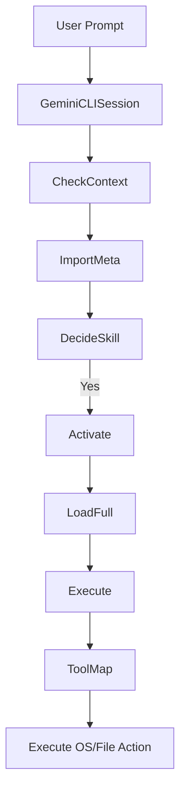
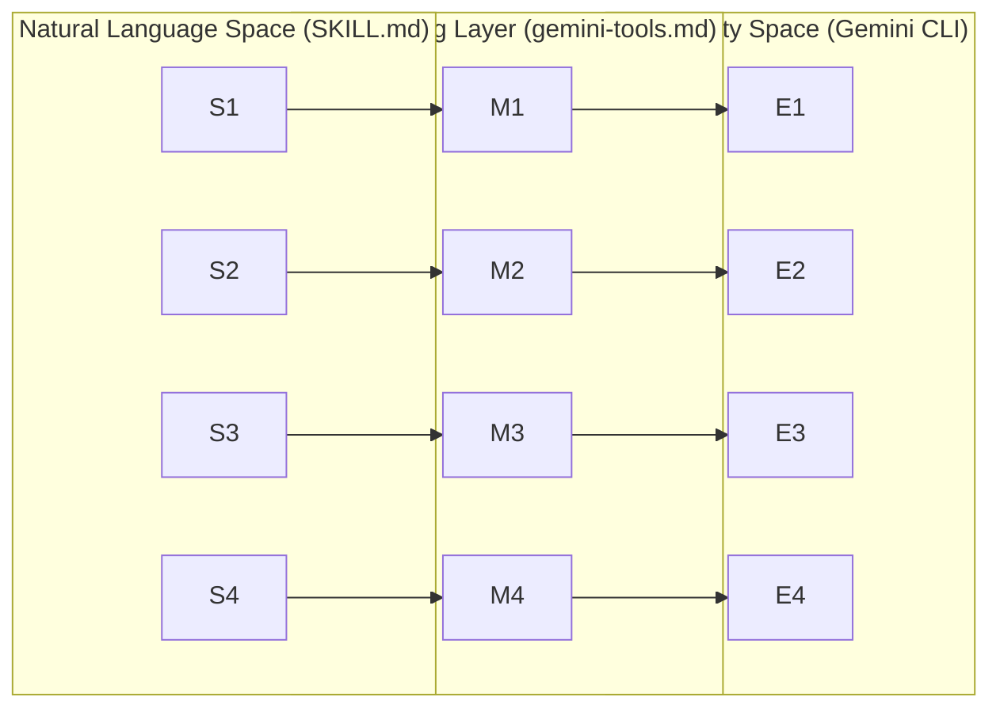

# Gemini CLI Integration

Relevant source files

The following files were used as context for generating this wiki page:

- [.cursor-plugin/plugin.json](https://github.com/obra/superpowers/blob/HEAD/.cursor-plugin/plugin.json)
- [GEMINI.md](https://github.com/obra/superpowers/blob/HEAD/GEMINI.md)
- [docs/superpowers/specs/2026-05-05-platform-neutral-config-refs-design.md](https://github.com/obra/superpowers/blob/HEAD/docs/superpowers/specs/2026-05-05-platform-neutral-config-refs-design.md)
- [gemini-extension.json](https://github.com/obra/superpowers/blob/HEAD/gemini-extension.json)
- [skills/receiving-code-review/SKILL.md](https://github.com/obra/superpowers/blob/HEAD/skills/receiving-code-review/SKILL.md)
- [skills/using-superpowers/references/antigravity-tools.md](https://github.com/obra/superpowers/blob/HEAD/skills/using-superpowers/references/antigravity-tools.md)
- [skills/using-superpowers/references/codex-tools.md](https://github.com/obra/superpowers/blob/HEAD/skills/using-superpowers/references/codex-tools.md)
- [skills/using-superpowers/references/pi-tools.md](https://github.com/obra/superpowers/blob/HEAD/skills/using-superpowers/references/pi-tools.md)

The Gemini CLI integration allows the Superpowers skills library to function as a native extension within the Gemini command-line environment. This integration leverages Gemini's extension system to provide structured workflows, tool mapping for cross-platform compatibility, and automated context injection via the `GEMINI.md` entry point.

## Extension Architecture

The Gemini CLI integration is defined by a root-level configuration file that identifies the repository as a Gemini extension. This integration is designed for high portability and minimal setup by using native Gemini CLI capabilities.

### gemini-extension.json
This file serves as the manifest for the Gemini CLI. It defines the extension's metadata and points to the primary context file used to bootstrap every session. It specifies the `contextFileName` as `GEMINI.md` and tracks the current version of the library.

Sources: [gemini-extension.json:1-6](https://github.com/obra/superpowers/blob/HEAD/gemini-extension.json#L1-L6)

### GEMINI.md Context File
The `GEMINI.md` file acts as the entry point for context injection. At the start of a session, Gemini CLI processes this file and handles any `@` syntax directives to load skill definitions and reference materials into the active context window. Specifically, it loads the core `using-superpowers` skill and the Gemini-specific tool mapping reference.

Sources: [GEMINI.md:1-3](https://github.com/obra/superpowers/blob/HEAD/GEMINI.md#L1-L3)

## Tool Mapping and Adaptation

Since Superpowers skills are written using Claude Code tool nomenclature (e.g., `Read`, `Write`, `Edit`), the Gemini CLI integration includes a mapping layer. This ensures that the model understands which native Gemini CLI tools to invoke when a skill instructs it to perform an action.

### Mapping Table
The following mappings translate between the generic skill instructions and the specific Gemini CLI environment:

| Claude Code Tool (Skill Reference) | Gemini CLI Equivalent |
| :--- | :--- |
| `Read` (file reading) | `read_file` |
| `Write` (file creation) | `write_file` |
| `Edit` (file editing) | `replace` |
| `Bash` (run commands) | `run_shell_command` |
| `Grep` (search file content) | `grep_search` |
| `Glob` (search files by name) | `glob` |
| `TodoWrite` (task tracking) | `write_todos` |
| `Skill` (invoke a skill) | `activate_skill` |
| `WebSearch` | `google_web_search` |
| `WebFetch` | `web_fetch` |
| `Task` (dispatch subagent) | `@agent-name` (Native syntax) |

Sources: [GEMINI.md:2-2](https://github.com/obra/superpowers/blob/HEAD/GEMINI.md#L2), [docs/superpowers/specs/2026-05-05-platform-neutral-config-refs-design.md:23-24](https://github.com/obra/superpowers/blob/HEAD/docs/superpowers/specs/2026-05-05-platform-neutral-config-refs-design.md#L23-L24)

### Gemini-Specific Tools
Gemini CLI provides unique tools that are utilized by the model to maintain state and manage workflows:
*   `save_memory`: Used to persist facts to `GEMINI.md` across different sessions.
*   `enter_plan_mode` / `exit_plan_mode`: Switches the agent into a specialized mode for planning before execution.

Sources: [docs/superpowers/specs/2026-05-05-platform-neutral-config-refs-design.md:23-24](https://github.com/obra/superpowers/blob/HEAD/docs/superpowers/specs/2026-05-05-platform-neutral-config-refs-design.md#L23-L24)

## Skill Activation Flow

In the Gemini CLI, skills are not pre-loaded in their entirety to save tokens. Instead, skill metadata is loaded at the start of the session, and the full content is retrieved on-demand using the `activate_skill` tool.

### Data Flow: Skill Invocation
The diagram below illustrates how a user request triggers the skill discovery and activation process within the Gemini CLI environment.

**Gemini Skill Discovery and Activation**

Sources: [GEMINI.md:1-3](https://github.com/obra/superpowers/blob/HEAD/GEMINI.md#L1-L3), [gemini-extension.json:5-5](https://github.com/obra/superpowers/blob/HEAD/gemini-extension.json#L5)

## Subagent Support

Gemini CLI supports subagents natively via the `@` syntax. This allows the system to execute complex workflows like `subagent-driven-development` by dispatching tasks to the `@generalist` agent or other specialized agents.

### Subagent Mapping and Fallback
When a skill instructs the model to use the `Task` tool, Gemini CLI users employ the `@generalist` agent. If subagent dispatch is unavailable, the system falls back to sequential execution in the current session, often utilizing the `executing-plans` skill to manage the batch of tasks.

Sources: [skills/using-superpowers/references/pi-tools.md:11-13](https://github.com/obra/superpowers/blob/HEAD/skills/using-superpowers/references/pi-tools.md#L11-L13), [skills/using-superpowers/references/antigravity-tools.md:7-8](https://github.com/obra/superpowers/blob/HEAD/skills/using-superpowers/references/antigravity-tools.md#L7-L8)

## Implementation Details

The integration bridges the "Natural Language Space" of the skill definitions with the "Code Entity Space" of the Gemini CLI tools.

### Tool Mapping Bridge
The following diagram maps the conceptual instructions found in skill files to the specific function calls available in the Gemini CLI environment.

**Gemini Tool Mapping Bridge**

Sources: [GEMINI.md:2-2](https://github.com/obra/superpowers/blob/HEAD/GEMINI.md#L2), [docs/superpowers/specs/2026-05-05-platform-neutral-config-refs-design.md:23-24](https://github.com/obra/superpowers/blob/HEAD/docs/superpowers/specs/2026-05-05-platform-neutral-config-refs-design.md#L23-L24)

### Instruction Priority
In the Gemini environment, the hierarchy of instructions is strictly enforced to ensure the user remains in control:
1.  **User Instructions:** `GEMINI.md` or direct prompts (Highest Priority).
2.  **Superpowers Skills:** Overrides default system prompt behavior where they conflict.
3.  **Default System Prompt:** (Lowest Priority).

If `GEMINI.md` explicitly contradicts a skill (e.g., "don't use TDD"), the user's instruction in `GEMINI.md` takes precedence. Phrases like "You're absolutely right!" are considered explicit instruction-file violations.

Sources: [skills/receiving-code-review/SKILL.md:30-30](https://github.com/obra/superpowers/blob/HEAD/skills/receiving-code-review/SKILL.md#L30), [docs/superpowers/specs/2026-05-05-platform-neutral-config-refs-design.md:18-18](https://github.com/obra/superpowers/blob/HEAD/docs/superpowers/specs/2026-05-05-platform-neutral-config-refs-design.md#L18)

## Version Management
The Gemini integration versioning is synchronized with the rest of the Superpowers ecosystem. The `version` field in `gemini-extension.json` tracks the library version.

Sources: [gemini-extension.json:4-4](https://github.com/obra/superpowers/blob/HEAD/gemini-extension.json#L4), [.cursor-plugin/plugin.json:5-5](https://github.com/obra/superpowers/blob/HEAD/.cursor-plugin/plugin.json#L5)