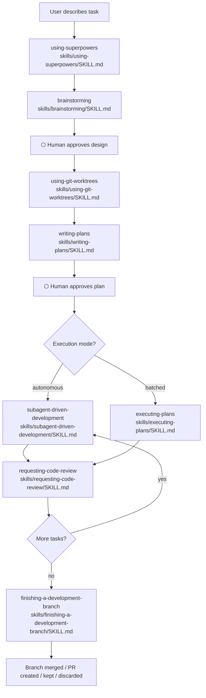

# Development Workflows

Relevant source files

The following files were used as context for generating this wiki page:

- [.gitignore](https://github.com/obra/superpowers/blob/HEAD/.gitignore)
- [CLAUDE.md](https://github.com/obra/superpowers/blob/HEAD/CLAUDE.md)
- [README.md](https://github.com/obra/superpowers/blob/HEAD/README.md)
- [skills/brainstorming/SKILL.md](https://github.com/obra/superpowers/blob/HEAD/skills/brainstorming/SKILL.md)
- [skills/writing-plans/SKILL.md](https://github.com/obra/superpowers/blob/HEAD/skills/writing-plans/SKILL.md)

This page provides an overview of the structured development pipeline that Superpowers enforces through its skill system. It describes the sequence of skills that activate during a development session and how they connect together.

Superpowers is built on a set of composable "skills" and initial instructions that ensure your agent uses them [README.md:3-5](https://github.com/obra/superpowers/blob/HEAD/README.md#L3-L5). The system enforces a step-back approach: before writing code, the agent teases out a spec, presents it in digestible chunks, creates an implementation plan, and then launches a subagent-driven development process [README.md:18-24](https://github.com/obra/superpowers/blob/HEAD/README.md#L18-L24).

For details on individual stages, see the sub-pages: 
- [Complete Workflow Pipeline](28_6.1-complete-workflow-pipeline.md) — Overview of the three-phase pipeline: brainstorming → writing-plans → subagent-driven-development
- [Brainstorming and Design](29_6.2-brainstorming-and-design.md) — Detail the brainstorming skill's HARD-GATE, scope assessment, spec review loop, and design documentation
- [Visual Brainstorming Companion](30_6.3-visual-brainstorming-companion.md) — Explain the browser-based visual companion, .events file architecture, and non-blocking interaction model
- [Using Git Worktrees](31_6.4-using-git-worktrees.md) — Document the worktree isolation requirement, directory selection, safety verification, and clean baseline setup
- [Writing Implementation Plans](32_6.5-writing-implementation-plans.md) — Explain the writing-plans skill, file structure mapping, chunk-based composition, and plan review loops
- [Subagent-Driven Development](33_6.6-subagent-driven-development.md) — Comprehensive documentation of the SDD workflow: fresh subagents per task, two-stage review, model selection, status protocol
- [Executing Plans in Batches](34_6.7-executing-plans-in-batches.md) — Document the executing-plans skill as an alternative to SDD for parallel session execution
- [Code Review Process](35_6.8-code-review-process.md) — Explain the requesting-code-review skill, spec compliance vs. code quality review, and BASE_SHA/HEAD_SHA protocol
- [Finishing Development Branches](36_6.9-finishing-development-branches.md) — Document the finishing-a-development-branch skill's test verification, integration options, and worktree cleanup

---

## The Development Pipeline at a Glance

The full pipeline covers a project from initial idea to merged branch. There are two explicit human approval gates: one after the design is presented in `brainstorming`, and one before implementation execution begins after `writing-plans` [skills/brainstorming/SKILL.md:12-14](https://github.com/obra/superpowers/blob/HEAD/skills/brainstorming/SKILL.md#L12-L14), [skills/writing-plans/SKILL.md:158-166](https://github.com/obra/superpowers/blob/HEAD/skills/writing-plans/SKILL.md#L158-L166).

| Stage | Skill Name | Human Gate? | Purpose |
|---|---|---|---|
| Design exploration | `brainstorming` | ✅ Approve design | Refine rough ideas, explore alternatives, save design document. |
| Isolated workspace | `using-git-worktrees` | — | Create isolated branch, run setup, verify clean test baseline. |
| Task breakdown | `writing-plans` | ✅ Approve plan | Break work into 2-5 minute tasks with exact file paths and code. |
| Subagent execution | `subagent-driven-development` | — | Dispatch fresh subagent per task with two-stage review. |
| Batch execution (alt) | `executing-plans` | Between batches | Execute tasks in current session with checkpoints. |
| Inter-task review | `requesting-code-review` | — | Review against plan; report issues by severity. |
| Branch completion | `finishing-a-development-branch` | ✅ Choose outcome | Verify tests, merge/PR, and clean up worktree. |

Sources: [README.md:190-202](https://github.com/obra/superpowers/blob/HEAD/README.md#L190-L202), [skills/brainstorming/SKILL.md:20-33](https://github.com/obra/superpowers/blob/HEAD/skills/brainstorming/SKILL.md#L20-L33), [skills/writing-plans/SKILL.md:158-175](https://github.com/obra/superpowers/blob/HEAD/skills/writing-plans/SKILL.md#L158-L175)

---

## Pipeline Flow

The following diagram bridges the high-level workflow concepts to the specific skill files and human interaction points.

**Workflow Pipeline: Skill Sequence**

Sources: [README.md:190-202](https://github.com/obra/superpowers/blob/HEAD/README.md#L190-L202), [skills/brainstorming/SKILL.md:34-59](https://github.com/obra/superpowers/blob/HEAD/skills/brainstorming/SKILL.md#L34-L59), [skills/writing-plans/SKILL.md:158-175](https://github.com/obra/superpowers/blob/HEAD/skills/writing-plans/SKILL.md#L158-L175)

---

## Human Approval Gates

The pipeline contains two mandatory human approval gates that prevent forward progress without explicit confirmation.

**1. Design approval gate** — enforced by the `brainstorming` skill via a `<HARD-GATE>`. The agent is prohibited from jumping into code or implementation skills until the user has approved the presented design [skills/brainstorming/SKILL.md:12-14](https://github.com/obra/superpowers/blob/HEAD/skills/brainstorming/SKILL.md#L12-L14).

**2. Plan approval gate** — enforced by `writing-plans`. Once the design is approved and a plan is written to `docs/superpowers/plans/`, the agent offers an execution choice. Execution only begins once the user selects an execution mode [skills/writing-plans/SKILL.md:158-166](https://github.com/obra/superpowers/blob/HEAD/skills/writing-plans/SKILL.md#L158-L166).

---

## Execution Mode Choice

After a plan is approved, the agent selects between two primary execution modes [skills/writing-plans/SKILL.md:160-166](https://github.com/obra/superpowers/blob/HEAD/skills/writing-plans/SKILL.md#L160-L166):

| Mode | Skill | Behavior |
|---|---|---|
| **Subagent-Driven** | `subagent-driven-development` | Dispatches a fresh subagent per task with a two-stage review (spec compliance, then code quality). Recommended for fast iteration [skills/writing-plans/SKILL.md:162](https://github.com/obra/superpowers/blob/HEAD/skills/writing-plans/SKILL.md#L162). |
| **Batch Execution** | `executing-plans` | Executes tasks in the current session in batches with checkpoints for human review [skills/writing-plans/SKILL.md:164](https://github.com/obra/superpowers/blob/HEAD/skills/writing-plans/SKILL.md#L164). |

Both modes are expected to follow the task granularity defined in the plan, which enforces a **RED-GREEN-REFACTOR** cycle: write failing test, verify failure, write minimal code to pass, verify pass, and commit [skills/writing-plans/SKILL.md:95-125](https://github.com/obra/superpowers/blob/HEAD/skills/writing-plans/SKILL.md#L95-L125), [README.md:198](https://github.com/obra/superpowers/blob/HEAD/README.md#L198).

---

## Review Loops and Verification

The workflow emphasizes rigorous verification through automated and manual review processes.

- **Worktree Isolation**: Development is isolated in git worktrees (stored in `.worktrees/`) to ensure a clean baseline [README.md:192](https://github.com/obra/superpowers/blob/HEAD/README.md#L192), [.gitignore:1](https://github.com/obra/superpowers/blob/HEAD/.gitignore#L1).
- **Task Granularity**: Plans must be "bite-sized" (2-5 minutes per task) to ensure they are worth a fresh reviewer's gate and can be easily rolled back [skills/writing-plans/SKILL.md:38-43](https://github.com/obra/superpowers/blob/HEAD/skills/writing-plans/SKILL.md#L38-L43).
- **Code Review**: The `requesting-code-review` skill activates between tasks to review against the plan and report issues by severity [README.md:200](https://github.com/obra/superpowers/blob/HEAD/README.md#L200).
- **Branch Finalization**: The `finishing-a-development-branch` skill verifies tests and handles cleanup of the worktree before merging or creating a PR [README.md:202](https://github.com/obra/superpowers/blob/HEAD/README.md#L202).

Sources: [README.md:190-202](https://github.com/obra/superpowers/blob/HEAD/README.md#L190-L202), [skills/writing-plans/SKILL.md:38-53](https://github.com/obra/superpowers/blob/HEAD/skills/writing-plans/SKILL.md#L38-L53), [skills/writing-plans/SKILL.md:95-125](https://github.com/obra/superpowers/blob/HEAD/skills/writing-plans/SKILL.md#L95-L125)32:T25e0,# Complete Workflow Pipeline

<de