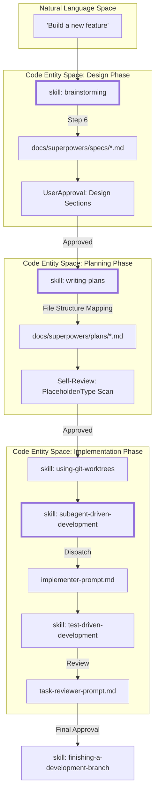
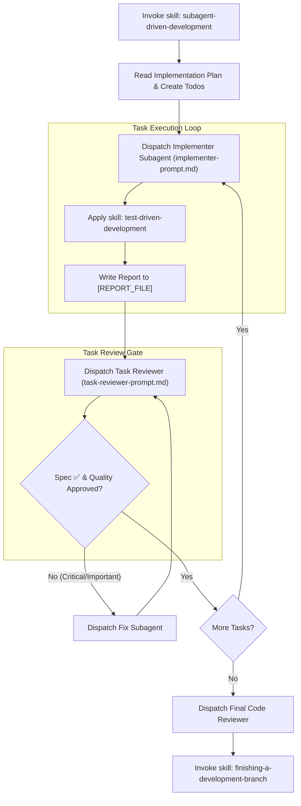

# Complete Workflow Pipeline

Relevant source files

The following files were used as context for generating this wiki page:

- [.gitignore](https://github.com/obra/superpowers/blob/HEAD/.gitignore)
- [CLAUDE.md](https://github.com/obra/superpowers/blob/HEAD/CLAUDE.md)
- [README.md](https://github.com/obra/superpowers/blob/HEAD/README.md)
- [docs/superpowers/specs/2026-06-09-sdd-task-scoped-review-dispatch-design.md](https://github.com/obra/superpowers/blob/HEAD/docs/superpowers/specs/2026-06-09-sdd-task-scoped-review-dispatch-design.md)
- [skills/brainstorming/SKILL.md](https://github.com/obra/superpowers/blob/HEAD/skills/brainstorming/SKILL.md)
- [skills/subagent-driven-development/SKILL.md](https://github.com/obra/superpowers/blob/HEAD/skills/subagent-driven-development/SKILL.md)
- [skills/subagent-driven-development/implementer-prompt.md](https://github.com/obra/superpowers/blob/HEAD/skills/subagent-driven-development/implementer-prompt.md)
- [skills/subagent-driven-development/task-reviewer-prompt.md](https://github.com/obra/superpowers/blob/HEAD/skills/subagent-driven-development/task-reviewer-prompt.md)
- [skills/writing-plans/SKILL.md](https://github.com/obra/superpowers/blob/HEAD/skills/writing-plans/SKILL.md)

This document provides a comprehensive overview of the three-phase development workflow enforced by Superpowers: **brainstorming → writing-plans → subagent-driven-development**. Each phase has mandatory checkpoints, review loops, and hard gates that prevent premature advancement.

## Workflow Overview

The Superpowers workflow enforces structured development through three mandatory phases, each with distinct outputs and validation gates:

| Phase | Skill | Input | Output | Gate |
|-------|-------|-------|--------|------|
| **Design** | `brainstorming` | User request | `docs/superpowers/specs/YYYY-MM-DD-<topic>-design.md` | **HARD-GATE**: No implementation until design approved [skills/brainstorming/SKILL.md:12-14](https://github.com/obra/superpowers/blob/HEAD/skills/brainstorming/SKILL.md#L12-L14) |
| **Planning** | `writing-plans` | Design spec | `docs/superpowers/plans/YYYY-MM-DD-<feature-name>.md` | **Scope Check**: Decompose multi-subsystem projects [skills/writing-plans/SKILL.md:21-23](https://github.com/obra/superpowers/blob/HEAD/skills/writing-plans/SKILL.md#L21-L23) |
| **Implementation** | `subagent-driven-development` | Implementation plan | Working code in isolated worktree | **Two-stage review** (Spec Compliance + Code Quality) [skills/subagent-driven-development/SKILL.md:45-82](https://github.com/obra/superpowers/blob/HEAD/skills/subagent-driven-development/SKILL.md#L45-L82) |

**Sources:** [README.md:188-203](https://github.com/obra/superpowers/blob/HEAD/README.md#L188-L203), [skills/brainstorming/SKILL.md:1-33](https://github.com/obra/superpowers/blob/HEAD/skills/brainstorming/SKILL.md#L1-L33), [skills/writing-plans/SKILL.md:1-25](https://github.com/obra/superpowers/blob/HEAD/skills/writing-plans/SKILL.md#L1-L25)

## Complete Workflow Pipeline Diagram

The following diagram bridges the Natural Language intent of the user to the specific Code Entities (skills and prompts) that manage the state transition.

**Sources:** [skills/brainstorming/SKILL.md:36-59](https://github.com/obra/superpowers/blob/HEAD/skills/brainstorming/SKILL.md#L36-L59), [skills/writing-plans/SKILL.md:144-155](https://github.com/obra/superpowers/blob/HEAD/skills/writing-plans/SKILL.md#L144-L155), [skills/subagent-driven-development/SKILL.md:47-82](https://github.com/obra/superpowers/blob/HEAD/skills/subagent-driven-development/SKILL.md#L47-L82)

---

## Phase 1: Design (brainstorming skill)

The `brainstorming` phase transforms raw ideas into validated design specifications. It is protected by a **HARD-GATE** that forbids implementation until approval is granted [skills/brainstorming/SKILL.md:12-14](https://github.com/obra/superpowers/blob/HEAD/skills/brainstorming/SKILL.md#L12-L14).

### Mandatory Checklist
The agent must complete these tasks in order:
1. **Explore project context**: Check files, docs, and recent commits [skills/brainstorming/SKILL.md:24-24](https://github.com/obra/superpowers/blob/HEAD/skills/brainstorming/SKILL.md#L24).
2. **Offer visual companion**: The first time a question would be clearer shown than described, offer it as a standalone message [skills/brainstorming/SKILL.md:25-25](https://github.com/obra/superpowers/blob/HEAD/skills/brainstorming/SKILL.md#L25).
3. **Ask clarifying questions**: One at a time to understand purpose and constraints [skills/brainstorming/SKILL.md:26-26](https://github.com/obra/superpowers/blob/HEAD/skills/brainstorming/SKILL.md#L26).
4. **Propose 2-3 approaches**: Present trade-offs and a recommendation [skills/brainstorming/SKILL.md:27-27](https://github.com/obra/superpowers/blob/HEAD/skills/brainstorming/SKILL.md#L27).
5. **Present design sections**: Get user approval incrementally [skills/brainstorming/SKILL.md:28-28](https://github.com/obra/superpowers/blob/HEAD/skills/brainstorming/SKILL.md#L28).
6. **Write design doc**: Save to `docs/superpowers/specs/YYYY-MM-DD-<topic>-design.md` [skills/brainstorming/SKILL.md:29-29](https://github.com/obra/superpowers/blob/HEAD/skills/brainstorming/SKILL.md#L29).
7. **Spec self-review**: Scan for placeholders, contradictions, and ambiguity [skills/brainstorming/SKILL.md:30-30](https://github.com/obra/superpowers/blob/HEAD/skills/brainstorming/SKILL.md#L30).
8. **User reviews written spec**: Final confirmation before proceeding [skills/brainstorming/SKILL.md:31-31](https://github.com/obra/superpowers/blob/HEAD/skills/brainstorming/SKILL.md#L31).

### Decomposition Strategy
If the request describes multiple independent subsystems, the agent must flag this immediately and help decompose into sub-projects [skills/brainstorming/SKILL.md:67-69](https://github.com/obra/superpowers/blob/HEAD/skills/brainstorming/SKILL.md#L67-L69). Each sub-project then follows its own spec → plan → implementation cycle [skills/brainstorming/SKILL.md:69-69](https://github.com/obra/superpowers/blob/HEAD/skills/brainstorming/SKILL.md#L69).

**Sources:** [skills/brainstorming/SKILL.md:12-33](https://github.com/obra/superpowers/blob/HEAD/skills/brainstorming/SKILL.md#L12-L33), [skills/brainstorming/SKILL.md:63-101](https://github.com/obra/superpowers/blob/HEAD/skills/brainstorming/SKILL.md#L63-L101)

---

## Phase 2: Planning (writing-plans skill)

Once the spec is approved, the `writing-plans` skill breaks the work into bite-sized tasks (2-5 minutes each) [skills/writing-plans/SKILL.md:45-47](https://github.com/obra/superpowers/blob/HEAD/skills/writing-plans/SKILL.md#L45-L47).

### Plan Structure and Requirements
Every plan must follow a strict schema:
- **File Structure Mapping**: Map out all files to be created or modified before defining tasks to lock in decomposition decisions [skills/writing-plans/SKILL.md:25-34](https://github.com/obra/superpowers/blob/HEAD/skills/writing-plans/SKILL.md#L25-L34).
- **Standardized Header**: Every plan must start with a header including the goal, architecture, tech stack, and **Global Constraints** copied verbatim from the spec [skills/writing-plans/SKILL.md:54-77](https://github.com/obra/superpowers/blob/HEAD/skills/writing-plans/SKILL.md#L54-L77).
- **No Placeholders**: Patterns like "TBD", "implement later", or "add appropriate error handling" are considered plan failures [skills/writing-plans/SKILL.md:128-137](https://github.com/obra/superpowers/blob/HEAD/skills/writing-plans/SKILL.md#L128-L137).
- **Task Granularity**: Each task includes exact file paths, interfaces (Consumes/Produces), and a 5-step implementation cycle (Test → Fail → Implement → Pass → Commit) [skills/writing-plans/SKILL.md:79-126](https://github.com/obra/superpowers/blob/HEAD/skills/writing-plans/SKILL.md#L79-L126).

### Plan Review Loop
After writing, the agent performs a self-review against the spec:
1. **Spec coverage**: Ensure every requirement in the spec has a corresponding task [skills/writing-plans/SKILL.md:148-148](https://github.com/obra/superpowers/blob/HEAD/skills/writing-plans/SKILL.md#L148).
2. **Placeholder scan**: Search for red flags like "TODO" or vague steps [skills/writing-plans/SKILL.md:150-150](https://github.com/obra/superpowers/blob/HEAD/skills/writing-plans/SKILL.md#L150).
3. **Type consistency**: Verify method signatures and property names match across all tasks [skills/writing-plans/SKILL.md:152-152](https://github.com/obra/superpowers/blob/HEAD/skills/writing-plans/SKILL.md#L152).

**Sources:** [skills/writing-plans/SKILL.md:1-155](https://github.com/obra/superpowers/blob/HEAD/skills/writing-plans/SKILL.md#L1-L155)

---

## Phase 3: Implementation (SDD or Executing Plans)

The final phase involves the actual code changes, typically performed in an isolated git worktree created via `using-git-worktrees` [README.md:192-192](https://github.com/obra/superpowers/blob/HEAD/README.md#L192).

### Subagent-Driven Development (SDD)
This is the recommended approach. The controller agent dispatches fresh subagents for every task in the plan [skills/subagent-driven-development/SKILL.md:8-12](https://github.com/obra/superpowers/blob/HEAD/skills/subagent-driven-development/SKILL.md#L8-L12).

**Implementation Logic Flow:**

### Review Calibration
SDD utilizes a merged per-task review process where one reviewer provides two verdicts: **Spec Compliance** and **Code Quality** [docs/superpowers/specs/2026-06-09-sdd-task-scoped-review-dispatch-design.md:54-57](https://github.com/obra/superpowers/blob/HEAD/docs/superpowers/specs/2026-06-09-sdd-task-scoped-review-dispatch-design.md#L54-L57). 
- **Critical/Important**: Findings that block progress or damage maintainability (e.g., swallowed errors, assertion-free tests) [skills/subagent-driven-development/task-reviewer-prompt.md:125-130](https://github.com/obra/superpowers/blob/HEAD/skills/subagent-driven-development/task-reviewer-prompt.md#L125-L130).
- **Minor**: "Nice to have" suggestions that do not block the task [skills/subagent-driven-development/task-reviewer-prompt.md:130-130](https://github.com/obra/superpowers/blob/HEAD/skills/subagent-driven-development/task-reviewer-prompt.md#L130).

**Sources:** [README.md:188-203](https://github.com/obra/superpowers/blob/HEAD/README.md#L188-L203), [skills/subagent-driven-development/SKILL.md:45-82](https://github.com/obra/superpowers/blob/HEAD/skills/subagent-driven-development/SKILL.md#L45-L82), [skills/subagent-driven-development/task-reviewer-prompt.md:1-166](https://github.com/obra/superpowers/blob/HEAD/skills/subagent-driven-development/task-reviewer-prompt.md#L1-L166), [docs/superpowers/specs/2026-06-09-sdd-task-scoped-review-dispatch-design.md:38-76](https://github.com/obra/superpowers/blob/HEAD/docs/superpowers/specs/2026-06-09-sdd-task-scoped-review-dispatch-design.md#L38-L76)33:T244e,# Brainst