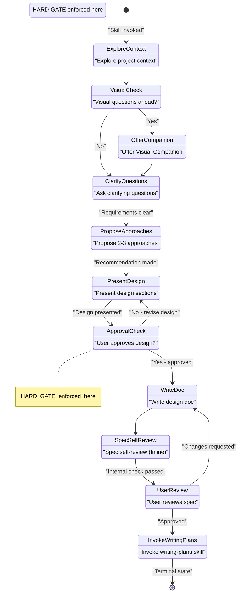
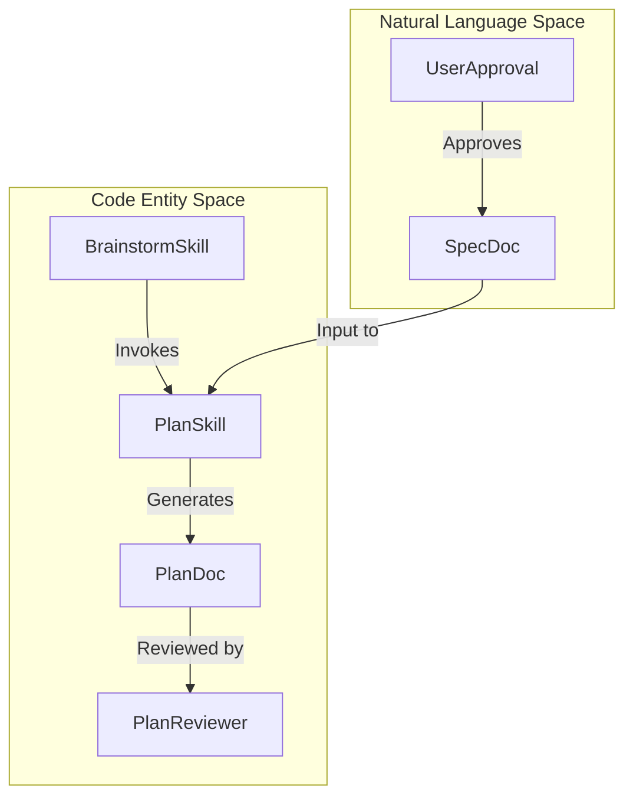

# Brainstorming and Design

<details>
<summary>Relevant source files</summary>

The following files were used as context for generating this wiki page:

- [skills/brainstorming/SKILL.md](https://github.com/obra/superpowers/blob/HEAD/skills/brainstorming/SKILL.md)
- [skills/brainstorming/spec-document-reviewer-prompt.md](https://github.com/obra/superpowers/blob/HEAD/skills/brainstorming/spec-document-reviewer-prompt.md)
- [skills/requesting-code-review/code-reviewer.md](https://github.com/obra/superpowers/blob/HEAD/skills/requesting-code-review/code-reviewer.md)
- [skills/writing-plans/SKILL.md](https://github.com/obra/superpowers/blob/HEAD/skills/writing-plans/SKILL.md)
- [skills/writing-plans/plan-document-reviewer-prompt.md](https://github.com/obra/superpowers/blob/HEAD/skills/writing-plans/plan-document-reviewer-prompt.md)
- [skills/writing-skills/persuasion-principles.md](https://github.com/obra/superpowers/blob/HEAD/skills/writing-skills/persuasion-principles.md)

</details>


## Purpose and Scope

The brainstorming phase is the mandatory first stage of any development workflow in Superpowers. It enforces a design-before-implementation discipline by requiring user approval of a complete design specification before any code is written, scaffolding is created, or implementation skills are invoked. 

In version 5.0.0, the workflow was optimized by replacing high-latency subagent review loops with high-velocity inline self-review checklists to reduce execution time while maintaining quality.

Sources: [skills/brainstorming/SKILL.md:1-15](https://github.com/obra/superpowers/blob/HEAD/skills/brainstorming/SKILL.md#L1-L15), [skills/brainstorming/SKILL.md:112-119](https://github.com/obra/superpowers/blob/HEAD/skills/brainstorming/SKILL.md#L112-L119)

---

## The HARD-GATE Constraint

The `brainstorming` skill implements a hard gate that blocks all implementation activity until design approval:

```markdown
<HARD-GATE>
Do NOT invoke any implementation skill, write any code, scaffold any project, or take any implementation action until you have presented a design and the user has approved it. This applies to EVERY project regardless of perceived simplicity.
</HARD-GATE>
```

This gate prevents the following actions until design approval:
- Invoking implementation skills (e.g., `frontend-design`, `mcp-builder`). [skills/brainstorming/SKILL.md:61-62](https://github.com/obra/superpowers/blob/HEAD/skills/brainstorming/SKILL.md#L61-L62)
- Writing any production or test code. [skills/brainstorming/SKILL.md:12-14](https://github.com/obra/superpowers/blob/HEAD/skills/brainstorming/SKILL.md#L12-L14)
- Scaffolding projects or creating file structures. [skills/brainstorming/SKILL.md:12-14](https://github.com/obra/superpowers/blob/HEAD/skills/brainstorming/SKILL.md#L12-L14)

The only skill that may be invoked after brainstorming is `writing-plans`. [skills/brainstorming/SKILL.md:61-62](https://github.com/obra/superpowers/blob/HEAD/skills/brainstorming/SKILL.md#L61-L62)

Sources: [skills/brainstorming/SKILL.md:12-19](https://github.com/obra/superpowers/blob/HEAD/skills/brainstorming/SKILL.md#L12-L19), [skills/brainstorming/SKILL.md:61-62](https://github.com/obra/superpowers/blob/HEAD/skills/brainstorming/SKILL.md#L61-L62)

---

## Mandatory Nine-Step Process

The skill enforces a checklist of nine sequential steps. Each step must be completed before proceeding to the next:

| Step | Activity | Output |
|------|----------|--------|
| 1 | Explore project context | Understanding of current state (files, docs, commits) |
| 2 | Offer visual companion | Launch browser-based visual aid if visual questions are likely |
| 3 | Ask clarifying questions | Refined requirements (one question at a time) |
| 4 | Propose 2-3 approaches | Options with trade-offs and recommendation |
| 5 | Present design sections | Validated design with user approval after each section |
| 6 | Write design doc | `docs/superpowers/specs/YYYY-MM-DD-<topic>-design.md` |
| 7 | Spec self-review | Inline check for placeholders, consistency, and scope |
| 8 | User reviews written spec | Final human verification of the spec file |
| 9 | Transition to implementation | Invoke `writing-plans` skill |

Sources: [skills/brainstorming/SKILL.md:22-32](https://github.com/obra/superpowers/blob/HEAD/skills/brainstorming/SKILL.md#L22-L32)

---

## Process State Machine

### Brainstorming Workflow State Diagram

The following diagram illustrates the internal logic and transitions within the `brainstorming` skill.



Sources: [skills/brainstorming/SKILL.md:34-59](https://github.com/obra/superpowers/blob/HEAD/skills/brainstorming/SKILL.md#L34-L59)

---

## Spec Self-Review and Subagent Review

Superpowers provides two mechanisms for verifying a design specification: an inline **Spec Self-Review** performed by the current agent, and an optional **Spec Document Reviewer** subagent.

### Spec Self-Review Checklist
The agent must perform a "fresh eyes" check against these criteria before presenting the final spec to the user:
1.  **Placeholder scan**: Check for "TBD", "TODO", or vague requirements. [skills/brainstorming/SKILL.md:114-114](https://github.com/obra/superpowers/blob/HEAD/skills/brainstorming/SKILL.md#L114)
2.  **Internal consistency**: Ensure architecture matches feature descriptions and no sections contradict. [skills/brainstorming/SKILL.md:115-115](https://github.com/obra/superpowers/blob/HEAD/skills/brainstorming/SKILL.md#L115)
3.  **Scope check**: Verify the spec is focused on a single plan and not multiple independent subsystems. [skills/brainstorming/SKILL.md:116-116](https://github.com/obra/superpowers/blob/HEAD/skills/brainstorming/SKILL.md#L116)
4.  **Ambiguity check**: Ensure requirements cannot be interpreted in multiple ways. [skills/brainstorming/SKILL.md:117-117](https://github.com/obra/superpowers/blob/HEAD/skills/brainstorming/SKILL.md#L117)

### Spec Document Reviewer Subagent
For complex designs, a subagent can be dispatched using the `Task` tool with the `spec-document-reviewer-prompt.md` template. This reviewer specifically looks for:
- **Completeness**: Identifying missing sections or "TBD" placeholders. [skills/brainstorming/spec-document-reviewer-prompt.md:21-21](https://github.com/obra/superpowers/blob/HEAD/skills/brainstorming/spec-document-reviewer-prompt.md#L21)
- **YAGNI**: Flagging unrequested features or over-engineering. [skills/brainstorming/spec-document-reviewer-prompt.md:25-25](https://github.com/obra/superpowers/blob/HEAD/skills/brainstorming/spec-document-reviewer-prompt.md#L25)
- **Calibration**: Reviewers are instructed only to flag issues that would cause real problems during implementation planning. [skills/brainstorming/spec-document-reviewer-prompt.md:29-32](https://github.com/obra/superpowers/blob/HEAD/skills/brainstorming/spec-document-reviewer-prompt.md#L29-L32)

Sources: [skills/brainstorming/SKILL.md:111-121](https://github.com/obra/superpowers/blob/HEAD/skills/brainstorming/SKILL.md#L111-L121), [skills/brainstorming/spec-document-reviewer-prompt.md:1-47](https://github.com/obra/superpowers/blob/HEAD/skills/brainstorming/spec-document-reviewer-prompt.md#L1-L47)

---

## Design for Isolation and Clarity

The `brainstorming` skill enforces specific architectural principles during the design phase:

- **Single Responsibility**: Break systems into units with one clear purpose. [skills/brainstorming/SKILL.md:91-91](https://github.com/obra/superpowers/blob/HEAD/skills/brainstorming/SKILL.md#L91)
- **Well-Defined Interfaces**: Units must communicate through clear boundaries; changes to internals should not break consumers. [skills/brainstorming/SKILL.md:92-93](https://github.com/obra/superpowers/blob/HEAD/skills/brainstorming/SKILL.md#L92-L93)
- **Opaque Internals**: A unit should be understandable without reading its internal code. [skills/brainstorming/SKILL.md:93-93](https://github.com/obra/superpowers/blob/HEAD/skills/brainstorming/SKILL.md#L93)
- **Scope Assessment**: If a request involves multiple independent subsystems (e.g., chat + billing + analytics), the agent MUST flag this and decompose it into sub-projects. [skills/brainstorming/SKILL.md:67-69](https://github.com/obra/superpowers/blob/HEAD/skills/brainstorming/SKILL.md#L67-L69)

Sources: [skills/brainstorming/SKILL.md:67-69](https://github.com/obra/superpowers/blob/HEAD/skills/brainstorming/SKILL.md#L67-L69), [skills/brainstorming/SKILL.md:89-95](https://github.com/obra/superpowers/blob/HEAD/skills/brainstorming/SKILL.md#L89-L95)

---

## Transition to Implementation Planning

Once the brainstorming phase is complete and the spec is approved, the workflow transitions to the `writing-plans` skill.

### Implementation Planning Data Flow

This diagram bridges the conceptual design approval to the technical execution entities in the codebase.



### Key Differences in Planning
While Brainstorming focuses on *what* and *why*, the `writing-plans` skill focuses on *how*:
- **Bite-Sized Tasks**: Each task is one action (2-5 minutes), such as "Write the failing test" or "Commit". [skills/writing-plans/SKILL.md:47-52](https://github.com/obra/superpowers/blob/HEAD/skills/writing-plans/SKILL.md#L47-L52)
- **No Placeholders**: Plans must contain actual code blocks and exact file paths; phrases like "TBD" or "add appropriate error handling" are considered plan failures. [skills/writing-plans/SKILL.md:128-137](https://github.com/obra/superpowers/blob/HEAD/skills/writing-plans/SKILL.md#L128-L137)
- **TDD Enforcement**: Steps must include writing failing tests before implementation. [skills/writing-plans/SKILL.md:95-101](https://github.com/obra/superpowers/blob/HEAD/skills/writing-plans/SKILL.md#L95-L101)

Sources: [skills/writing-plans/SKILL.md:1-170](https://github.com/obra/superpowers/blob/HEAD/skills/writing-plans/SKILL.md#L1-L170), [skills/writing-plans/plan-document-reviewer-prompt.md:1-47](https://github.com/obra/superpowers/blob/HEAD/skills/writing-plans/plan-document-reviewer-prompt.md#L1-L47)