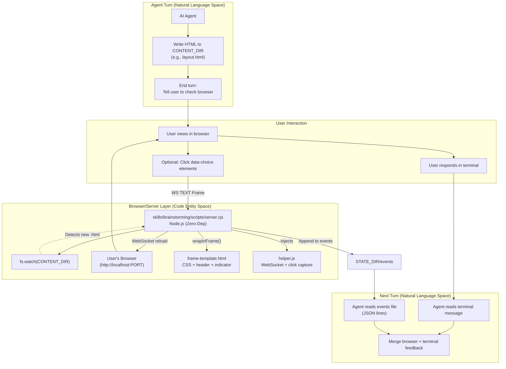
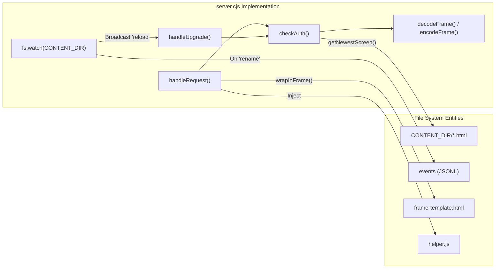
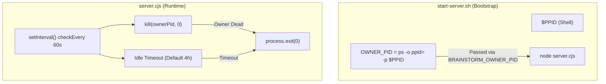

# Visual Brainstorming Companion

Relevant source files

The following files were used as context for generating this wiki page:

- [docs/superpowers/plans/2026-06-09-visual-companion-issues.md](https://github.com/obra/superpowers/blob/HEAD/docs/superpowers/plans/2026-06-09-visual-companion-issues.md)
- [skills/brainstorming/scripts/server.cjs](https://github.com/obra/superpowers/blob/HEAD/skills/brainstorming/scripts/server.cjs)
- [skills/brainstorming/scripts/start-server.sh](https://github.com/obra/superpowers/blob/HEAD/skills/brainstorming/scripts/start-server.sh)
- [skills/brainstorming/scripts/stop-server.sh](https://github.com/obra/superpowers/blob/HEAD/skills/brainstorming/scripts/stop-server.sh)
- [skills/brainstorming/visual-companion.md](https://github.com/obra/superpowers/blob/HEAD/skills/brainstorming/visual-companion.md)
- [tests/brainstorm-server/server.test.js](https://github.com/obra/superpowers/blob/HEAD/tests/brainstorm-server/server.test.js)
- [tests/brainstorm-server/stop-server.test.sh](https://github.com/obra/superpowers/blob/HEAD/tests/brainstorm-server/stop-server.test.sh)

## Purpose and Scope

The Visual Brainstorming Companion is a browser-based tool for showing mockups, diagrams, and interactive visual options during brainstorming sessions. It implements a non-blocking architecture where the browser serves as an interactive display while the terminal remains the primary conversation channel. This document covers the `.events` file architecture, server components, interaction model, and security hardening. For the broader brainstorming workflow and design process, see [Brainstorming and Design](29_6.2-brainstorming-and-design.md).

**Sources:** [skills/brainstorming/visual-companion.md:1-32](https://github.com/obra/superpowers/blob/HEAD/skills/brainstorming/visual-companion.md#L1-L32), [skills/brainstorming/scripts/server.cjs:1-15](https://github.com/obra/superpowers/blob/HEAD/skills/brainstorming/scripts/server.cjs#L1-L15)

---

## Architecture Overview

The visual companion uses a watch-and-serve pattern: the AI agent writes HTML fragments to a session directory, a zero-dependency Node.js server watches for new files and serves them to the browser, and user interactions are recorded to an `events` file in the state directory that the agent reads on subsequent turns.

### System Data Flow

**Key architectural principles:**

| Principle | Implementation |
|-----------|----------------|
| **Non-blocking** | Agent ends turn after writing HTML; no tool output blocking [skills/brainstorming/visual-companion.md:102-111](https://github.com/obra/superpowers/blob/HEAD/skills/brainstorming/visual-companion.md#L102-L111) |
| **Terminal primacy** | Terminal remains available for user input during visual sessions [skills/brainstorming/visual-companion.md:112-116](https://github.com/obra/superpowers/blob/HEAD/skills/brainstorming/visual-companion.md#L112-L116) |
| **Zero Dependencies** | Server uses only Node.js built-ins (`http`, `crypto`, `fs`) [skills/brainstorming/scripts/server.cjs:1-5](https://github.com/obra/superpowers/blob/HEAD/skills/brainstorming/scripts/server.cjs#L1-L5) |
| **Auto-refresh** | Browser reloads via WebSocket when new HTML files are detected [skills/brainstorming/scripts/server.cjs:410-420](https://github.com/obra/superpowers/blob/HEAD/skills/brainstorming/scripts/server.cjs#L410-L420) |
| **Fragment-based** | Agent writes content fragments; server wraps in frame template [skills/brainstorming/visual-companion.md:31-32](https://github.com/obra/superpowers/blob/HEAD/skills/brainstorming/visual-companion.md#L31-L32) |

**Sources:** [skills/brainstorming/visual-companion.md:27-32](https://github.com/obra/superpowers/blob/HEAD/skills/brainstorming/visual-companion.md#L27-L32), [skills/brainstorming/scripts/server.cjs:1-125](https://github.com/obra/superpowers/blob/HEAD/skills/brainstorming/scripts/server.cjs#L1-L125)

---

## Core Components

### Server: `skills/brainstorming/scripts/server.cjs`

The server is a single-file CommonJS module that handles HTTP serving, WebSocket protocol implementation (RFC 6455), and file watching.

**Security and Configuration:**
- **Per-Session Secret Key**: The server generates a random 32-byte token [skills/brainstorming/scripts/server.cjs:124-126](https://github.com/obra/superpowers/blob/HEAD/skills/brainstorming/scripts/server.cjs#L124-L126). Access requires this token via `?key=` URL parameter or a `brainstorm-key-<PORT>` cookie [skills/brainstorming/scripts/server.cjs:115-122](https://github.com/obra/superpowers/blob/HEAD/skills/brainstorming/scripts/server.cjs#L115-L122).
- `BRAINSTORM_PORT`: Port to bind. Reuses the last bound port from `PORT_FILE` if available to support browser reconnection [skills/brainstorming/scripts/server.cjs:89-98](https://github.com/obra/superpowers/blob/HEAD/skills/brainstorming/scripts/server.cjs#L89-L98).
- `BRAINSTORM_DIR`: Root directory for session files, containing `content/` and `state/` [skills/brainstorming/scripts/server.cjs:102-104](https://github.com/obra/superpowers/blob/HEAD/skills/brainstorming/scripts/server.cjs#L102-L104).
- `BRAINSTORM_OWNER_PID`: Parent process PID for lifecycle monitoring. The server exits if this process is no longer alive [skills/brainstorming/scripts/server.cjs:113](https://github.com/obra/superpowers/blob/HEAD/skills/brainstorming/scripts/server.cjs#L113).

**Sources:** [skills/brainstorming/scripts/server.cjs:83-152](https://github.com/obra/superpowers/blob/HEAD/skills/brainstorming/scripts/server.cjs#L83-L152), [docs/superpowers/plans/2026-06-09-visual-companion-issues.md:68-113](https://github.com/obra/superpowers/blob/HEAD/docs/superpowers/plans/2026-06-09-visual-companion-issues.md#L68-L113)

### Helper Script: `helper.js`

Injected into every page to provide interactivity without requiring the agent to write complex scripts.

- **WebSocket Connection**: Automatically connects to the server and handles `reload` messages [tests/brainstorm-server/server.test.js:179-184](https://github.com/obra/superpowers/blob/HEAD/tests/brainstorm-server/server.test.js#L179-L184).
- **Click Capture**: Listens for clicks on any element with a `data-choice` attribute [skills/brainstorming/visual-companion.md:29-32](https://github.com/obra/superpowers/blob/HEAD/skills/brainstorming/visual-companion.md#L29-L32).
- **Selection Logic**: Manages the `.selected` CSS class and sends interaction data back to the server via WebSocket [skills/brainstorming/scripts/server.cjs:243-246](https://github.com/obra/superpowers/blob/HEAD/skills/brainstorming/scripts/server.cjs#L243-L246).

**Sources:** [skills/brainstorming/scripts/server.cjs:229-255](https://github.com/obra/superpowers/blob/HEAD/skills/brainstorming/scripts/server.cjs#L229-L255), [docs/superpowers/plans/2026-06-09-visual-companion-issues.md:35](https://github.com/obra/superpowers/blob/HEAD/docs/superpowers/plans/2026-06-09-visual-companion-issues.md#L35)

---

## The `events` File Architecture

The server records browser interactions to an `events` file in the session's state directory as a series of JSON objects (JSON Lines format).

### Event Lifecycle

1. **Creation**: When a user clicks a `data-choice` element, the browser helper sends a WebSocket message [docs/superpowers/plans/2026-06-09-visual-companion-issues.md:71-72](https://github.com/obra/superpowers/blob/HEAD/docs/superpowers/plans/2026-06-09-visual-companion-issues.md#L71-L72).
2. **Persistence**: `server.cjs` appends the event to `state/events` using `fs.appendFileSync` [docs/superpowers/plans/2026-06-09-visual-companion-issues.md:34](https://github.com/obra/superpowers/blob/HEAD/docs/superpowers/plans/2026-06-09-visual-companion-issues.md#L34).
3. **Consumption**: On the next turn, the agent reads the file to determine user preference [skills/brainstorming/visual-companion.md:112-115](https://github.com/obra/superpowers/blob/HEAD/skills/brainstorming/visual-companion.md#L112-L115).
4. **Cleanup**: When a new HTML file is added (a new "screen"), the server deletes the existing `events` file to clear stale data [skills/brainstorming/visual-companion.md:29-32](https://github.com/obra/superpowers/blob/HEAD/skills/brainstorming/visual-companion.md#L29-L32).

**Sources:** [skills/brainstorming/scripts/server.cjs:1-15](https://github.com/obra/superpowers/blob/HEAD/skills/brainstorming/scripts/server.cjs#L1-L15), [skills/brainstorming/visual-companion.md:29-32](https://github.com/obra/superpowers/blob/HEAD/skills/brainstorming/visual-companion.md#L29-L32), [docs/superpowers/plans/2026-06-09-visual-companion-issues.md:68-113](https://github.com/obra/superpowers/blob/HEAD/docs/superpowers/plans/2026-06-09-visual-companion-issues.md#L68-L113)

---

## Interaction Loop

The brainstorming process follows a specific loop when the visual companion is active.

### Turn Sequence
1. **Agent Turn**:
   - Check if server is alive by verifying `$STATE_DIR/server-info` exists and `$STATE_DIR/server-stopped` does not [skills/brainstorming/visual-companion.md:101-101](https://github.com/obra/superpowers/blob/HEAD/skills/brainstorming/visual-companion.md#L101).
   - Write a new HTML file with a unique name to `screen_dir` [skills/brainstorming/visual-companion.md:102-104](https://github.com/obra/superpowers/blob/HEAD/skills/brainstorming/visual-companion.md#L102-L104).
   - Inform the user of the full URL (including the security key) and summarize the content [skills/brainstorming/visual-companion.md:107-110](https://github.com/obra/superpowers/blob/HEAD/skills/brainstorming/visual-companion.md#L107-L110).
2. **User Interaction**:
   - User views the screen in the browser.
   - User may click options (recorded to `events`).
   - User responds in the terminal with textual feedback [skills/brainstorming/visual-companion.md:111-111](https://github.com/obra/superpowers/blob/HEAD/skills/brainstorming/visual-companion.md#L111).
3. **Next Agent Turn**:
   - Agent reads `$STATE_DIR/events` for structured data [skills/brainstorming/visual-companion.md:113-114](https://github.com/obra/superpowers/blob/HEAD/skills/brainstorming/visual-companion.md#L113-L114).
   - Agent merges browser events with terminal text to decide next steps [skills/brainstorming/visual-companion.md:115-116](https://github.com/obra/superpowers/blob/HEAD/skills/brainstorming/visual-companion.md#L115-L116).

**Sources:** [skills/brainstorming/visual-companion.md:98-119](https://github.com/obra/superpowers/blob/HEAD/skills/brainstorming/visual-companion.md#L98-L119)

---

## Session Management

### Server Startup
The `start-server.sh` script handles process backgrounding and environment detection.

- **Persistence**: Using `--project-dir` stores session files in `.superpowers/brainstorm/${SESSION_ID}` within the project. It also persists the bound port and key in `.last-port` and `.last-token` [skills/brainstorming/scripts/start-server.sh:116-121](https://github.com/obra/superpowers/blob/HEAD/skills/brainstorming/scripts/start-server.sh#L116-L121).
- **Foreground Mode**: Auto-detected on Windows/MSYS2 or when `CODEX_CI` is set to ensure the server survives environments that reap background processes [skills/brainstorming/scripts/start-server.sh:97-107](https://github.com/obra/superpowers/blob/HEAD/skills/brainstorming/scripts/start-server.sh#L97-L107).
- **Owner Monitoring**: The server resolves the harness PID (`OWNER_PID`) and monitors it. On Windows, this is disabled to avoid PID namespace conflicts [skills/brainstorming/scripts/start-server.sh:153-167](https://github.com/obra/superpowers/blob/HEAD/skills/brainstorming/scripts/start-server.sh#L153-L167).

### Lifecycle Monitoring Implementation

**Sources:** [skills/brainstorming/scripts/start-server.sh:153-167](https://github.com/obra/superpowers/blob/HEAD/skills/brainstorming/scripts/start-server.sh#L153-L167), [skills/brainstorming/scripts/server.cjs:113](https://github.com/obra/superpowers/blob/HEAD/skills/brainstorming/scripts/server.cjs#L113), [skills/brainstorming/scripts/start-server.sh:14-14](https://github.com/obra/superpowers/blob/HEAD/skills/brainstorming/scripts/start-server.sh#L14)

### Server Shutdown
The `stop-server.sh` script reads the `server.pid` file and performs a safety check to verify the PID actually belongs to a brainstorm server instance by checking the `server-instance-id` [skills/brainstorming/scripts/stop-server.sh:65-71](https://github.com/obra/superpowers/blob/HEAD/skills/brainstorming/scripts/stop-server.sh#L65-L71). It attempts a graceful shutdown, escalating to `SIGKILL` if necessary [skills/brainstorming/scripts/stop-server.sh:86-98](https://github.com/obra/superpowers/blob/HEAD/skills/brainstorming/scripts/stop-server.sh#L86-L98).

**Sources:** [skills/brainstorming/scripts/stop-server.sh:1-110](https://github.com/obra/superpowers/blob/HEAD/skills/brainstorming/scripts/stop-server.sh#L1-L110), [tests/brainstorm-server/stop-server.test.sh:1-182](https://github.com/obra/superpowers/blob/HEAD/tests/brainstorm-server/stop-server.test.sh#L1-L182)

---

## Testing

The brainstorming server is verified through both unit and integration tests.

- **Server Integration Tests**: `tests/brainstorm-server/server.test.js` verifies HTTP serving, WebSocket communication, and file watching behavior [tests/brainstorm-server/server.test.js:1-15](https://github.com/obra/superpowers/blob/HEAD/tests/brainstorm-server/server.test.js#L1-L15).
- **PID Safety Tests**: `tests/brainstorm-server/stop-server.test.sh` ensures that `stop-server.sh` does not kill unrelated processes that have reused a stale PID [tests/brainstorm-server/stop-server.test.sh:46-61](https://github.com/obra/superpowers/blob/HEAD/tests/brainstorm-server/stop-server.test.sh#L46-L61).

**Sources:** [tests/brainstorm-server/server.test.js:1-50](https://github.com/obra/superpowers/blob/HEAD/tests/brainstorm-server/server.test.js#L1-L50), [tests/brainstorm-server/stop-server.test.sh:1-182](https://github.com/obra/superpowers/blob/HEAD/tests/brainstorm-server/stop-server.test.sh#L1-L182)