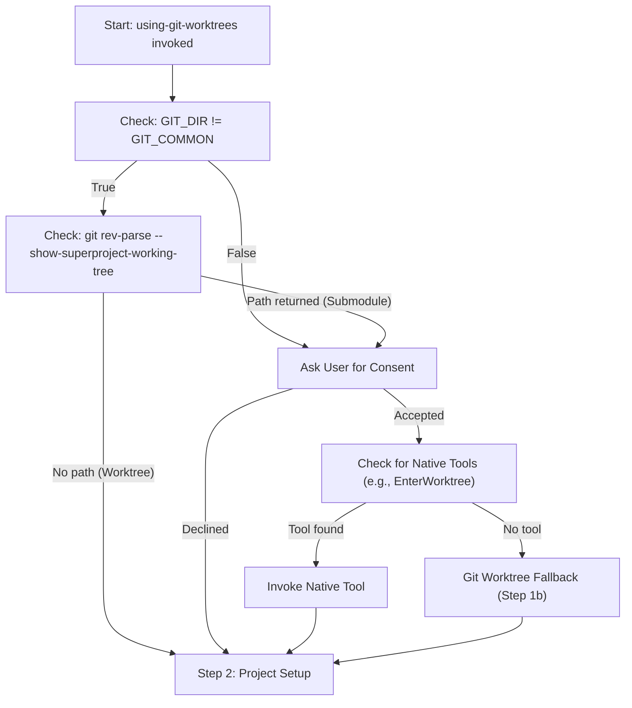
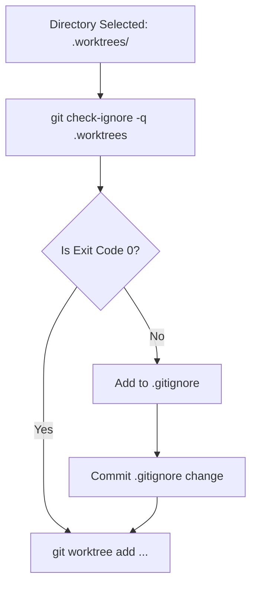
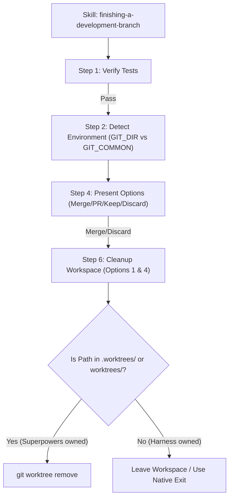

# Using Git Worktrees

Relevant source files

The following files were used as context for generating this wiki page:

- [skills/finishing-a-development-branch/SKILL.md](https://github.com/obra/superpowers/blob/HEAD/skills/finishing-a-development-branch/SKILL.md)
- [skills/using-git-worktrees/SKILL.md](https://github.com/obra/superpowers/blob/HEAD/skills/using-git-worktrees/SKILL.md)

## Purpose and Scope

This document covers the `using-git-worktrees` skill, which ensures feature development occurs in an isolated workspace. The skill prioritizes platform-native isolation tools, detects existing worktree environments, and implements a fallback to manual `git worktree` management with strict safety verification and baseline test validation.

This skill is a mandatory prerequisite for implementation workflows like `subagent-driven-development` and `executing-plans` to prevent pollution of the main project workspace.

**Sources:** [skills/using-git-worktrees/SKILL.md:1-15](https://github.com/obra/superpowers/blob/HEAD/skills/using-git-worktrees/SKILL.md#L1-L15)

---

## Workspace Isolation Strategy

The core principle of the skill is: **Detect existing isolation first, use native tools second, and fall back to git worktrees last.** It is designed to never "fight the harness" by creating nested worktrees where isolation already exists.

### Isolation Detection Flow

### Environment Detection Logic
Before creating any workspace, the skill verifies if it is already running in a linked worktree by comparing `GIT_DIR` and `GIT_COMMON` [skills/using-git-worktrees/SKILL.md:21-24](https://github.com/obra/superpowers/blob/HEAD/skills/using-git-worktrees/SKILL.md#L21-L24).

| Condition | Meaning | Action |
|-----------|---------|--------|
| `GIT_DIR != GIT_COMMON` (No submodule) | Already in a linked worktree | Skip creation; Proceed to setup [skills/using-git-worktrees/SKILL.md:33-34](https://github.com/obra/superpowers/blob/HEAD/skills/using-git-worktrees/SKILL.md#L33-L34) |
| `GIT_DIR == GIT_COMMON` | Normal repository checkout | Ask user for consent to create worktree [skills/using-git-worktrees/SKILL.md:39-43](https://github.com/obra/superpowers/blob/HEAD/skills/using-git-worktrees/SKILL.md#L39-L43) |
| `git rev-parse --show-superproject` | Inside a git submodule | Treat as normal repo; Ask for consent [skills/using-git-worktrees/SKILL.md:26-31](https://github.com/obra/superpowers/blob/HEAD/skills/using-git-worktrees/SKILL.md#L26-L31) |

**Sources:** [skills/using-git-worktrees/SKILL.md:16-46](https://github.com/obra/superpowers/blob/HEAD/skills/using-git-worktrees/SKILL.md#L16-L46)

---

## Directory Selection Algorithm (Git Fallback)

If no native tool is available and the user provides consent, the skill follows a strict priority order for directory selection. Explicit user preference always overrides observed filesystem state.

### Priority Order for Manual Worktrees

| Priority | Location | Logic |
|----------|----------|-------|
| 1 | Declared Preference | User's specific instructions in the prompt or project files [skills/using-git-worktrees/SKILL.md:67](https://github.com/obra/superpowers/blob/HEAD/skills/using-git-worktrees/SKILL.md#L67) |
| 2 | `.worktrees/` | Preferred project-local hidden directory [skills/using-git-worktrees/SKILL.md:71](https://github.com/obra/superpowers/blob/HEAD/skills/using-git-worktrees/SKILL.md#L71) |
| 3 | `worktrees/` | Alternative project-local directory [skills/using-git-worktrees/SKILL.md:72](https://github.com/obra/superpowers/blob/HEAD/skills/using-git-worktrees/SKILL.md#L72) |
| 4 | Default | `.worktrees/` at project root [skills/using-git-worktrees/SKILL.md:76](https://github.com/obra/superpowers/blob/HEAD/skills/using-git-worktrees/SKILL.md#L76) |

**Sources:** [skills/using-git-worktrees/SKILL.md:63-77](https://github.com/obra/superpowers/blob/HEAD/skills/using-git-worktrees/SKILL.md#L63-L77)

---

## Safety Verification System

For project-local directories (`.worktrees/` or `worktrees/`), the skill **must** verify the directory is gitignored before creation to prevent committing worktree state to the repository.

### Verification Implementation

**Sources:** [skills/using-git-worktrees/SKILL.md:78-89](https://github.com/obra/superpowers/blob/HEAD/skills/using-git-worktrees/SKILL.md#L78-L89)

---

## Project Setup and Baseline Testing

Once the workspace is active, the skill performs automated environment preparation and validation.

### Setup Auto-Detection
The skill inspects the filesystem to run appropriate package managers:
*   **Node.js:** `npm install` if `package.json` exists [skills/using-git-worktrees/SKILL.md:107-108](https://github.com/obra/superpowers/blob/HEAD/skills/using-git-worktrees/SKILL.md#L107-L108).
*   **Rust:** `cargo build` if `Cargo.toml` exists [skills/using-git-worktrees/SKILL.md:110-111](https://github.com/obra/superpowers/blob/HEAD/skills/using-git-worktrees/SKILL.md#L110-L111).
*   **Python:** `pip install -r requirements.txt` or `poetry install` [skills/using-git-worktrees/SKILL.md:113-115](https://github.com/obra/superpowers/blob/HEAD/skills/using-git-worktrees/SKILL.md#L113-L115).
*   **Go:** `go mod download` if `go.mod` exists [skills/using-git-worktrees/SKILL.md:117-118](https://github.com/obra/superpowers/blob/HEAD/skills/using-git-worktrees/SKILL.md#L117-L118).

**Sources:** [skills/using-git-worktrees/SKILL.md:102-119](https://github.com/obra/superpowers/blob/HEAD/skills/using-git-worktrees/SKILL.md#L102-L119)

### Baseline Validation
The skill runs the project's test suite (e.g., `npm test`, `cargo test`, `pytest`, `go test ./...`) to ensure the workspace starts in a clean state [skills/using-git-worktrees/SKILL.md:121-128](https://github.com/obra/superpowers/blob/HEAD/skills/using-git-worktrees/SKILL.md#L121-L128).

*   **If tests fail:** The agent reports the failures and asks the user whether to proceed or investigate [skills/using-git-worktrees/SKILL.md:130](https://github.com/obra/superpowers/blob/HEAD/skills/using-git-worktrees/SKILL.md#L130).
*   **If tests pass:** The agent reports "Ready to implement" with the count of passing tests [skills/using-git-worktrees/SKILL.md:132-140](https://github.com/obra/superpowers/blob/HEAD/skills/using-git-worktrees/SKILL.md#L132-L140).

**Sources:** [skills/using-git-worktrees/SKILL.md:121-140](https://github.com/obra/superpowers/blob/HEAD/skills/using-git-worktrees/SKILL.md#L121-L140)

---

## Integration and Cleanup

### Workflow Context
The `using-git-worktrees` skill is typically paired with `finishing-a-development-branch` for the end-of-life cycle of the workspace.

| Skill | Role | Cleanup Behavior |
|-------|------|------------------|
| `using-git-worktrees` | Creation | Detects `GIT_DIR` and creates if needed |
| `finishing-a-development-branch` | Disposal | Only cleans up worktrees inside `.worktrees/` or `worktrees/` [skills/finishing-a-development-branch/SKILL.md:173-178](https://github.com/obra/superpowers/blob/HEAD/skills/finishing-a-development-branch/SKILL.md#L173-L178) |

**Provenance-based cleanup:** `finishing-a-development-branch` will **not** remove worktrees created by the harness or external tools (anything outside the specific Superpowers-managed paths) [skills/finishing-a-development-branch/SKILL.md:182](https://github.com/obra/superpowers/blob/HEAD/skills/finishing-a-development-branch/SKILL.md#L182).

### Worktree Disposal Flow

**Sources:** [skills/finishing-a-development-branch/SKILL.md:18-182](https://github.com/obra/superpowers/blob/HEAD/skills/finishing-a-development-branch/SKILL.md#L18-L182)

### Error Handling: Sandbox Fallback
If `git worktree add` fails due to environment restrictions (e.g., a restricted container or sandbox permission error), the skill provides a **Sandbox Fallback**: it notifies the user of the denial and proceeds to work in the current directory instead of failing the task [skills/using-git-worktrees/SKILL.md:100](https://github.com/obra/superpowers/blob/HEAD/skills/using-git-worktrees/SKILL.md#L100).

**Sources:** [skills/using-git-worktrees/SKILL.md:100](https://github.com/obra/superpowers/blob/HEAD/skills/using-git-worktrees/SKILL.md#L100)

---

## Quick Reference Summary

| Situation | Action |
|-----------|--------|
| **Already in worktree** | Skip creation; use current path [skills/using-git-worktrees/SKILL.md:146](https://github.com/obra/superpowers/blob/HEAD/skills/using-git-worktrees/SKILL.md#L146). |
| **Native tool available** | Use platform-specific tool (e.g. Claude Code `WorktreeCreate`) [skills/using-git-worktrees/SKILL.md:148](https://github.com/obra/superpowers/blob/HEAD/skills/using-git-worktrees/SKILL.md#L148). |
| **No native tool** | Use `git worktree add` into `.worktrees/` [skills/using-git-worktrees/SKILL.md:149](https://github.com/obra/superpowers/blob/HEAD/skills/using-git-worktrees/SKILL.md#L149). |
| **Directory not ignored** | Add to `.gitignore` and commit first [skills/using-git-worktrees/SKILL.md:154](https://github.com/obra/superpowers/blob/HEAD/skills/using-git-worktrees/SKILL.md#L154). |
| **Detached HEAD** | Proceed, but note that branch creation is needed at finish [skills/using-git-worktrees/SKILL.md:37](https://github.com/obra/superpowers/blob/HEAD/skills/using-git-worktrees/SKILL.md#L37). |
| **Permission Error** | Fall back to working in the current directory [skills/using-git-worktrees/SKILL.md:155](https://github.com/obra/superpowers/blob/HEAD/skills/using-git-worktrees/SKILL.md#L155). |

**Sources:** [skills/using-git-worktrees/SKILL.md:144-157](https://github.com/obra/superpowers/blob/HEAD/skills/using-git-worktrees/SKILL.md#L144-L157)