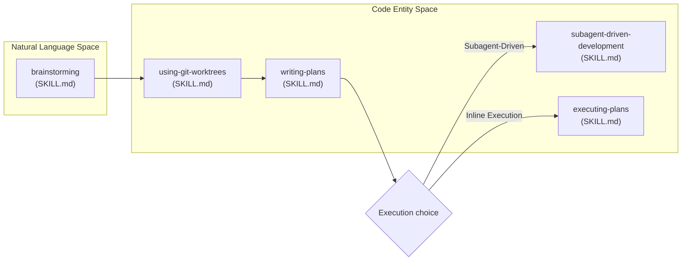
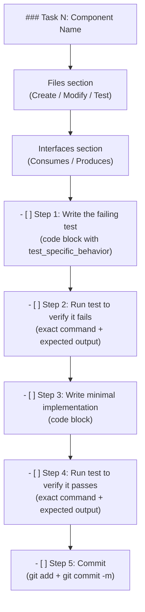
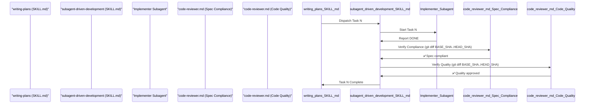

# Writing Implementation Plans

<details>
<summary>Relevant source files</summary>

The following files were used as context for generating this wiki page:

- [skills/brainstorming/SKILL.md](https://github.com/obra/superpowers/blob/HEAD/skills/brainstorming/SKILL.md)
- [skills/brainstorming/spec-document-reviewer-prompt.md](https://github.com/obra/superpowers/blob/HEAD/skills/brainstorming/spec-document-reviewer-prompt.md)
- [skills/requesting-code-review/code-reviewer.md](https://github.com/obra/superpowers/blob/HEAD/skills/requesting-code-review/code-reviewer.md)
- [skills/writing-plans/SKILL.md](https://github.com/obra/superpowers/blob/HEAD/skills/writing-plans/SKILL.md)
- [skills/writing-plans/plan-document-reviewer-prompt.md](https://github.com/obra/superpowers/blob/HEAD/skills/writing-plans/plan-document-reviewer-prompt.md)
- [skills/writing-skills/persuasion-principles.md](https://github.com/obra/superpowers/blob/HEAD/skills/writing-skills/persuasion-principles.md)

</details>


This page documents the `writing-plans` skill: what it produces, how plans are structured, how TDD steps are embedded in each task, and how execution is handed off after planning. This skill operates within the middle of the development pipeline — after brainstorming and worktree setup, and before execution. For the full pipeline sequence, see [6.1 Complete Workflow Pipeline](28_6.1-complete-workflow-pipeline.md). For the upstream brainstorming step, see [6.2 Brainstorming and Design](29_6.2-brainstorming-and-design.md). For execution options after planning, see [6.6 Subagent-Driven Development](33_6.6-subagent-driven-development.md) and [6.7 Executing Plans in Batches](34_6.7-executing-plans-in-batches.md).

---

## Role in the Workflow

The `writing-plans` skill is invoked after a design document (spec) exists and a git worktree has been created. It converts a design into a concrete, file-by-file, step-by-step implementation plan that any skilled developer — with no codebase familiarity — can follow.

**Workflow Position Diagram**



**Sources:** [skills/writing-plans/SKILL.md:1-153](https://github.com/obra/superpowers/blob/HEAD/skills/writing-plans/SKILL.md#L1-L153), [skills/brainstorming/SKILL.md:32-67](https://github.com/obra/superpowers/blob/HEAD/skills/brainstorming/SKILL.md#L32-L67)

---

## Invoking the Skill

The skill is invoked directly by name or as the terminal state of a brainstorming session.

| Invocation method | Context |
|---|---|
| Direct skill name | `superpowers:writing-plans` |
| Brainstorming transition | Automated after spec approval |

**Announcement:** Upon invocation, the agent must announce: _"I'm using the writing-plans skill to create the implementation plan."_ [skills/writing-plans/SKILL.md:14-14](https://github.com/obra/superpowers/blob/HEAD/skills/writing-plans/SKILL.md#L14)

**Sources:** [skills/writing-plans/SKILL.md:14-14](https://github.com/obra/superpowers/blob/HEAD/skills/writing-plans/SKILL.md#L14), [skills/brainstorming/SKILL.md:62-67](https://github.com/obra/superpowers/blob/HEAD/skills/brainstorming/SKILL.md#L62-L67)

---

## Plan File Location and Naming

Plans are saved to a fixed directory relative to the project root:

```
docs/superpowers/plans/YYYY-MM-DD-<feature-name>.md
```

**Note:** User preferences for plan location override this default [skills/writing-plans/SKILL.md:19-19](https://github.com/obra/superpowers/blob/HEAD/skills/writing-plans/SKILL.md#L19). This process should be run in a dedicated worktree created by the `superpowers:using-git-worktrees` skill [skills/writing-plans/SKILL.md:16-16](https://github.com/obra/superpowers/blob/HEAD/skills/writing-plans/SKILL.md#L16).

**Sources:** [skills/writing-plans/SKILL.md:16-19](https://github.com/obra/superpowers/blob/HEAD/skills/writing-plans/SKILL.md#L16-L19)

---

## Plan Document Header

Every plan file must begin with a fixed header block [skills/writing-plans/SKILL.md:56-56](https://github.com/obra/superpowers/blob/HEAD/skills/writing-plans/SKILL.md#L56). This header is required to guide future agents and includes global constraints from the spec [skills/writing-plans/SKILL.md:69-74](https://github.com/obra/superpowers/blob/HEAD/skills/writing-plans/SKILL.md#L69-L74).

```markdown
# [Feature Name] Implementation Plan

> **For agentic workers:** REQUIRED SUB-SKILL: Use superpowers:subagent-driven-development (recommended) or superpowers:executing-plans to implement this plan task-by-task. Steps use checkbox (`- [ ]`) syntax for tracking.

**Goal:** [One sentence describing what this builds]

**Architecture:** [2-3 sentences about approach]

**Tech Stack:** [Key technologies/libraries]

## Global Constraints

[Exact values copied verbatim from the spec]

---
```

The embedded instruction ensures that a future agent opening this plan file knows to load the appropriate execution skill before proceeding [skills/writing-plans/SKILL.md:61-61](https://github.com/obra/superpowers/blob/HEAD/skills/writing-plans/SKILL.md#L61).

**Sources:** [skills/writing-plans/SKILL.md:54-77](https://github.com/obra/superpowers/blob/HEAD/skills/writing-plans/SKILL.md#L54-L77)

---

## File Structure Mapping

Before defining tasks, the planner must map out which files will be created or modified [skills/writing-plans/SKILL.md:27-27](https://github.com/obra/superpowers/blob/HEAD/skills/writing-plans/SKILL.md#L27). This is where decomposition decisions are locked in.

*   **Isolation:** Design units with clear boundaries and well-defined interfaces [skills/writing-plans/SKILL.md:29-29](https://github.com/obra/superpowers/blob/HEAD/skills/writing-plans/SKILL.md#L29).
*   **Focus:** Prefer smaller, focused files over large ones that do too much [skills/writing-plans/SKILL.md:30-30](https://github.com/obra/superpowers/blob/HEAD/skills/writing-plans/SKILL.md#L30).
*   **Locality:** Files that change together should live together (split by responsibility, not technical layer) [skills/writing-plans/SKILL.md:31-31](https://github.com/obra/superpowers/blob/HEAD/skills/writing-plans/SKILL.md#L31).
*   **Patterns:** In existing codebases, follow established patterns unless a file has grown unwieldy and requires a split [skills/writing-plans/SKILL.md:32-32](https://github.com/obra/superpowers/blob/HEAD/skills/writing-plans/SKILL.md#L32).

**Sources:** [skills/writing-plans/SKILL.md:25-35](https://github.com/obra/superpowers/blob/HEAD/skills/writing-plans/SKILL.md#L25-L35)

---

## Bite-Sized Task Granularity

Each step in a task must represent a single, concrete action that takes 2–5 minutes [skills/writing-plans/SKILL.md:47-47](https://github.com/obra/superpowers/blob/HEAD/skills/writing-plans/SKILL.md#L47). The skill enforces granularity at the action level, not the task level.

**Step granularity examples:**

| What feels like one step | How the skill breaks it down |
|---|---|
| "Add a test and make it pass" | Step 1: Write the failing test; Step 2: Run it to confirm failure; Step 3: Write minimal implementation; Step 4: Run tests to confirm pass; Step 5: Commit [skills/writing-plans/SKILL.md:48-52](https://github.com/obra/superpowers/blob/HEAD/skills/writing-plans/SKILL.md#L48-L52) |
| "Implement the parser" | Multiple tasks, each with their own TDD cycle |

The writing philosophy: assume the implementer is a skilled developer who knows almost nothing about this codebase or problem domain [skills/writing-plans/SKILL.md:10-12](https://github.com/obra/superpowers/blob/HEAD/skills/writing-plans/SKILL.md#L10-L12).

**Sources:** [skills/writing-plans/SKILL.md:10-13](https://github.com/obra/superpowers/blob/HEAD/skills/writing-plans/SKILL.md#L10-L13), [skills/writing-plans/SKILL.md:36-53](https://github.com/obra/superpowers/blob/HEAD/skills/writing-plans/SKILL.md#L36-L53)

---

## Task Structure and TDD Embedding

Each task follows a fixed structure [skills/writing-plans/SKILL.md:79-81](https://github.com/obra/superpowers/blob/HEAD/skills/writing-plans/SKILL.md#L79-L81). TDD is embedded directly into each task's steps.

**Task Structure Diagram**



**Task template fields:**

| Field | Requirement |
|---|---|
| `### Task N:` | Numbered sequentially; name describes the component [skills/writing-plans/SKILL.md:82-82](https://github.com/obra/superpowers/blob/HEAD/skills/writing-plans/SKILL.md#L82) |
| `**Files:**` | Exact paths: `Create:`, `Modify: path:line-line`, `Test:` [skills/writing-plans/SKILL.md:84-87](https://github.com/obra/superpowers/blob/HEAD/skills/writing-plans/SKILL.md#L84-L87) |
| `**Interfaces:**` | Exact signatures for `Consumes` and `Produces` [skills/writing-plans/SKILL.md:89-93](https://github.com/obra/superpowers/blob/HEAD/skills/writing-plans/SKILL.md#L89-L93) |
| `Step 1` | Complete test code block [skills/writing-plans/SKILL.md:95-101](https://github.com/obra/superpowers/blob/HEAD/skills/writing-plans/SKILL.md#L95-L101) |
| `Step 2` | Exact run command + expected failure message [skills/writing-plans/SKILL.md:103-106](https://github.com/obra/superpowers/blob/HEAD/skills/writing-plans/SKILL.md#L103-L106) |
| `Step 3` | Complete implementation code block [skills/writing-plans/SKILL.md:108-113](https://github.com/obra/superpowers/blob/HEAD/skills/writing-plans/SKILL.md#L108-L113) |
| `Step 4` | Exact run command + expected pass output [skills/writing-plans/SKILL.md:115-118](https://github.com/obra/superpowers/blob/HEAD/skills/writing-plans/SKILL.md#L115-L118) |
| `Step 5` | Exact `git add` and `git commit -m` commands [skills/writing-plans/SKILL.md:120-125](https://github.com/obra/superpowers/blob/HEAD/skills/writing-plans/SKILL.md#L120-L125) |

**Sources:** [skills/writing-plans/SKILL.md:79-126](https://github.com/obra/superpowers/blob/HEAD/skills/writing-plans/SKILL.md#L79-L126)

---

## Plan Review Loop

After writing the complete plan, the agent must perform a self-review or dispatch a specialized subagent to verify quality before any code is touched [skills/writing-plans/SKILL.md:144-146](https://github.com/obra/superpowers/blob/HEAD/skills/writing-plans/SKILL.md#L144-L146).

1.  **Dispatch:** Use `plan-document-reviewer-prompt.md` to start a `plan-document-reviewer` subagent using the `Task` tool [skills/writing-plans/plan-document-reviewer-prompt.md:1-11](https://github.com/obra/superpowers/blob/HEAD/skills/writing-plans/plan-document-reviewer-prompt.md#L1-L11).
2.  **Context:** Provide the plan path (`PLAN_FILE_PATH`) and the spec path (`SPEC_FILE_PATH`) [skills/writing-plans/plan-document-reviewer-prompt.md:15-16](https://github.com/obra/superpowers/blob/HEAD/skills/writing-plans/plan-document-reviewer-prompt.md#L15-L16).
3.  **Checklist:** The reviewer checks for completeness, spec alignment, task decomposition, and buildability [skills/writing-plans/plan-document-reviewer-prompt.md:18-26](https://github.com/obra/superpowers/blob/HEAD/skills/writing-plans/plan-document-reviewer-prompt.md#L18-L26).
4.  **Iteration:** If issues are found, the original agent fixes them inline [skills/writing-plans/SKILL.md:154-154](https://github.com/obra/superpowers/blob/HEAD/skills/writing-plans/SKILL.md#L154).

**Sources:** [skills/writing-plans/SKILL.md:144-154](https://github.com/obra/superpowers/blob/HEAD/skills/writing-plans/SKILL.md#L144-L154), [skills/writing-plans/plan-document-reviewer-prompt.md:1-50](https://github.com/obra/superpowers/blob/HEAD/skills/writing-plans/plan-document-reviewer-prompt.md#L1-L50)

---

## Execution Handoff

After saving and approving the plan, the agent offers an execution choice to the human [skills/writing-plans/SKILL.md:156-166](https://github.com/obra/superpowers/blob/HEAD/skills/writing-plans/SKILL.md#L156-L166):

> "Plan complete and saved to `docs/superpowers/plans/<filename>.md`. Two execution options:
>
> **1. Subagent-Driven (recommended)** - I dispatch a fresh subagent per task, review between tasks, fast iteration
>
> **2. Inline Execution** - Execute tasks in this session using executing-plans, batch execution with checkpoints
>
> **Which approach?"**

**Handoff decision matrix:**

| Choice | Skill loaded | Session behavior |
|---|---|---|
| Subagent-Driven | `superpowers:subagent-driven-development` | Fresh subagent per task; two-stage review [skills/writing-plans/SKILL.md:168-170](https://github.com/obra/superpowers/blob/HEAD/skills/writing-plans/SKILL.md#L168-L170) |
| Inline Execution | `superpowers:executing-plans` | Batch execution in current session with checkpoints [skills/writing-plans/SKILL.md:172-174](https://github.com/obra/superpowers/blob/HEAD/skills/writing-plans/SKILL.md#L172-L174) |

**Execution Mapping to Subagents**



**Sources:** [skills/writing-plans/SKILL.md:156-174](https://github.com/obra/superpowers/blob/HEAD/skills/writing-plans/SKILL.md#L156-L174), [skills/requesting-code-review/code-reviewer.md:1-126](https://github.com/obra/superpowers/blob/HEAD/skills/requesting-code-review/code-reviewer.md#L1-L126)

---

## Summary of Constraints

| Constraint | Rule |
|---|---|
| File save location | `docs/superpowers/plans/YYYY-MM-DD-<feature-name>.md` [skills/writing-plans/SKILL.md:18-18](https://github.com/obra/superpowers/blob/HEAD/skills/writing-plans/SKILL.md#L18) |
| Header | Required; includes Goal, Architecture, Tech Stack, Global Constraints [skills/writing-plans/SKILL.md:56-74](https://github.com/obra/superpowers/blob/HEAD/skills/writing-plans/SKILL.md#L56-L74) |
| Task step size | 2–5 minutes per step [skills/writing-plans/SKILL.md:47-47](https://github.com/obra/superpowers/blob/HEAD/skills/writing-plans/SKILL.md#L47) |
| TDD | Mandatory — every task has failing test before implementation [skills/writing-plans/SKILL.md:10-10](https://github.com/obra/superpowers/blob/HEAD/skills/writing-plans/SKILL.md#L10) |
| Review Loop | Mandatory review of the plan document [skills/writing-plans/SKILL.md:144-146](https://github.com/obra/superpowers/blob/HEAD/skills/writing-plans/SKILL.md#L144-L146) |
| Code in plan | Must be complete; no "add validation" placeholders [skills/writing-plans/SKILL.md:128-137](https://github.com/obra/superpowers/blob/HEAD/skills/writing-plans/SKILL.md#L128-L137) |
| Commands | Must include exact command string and expected output [skills/writing-plans/SKILL.md:139-142](https://github.com/obra/superpowers/blob/HEAD/skills/writing-plans/SKILL.md#L139-L142) |

**Sources:** [skills/writing-plans/SKILL.md:1-174](https://github.com/obra/superpowers/blob/HEAD/skills/writing-plans/SKILL.md#L1-L174), [skills/writing-plans/plan-document-reviewer-prompt.md:1-50](https://github.com/obra/superpowers/blob/HEAD/skills/writing-plans/plan-document-reviewer-prompt.md#L1-L50)37:T2f1b,# Subag