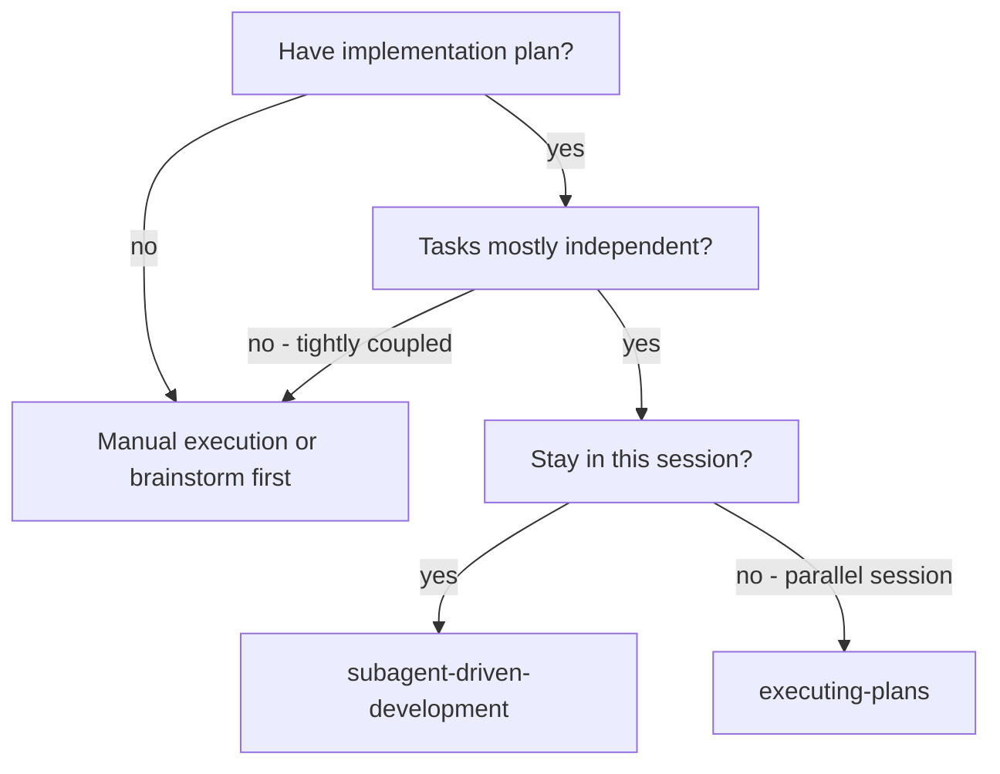
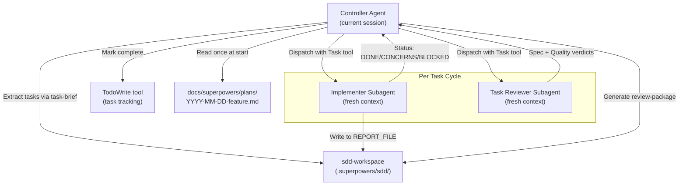
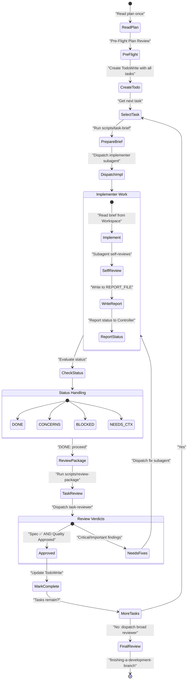

# Subagent-Driven Development

Relevant source files

The following files were used as context for generating this wiki page:

- [docs/superpowers/specs/2026-06-09-sdd-task-scoped-review-dispatch-design.md](https://github.com/obra/superpowers/blob/HEAD/docs/superpowers/specs/2026-06-09-sdd-task-scoped-review-dispatch-design.md)
- [docs/superpowers/specs/2026-06-10-strict-cost-sdd-design.md](https://github.com/obra/superpowers/blob/HEAD/docs/superpowers/specs/2026-06-10-strict-cost-sdd-design.md)
- [skills/subagent-driven-development/SKILL.md](https://github.com/obra/superpowers/blob/HEAD/skills/subagent-driven-development/SKILL.md)
- [skills/subagent-driven-development/implementer-prompt.md](https://github.com/obra/superpowers/blob/HEAD/skills/subagent-driven-development/implementer-prompt.md)
- [skills/subagent-driven-development/scripts/review-package](https://github.com/obra/superpowers/blob/HEAD/skills/subagent-driven-development/scripts/review-package)
- [skills/subagent-driven-development/scripts/sdd-workspace](https://github.com/obra/superpowers/blob/HEAD/skills/subagent-driven-development/scripts/sdd-workspace)
- [skills/subagent-driven-development/scripts/task-brief](https://github.com/obra/superpowers/blob/HEAD/skills/subagent-driven-development/scripts/task-brief)
- [skills/subagent-driven-development/task-reviewer-prompt.md](https://github.com/obra/superpowers/blob/HEAD/skills/subagent-driven-development/task-reviewer-prompt.md)
- [tests/claude-code/test-sdd-workspace.sh](https://github.com/obra/superpowers/blob/HEAD/tests/claude-code/test-sdd-workspace.sh)

## Purpose and Scope

This page documents the subagent-driven development (SDD) workflow, which executes implementation plans by dispatching fresh subagents per task with mandatory two-stage review. The controller agent orchestrates implementer subagents and reviewer subagents, managing the task queue and ensuring quality gates pass before marking tasks complete.

The SDD workflow is the final execution phase of the Superpowers pipeline, following brainstorming and plan writing. It ensures high-quality output through isolated contexts and specialized model selection.

**Sources:** [skills/subagent-driven-development/SKILL.md:1-12](https://github.com/obra/superpowers/blob/HEAD/skills/subagent-driven-development/SKILL.md#L1-L12), [skills/subagent-driven-development/SKILL.md:40-60](https://github.com/obra/superpowers/blob/HEAD/skills/subagent-driven-development/SKILL.md#L40-L60)

## When to Use This Workflow

**Decision criteria:**

| Criterion | Required for SDD |
|-----------|------------------|
| Implementation plan exists | Yes - from `writing-plans` skill |
| Tasks are independent | Yes - can be implemented in any order |
| Subagent support | Yes - harness must support `Task` tool (Claude Code, Codex) |
| Session continuity | Yes - work continues in current session |

SDD is the preferred execution method when subagents are available because it prevents context pollution and allows for specialized review loops. If subagents are not available, the system falls back to the `executing-plans` skill.

**Sources:** [skills/subagent-driven-development/SKILL.md:14-39](https://github.com/obra/superpowers/blob/HEAD/skills/subagent-driven-development/SKILL.md#L14-L39)

## Core Architecture

The SDD architecture separates the "Controller" (which maintains the global plan state) from "Subagents" (which perform isolated units of work).

**Key architectural decisions:**

- **Fresh subagent per task:** Each implementer starts with clean context, preventing pollution from previous tasks [skills/subagent-driven-development/SKILL.md:10-12](https://github.com/obra/superpowers/blob/HEAD/skills/subagent-driven-development/SKILL.md#L10-L12).
- **Artifact Isolation:** Short-lived artifacts (briefs, reports, diffs) are stored in `.superpowers/sdd/`, a self-ignoring directory managed by `sdd-workspace` [skills/subagent-driven-development/scripts/sdd-workspace:1-23](https://github.com/obra/superpowers/blob/HEAD/skills/subagent-driven-development/scripts/sdd-workspace#L1-L23).
- **Integrated Task Review:** Spec compliance and code quality reviews are merged into a single `task-reviewer-prompt.md` dispatch to reduce overhead while maintaining two distinct verdicts [docs/superpowers/specs/2026-06-09-sdd-task-scoped-review-dispatch-design.md:54-59](https://github.com/obra/superpowers/blob/HEAD/docs/superpowers/specs/2026-06-09-sdd-task-scoped-review-dispatch-design.md#L54-L59).
- **Review loops:** If a reviewer finds issues, the implementer fixes them, and the same reviewer re-evaluates the work [skills/subagent-driven-development/SKILL.md:72-78](https://github.com/obra/superpowers/blob/HEAD/skills/subagent-driven-development/SKILL.md#L72-L78).

**Sources:** [skills/subagent-driven-development/SKILL.md:10-12](https://github.com/obra/superpowers/blob/HEAD/skills/subagent-driven-development/SKILL.md#L10-L12), [skills/subagent-driven-development/scripts/sdd-workspace:1-23](https://github.com/obra/superpowers/blob/HEAD/skills/subagent-driven-development/scripts/sdd-workspace#L1-L23), [docs/superpowers/specs/2026-06-09-sdd-task-scoped-review-dispatch-design.md:54-59](https://github.com/obra/superpowers/blob/HEAD/docs/superpowers/specs/2026-06-09-sdd-task-scoped-review-dispatch-design.md#L54-L59)

## The Complete Process

**Critical invariants:**

1. **Pre-Flight Review:** Scan the plan for conflicts or contradictions before dispatching the first task [skills/subagent-driven-development/SKILL.md:85-97](https://github.com/obra/superpowers/blob/HEAD/skills/subagent-driven-development/SKILL.md#L85-L97).
2. **Artifact-Based Communication:** Subagents read their briefs and write their reports to files in the `sdd-workspace` to minimize controller context bloat [skills/subagent-driven-development/scripts/task-brief:1-8](https://github.com/obra/superpowers/blob/HEAD/skills/subagent-driven-development/scripts/task-brief#L1-L8).
3. **Task-Scoped Review:** Task reviewers are restricted to the diff and task brief; they do not crawl the broader codebase unless a concrete risk is identified [skills/subagent-driven-development/task-reviewer-prompt.md:42-47](https://github.com/obra/superpowers/blob/HEAD/skills/subagent-driven-development/task-reviewer-prompt.md#L42-L47).
4. **Fix Severity:** Only Critical and Important findings mandate a fix-and-re-review loop [skills/subagent-driven-development/SKILL.md:120-123](https://github.com/obra/superpowers/blob/HEAD/skills/subagent-driven-development/SKILL.md#L120-L123).

**Sources:** [skills/subagent-driven-development/SKILL.md:45-83](https://github.com/obra/superpowers/blob/HEAD/skills/subagent-driven-development/SKILL.md#L45-L83), [skills/subagent-driven-development/SKILL.md:85-97](https://github.com/obra/superpowers/blob/HEAD/skills/subagent-driven-development/SKILL.md#L85-L97), [skills/subagent-driven-development/task-reviewer-prompt.md:42-47](https://github.com/obra/superpowers/blob/HEAD/skills/subagent-driven-development/task-reviewer-prompt.md#L42-L47), [skills/subagent-driven-development/scripts/task-brief:1-8](https://github.com/obra/superpowers/blob/HEAD/skills/subagent-driven-development/scripts/task-brief#L1-L8)

## Model Selection Strategy

The workflow utilizes different model tiers to balance cost, speed, and reasoning capability.

| Task Type | Model Tier | Complexity Signals |
|-----------|-----------|-------------|
| **Mechanical** | Cheap / Fast | Isolated functions, clear specs, 1-2 files. Plan contains complete code [skills/subagent-driven-development/SKILL.md:103](https://github.com/obra/superpowers/blob/HEAD/skills/subagent-driven-development/SKILL.md#L103). |
| **Integration** | Standard / Mid-tier | Multi-file coordination, pattern matching, debugging [skills/subagent-driven-development/SKILL.md:105](https://github.com/obra/superpowers/blob/HEAD/skills/subagent-driven-development/SKILL.md#L105). |
| **Architecture** | Most Capable | Design judgment, broad final review, complex concurrency [skills/subagent-driven-development/SKILL.md:107-109](https://github.com/obra/superpowers/blob/HEAD/skills/subagent-driven-development/SKILL.md#L107-L109). |

**Key Principle:** "Turn count beats token price." Cheaper models often take 2-3x more turns on multi-step work, potentially costing more than mid-tier models in wall-clock time and context [skills/subagent-driven-development/SKILL.md:119-122](https://github.com/obra/superpowers/blob/HEAD/skills/subagent-driven-development/SKILL.md#L119-L122).

**Sources:** [skills/subagent-driven-development/SKILL.md:99-125](https://github.com/obra/superpowers/blob/HEAD/skills/subagent-driven-development/SKILL.md#L99-L125)

## Implementation Artifacts

The SDD workflow relies on several shell scripts to manage data flow between subagents.

| Script | Purpose | Output Path |
|--------|---------|-------------|
| `sdd-workspace` | Ensures the `.superpowers/sdd/` directory exists with a `*` gitignore [skills/subagent-driven-development/scripts/sdd-workspace:1-23](https://github.com/obra/superpowers/blob/HEAD/skills/subagent-driven-development/scripts/sdd-workspace#L1-L23). | `.superpowers/sdd/` |
| `task-brief` | Extracts the specific text for Task N from the implementation plan [skills/subagent-driven-development/scripts/task-brief:1-25](https://github.com/obra/superpowers/blob/HEAD/skills/subagent-driven-development/scripts/task-brief#L1-L25). | `.superpowers/sdd/task-N-brief.md` |
| `review-package` | Generates a combined file containing commit logs, stats, and the full diff [skills/subagent-driven-development/scripts/review-package:1-41](https://github.com/obra/superpowers/blob/HEAD/skills/subagent-driven-development/scripts/review-package#L1-L41). | `.superpowers/sdd/review-BASE..HEAD.diff` |

**Sources:** [skills/subagent-driven-development/scripts/sdd-workspace:1-23](https://github.com/obra/superpowers/blob/HEAD/skills/subagent-driven-development/scripts/sdd-workspace#L1-L23), [skills/subagent-driven-development/scripts/task-brief:1-25](https://github.com/obra/superpowers/blob/HEAD/skills/subagent-driven-development/scripts/task-brief#L1-L25), [skills/subagent-driven-development/scripts/review-package:1-41](https://github.com/obra/superpowers/blob/HEAD/skills/subagent-driven-development/scripts/review-package#L1-L41)

## Task Reviewer Protocol

The task reviewer (`task-reviewer-prompt.md`) provides a unified gate for each task.

### Verdicts and Calibration
Reviewers categorize findings by severity:
- **Critical (Must Fix):** Incorrect behavior, data loss, or security flaws [skills/subagent-driven-development/task-reviewer-prompt.md:154](https://github.com/obra/superpowers/blob/HEAD/skills/subagent-driven-development/task-reviewer-prompt.md#L154).
- **Important (Should Fix):** Maintainability damage (e.g., verbatim logic duplication, swallowed errors, assertion-free tests) [skills/subagent-driven-development/task-reviewer-prompt.md:155](https://github.com/obra/superpowers/blob/HEAD/skills/subagent-driven-development/task-reviewer-prompt.md#L155).
- **Minor (Nice to Have):** Polish, broader coverage, or style suggestions [skills/subagent-driven-development/task-reviewer-prompt.md:156](https://github.com/obra/superpowers/blob/HEAD/skills/subagent-driven-development/task-reviewer-prompt.md#L156).

### Skepticism Rule
Reviewers are instructed: **"Do Not Trust the Report."** They must verify implementer claims against the actual diff and treat implementer design rationales (e.g., "left it per YAGNI") as claims to be judged, not verdicts [skills/subagent-driven-development/task-reviewer-prompt.md:55-62](https://github.com/obra/superpowers/blob/HEAD/skills/subagent-driven-development/task-reviewer-prompt.md#L55-L62).

**Sources:** [skills/subagent-driven-development/task-reviewer-prompt.md:1-166](https://github.com/obra/superpowers/blob/HEAD/skills/subagent-driven-development/task-reviewer-prompt.md#L1-L166), [docs/superpowers/specs/2026-06-09-sdd-task-scoped-review-dispatch-design.md:60-68](https://github.com/obra/superpowers/blob/HEAD/docs/superpowers/specs/2026-06-09-sdd-task-scoped-review-dispatch-design.md#L60-L68)

## Status Protocol Handling

Implementer subagents report one of four statuses. The controller must handle each appropriately:

| Status | Meaning | Controller Action |
|--------|---------|-------------------|
| **DONE** | Task complete | Proceed to task review [skills/subagent-driven-development/SKILL.md:129](https://github.com/obra/superpowers/blob/HEAD/skills/subagent-driven-development/SKILL.md#L129). |
| **DONE_WITH_CONCERNS** | Work complete but implementer has doubts | Address concerns; proceed to review if they are minor [skills/subagent-driven-development/SKILL.md:131](https://github.com/obra/superpowers/blob/HEAD/skills/subagent-driven-development/SKILL.md#L131). |
| **NEEDS_CONTEXT** | Missing information | Provide missing context and re-dispatch [skills/subagent-driven-development/SKILL.md:133](https://github.com/obra/superpowers/blob/HEAD/skills/subagent-driven-development/SKILL.md#L133). |
| **BLOCKED** | Cannot complete task | Assess: upgrade model, break down task, or escalate to human if plan is broken [skills/subagent-driven-development/SKILL.md:135-139](https://github.com/obra/superpowers/blob/HEAD/skills/subagent-driven-development/SKILL.md#L135-L139). |

**Sources:** [skills/subagent-driven-development/SKILL.md:127-141](https://github.com/obra/superpowers/blob/HEAD/skills/subagent-driven-development/SKILL.md#L127-L141), [skills/subagent-driven-development/implementer-prompt.md:127-138](https://github.com/obra/superpowers/blob/HEAD/skills/subagent-driven-development/implementer-prompt.md#L127-L138)38