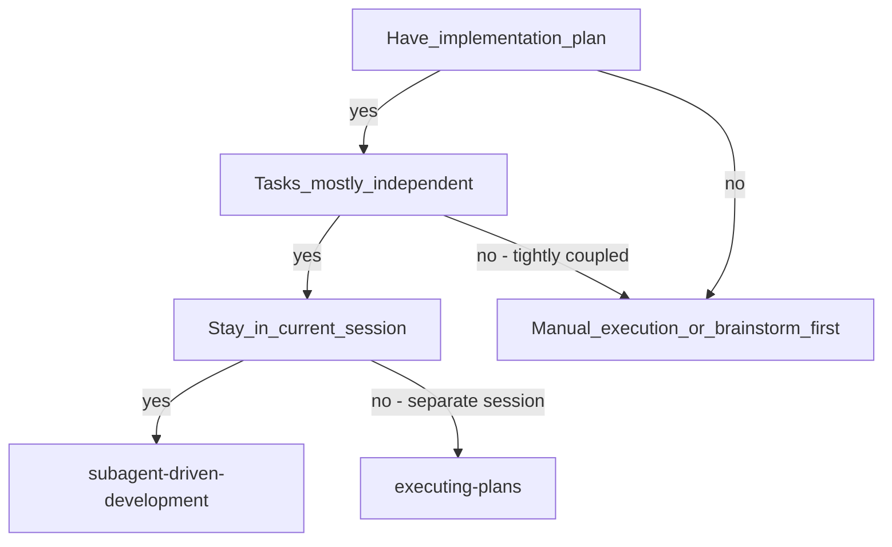
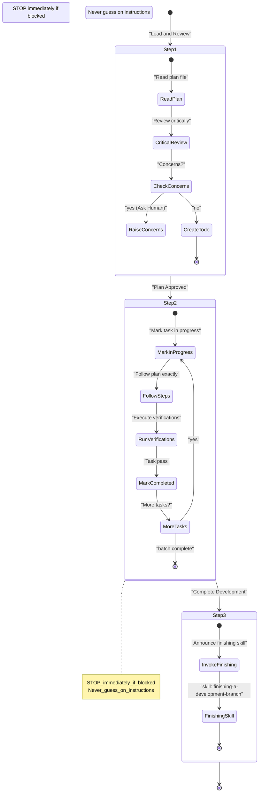
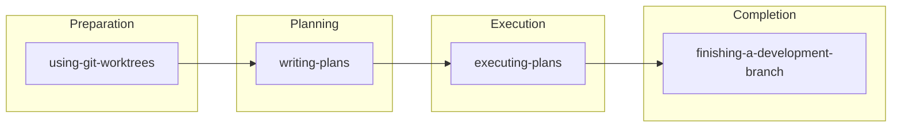

# Executing Plans in Batches

Relevant source files

The following files were used as context for generating this wiki page:

- [skills/executing-plans/SKILL.md](https://github.com/obra/superpowers/blob/HEAD/skills/executing-plans/SKILL.md)
- [skills/writing-skills/SKILL.md](https://github.com/obra/superpowers/blob/HEAD/skills/writing-skills/SKILL.md)
- [skills/writing-skills/anthropic-best-practices.md](https://github.com/obra/superpowers/blob/HEAD/skills/writing-skills/anthropic-best-practices.md)

## Purpose and Scope

This document describes the **batch execution workflow** for implementing plans in a separate session with human review checkpoints between batches of tasks. This approach provides architectural oversight at regular intervals while maintaining implementation momentum.

For executing plans with automated subagent review in the same session, see [Subagent-Driven Development (6.6)](). For creating the implementation plan that this skill executes, see [Writing Implementation Plans (6.5)](). For completing the work after all tasks are done, see [Finishing Development Branches (6.9)]().

Sources: [skills/executing-plans/SKILL.md:1-15](https://github.com/obra/superpowers/blob/HEAD/skills/executing-plans/SKILL.md#L1-L15)

---

## Overview

The `executing-plans` skill implements a checkpoint-based execution model where the AI agent executes tasks in batches, reports progress, and waits for human feedback before proceeding. This skill is specifically designed for environments where subagents are not available or where a human-in-the-loop batching process is preferred over fully automated task delegation.

**Key characteristics:**
- **Announcement Protocol:** Must announce "I'm using the executing-plans skill to implement this plan" at the start [skills/executing-plans/SKILL.md:12-12](https://github.com/obra/superpowers/blob/HEAD/skills/executing-plans/SKILL.md#L12).
- **Subagent Fallback:** This skill is the primary alternative when subagent support is missing. If subagents are available, `subagent-driven-development` is preferred for higher quality [skills/executing-plans/SKILL.md:14-14](https://github.com/obra/superpowers/blob/HEAD/skills/executing-plans/SKILL.md#L14).
- **Fixed Checkpoints:** Human review occurs between batches rather than automated review loops.
- **Explicit Stop Conditions:** Hard-coded triggers to stop implementation and ask for help [skills/executing-plans/SKILL.md:41-47](https://github.com/obra/superpowers/blob/HEAD/skills/executing-plans/SKILL.md#L41-L47).

Sources: [skills/executing-plans/SKILL.md:1-15](https://github.com/obra/superpowers/blob/HEAD/skills/executing-plans/SKILL.md#L1-L15)

---

## When to Use This Skill

### Choosing Between Execution Modes

The following diagram bridges the **Natural Language Decision Space** to the **Code Skill Space**.

**Execution Strategy Selection**

**Use `executing-plans` when:**
- The work will happen in a parallel or separate session from planning.
- Subagents are not supported on the current platform (e.g., Gemini CLI without extensions) [skills/executing-plans/SKILL.md:14-14](https://github.com/obra/superpowers/blob/HEAD/skills/executing-plans/SKILL.md#L14).
- Tasks can be executed sequentially by a single agent context.

**Use `subagent-driven-development` instead when:**
- Staying in the same session (no context switch).
- Subagent support is available (Claude Code, Codex, or Gemini CLI with extensions) [skills/executing-plans/SKILL.md:14-14](https://github.com/obra/superpowers/blob/HEAD/skills/executing-plans/SKILL.md#L14).
- Want automated review loops (Spec Compliance + Code Quality) after each task.
- Need faster iteration without human-in-the-loop between every task.

Sources: [skills/executing-plans/SKILL.md:1-15](https://github.com/obra/superpowers/blob/HEAD/skills/executing-plans/SKILL.md#L1-L15)

---

## The Execution Process

### Process Flow

Sources: [skills/executing-plans/SKILL.md:16-38](https://github.com/obra/superpowers/blob/HEAD/skills/executing-plans/SKILL.md#L16-L38)

---

## Step 1: Load and Review Plan

The agent begins by loading the plan file and performing a critical review **before** starting implementation. This is a mandatory gate to prevent wasted effort on flawed plans.

**Process:**
1. **Read:** Access the plan file [skills/executing-plans/SKILL.md:19-19](https://github.com/obra/superpowers/blob/HEAD/skills/executing-plans/SKILL.md#L19).
2. **Review:** Identify questions or concerns [skills/executing-plans/SKILL.md:20-20](https://github.com/obra/superpowers/blob/HEAD/skills/executing-plans/SKILL.md#L20).
3. **Gate:** If concerns exist, raise them with the human partner [skills/executing-plans/SKILL.md:21-21](https://github.com/obra/superpowers/blob/HEAD/skills/executing-plans/SKILL.md#L21).
4. **Initialize:** If clear, create todos for plan items and proceed [skills/executing-plans/SKILL.md:22-22](https://github.com/obra/superpowers/blob/HEAD/skills/executing-plans/SKILL.md#L22).

Sources: [skills/executing-plans/SKILL.md:18-23](https://github.com/obra/superpowers/blob/HEAD/skills/executing-plans/SKILL.md#L18-L23)

---

## Step 2: Execute Tasks

Implementation follows a strict "Follow Exactly" protocol. `executing-plans` relies on the agent following the plan's bite-sized steps exactly [skills/executing-plans/SKILL.md:28-28](https://github.com/obra/superpowers/blob/HEAD/skills/executing-plans/SKILL.md#L28).

**Execution Rules:**
- **Status Tracking:** Mark each task as `in_progress` before starting [skills/executing-plans/SKILL.md:27-27](https://github.com/obra/superpowers/blob/HEAD/skills/executing-plans/SKILL.md#L27).
- **Precision:** Follow each step exactly as specified in the plan [skills/executing-plans/SKILL.md:28-28](https://github.com/obra/superpowers/blob/HEAD/skills/executing-plans/SKILL.md#L28).
- **Verification:** Run verifications as specified for every task; do not skip [skills/executing-plans/SKILL.md:29-30](https://github.com/obra/superpowers/blob/HEAD/skills/executing-plans/SKILL.md#L29-L30).
- **Completion:** Mark as completed only after successful verification [skills/executing-plans/SKILL.md:30-30](https://github.com/obra/superpowers/blob/HEAD/skills/executing-plans/SKILL.md#L30).

### Handling Failures During Execution
If a verification fails or an unexpected behavior occurs, the agent must not guess a fix. Instead, it should stop and ask for clarification [skills/executing-plans/SKILL.md:41-47](https://github.com/obra/superpowers/blob/HEAD/skills/executing-plans/SKILL.md#L41-L47).

Sources: [skills/executing-plans/SKILL.md:24-31](https://github.com/obra/superpowers/blob/HEAD/skills/executing-plans/SKILL.md#L24-L31), [skills/executing-plans/SKILL.md:41-47](https://github.com/obra/superpowers/blob/HEAD/skills/executing-plans/SKILL.md#L41-L47)

---

## Step 3: Complete Development

After all tasks in the plan are finished and verified, the agent transitions to the finalization phase.

**Mandatory Hand-off:**
1. Announce: "I'm using the finishing-a-development-branch skill to complete this work" [skills/executing-plans/SKILL.md:35-35](https://github.com/obra/superpowers/blob/HEAD/skills/executing-plans/SKILL.md#L35).
2. **Required Sub-Skill:** Use `superpowers:finishing-a-development-branch` [skills/executing-plans/SKILL.md:36-36](https://github.com/obra/superpowers/blob/HEAD/skills/executing-plans/SKILL.md#L36).
3. Follow the finishing skill to verify final tests and present integration options [skills/executing-plans/SKILL.md:37-37](https://github.com/obra/superpowers/blob/HEAD/skills/executing-plans/SKILL.md#L37).

Sources: [skills/executing-plans/SKILL.md:32-38](https://github.com/obra/superpowers/blob/HEAD/skills/executing-plans/SKILL.md#L32-L38)

---

## When to Stop and Ask for Help

The `executing-plans` skill defines specific "Iron Laws" for stopping implementation to prevent cascading errors.

### Stop Conditions

| Trigger | Context | Action |
|:---|:---|:---|
| **Blocker** | Missing dependency or test fails [skills/executing-plans/SKILL.md:42-42](https://github.com/obra/superpowers/blob/HEAD/skills/executing-plans/SKILL.md#L42) | STOP immediately |
| **Ambiguity** | Instruction is unclear or missing context [skills/executing-plans/SKILL.md:42-44](https://github.com/obra/superpowers/blob/HEAD/skills/executing-plans/SKILL.md#L42-L44) | STOP; do not guess |
| **Repetitive Failure** | Verification fails repeatedly [skills/executing-plans/SKILL.md:45-45](https://github.com/obra/superpowers/blob/HEAD/skills/executing-plans/SKILL.md#L45) | STOP; do not force |
| **Plan Gaps** | Critical gaps prevent starting [skills/executing-plans/SKILL.md:43-43](https://github.com/obra/superpowers/blob/HEAD/skills/executing-plans/SKILL.md#L43) | STOP; report to human |

**Rule:** Never start implementation on `main`/`master` branch without explicit user consent [skills/executing-plans/SKILL.md:63-63](https://github.com/obra/superpowers/blob/HEAD/skills/executing-plans/SKILL.md#L63).

Sources: [skills/executing-plans/SKILL.md:41-64](https://github.com/obra/superpowers/blob/HEAD/skills/executing-plans/SKILL.md#L41-L64)

---

## Integration with Workflow Skills

The batch execution process is part of a larger skill chain.

**Required Skill Chain**

| Skill | Role in Batch Execution |
|:---|:---|
| `superpowers:using-git-worktrees` | **REQUIRED:** Set up isolated workspace before starting [skills/executing-plans/SKILL.md:68-68](https://github.com/obra/superpowers/blob/HEAD/skills/executing-plans/SKILL.md#L68). |
| `superpowers:writing-plans` | Creates the specific plan that this skill executes [skills/executing-plans/SKILL.md:69-69](https://github.com/obra/superpowers/blob/HEAD/skills/executing-plans/SKILL.md#L69). |
| `superpowers:finishing-a-development-branch` | **REQUIRED:** Completes development after all tasks are finished [skills/executing-plans/SKILL.md:70-70](https://github.com/obra/superpowers/blob/HEAD/skills/executing-plans/SKILL.md#L70). |

Sources: [skills/executing-plans/SKILL.md:65-71](https://github.com/obra/superpowers/blob/HEAD/skills/executing-plans/SKILL.md#L65-L71)