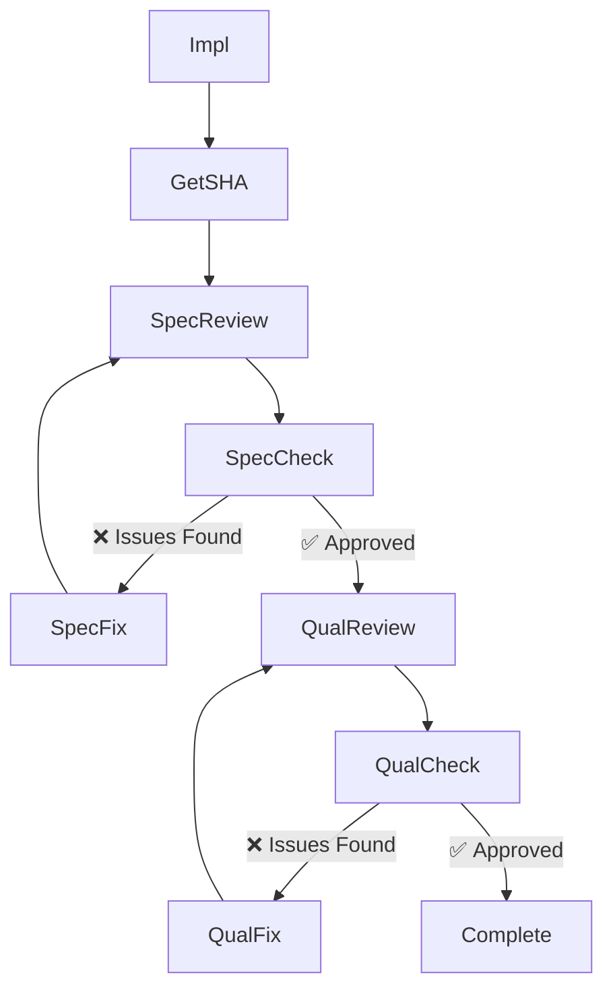
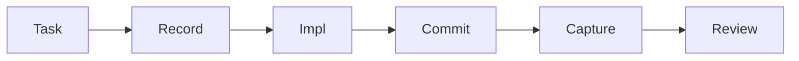
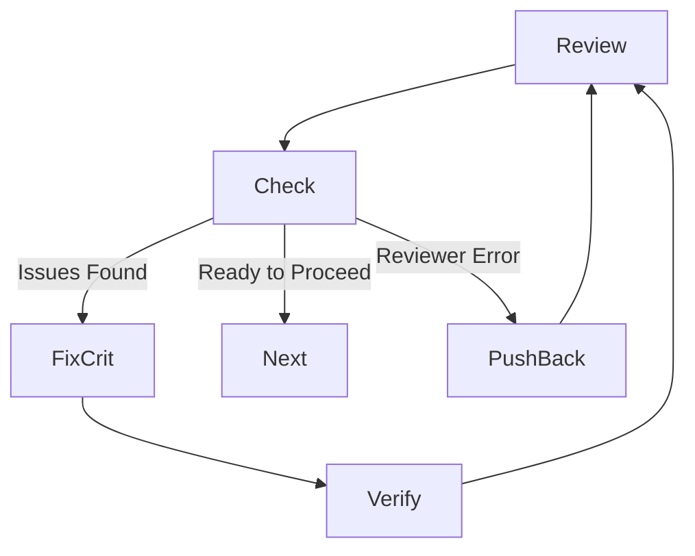

# Code Review Process

<details>
<summary>Relevant source files</summary>

The following files were used as context for generating this wiki page:

- [docs/superpowers/specs/2026-05-05-platform-neutral-prose-design.md](https://github.com/obra/superpowers/blob/HEAD/docs/superpowers/specs/2026-05-05-platform-neutral-prose-design.md)
- [skills/brainstorming/spec-document-reviewer-prompt.md](https://github.com/obra/superpowers/blob/HEAD/skills/brainstorming/spec-document-reviewer-prompt.md)
- [skills/dispatching-parallel-agents/SKILL.md](https://github.com/obra/superpowers/blob/HEAD/skills/dispatching-parallel-agents/SKILL.md)
- [skills/requesting-code-review/SKILL.md](https://github.com/obra/superpowers/blob/HEAD/skills/requesting-code-review/SKILL.md)
- [skills/requesting-code-review/code-reviewer.md](https://github.com/obra/superpowers/blob/HEAD/skills/requesting-code-review/code-reviewer.md)
- [skills/writing-plans/plan-document-reviewer-prompt.md](https://github.com/obra/superpowers/blob/HEAD/skills/writing-plans/plan-document-reviewer-prompt.md)
- [skills/writing-skills/persuasion-principles.md](https://github.com/obra/superpowers/blob/HEAD/skills/writing-skills/persuasion-principles.md)

</details>


## Purpose and Scope

This page documents the code review process for implementation work: how to request reviews, the two-stage review architecture (spec compliance then code quality), the `BASE_SHA`/`HEAD_SHA` protocol, and the technical rigor required for receiving feedback.

The process is designed to catch issues before they cascade by using specialized subagents with isolated contexts [skills/requesting-code-review/SKILL.md:8-10](https://github.com/obra/superpowers/blob/HEAD/skills/requesting-code-review/SKILL.md#L8-L10). This ensures the reviewer focuses on the work product rather than the session history, preserving the controller agent's context for coordination [skills/requesting-code-review/SKILL.md:8-9](https://github.com/obra/superpowers/blob/HEAD/skills/requesting-code-review/SKILL.md#L8-L9).

**Sources:** [skills/requesting-code-review/SKILL.md:1-10](https://github.com/obra/superpowers/blob/HEAD/skills/requesting-code-review/SKILL.md#L1-L10)

---

## Two-Stage Review Architecture

The Superpowers code review process uses a two-stage architecture: **spec compliance review** must pass before **code quality review** begins. This separation prevents wasting time reviewing the quality of code that does not actually meet the requirements.

### Review Flow Diagram



**Key principle:** Review early, review often. Catch issues before they compound [skills/requesting-code-review/SKILL.md:10-10](https://github.com/obra/superpowers/blob/HEAD/skills/requesting-code-review/SKILL.md#L10), [skills/requesting-code-review/SKILL.md:78-80](https://github.com/obra/superpowers/blob/HEAD/skills/requesting-code-review/SKILL.md#L78-L80). In structured workflows, this review is mandatory after each task [skills/requesting-code-review/SKILL.md:14-15](https://github.com/obra/superpowers/blob/HEAD/skills/requesting-code-review/SKILL.md#L14-L15).

**Sources:** [skills/requesting-code-review/SKILL.md:6-15](https://github.com/obra/superpowers/blob/HEAD/skills/requesting-code-review/SKILL.md#L6-L15), [skills/requesting-code-review/SKILL.md:77-83](https://github.com/obra/superpowers/blob/HEAD/skills/requesting-code-review/SKILL.md#L77-L83), [skills/brainstorming/spec-document-reviewer-prompt.md:1-15](https://github.com/obra/superpowers/blob/HEAD/skills/brainstorming/spec-document-reviewer-prompt.md#L1-L15)

---

## Spec Compliance and Quality Review

The code reviewer subagent verifies both that the implementation matches the specification and that it is well-built: clean, tested, and maintainable [skills/requesting-code-review/code-reviewer.md:5-6](https://github.com/obra/superpowers/blob/HEAD/skills/requesting-code-review/code-reviewer.md#L5-L6).

### Review Criteria

| Category | Review Focus |
|----------|--------------|
| **Plan alignment** | Implementation matches plan, all functionality present, justified deviations [skills/requesting-code-review/code-reviewer.md:39-43](https://github.com/obra/superpowers/blob/HEAD/skills/requesting-code-review/code-reviewer.md#L39-L43). |
| **Code quality** | Separation of concerns, error handling, type safety, DRY principle, edge cases [skills/requesting-code-review/code-reviewer.md:44-50](https://github.com/obra/superpowers/blob/HEAD/skills/requesting-code-review/code-reviewer.md#L44-L50). |
| **Architecture** | Sound design, scalability, performance, security, clean integration [skills/requesting-code-review/code-reviewer.md:51-56](https://github.com/obra/superpowers/blob/HEAD/skills/requesting-code-review/code-reviewer.md#L51-L56). |
| **Testing** | Real behavior tested (not just mocks), edge cases covered, integration tests, all passing [skills/requesting-code-review/code-reviewer.md:57-62](https://github.com/obra/superpowers/blob/HEAD/skills/requesting-code-review/code-reviewer.md#L57-L62). |
| **Production Readiness** | Migration strategy, backward compatibility, documentation complete [skills/requesting-code-review/code-reviewer.md:63-68](https://github.com/obra/superpowers/blob/HEAD/skills/requesting-code-review/code-reviewer.md#L63-L68). |

### Review Output Format

The reviewer returns structured feedback categorized by severity [skills/requesting-code-review/SKILL.md:43-45](https://github.com/obra/superpowers/blob/HEAD/skills/requesting-code-review/SKILL.md#L43-L45), [skills/requesting-code-review/code-reviewer.md:80-110](https://github.com/obra/superpowers/blob/HEAD/skills/requesting-code-review/code-reviewer.md#L80-L110):

```
### Strengths
[What's well done? Be specific.]

### Issues
#### Critical (Must Fix)
[Bugs, security issues, data loss risks, broken functionality]

#### Important (Should Fix)
[Architecture problems, missing features, poor error handling, test gaps]

#### Minor (Nice to Have)
[Code style, optimization opportunities, documentation polish]

### Assessment
Ready to merge? [Yes | No | With fixes]
Reasoning: [1-2 sentence technical assessment]
```

**Sources:** [skills/requesting-code-review/code-reviewer.md:33-110](https://github.com/obra/superpowers/blob/HEAD/skills/requesting-code-review/code-reviewer.md#L33-L110), [skills/requesting-code-review/SKILL.md:64-70](https://github.com/obra/superpowers/blob/HEAD/skills/requesting-code-review/SKILL.md#L64-L70)

---

## BASE_SHA/HEAD_SHA Protocol

Code reviewers need to know exactly which commits to review. The protocol uses two git SHAs to define the review scope [skills/requesting-code-review/SKILL.md:26-30](https://github.com/obra/superpowers/blob/HEAD/skills/requesting-code-review/SKILL.md#L26-L30).

### SHA Acquisition



### SHA Definition

| SHA | Definition | Common Commands |
|-----|------------|---------------|
| `BASE_SHA` | Starting commit/baseline | `git rev-parse HEAD~1` or `origin/main` [skills/requesting-code-review/SKILL.md:28-28](https://github.com/obra/superpowers/blob/HEAD/skills/requesting-code-review/SKILL.md#L28) |
| `HEAD_SHA` | Ending commit/work product | `git rev-parse HEAD` [skills/requesting-code-review/SKILL.md:29-29](https://github.com/obra/superpowers/blob/HEAD/skills/requesting-code-review/SKILL.md#L29) |

**Sources:** [skills/requesting-code-review/SKILL.md:26-30](https://github.com/obra/superpowers/blob/HEAD/skills/requesting-code-review/SKILL.md#L26-L30), [skills/requesting-code-review/SKILL.md:55-56](https://github.com/obra/superpowers/blob/HEAD/skills/requesting-code-review/SKILL.md#L55-L56)

---

## Dispatching Review Subagents

Reviews are performed by specialized subagents dispatched as a `general-purpose` type [skills/requesting-code-review/SKILL.md:34-34](https://github.com/obra/superpowers/blob/HEAD/skills/requesting-code-review/SKILL.md#L34).

### Dispatch Logic

When requesting a review, the controller agent fills a template with specific context [skills/requesting-code-review/SKILL.md:36-41](https://github.com/obra/superpowers/blob/HEAD/skills/requesting-code-review/SKILL.md#L36-L41):

1. **`{DESCRIPTION}`**: Brief summary of what was built.
2. **`{PLAN_OR_REQUIREMENTS}`**: What it should do (e.g., a specific task from a plan file).
3. **`{BASE_SHA}`**: Starting commit.
4. **`{HEAD_SHA}`**: Ending commit.

### Implementation Mapping

| Code Entity | Role | File Path |
|-------------|------|-----------|
| `requesting-code-review` | Primary skill for review requests | [skills/requesting-code-review/SKILL.md:2-3](https://github.com/obra/superpowers/blob/HEAD/skills/requesting-code-review/SKILL.md#L2-L3) |
| `code-reviewer.md` | Template and instructions for the reviewer subagent | [skills/requesting-code-review/code-reviewer.md:1-3](https://github.com/obra/superpowers/blob/HEAD/skills/requesting-code-review/code-reviewer.md#L1-L3) |
| `spec-document-reviewer-prompt.md` | Specialized prompt for spec compliance checks | [skills/brainstorming/spec-document-reviewer-prompt.md:1-3](https://github.com/obra/superpowers/blob/HEAD/skills/brainstorming/spec-document-reviewer-prompt.md#L1-L3) |
| `plan-document-reviewer-prompt.md` | Specialized prompt for implementation plan checks | [skills/writing-plans/plan-document-reviewer-prompt.md:1-3](https://github.com/obra/superpowers/blob/HEAD/skills/writing-plans/plan-document-reviewer-prompt.md#L1-L3) |
| `dispatching-parallel-agents` | Pattern for handling multiple independent reviews/fixes | [skills/dispatching-parallel-agents/SKILL.md:1-14](https://github.com/obra/superpowers/blob/HEAD/skills/dispatching-parallel-agents/SKILL.md#L1-L14) |

**Sources:** [skills/requesting-code-review/SKILL.md:32-41](https://github.com/obra/superpowers/blob/HEAD/skills/requesting-code-review/SKILL.md#L32-L41), [skills/brainstorming/spec-document-reviewer-prompt.md:1-10](https://github.com/obra/superpowers/blob/HEAD/skills/brainstorming/spec-document-reviewer-prompt.md#L1-L10), [skills/writing-plans/plan-document-reviewer-prompt.md:1-10](https://github.com/obra/superpowers/blob/HEAD/skills/writing-plans/plan-document-reviewer-prompt.md#L1-L10), [skills/dispatching-parallel-agents/SKILL.md:1-14](https://github.com/obra/superpowers/blob/HEAD/skills/dispatching-parallel-agents/SKILL.md#L1-L14)

---

## Receiving and Acting on Feedback

Feedback must be addressed with technical rigor. The implementer is expected to act on feedback according to its severity [skills/requesting-code-review/SKILL.md:42-46](https://github.com/obra/superpowers/blob/HEAD/skills/requesting-code-review/SKILL.md#L42-L46).

### Action Protocol

1. **Critical issues**: Fix immediately [skills/requesting-code-review/SKILL.md:43-43](https://github.com/obra/superpowers/blob/HEAD/skills/requesting-code-review/SKILL.md#L43).
2. **Important issues**: Fix before proceeding to the next task [skills/requesting-code-review/SKILL.md:44-44](https://github.com/obra/superpowers/blob/HEAD/skills/requesting-code-review/SKILL.md#L44).
3. **Minor issues**: Note for later or polish if time permits [skills/requesting-code-review/SKILL.md:45-45](https://github.com/obra/superpowers/blob/HEAD/skills/requesting-code-review/SKILL.md#L45).
4. **Disagreements**: If the reviewer is wrong, push back with technical reasoning and evidence (code or tests) [skills/requesting-code-review/SKILL.md:46-46](https://github.com/obra/superpowers/blob/HEAD/skills/requesting-code-review/SKILL.md#L46), [skills/requesting-code-review/SKILL.md:98-101](https://github.com/obra/superpowers/blob/HEAD/skills/requesting-code-review/SKILL.md#L98-L101).

### Review Integration Workflow



### Red Flags

**Never:**
- Skip review because the task is perceived as "simple" [skills/requesting-code-review/SKILL.md:93-93](https://github.com/obra/superpowers/blob/HEAD/skills/requesting-code-review/SKILL.md#L93).
- Ignore **Critical** issues [skills/requesting-code-review/SKILL.md:94-94](https://github.com/obra/superpowers/blob/HEAD/skills/requesting-code-review/SKILL.md#L94).
- Proceed with unfixed **Important** issues [skills/requesting-code-review/SKILL.md:95-95](https://github.com/obra/superpowers/blob/HEAD/skills/requesting-code-review/SKILL.md#L95).
- Argue with valid technical feedback without reasoning [skills/requesting-code-review/SKILL.md:96-96](https://github.com/obra/superpowers/blob/HEAD/skills/requesting-code-review/SKILL.md#L96).

**Sources:** [skills/requesting-code-review/SKILL.md:42-47](https://github.com/obra/superpowers/blob/HEAD/skills/requesting-code-review/SKILL.md#L42-L47), [skills/requesting-code-review/SKILL.md:90-101](https://github.com/obra/superpowers/blob/HEAD/skills/requesting-code-review/SKILL.md#L90-L101), [skills/requesting-code-review/code-reviewer.md:111-126](https://github.com/obra/superpowers/blob/HEAD/skills/requesting-code-review/code-reviewer.md#L111-L126)3a:T1ea9