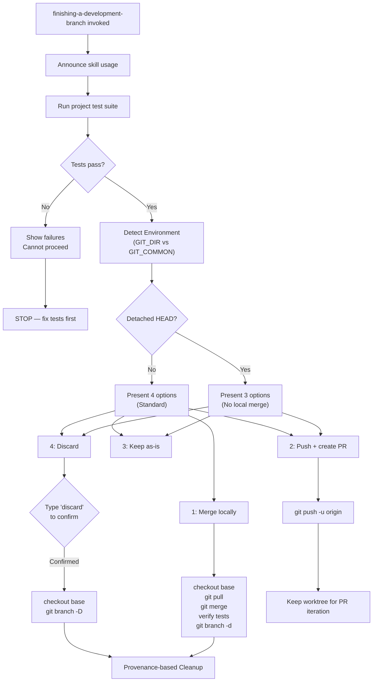
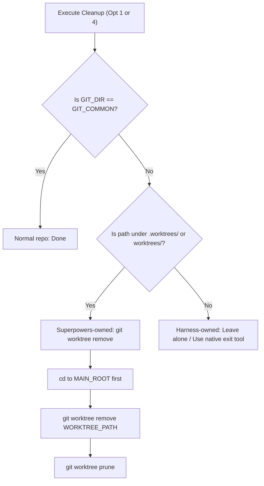

# Finishing Development Branches

<details>
<summary>Relevant source files</summary>

The following files were used as context for generating this wiki page:

- [skills/finishing-a-development-branch/SKILL.md](https://github.com/obra/superpowers/blob/HEAD/skills/finishing-a-development-branch/SKILL.md)
- [skills/using-git-worktrees/SKILL.md](https://github.com/obra/superpowers/blob/HEAD/skills/using-git-worktrees/SKILL.md)

</details>


This page documents the `finishing-a-development-branch` skill: how it gates completion on test verification, environment detection for isolated workspaces, integration options, and provenance-based worktree cleanup. For the earlier phase of setting up an isolated workspace, see [Using Git Worktrees (6.4)]().

---

## Purpose and Position in the Workflow

The `finishing-a-development-branch` skill is the final step in the development pipeline. It runs after all implementation tasks are complete and handles the transition from a feature branch back into the main codebase, a Pull Request, or deliberate abandonment of the work.

**Skill file:** [skills/finishing-a-development-branch/SKILL.md:1-241](https://github.com/obra/superpowers/blob/HEAD/skills/finishing-a-development-branch/SKILL.md#L1-L241)

**Core principle:** Verify tests → Detect environment → Present options → Execute choice → Clean up [skills/finishing-a-development-branch/SKILL.md:12-12](https://github.com/obra/superpowers/blob/HEAD/skills/finishing-a-development-branch/SKILL.md#L12).

Sources: [skills/finishing-a-development-branch/SKILL.md:1-15](https://github.com/obra/superpowers/blob/HEAD/skills/finishing-a-development-branch/SKILL.md#L1-L15)

---

## Process Flow

The workflow transitions from verification to environment-aware decision making.

**Diagram: finishing-a-development-branch Execution Flow**



Sources: [skills/finishing-a-development-branch/SKILL.md:16-161](https://github.com/obra/superpowers/blob/HEAD/skills/finishing-a-development-branch/SKILL.md#L16-L161)

---

## Step 1: Test Verification Gate

Before any option is presented, the skill runs the project's test suite. This is a hard gate — failing tests block all merge and PR operations [skills/finishing-a-development-branch/SKILL.md:18-36](https://github.com/obra/superpowers/blob/HEAD/skills/finishing-a-development-branch/SKILL.md#L18-L36).

```bash
# Run project's test suite
npm test / cargo test / pytest / go test ./...
```

If tests fail, the agent must show the failures and stop. It cannot proceed with merge/PR until tests pass [skills/finishing-a-development-branch/SKILL.md:27-36](https://github.com/obra/superpowers/blob/HEAD/skills/finishing-a-development-branch/SKILL.md#L27-L36).

Sources: [skills/finishing-a-development-branch/SKILL.md:18-39](https://github.com/obra/superpowers/blob/HEAD/skills/finishing-a-development-branch/SKILL.md#L18-L39)

---

## Step 2: Environment Detection

The skill determines the workspace state to customize the menu and cleanup logic [skills/finishing-a-development-branch/SKILL.md:40-56](https://github.com/obra/superpowers/blob/HEAD/skills/finishing-a-development-branch/SKILL.md#L40-L56).

| State | Menu | Cleanup Logic |
|-------|------|---------------|
| `GIT_DIR == GIT_COMMON` (Normal repo) | Standard 4 options | No worktree to clean up |
| `GIT_DIR != GIT_COMMON`, Named branch | Standard 4 options | Provenance-based cleanup |
| `GIT_DIR != GIT_COMMON`, Detached HEAD | Reduced 3 options | No cleanup (externally managed) |

Sources: [skills/finishing-a-development-branch/SKILL.md:40-56](https://github.com/obra/superpowers/blob/HEAD/skills/finishing-a-development-branch/SKILL.md#L40-L56)

---

## Step 3: Present Options

Based on Step 2, the agent presents structured choices [skills/finishing-a-development-branch/SKILL.md:66-91](https://github.com/obra/superpowers/blob/HEAD/skills/finishing-a-development-branch/SKILL.md#L66-L91).

### Standard Menu (Normal Repo or Named Branch)
1. **Merge back to <base-branch> locally**
2. **Push and create a Pull Request**
3. **Keep the branch as-is (I'll handle it later)**
4. **Discard this work**

### Detached HEAD Menu
1. **Push as new branch and create a Pull Request**
2. **Keep as-is (I'll handle it later)**
3. **Discard this work**

Sources: [skills/finishing-a-development-branch/SKILL.md:66-91](https://github.com/obra/superpowers/blob/HEAD/skills/finishing-a-development-branch/SKILL.md#L66-L91)

---

## Step 4: Execute Choice

### Option 1: Merge Locally
The agent switches to the base branch (detected via `git merge-base`), pulls the latest changes, and merges the feature branch [skills/finishing-a-development-branch/SKILL.md:97-107](https://github.com/obra/superpowers/blob/HEAD/skills/finishing-a-development-branch/SKILL.md#L97-L107). It must **verify tests on the merged result** before removing the worktree and deleting the local branch [skills/finishing-a-development-branch/SKILL.md:109-113](https://github.com/obra/superpowers/blob/HEAD/skills/finishing-a-development-branch/SKILL.md#L109-L113).

### Option 2: Push and Create PR
The branch is pushed to `origin` using `git push -u origin <feature-branch>` [skills/finishing-a-development-branch/SKILL.md:121-126](https://github.com/obra/superpowers/blob/HEAD/skills/finishing-a-development-branch/SKILL.md#L121-L126). **Worktrees are never cleaned up for Option 2**, as the user needs the workspace to iterate on PR feedback [skills/finishing-a-development-branch/SKILL.md:128-128](https://github.com/obra/superpowers/blob/HEAD/skills/finishing-a-development-branch/SKILL.md#L128).

### Option 4: Discard
The agent must list the branch and commits to be deleted and wait for the user to type the exact string `discard` before executing destructive operations [skills/finishing-a-development-branch/SKILL.md:137-148](https://github.com/obra/superpowers/blob/HEAD/skills/finishing-a-development-branch/SKILL.md#L137-L148).

Sources: [skills/finishing-a-development-branch/SKILL.md:95-160](https://github.com/obra/superpowers/blob/HEAD/skills/finishing-a-development-branch/SKILL.md#L95-L160)

---

## Step 5: Provenance-Based Cleanup

Cleanup only runs for **Options 1 and 4** and follows strict provenance rules to avoid fighting the harness.

**Diagram: Cleanup Decision Logic**



**Critical Safety Rules:**
- **CWD Safety:** The agent must `cd` to the main repository root before running `git worktree remove`, otherwise the command fails because the CWD is inside the directory being deleted [skills/finishing-a-development-branch/SKILL.md:211-214](https://github.com/obra/superpowers/blob/HEAD/skills/finishing-a-development-branch/SKILL.md#L211-L214).
- **Ownership:** Only worktrees located in Superpowers-managed directories (`.worktrees/` or `worktrees/`) are removed. Anything else is considered "externally managed" [skills/finishing-a-development-branch/SKILL.md:173-182](https://github.com/obra/superpowers/blob/HEAD/skills/finishing-a-development-branch/SKILL.md#L173-L182).

Sources: [skills/finishing-a-development-branch/SKILL.md:161-183](https://github.com/obra/superpowers/blob/HEAD/skills/finishing-a-development-branch/SKILL.md#L161-L183)

---

## Common Mistakes and Red Flags

| Mistake | Fix |
|:---|:---|
| Skipping test verification | Always verify tests pass before offering integration options [skills/finishing-a-development-branch/SKILL.md:195-197](https://github.com/obra/superpowers/blob/HEAD/skills/finishing-a-development-branch/SKILL.md#L195-L197) |
| Cleaning up for Option 2 | Always preserve worktrees for PRs so the user can iterate [skills/finishing-a-development-branch/SKILL.md:203-205](https://github.com/obra/superpowers/blob/HEAD/skills/finishing-a-development-branch/SKILL.md#L203-L205) |
| Deleting branch before worktree | Remove the worktree first; `git branch -d` fails if a worktree still references it [skills/finishing-a-development-branch/SKILL.md:207-209](https://github.com/obra/superpowers/blob/HEAD/skills/finishing-a-development-branch/SKILL.md#L207-L209) |
| Removing harness worktrees | Only clean up worktrees inside `.worktrees/` or `worktrees/` [skills/finishing-a-development-branch/SKILL.md:215-217](https://github.com/obra/superpowers/blob/HEAD/skills/finishing-a-development-branch/SKILL.md#L215-L217) |

**Never:**
- Merge without verifying tests on the merged result [skills/finishing-a-development-branch/SKILL.md:227-227](https://github.com/obra/superpowers/blob/HEAD/skills/finishing-a-development-branch/SKILL.md#L227).
- Delete work without typed "discard" confirmation [skills/finishing-a-development-branch/SKILL.md:228-228](https://github.com/obra/superpowers/blob/HEAD/skills/finishing-a-development-branch/SKILL.md#L228).
- Run `git worktree remove` from inside that worktree [skills/finishing-a-development-branch/SKILL.md:232-232](https://github.com/obra/superpowers/blob/HEAD/skills/finishing-a-development-branch/SKILL.md#L232).

Sources: [skills/finishing-a-development-branch/SKILL.md:193-241](https://github.com/obra/superpowers/blob/HEAD/skills/finishing-a-development-branch/SKILL.md#L193-L241)3b:T2065,# K