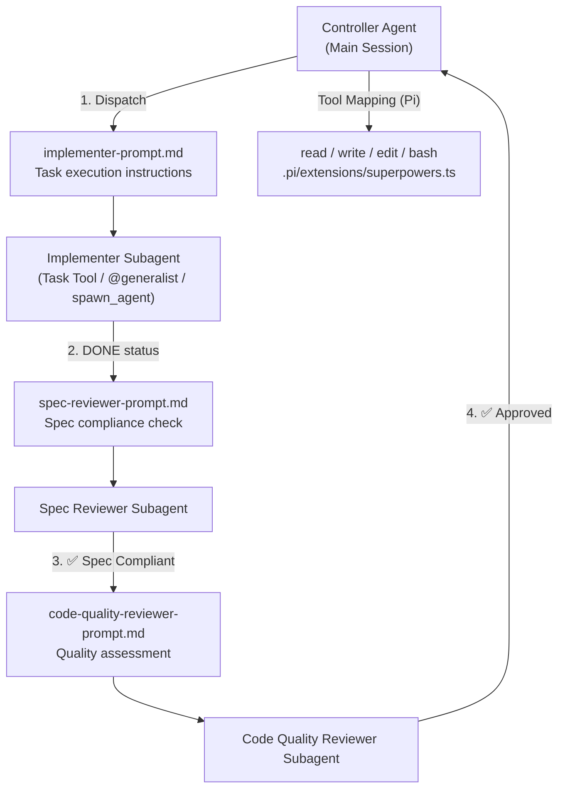

# Key Skills Reference

Relevant source files

The following files were used as context for generating this wiki page:

- [.pi/extensions/superpowers.ts](https://github.com/obra/superpowers/blob/HEAD/.pi/extensions/superpowers.ts)
- [skills/brainstorming/SKILL.md](https://github.com/obra/superpowers/blob/HEAD/skills/brainstorming/SKILL.md)
- [skills/using-superpowers/SKILL.md](https://github.com/obra/superpowers/blob/HEAD/skills/using-superpowers/SKILL.md)
- [skills/writing-plans/SKILL.md](https://github.com/obra/superpowers/blob/HEAD/skills/writing-plans/SKILL.md)
- [tests/pi/test-pi-extension.mjs](https://github.com/obra/superpowers/blob/HEAD/tests/pi/test-pi-extension.mjs)

This page provides high-level reference documentation for the core skills in the Superpowers library. For detailed workflow guides, see [Complete Workflow Pipeline](28_6.1-complete-workflow-pipeline.md). For instructions on creating new skills, see [Creating Skills](46_8-creating-skills.md).

## Overview

Superpowers skills are reusable, modular units of AI guidance stored as `SKILL.md` files [skills/using-superpowers/SKILL.md:1-3](https://github.com/obra/superpowers/blob/HEAD/skills/using-superpowers/SKILL.md#L1-L3). They enforce structured development workflows across multiple platforms by providing specialized instructions, checklists, and subagent prompt templates. The system is built on the principle that the agent checks for relevant skills before any task, turning workflows into mandatory protocols rather than suggestions [skills/using-superpowers/SKILL.md:10-16](https://github.com/obra/superpowers/blob/HEAD/skills/using-superpowers/SKILL.md#L10-L16).

## Core Workflow Pipeline

The Superpowers development process follows a strict pipeline: **Brainstorming** (Design) → **Using Git Worktrees** (Isolation) → **Writing Plans** (Decomposition) → **Subagent-Driven Development** (Execution) [skills/using-superpowers/SKILL.md:28-32](https://github.com/obra/superpowers/blob/HEAD/skills/using-superpowers/SKILL.md#L28-L32), [skills/brainstorming/SKILL.md:32-33](https://github.com/obra/superpowers/blob/HEAD/skills/brainstorming/SKILL.md#L32-L33).

### Diagram: Skill-Based Development Workflow
This diagram associates the natural language stages of development with the specific code entities (skills and prompt templates) that govern them.

```mermaid
graph TB
    User_Request["User Request"] --> using_superpowers_br_SKILL_md_br_Skill_i["using-superpowers<br/>SKILL.md<br/>Skill invocation protocol"]
    
    using_superpowers_br_SKILL_md_br_Skill_i["using-superpowers<br/>SKILL.md<br/>Skill invocation protocol"] -->|"1% rule applies"| Skill_tool_activate_skill_br_Discovery_h["Skill tool / activate_skill<br/>Discovery helper"]
    
    Skill_tool_activate_skill_br_Discovery_h["Skill tool / activate_skill<br/>Discovery helper"] --> brainstorming_br_SKILL_md_br_HARD_GATE_e["brainstorming<br/>SKILL.md<br/>HARD-GATE enforcement"]
    
    brainstorming_br_SKILL_md_br_HARD_GATE_e["brainstorming<br/>SKILL.md<br/>HARD-GATE enforcement"] -->|"Design approved"| docs_superpowers_specs_br_YYYY_MM_DD_top["docs/superpowers/specs/<br/>YYYY-MM-DD-topic-design.md"]
    
    docs_superpowers_specs_br_YYYY_MM_DD_top["docs/superpowers/specs/<br/>YYYY-MM-DD-topic-design.md"] --> using_git_worktrees_br_SKILL_md_br_Isola["using-git-worktrees<br/>SKILL.md<br/>Isolation requirement"]
    
    using_git_worktrees_br_SKILL_md_br_Isola["using-git-worktrees<br/>SKILL.md<br/>Isolation requirement"] --> writing_plans_br_SKILL_md_br_Task_decomp["writing-plans<br/>SKILL.md<br/>Task decomposition"]
    
    writing_plans_br_SKILL_md_br_Task_decomp["writing-plans<br/>SKILL.md<br/>Task decomposition"] --> docs_superpowers_plans_br_YYYY_MM_DD_fea["docs/superpowers/plans/<br/>YYYY-MM-DD-feature.md"]
    
    docs_superpowers_plans_br_YYYY_MM_DD_fea["docs/superpowers/plans/<br/>YYYY-MM-DD-feature.md"] --> subagent_driven_development_br_SKILL_md["subagent-driven-development<br/>SKILL.md<br/>Fresh subagent + two-stage review"]
    
    subagent_driven_development_br_SKILL_md["subagent-driven-development<br/>SKILL.md<br/>Fresh subagent + two-stage review"] -->|"Per task"| implementer_prompt_md_br_Task_execution["implementer-prompt.md<br/>Task execution template"]
    
    implementer_prompt_md_br_Task_execution["implementer-prompt.md<br/>Task execution template"] -->|"DONE status"| spec_reviewer_prompt_md_br_Spec_complian["spec-reviewer-prompt.md<br/>Spec compliance check"]
    
    spec_reviewer_prompt_md_br_Spec_complian["spec-reviewer-prompt.md<br/>Spec compliance check"] -->|"✅ Spec compliant"| code_quality_reviewer_prompt_md_br_Quali["code-quality-reviewer-prompt.md<br/>Quality assessment"]
    
    code_quality_reviewer_prompt_md_br_Quali["code-quality-reviewer-prompt.md<br/>Quality assessment"] -->|"✅ Approved"| finishing_a_development_branch_br_SKILL["finishing-a-development-branch<br/>SKILL.md<br/>Integration and cleanup"]
```

Sources: [skills/using-superpowers/SKILL.md:28-32](https://github.com/obra/superpowers/blob/HEAD/skills/using-superpowers/SKILL.md#L28-L32), [skills/brainstorming/SKILL.md:12-14](https://github.com/obra/superpowers/blob/HEAD/skills/brainstorming/SKILL.md#L12-L14), [skills/writing-plans/SKILL.md:18-20](https://github.com/obra/superpowers/blob/HEAD/skills/writing-plans/SKILL.md#L18-L20), [skills/using-superpowers/SKILL.md:52-60](https://github.com/obra/superpowers/blob/HEAD/skills/using-superpowers/SKILL.md#L52-L60)

---

## 7.1 using-superpowers (Meta-Skill)
The `using-superpowers` skill is the entry point for all library usage. It enforces the **1% Rule**: if there is even a 1% chance a skill applies, it must be invoked [skills/using-superpowers/SKILL.md:10-16](https://github.com/obra/superpowers/blob/HEAD/skills/using-superpowers/SKILL.md#L10-L16). It also establishes the instruction priority hierarchy where project-specific instructions (like `CLAUDE.md`, `GEMINI.md`, or `AGENTS.md`) override Superpowers skills [skills/using-superpowers/SKILL.md:62-63](https://github.com/obra/superpowers/blob/HEAD/skills/using-superpowers/SKILL.md#L62-L63).

For details, see [using-superpowers (Meta-Skill)](38_7.1-using-superpowers-meta-skill.md).

## 7.2 brainstorming
The `brainstorming` skill enforces a **HARD-GATE**: no implementation or code writing is permitted until a design has been presented and approved by the user [skills/brainstorming/SKILL.md:12-14](https://github.com/obra/superpowers/blob/HEAD/skills/brainstorming/SKILL.md#L12-L14). It guides the AI through context exploration, clarifying questions, and trade-off analysis before generating a formal design document in `docs/superpowers/specs/` [skills/brainstorming/SKILL.md:29-31](https://github.com/obra/superpowers/blob/HEAD/skills/brainstorming/SKILL.md#L29-L31).

For details, see [brainstorming](39_7.2-brainstorming.md).

## 7.3 writing-plans
The `writing-plans` skill translates approved designs into actionable implementation plans. It requires mapping out file structures and decomposing work into "bite-sized" tasks [skills/writing-plans/SKILL.md:25-34](https://github.com/obra/superpowers/blob/HEAD/skills/writing-plans/SKILL.md#L25-L34). Every task must include exact file paths, complete code blocks, and specific verification steps to ensure an engineer with "zero context" can execute it [skills/writing-plans/SKILL.md:10-12](https://github.com/obra/superpowers/blob/HEAD/skills/writing-plans/SKILL.md#L10-L12).

For details, see [writing-plans](40_7.3-writing-plans.md).

## 7.4 subagent-driven-development
The `subagent-driven-development` (SDD) skill is the primary execution engine. It dispatches a fresh subagent for every task in a plan to prevent context pollution [skills/writing-plans/SKILL.md:162-163](https://github.com/obra/superpowers/blob/HEAD/skills/writing-plans/SKILL.md#L162-L163). It includes a two-stage review process: first for spec compliance, then for code quality [skills/writing-plans/SKILL.md:169-170](https://github.com/obra/superpowers/blob/HEAD/skills/writing-plans/SKILL.md#L169-L170).

### Diagram: SDD Orchestration and Review
This diagram maps the SDD execution process to the specific subagent prompt files and tool mappings used across platforms like Pi.

Sources: [skills/writing-plans/SKILL.md:162-170](https://github.com/obra/superpowers/blob/HEAD/skills/writing-plans/SKILL.md#L162-L170), [.pi/extensions/superpowers.ts:88-97](https://github.com/obra/superpowers/blob/HEAD/.pi/extensions/superpowers.ts#L88-L97), [tests/pi/test-pi-extension.mjs:121-128](https://github.com/obra/superpowers/blob/HEAD/tests/pi/test-pi-extension.mjs#L121-L128)

For details, see [subagent-driven-development](41_7.4-subagent-driven-development.md).

## 7.5 test-driven-development
The `test-driven-development` skill enforces the classic **RED-GREEN-REFACTOR** cycle. The `writing-plans` skill integrates this by requiring steps for writing a failing test, verifying the failure, and then writing minimal implementation [skills/writing-plans/SKILL.md:95-115](https://github.com/obra/superpowers/blob/HEAD/skills/writing-plans/SKILL.md#L95-L115).

For details, see [test-driven-development](42_7.5-test-driven-development.md).

## 7.6 systematic-debugging
The `systematic-debugging` skill provides a disciplined root cause process. It is used when fixing bugs to ensure a hypothesis-driven approach rather than "guess-and-check" [skills/using-superpowers/SKILL.md:31-32](https://github.com/obra/superpowers/blob/HEAD/skills/using-superpowers/SKILL.md#L31-L32).

For details, see [systematic-debugging](43_7.6-systematic-debugging.md).

## 7.7 using-git-worktrees
The `using-git-worktrees` skill ensures workspace isolation. It is referenced during the planning phase to ensure that implementation happens in a clean, isolated environment [skills/writing-plans/SKILL.md:16-17](https://github.com/obra/superpowers/blob/HEAD/skills/writing-plans/SKILL.md#L16-L17).

For details, see [using-git-worktrees](44_7.7-using-git-worktrees.md).

## 7.8 Other Essential Skills
- **executing-plans**: An alternative to SDD that uses batch execution in the current session with human checkpoints [skills/writing-plans/SKILL.md:172-174](https://github.com/obra/superpowers/blob/HEAD/skills/writing-plans/SKILL.md#L172-L174).
- **finishing-a-development-branch**: Final stage involving test verification and cleanup after a plan is fully implemented.
- **verification-before-completion**: Ensures a task is actually finished and meets requirements before moving to the next one.

For details, see [Other Essential Skills](45_7.8-other-essential-skills.md).3c:T28d2,# usi