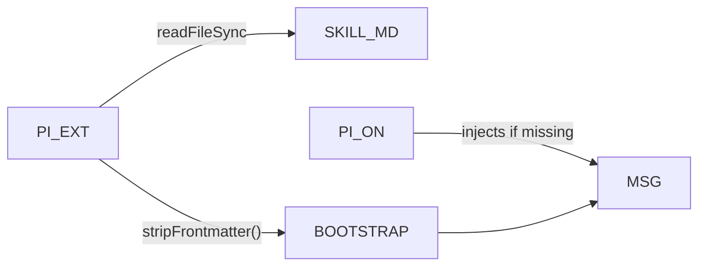
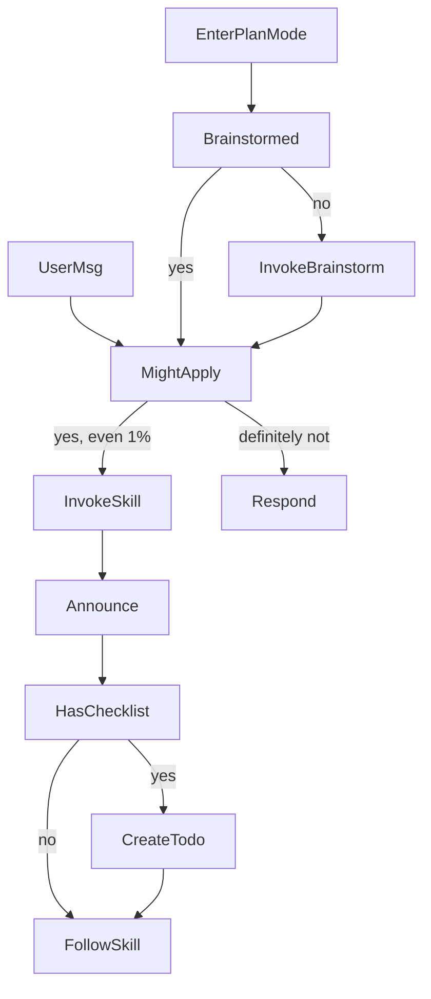
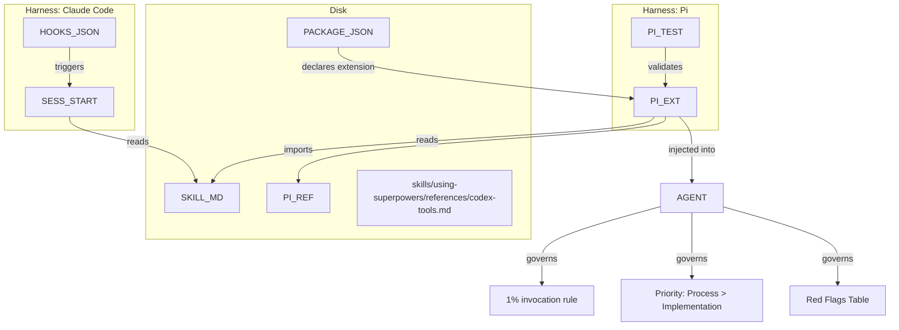

# using-superpowers (Meta-Skill)

<details>
<summary>Relevant source files</summary>

The following files were used as context for generating this wiki page:

- [.claude-plugin/plugin.json](https://github.com/obra/superpowers/blob/HEAD/.claude-plugin/plugin.json)
- [.pi/extensions/superpowers.ts](https://github.com/obra/superpowers/blob/HEAD/.pi/extensions/superpowers.ts)
- [RELEASE-NOTES.md](https://github.com/obra/superpowers/blob/HEAD/RELEASE-NOTES.md)
- [skills/using-superpowers/SKILL.md](https://github.com/obra/superpowers/blob/HEAD/skills/using-superpowers/SKILL.md)
- [tests/pi/test-pi-extension.mjs](https://github.com/obra/superpowers/blob/HEAD/tests/pi/test-pi-extension.mjs)

</details>


This page is a full reference for the `using-superpowers` skill — the bootstrap meta-skill that governs how an agent discovers and applies all other skills. It covers the mandatory invocation protocol (the 1% rule), instruction priority hierarchy, the SUBAGENT-STOP gate, skill type priority ordering, the Red Flags rationalization table, and platform-specific tool mappings.

As of v6.1.0, the `using-superpowers` bootstrap has been compressed for lower per-session token cost while maintaining the full Red Flags table and precedence rules [RELEASE-NOTES.md:16-22](https://github.com/obra/superpowers/blob/HEAD/RELEASE-NOTES.md#L16-L22).

---

## What the Meta-Skill Does

`using-superpowers` is the first skill an agent encounters in any session. Rather than guiding the agent through a specific task, it establishes the *rules for using all other skills*. Its content is injected directly into the session context via platform-specific bootstrap mechanisms rather than being loaded on-demand like other skills.

The skill lives at [skills/using-superpowers/SKILL.md](https://github.com/obra/superpowers/blob/HEAD/skills/using-superpowers/SKILL.md).

**Key responsibilities:**
- Enforce the 1% invocation threshold for skill usage [skills/using-superpowers/SKILL.md:10-16](https://github.com/obra/superpowers/blob/HEAD/skills/using-superpowers/SKILL.md#L10-L16)
- Define instruction priority hierarchy (user > skills > system prompt) [skills/using-superpowers/SKILL.md:60-63](https://github.com/obra/superpowers/blob/HEAD/skills/using-superpowers/SKILL.md#L60-L63)
- Provide the SUBAGENT-STOP gate to prevent subagents from re-invoking the meta-skill [skills/using-superpowers/SKILL.md:6-8](https://github.com/obra/superpowers/blob/HEAD/skills/using-superpowers/SKILL.md#L6-L8)
- Establish skill type priority (process skills before implementation skills) [skills/using-superpowers/SKILL.md:26-32](https://github.com/obra/superpowers/blob/HEAD/skills/using-superpowers/SKILL.md#L26-L32)
- Map Red Flag rationalizations to correct behavior [skills/using-superpowers/SKILL.md:33-51](https://github.com/obra/superpowers/blob/HEAD/skills/using-superpowers/SKILL.md#L33-L51)
- Guard plan mode with brainstorming gate [skills/using-superpowers/SKILL.md:22](https://github.com/obra/superpowers/blob/HEAD/skills/using-superpowers/SKILL.md#L22)

Sources: [skills/using-superpowers/SKILL.md:1-63](https://github.com/obra/superpowers/blob/HEAD/skills/using-superpowers/SKILL.md#L1-L63), [RELEASE-NOTES.md:16-22](https://github.com/obra/superpowers/blob/HEAD/RELEASE-NOTES.md#L16-L22)

---

## Session Injection

`using-superpowers` is read and embedded directly into the system context at the start of every session. In modern versions, this is handled by platform-specific extensions or hooks.

**Diagram: Pi Extension Injection Pipeline**



Sources: [.pi/extensions/superpowers.ts:11-75](https://github.com/obra/superpowers/blob/HEAD/.pi/extensions/superpowers.ts#L11-L75), [tests/pi/test-pi-extension.mjs:72-101](https://github.com/obra/superpowers/blob/HEAD/tests/pi/test-pi-extension.mjs#L72-L101)

**Key implementation details:**
- **Pi:** The extension uses `pi.on("context")` to inject the bootstrap as a user message at the start of the conversation or after session compaction [.pi/extensions/superpowers.ts:35-56](https://github.com/obra/superpowers/blob/HEAD/.pi/extensions/superpowers.ts#L35-L56).
- **Claude Code:** Uses the `hooks/session-start` script triggered by `hooks/hooks.json` [hooks/hooks.json:4-10](https://github.com/obra/superpowers/blob/HEAD/hooks/hooks.json#L4-L10).
- **Codex:** As of v6.1.0, Codex uses native skill discovery and no longer requires a session-start hook [RELEASE-NOTES.md:23-27](https://github.com/obra/superpowers/blob/HEAD/RELEASE-NOTES.md#L23-L27).

Sources: [.pi/extensions/superpowers.ts:1-122](https://github.com/obra/superpowers/blob/HEAD/.pi/extensions/superpowers.ts#L1-L122), [RELEASE-NOTES.md:7-12](https://github.com/obra/superpowers/blob/HEAD/RELEASE-NOTES.md#L7-L12), [RELEASE-NOTES.md:23-27](https://github.com/obra/superpowers/blob/HEAD/RELEASE-NOTES.md#L23-L27)

---

## The SUBAGENT-STOP Gate

Before enforcing the 1% rule, `using-superpowers` checks whether the current agent is a subagent dispatched for a specific task:

```
<SUBAGENT-STOP>
If you were dispatched as a subagent to execute a specific task, ignore this skill.
</SUBAGENT-STOP>
```

**Rationale:** Subagents are spawned to execute narrow, well-defined tasks. These agents should not re-invoke the meta-skill and trigger the full skill discovery protocol — they already have their task scope defined by the controller agent.

Sources: [skills/using-superpowers/SKILL.md:6-8](https://github.com/obra/superpowers/blob/HEAD/skills/using-superpowers/SKILL.md#L6-L8)

---

## The Mandatory Invocation Protocol (The 1% Rule)

The core rule established by `using-superpowers` is:

> **Invoke relevant or requested skills BEFORE any response or action.** [skills/using-superpowers/SKILL.md:20](https://github.com/obra/superpowers/blob/HEAD/skills/using-superpowers/SKILL.md#L20)

The threshold for invocation is deliberately low:

- If there is even a **1% chance** a skill might apply, the agent **must** invoke it [skills/using-superpowers/SKILL.md:11](https://github.com/obra/superpowers/blob/HEAD/skills/using-superpowers/SKILL.md#L11).
- If an invoked skill turns out to be inapplicable, the agent may disregard it — but the check itself is never optional [skills/using-superpowers/SKILL.md:20-21](https://github.com/obra/superpowers/blob/HEAD/skills/using-superpowers/SKILL.md#L20-L21).
- This rule applies even before clarifying questions or checking files [skills/using-superpowers/SKILL.md:20](https://github.com/obra/superpowers/blob/HEAD/skills/using-superpowers/SKILL.md#L20).

The `<EXTREMELY-IMPORTANT>` block emphasizes this rule using absolute language:

```
IF A SKILL APPLIES TO YOUR TASK, YOU DO NOT HAVE A CHOICE. YOU MUST USE IT.
This is not negotiable. You cannot rationalize your way out of this.
```

Sources: [skills/using-superpowers/SKILL.md:10-16](https://github.com/obra/superpowers/blob/HEAD/skills/using-superpowers/SKILL.md#L10-L16), [skills/using-superpowers/SKILL.md:20-21](https://github.com/obra/superpowers/blob/HEAD/skills/using-superpowers/SKILL.md#L20-L21)

---

## Instruction Priority Hierarchy

The instruction priority hierarchy clarifies conflict resolution:

| Priority | Source | Example | Binding |
|----------|--------|---------|---------|
| 1 (highest) | **User's explicit instructions** | `CLAUDE.md`, `AGENTS.md`, direct requests | Always wins |
| 2 (middle) | **Superpowers skills** | Skill files in library | Override default behavior |
| 3 (lowest) | **Default system prompt** | Base behavior of the AI model | Lowest priority |

**Resolution rule:**
Only skip skill workflows or instructions when your human partner has explicitly told you to [skills/using-superpowers/SKILL.md:62-63](https://github.com/obra/superpowers/blob/HEAD/skills/using-superpowers/SKILL.md#L62-L63).

Sources: [skills/using-superpowers/SKILL.md:60-63](https://github.com/obra/superpowers/blob/HEAD/skills/using-superpowers/SKILL.md#L60-L63)

---

## Platform Tool Mappings

The meta-skill and its platform references (e.g., `references/pi-tools.md`) map standard Claude Code tools to platform-specific equivalents.

### Pi Tool Mappings
| Claude Code Tool | Pi Equivalent | Purpose |
|------------------|---------------|---------|
| `Skill` | Native `read` | Load `SKILL.md` files [.pi/extensions/superpowers.ts:91](https://github.com/obra/superpowers/blob/HEAD/.pi/extensions/superpowers.ts#L91) |
| `Task` | `subagent` | If available via `pi-subagents` [.pi/extensions/superpowers.ts:95-96](https://github.com/obra/superpowers/blob/HEAD/.pi/extensions/superpowers.ts#L95-L96) |
| `TodoWrite` | `TODO.md` / `write` | Track work in local files [.pi/extensions/superpowers.ts:97-98](https://github.com/obra/superpowers/blob/HEAD/.pi/extensions/superpowers.ts#L97-L98) |
| `Read` / `Write` | `read` / `write` | File operations [.pi/extensions/superpowers.ts:93](https://github.com/obra/superpowers/blob/HEAD/.pi/extensions/superpowers.ts#L93) |
| `Bash` | `bash` | Run shell commands [.pi/extensions/superpowers.ts:93](https://github.com/obra/superpowers/blob/HEAD/.pi/extensions/superpowers.ts#L93) |

Note: Gemini CLI support was removed in v6.1.0 [RELEASE-NOTES.md:30-31](https://github.com/obra/superpowers/blob/HEAD/RELEASE-NOTES.md#L30-L31).

Sources: [.pi/extensions/superpowers.ts:89-98](https://github.com/obra/superpowers/blob/HEAD/.pi/extensions/superpowers.ts#L89-L98), [RELEASE-NOTES.md:30-31](https://github.com/obra/superpowers/blob/HEAD/RELEASE-NOTES.md#L30-L31)

---

## Decision Flow

**Diagram: Skill Invocation Decision Flow**



Sources: [skills/using-superpowers/SKILL.md:18-25](https://github.com/obra/superpowers/blob/HEAD/skills/using-superpowers/SKILL.md#L18-L25)

---

## Red Flags: Rationalization Table

The meta-skill includes a table of internal thoughts that indicate the agent is about to skip a skill check illegitimately:

| Thought | Reality |
|---------|---------|
| "This is just a simple question" | Questions are tasks. Check for skills. |
| "I need more context first" | Skill check comes BEFORE clarifying questions. |
| "Let me explore the codebase first" | Skills tell you HOW to explore. Check first. |
| "I can check git/files quickly" | Files lack conversation context. Check for skills. |
| "Let me gather information first" | Skills tell you HOW to gather information. |
| "This doesn't need a formal skill" | If a skill exists, use it. |
| "I remember this skill" | Skills evolve. Read current version. |
| "This doesn't count as a task" | Action = task. Check for skills. |
| "The skill is overkill" | Simple things become complex. Use it. |
| "I'll just do this one thing first" | Check BEFORE doing anything. |
| "This feels productive" | Undisciplined action wastes time. Skills prevent this. |
| "I know what that means" | Knowing the concept ≠ using the skill. Invoke it. |

Sources: [skills/using-superpowers/SKILL.md:33-51](https://github.com/obra/superpowers/blob/HEAD/skills/using-superpowers/SKILL.md#L33-L51)

---

## Code Entity Map

**Diagram: using-superpowers Code Entities**



Sources: [skills/using-superpowers/SKILL.md:1-63](https://github.com/obra/superpowers/blob/HEAD/skills/using-superpowers/SKILL.md#L1-L63), [.pi/extensions/superpowers.ts:1-113](https://github.com/obra/superpowers/blob/HEAD/.pi/extensions/superpowers.ts#L1-L113), [tests/pi/test-pi-extension.mjs:45-52](https://github.com/obra/superpowers/blob/HEAD/tests/pi/test-pi-extension.mjs#L45-L52), [hooks/hooks.json:1-16](https://github.com/obra/superpowers/blob/HEAD/hooks/hooks.json#L1-L16), [hooks/session-start:1-51](https://github.com/obra/superpowers/blob/HEAD/hooks/session-start#L1-L51)3d:T24f5