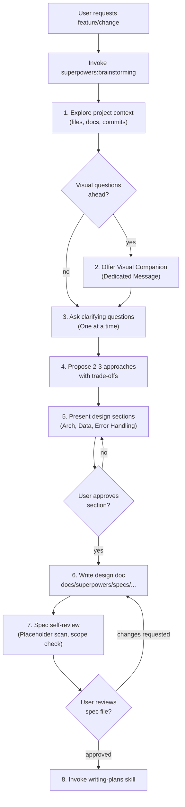
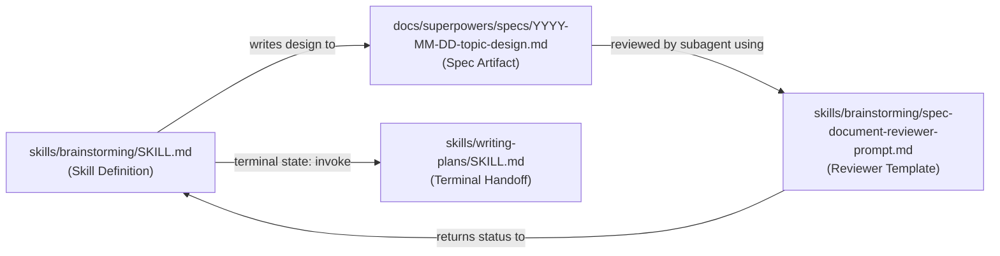

# brainstorming

Relevant source files

The following files were used as context for generating this wiki page:

- [skills/brainstorming/SKILL.md](https://github.com/obra/superpowers/blob/HEAD/skills/brainstorming/SKILL.md)
- [skills/brainstorming/spec-document-reviewer-prompt.md](https://github.com/obra/superpowers/blob/HEAD/skills/brainstorming/spec-document-reviewer-prompt.md)
- [skills/requesting-code-review/code-reviewer.md](https://github.com/obra/superpowers/blob/HEAD/skills/requesting-code-review/code-reviewer.md)
- [skills/writing-plans/SKILL.md](https://github.com/obra/superpowers/blob/HEAD/skills/writing-plans/SKILL.md)
- [skills/writing-plans/plan-document-reviewer-prompt.md](https://github.com/obra/superpowers/blob/HEAD/skills/writing-plans/plan-document-reviewer-prompt.md)
- [skills/writing-skills/persuasion-principles.md](https://github.com/obra/superpowers/blob/HEAD/skills/writing-skills/persuasion-principles.md)

This page is the full reference for the `brainstorming` skill ([skills/brainstorming/SKILL.md](https://github.com/obra/superpowers/blob/HEAD/skills/brainstorming/SKILL.md)), which governs how agents explore and design work before writing any code. It covers invocation rules, the sequential checklist, key principles, anti-patterns, the visual companion architecture, and spec review protocols.

For the broader workflow context in which brainstorming sits — including how it connects to `writing-plans`, `subagent-driven-development`, and branch finishing — see [§6.1](https://github.com/obra/superpowers/blob/HEAD/§6.1). For the meta-skill rule that mandates checking for applicable skills before any action (including before brainstorming), see [§7.1](https://github.com/obra/superpowers/blob/HEAD/§7.1).

---

## What the Skill Does

The `brainstorming` skill converts a raw idea into a documented design through structured collaborative dialogue. It enforces a **HARD-GATE** that prohibits any implementation action until the user has explicitly approved a design.

The skill lives at [skills/brainstorming/SKILL.md:1-4](https://github.com/obra/superpowers/blob/HEAD/skills/brainstorming/SKILL.md#L1-L4) and is accessible via the `superpowers:brainstorming` namespace.

---

## Invocation

| Platform | How to invoke |
|---|---|
| Claude Code | `Skill` tool with `superpowers:brainstorming` |
| Cursor | `superpowers:brainstorming` via skill tool |
| OpenCode | `@superpowers:brainstorming` mention |
| Codex | Automatic on name/description match, or explicit request |
| Gemini CLI | `activate_skill` tool with `brainstorming` |

Sources: [skills/brainstorming/SKILL.md:1-4](https://github.com/obra/superpowers/blob/HEAD/skills/brainstorming/SKILL.md#L1-L4)

---

## The HARD-GATE

The most important enforcement mechanism in this skill is the `<HARD-GATE>` block:

> Do NOT invoke any implementation skill, write any code, scaffold any project, or take any implementation action until you have presented a design and the user has approved it. This applies to **EVERY** project regardless of perceived simplicity. [skills/brainstorming/SKILL.md:12-14](https://github.com/obra/superpowers/blob/HEAD/skills/brainstorming/SKILL.md#L12-L14)

This gate is not conditional. It cannot be bypassed by arguments that the task is trivial.

Sources: [skills/brainstorming/SKILL.md:12-14](https://github.com/obra/superpowers/blob/HEAD/skills/brainstorming/SKILL.md#L12-L14)

---

## Anti-Pattern: "This Is Too Simple To Need A Design"

The skill explicitly names and rejects the most common rationalization for skipping design:

> "Simple" projects are where unexamined assumptions cause the most wasted work. The design can be short (a few sentences for truly simple projects), but you MUST present it and get approval. [skills/brainstorming/SKILL.md:16-19](https://github.com/obra/superpowers/blob/HEAD/skills/brainstorming/SKILL.md#L16-L19)

Sources: [skills/brainstorming/SKILL.md:16-19](https://github.com/obra/superpowers/blob/HEAD/skills/brainstorming/SKILL.md#L16-L19)

---

## The Sequential Checklist

The skill mandates that the agent create a task for each step and complete them in order. No step may be skipped.

| # | Step | Key Constraint |
|---|---|---|
| 1 | **Explore project context** | Check files, docs, recent commits before asking anything. [skills/brainstorming/SKILL.md:24](https://github.com/obra/superpowers/blob/HEAD/skills/brainstorming/SKILL.md#L24) |
| 2 | **Offer visual companion** | If topic involves visual questions; must be its own message. [skills/brainstorming/SKILL.md:25](https://github.com/obra/superpowers/blob/HEAD/skills/brainstorming/SKILL.md#L25) |
| 3 | **Ask clarifying questions** | One question per message; focus on purpose/constraints/success. [skills/brainstorming/SKILL.md:26](https://github.com/obra/superpowers/blob/HEAD/skills/brainstorming/SKILL.md#L26) |
| 4 | **Propose 2–3 approaches** | Include trade-offs and a stated recommendation. [skills/brainstorming/SKILL.md:27](https://github.com/obra/superpowers/blob/HEAD/skills/brainstorming/SKILL.md#L27) |
| 5 | **Present design** | Section-by-section (architecture, data flow, etc.), get approval. [skills/brainstorming/SKILL.md:28](https://github.com/obra/superpowers/blob/HEAD/skills/brainstorming/SKILL.md#L28) |
| 6 | **Write design doc** | Save to `docs/superpowers/specs/YYYY-MM-DD-<topic>-design.md`. [skills/brainstorming/SKILL.md:29](https://github.com/obra/superpowers/blob/HEAD/skills/brainstorming/SKILL.md#L29) |
| 7 | **Spec self-review** | Quick inline check for placeholders, contradictions, and scope. [skills/brainstorming/SKILL.md:30](https://github.com/obra/superpowers/blob/HEAD/skills/brainstorming/SKILL.md#L30) |
| 8 | **User reviews spec** | Final human sign-off on the written file. [skills/brainstorming/SKILL.md:31](https://github.com/obra/superpowers/blob/HEAD/skills/brainstorming/SKILL.md#L31) |
| 9 | **Transition** | Invoke `writing-plans` skill — no other skill permitted. [skills/brainstorming/SKILL.md:32](https://github.com/obra/superpowers/blob/HEAD/skills/brainstorming/SKILL.md#L32) |

Sources: [skills/brainstorming/SKILL.md:20-33](https://github.com/obra/superpowers/blob/HEAD/skills/brainstorming/SKILL.md#L20-L33)

---

## Process Flow

**Brainstorming skill control flow and decision logic**

Sources: [skills/brainstorming/SKILL.md:34-59](https://github.com/obra/superpowers/blob/HEAD/skills/brainstorming/SKILL.md#L34-L59)

---

## Visual Brainstorming Companion

The Visual Companion is a browser-based tool for showing mockups and diagrams. It is offered "just-in-time" when a question would be clearer shown than described [skills/brainstorming/SKILL.md:25](https://github.com/obra/superpowers/blob/HEAD/skills/brainstorming/SKILL.md#L25).

### Interaction Model
1. **Server Initialization:** The server is started via a script. It generates a `SESSION_ID` and directory.
2. **Push Screens:** The agent writes HTML fragments to the `screen_dir`. The server wraps fragments in a frame template.
3. **Capture Events:** User interactions (clicks, selections) are written as JSON lines to an `.events` file.
4. **Cleanup:** Use a stop script to kill the process and clean up ephemeral directories.

Sources: [skills/brainstorming/SKILL.md:25](https://github.com/obra/superpowers/blob/HEAD/skills/brainstorming/SKILL.md#L25)

---

## Spec Review and Validation

Once the design is written to a file, it undergoes two levels of review:

### 1. Spec Self-Review
The agent performs a "fresh eyes" check of the document:
- **Placeholder scan:** Searching for "TBD", "TODO", or vague requirements [skills/brainstorming/SKILL.md:114](https://github.com/obra/superpowers/blob/HEAD/skills/brainstorming/SKILL.md#L114).
- **Internal consistency:** Ensuring architecture matches feature descriptions [skills/brainstorming/SKILL.md:115](https://github.com/obra/superpowers/blob/HEAD/skills/brainstorming/SKILL.md#L115).
- **Scope check:** Confirming the spec is focused and not describing multiple independent subsystems [skills/brainstorming/SKILL.md:116](https://github.com/obra/superpowers/blob/HEAD/skills/brainstorming/SKILL.md#L116).
- **Ambiguity check:** Picking a specific path for requirements that could be interpreted two ways [skills/brainstorming/SKILL.md:117](https://github.com/obra/superpowers/blob/HEAD/skills/brainstorming/SKILL.md#L117).

### 2. External Spec Review (Subagent)
For complex designs, a subagent can be dispatched using the `Spec Document Reviewer Prompt Template` [skills/brainstorming/spec-document-reviewer-prompt.md:1-47](https://github.com/obra/superpowers/blob/HEAD/skills/brainstorming/spec-document-reviewer-prompt.md#L1-L47).
- **Purpose:** Verify the spec is complete, consistent, and ready for implementation planning [skills/brainstorming/spec-document-reviewer-prompt.md:5](https://github.com/obra/superpowers/blob/HEAD/skills/brainstorming/spec-document-reviewer-prompt.md#L5).
- **Criteria:** Completeness, Consistency, Clarity, Scope, and YAGNI [skills/brainstorming/spec-document-reviewer-prompt.md:19-25](https://github.com/obra/superpowers/blob/HEAD/skills/brainstorming/spec-document-reviewer-prompt.md#L19-L25).

### 3. Transition to Implementation
The only permitted terminal state for brainstorming is invoking the `writing-plans` skill [skills/brainstorming/SKILL.md:61](https://github.com/obra/superpowers/blob/HEAD/skills/brainstorming/SKILL.md#L61). This handoff ensures that the implementation plan is derived directly from the validated spec [skills/writing-plans/SKILL.md:1-4](https://github.com/obra/superpowers/blob/HEAD/skills/writing-plans/SKILL.md#L1-L4).

Sources: [skills/brainstorming/SKILL.md:111-121](https://github.com/obra/superpowers/blob/HEAD/skills/brainstorming/SKILL.md#L111-L121), [skills/writing-plans/SKILL.md:1-4](https://github.com/obra/superpowers/blob/HEAD/skills/writing-plans/SKILL.md#L1-L4), [skills/brainstorming/spec-document-reviewer-prompt.md:1-50](https://github.com/obra/superpowers/blob/HEAD/skills/brainstorming/spec-document-reviewer-prompt.md#L1-L50)

---

## Code Entity Mapping

**How brainstorming transitions from natural language design to code artifacts and tools**

Sources: [skills/brainstorming/SKILL.md:29-32](https://github.com/obra/superpowers/blob/HEAD/skills/brainstorming/SKILL.md#L29-L32), [skills/brainstorming/spec-document-reviewer-prompt.md:1-16](https://github.com/obra/superpowers/blob/HEAD/skills/brainstorming/spec-document-reviewer-prompt.md#L1-L16), [skills/writing-plans/SKILL.md:1-4](https://github.com/obra/superpowers/blob/HEAD/skills/writing-plans/SKILL.md#L1-L4)

---

## Key Principles

| Principle | Meaning |
|---|---|
| **One question at a time** | Multiple questions in one message overwhelm; split them across turns. [skills/brainstorming/SKILL.md:72](https://github.com/obra/superpowers/blob/HEAD/skills/brainstorming/SKILL.md#L72) |
| **Multiple choice preferred** | Reduces cognitive load; open-ended only when necessary. [skills/brainstorming/SKILL.md:71](https://github.com/obra/superpowers/blob/HEAD/skills/brainstorming/SKILL.md#L71) |
| **Isolation & Clarity** | Break systems into units with clear purposes and well-defined interfaces. [skills/brainstorming/SKILL.md:91-95](https://github.com/obra/superpowers/blob/HEAD/skills/brainstorming/SKILL.md#L91-L95) |
| **Explore alternatives** | Always propose 2–3 approaches; never present a single option as the only path. [skills/brainstorming/SKILL.md:77](https://github.com/obra/superpowers/blob/HEAD/skills/brainstorming/SKILL.md#L77) |
| **Incremental validation** | Present design section by section, get approval at each step. [skills/brainstorming/SKILL.md:83-85](https://github.com/obra/superpowers/blob/HEAD/skills/brainstorming/SKILL.md#L83-L85) |

Sources: [skills/brainstorming/SKILL.md:70-101](https://github.com/obra/superpowers/blob/HEAD/skills/brainstorming/SKILL.md#L70-L101)3e:T25d8,# w