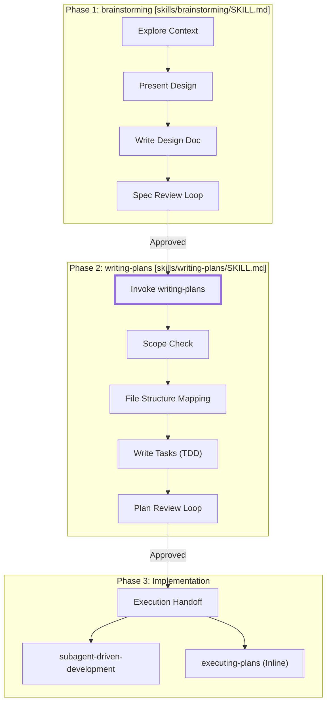
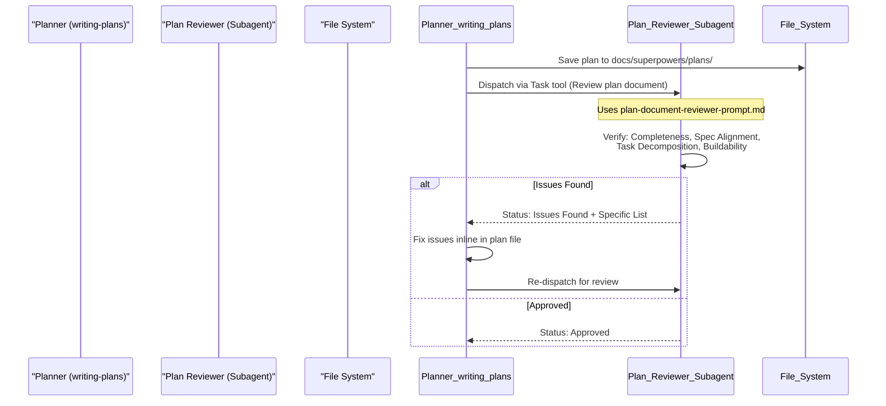
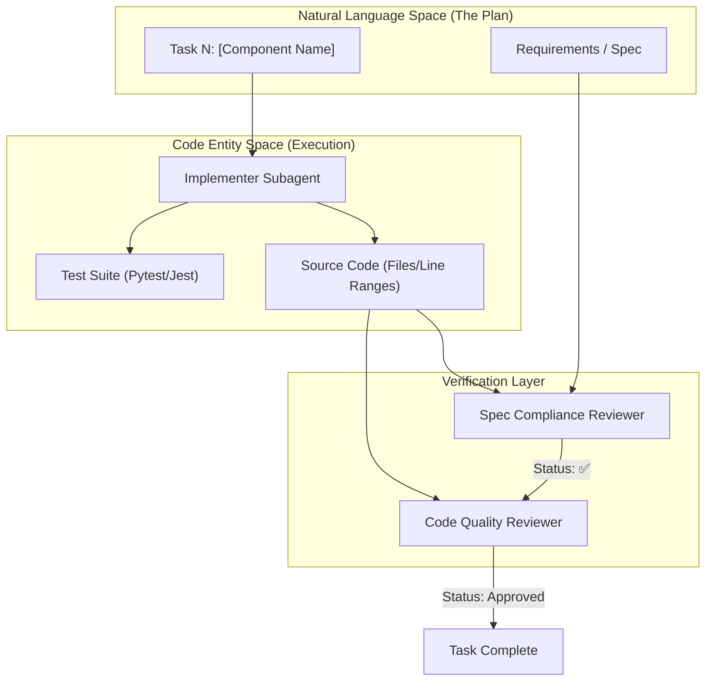

# writing-plans

Relevant source files

The following files were used as context for generating this wiki page:

- [skills/brainstorming/SKILL.md](https://github.com/obra/superpowers/blob/HEAD/skills/brainstorming/SKILL.md)
- [skills/brainstorming/spec-document-reviewer-prompt.md](https://github.com/obra/superpowers/blob/HEAD/skills/brainstorming/spec-document-reviewer-prompt.md)
- [skills/requesting-code-review/code-reviewer.md](https://github.com/obra/superpowers/blob/HEAD/skills/requesting-code-review/code-reviewer.md)
- [skills/writing-plans/SKILL.md](https://github.com/obra/superpowers/blob/HEAD/skills/writing-plans/SKILL.md)
- [skills/writing-plans/plan-document-reviewer-prompt.md](https://github.com/obra/superpowers/blob/HEAD/skills/writing-plans/plan-document-reviewer-prompt.md)
- [skills/writing-skills/persuasion-principles.md](https://github.com/obra/superpowers/blob/HEAD/skills/writing-skills/persuasion-principles.md)

## Purpose and Scope

The `writing-plans` skill creates comprehensive implementation plans that decompose feature specifications into bite-sized, executable tasks. This skill is the bridge between design and implementation in the three-phase development workflow: brainstorming (design) → writing-plans (planning) → subagent-driven-development (implementation) [[skills/writing-plans/SKILL.md:1-10]]().

The primary goal is to document everything an engineer needs to know—files to touch, code samples, testing commands, and documentation—assuming they have zero context for the codebase and potentially "questionable taste," necessitating explicit guidance [[skills/writing-plans/SKILL.md:10-13]]().

## When to Use writing-plans

The `writing-plans` skill is invoked immediately following the completion of a design spec in the brainstorming phase [[skills/brainstorming/SKILL.md:32-33]]().

### Workflow Integration

The following diagram illustrates how `writing-plans` fits into the broader Superpowers lifecycle, transitioning from the `brainstorming` skill to implementation skills.

**Superpowers Workflow Transition**

Sources: [[skills/brainstorming/SKILL.md:36-67]](), [[skills/writing-plans/SKILL.md:156-173]]()

**Preconditions:**
- **Dedicated Worktree:** Planning should be run in a dedicated git worktree, typically verified or created via the `superpowers:using-git-worktrees` skill at execution time [[skills/writing-plans/SKILL.md:16-17]]().
- **Scope Check:** If a spec covers multiple independent subsystems, the planner must suggest breaking it into separate plans—one per subsystem. Each plan must produce working, testable software on its own [[skills/writing-plans/SKILL.md:21-24]]().

## Plan Document Structure

### Storage and Metadata
Plans are saved to `docs/superpowers/plans/YYYY-MM-DD-<feature-name>.md` [[skills/writing-plans/SKILL.md:18]](). Every plan must begin with a standardized header that includes the goal, architecture summary, tech stack, and explicit instructions for agentic workers to use `subagent-driven-development` or `executing-plans` [[skills/writing-plans/SKILL.md:54-77]]().

### File Structure Mapping
Before defining tasks, the planner must map out file responsibilities [[skills/writing-plans/SKILL.md:25-27]]().
- **Decomposition:** Design units with clear boundaries and well-defined interfaces [[skills/writing-plans/SKILL.md:29]]().
- **Focus:** Prefer smaller, focused files over large ones; files that change together should live together [[skills/writing-plans/SKILL.md:30-31]]().
- **Consistency:** Follow established patterns in existing codebases, but include a split in the plan if a file has grown unwieldy [[skills/writing-plans/SKILL.md:32]]().

### Task Granularity
Tasks are broken down into steps that take **2-5 minutes** each [[skills/writing-plans/SKILL.md:47]](). A standard task follows a strict TDD (Test-Driven Development) cycle [[skills/writing-plans/SKILL.md:81-126]]():

| Step | Action | Requirement |
| :--- | :--- | :--- |
| **1** | Write failing test | Include exact code snippet [[skills/writing-plans/SKILL.md:95-101]]() |
| **2** | Verify failure | Provide exact command and expected error (e.g., "function not defined") [[skills/writing-plans/SKILL.md:103-106]]() |
| **3** | Minimal implementation | Include complete code (no placeholders) [[skills/writing-plans/SKILL.md:108-113]]() |
| **4** | Verify pass | Provide exact command and expected "PASS" [[skills/writing-plans/SKILL.md:115-118]]() |
| **5** | Commit | Provide `git` commands with descriptive messages [[skills/writing-plans/SKILL.md:120-125]]() |

## Plan Review Loop

After writing the complete plan, the skill enforces a self-review or a subagent-driven review loop [[skills/writing-plans/SKILL.md:144-155]]().

### Review Process Flow
The following diagram maps the review process to the `Task` tool and the `plan-document-reviewer-prompt.md` logic.

**Planning Review Sequence**

Sources: [[skills/writing-plans/SKILL.md:144-155]](), [[skills/writing-plans/plan-document-reviewer-prompt.md:1-47]]()

### Reviewer Calibration
The `plan-document-reviewer` is instructed to only flag issues that would cause real problems during implementation, such as [[skills/writing-plans/plan-document-reviewer-prompt.md:27-34]]():
- **Completeness:** TODOs, placeholders, or missing steps [[skills/writing-plans/plan-document-reviewer-prompt.md:22]]().
- **Spec Alignment:** Missing requirements from the spec or major scope creep [[skills/writing-plans/plan-document-reviewer-prompt.md:23]]().
- **Buildability:** Contradictory steps or tasks so vague they can't be acted on [[skills/writing-plans/plan-document-reviewer-prompt.md:25]]().

## Implementation Handoff and SDD Integration

The plan is designed to be consumed by the `subagent-driven-development` (SDD) workflow. The implementer subagent receives the full text of a task and is held to high standards of code organization and self-review.

### Implementation & Review Flow
This diagram bridges the natural language requirements in the plan to the code entities and review protocols used during implementation.

**From Plan to Code Entities**

Sources: [[skills/writing-plans/SKILL.md:156-173]](), [[skills/writing-plans/plan-document-reviewer-prompt.md:1-50]](), [[skills/requesting-code-review/code-reviewer.md:11-68]]()

## Execution Handoff

Once the plan is saved and approved, the skill offers two execution paths [[skills/writing-plans/SKILL.md:158-173]]():

1.  **Subagent-Driven (Recommended):** Uses the `subagent-driven-development` skill to dispatch a fresh subagent for every task, with a two-stage review between tasks [[skills/writing-plans/SKILL.md:162, 168-170]]().
2.  **Inline Execution:** Uses the `executing-plans` skill to execute tasks in the current session using batch execution with checkpoints [[skills/writing-plans/SKILL.md:164, 171-173]]().

## Key Principles and Constraints

- **No Placeholders:** Never use phrases like "TBD", "add validation", or "handle edge cases." The plan must contain the actual code and logic to be written [[skills/writing-plans/SKILL.md:128-137]]().
- **Exact Paths:** Always use exact file paths and, where possible, line ranges for modifications [[skills/writing-plans/SKILL.md:84-87, 139]]().
- **DRY/YAGNI:** Plans should emphasize "Don't Repeat Yourself" and "You Ain't Gonna Need It" to prevent over-engineering [[skills/writing-plans/SKILL.md:10]]().
- **Type Consistency:** Method signatures and property names must match across all tasks in the plan [[skills/writing-plans/SKILL.md:152-153]]().
- **Authority and Commitment:** The skill uses imperative language ("YOU MUST", "Never") and requires an announcement at the start to ensure compliance [[skills/writing-plans/SKILL.md:14]](), [[skills/writing-skills/persuasion-principles.md:11-36]]().

Sources: [[skills/writing-plans/SKILL.md:1-173]](), [[skills/writing-plans/plan-document-reviewer-prompt.md:1-50]](), [[skills/brainstorming/SKILL.md:1-67]](), [[skills/writing-skills/persuasion-principles.md:1-188]]()3f:T2efa,# s