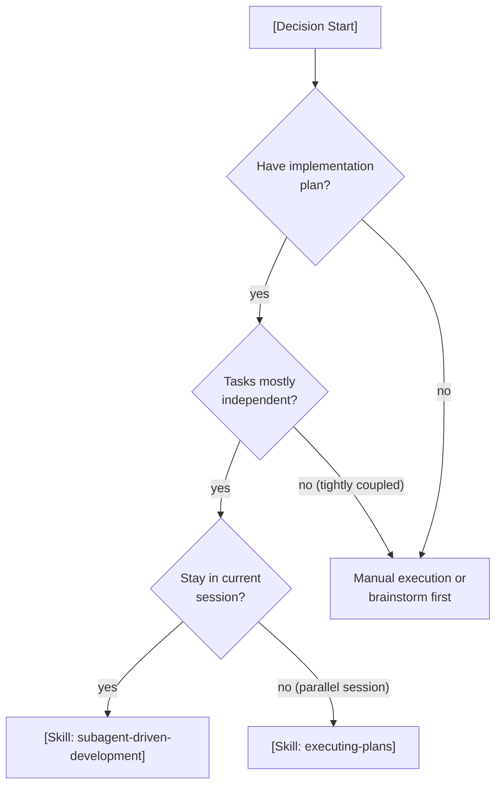
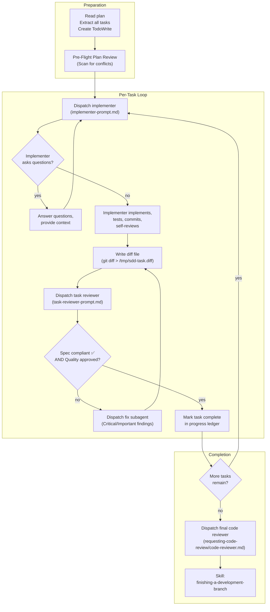
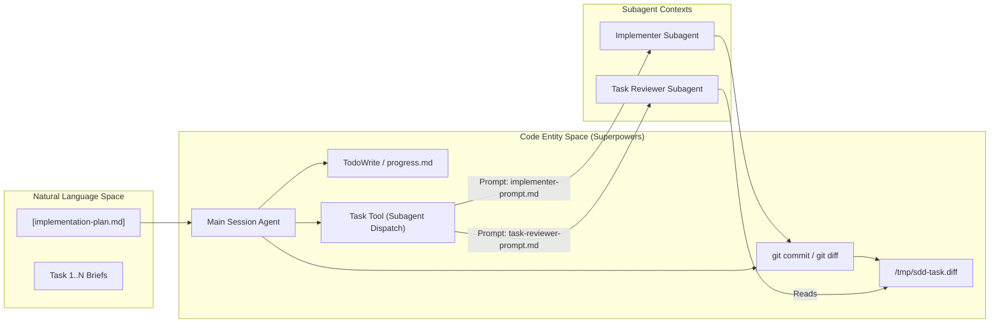

# subagent-driven-development

Relevant source files

The following files were used as context for generating this wiki page:

- [docs/superpowers/specs/2026-06-09-sdd-task-scoped-review-dispatch-design.md](https://github.com/obra/superpowers/blob/HEAD/docs/superpowers/specs/2026-06-09-sdd-task-scoped-review-dispatch-design.md)
- [docs/superpowers/specs/2026-06-10-strict-cost-sdd-design.md](https://github.com/obra/superpowers/blob/HEAD/docs/superpowers/specs/2026-06-10-strict-cost-sdd-design.md)
- [skills/subagent-driven-development/SKILL.md](https://github.com/obra/superpowers/blob/HEAD/skills/subagent-driven-development/SKILL.md)
- [skills/subagent-driven-development/implementer-prompt.md](https://github.com/obra/superpowers/blob/HEAD/skills/subagent-driven-development/implementer-prompt.md)
- [skills/subagent-driven-development/task-reviewer-prompt.md](https://github.com/obra/superpowers/blob/HEAD/skills/subagent-driven-development/task-reviewer-prompt.md)

## Purpose and Scope

This page documents the `subagent-driven-development` (SDD) skill, a structured workflow for executing implementation plans by dispatching fresh subagents per task with a mandatory two-stage review protocol. This skill is designed for use in environments that support subagent dispatch (Claude Code, Codex, OpenCode, Gemini CLI).

For creating the implementation plans that this skill executes, see [writing-plans](https://github.com/obra/superpowers/blob/HEAD/7.3). For executing plans in environments without subagent support, see [Executing Plans in Batches](https://github.com/obra/superpowers/blob/HEAD/6.7).

**Sources:** [skills/subagent-driven-development/SKILL.md:1-9](https://github.com/obra/superpowers/blob/HEAD/skills/subagent-driven-development/SKILL.md#L1-L9)

---

## Core Principle

The SDD workflow is governed by a specific quality formula:

**Fresh subagent per task + Task review (Spec Compliance + Code Quality) + Broad final review = High Quality, Fast Iteration**

By precisely crafting instructions and context for specialized agents, the system ensures they stay focused. Subagents should never inherit the main session's history; instead, the controller constructs exactly what they need, preserving the controller's own context for coordination work. [skills/subagent-driven-development/SKILL.md:10-12](https://github.com/obra/superpowers/blob/HEAD/skills/subagent-driven-development/SKILL.md#L10-L12)

**Continuous execution:** The controller is instructed to execute all tasks from the plan without stopping to check in with the human partner unless a `BLOCKED` status occurs, ambiguity genuinely prevents progress, or all tasks are complete. [skills/subagent-driven-development/SKILL.md:17-18](https://github.com/obra/superpowers/blob/HEAD/skills/subagent-driven-development/SKILL.md#L17-L18)

**Sources:** [skills/subagent-driven-development/SKILL.md:10-18](https://github.com/obra/superpowers/blob/HEAD/skills/subagent-driven-development/SKILL.md#L10-L18)

---

## When to Use

The system uses a decision matrix to determine if SDD is appropriate for the current task.

**Comparison with executing-plans:**

| Feature | subagent-driven-development | executing-plans |
| :--- | :--- | :--- |
| **Context** | Fresh subagent per task (no pollution) | Single session history |
| **Review** | Task-scoped (Spec + Quality) | Single review or batch review |
| **Speed** | Faster iteration (no human-in-loop) | Manual handoffs/checkpoints |
| **Session** | Remains in current session | Often involves parallel sessions |

**Sources:** [skills/subagent-driven-development/SKILL.md:19-44](https://github.com/obra/superpowers/blob/HEAD/skills/subagent-driven-development/SKILL.md#L19-L44)

---

## Execution Process Flow

The SDD process follows a strict loop for every task defined in the implementation plan. Recent optimizations have merged spec and quality reviews into a single subagent dispatch to reduce overhead. [docs/superpowers/specs/2026-06-09-sdd-task-scoped-review-dispatch-design.md:54-59](https://github.com/obra/superpowers/blob/HEAD/docs/superpowers/specs/2026-06-09-sdd-task-scoped-review-dispatch-design.md#L54-L59)

**Sources:** [skills/subagent-driven-development/SKILL.md:45-83](https://github.com/obra/superpowers/blob/HEAD/skills/subagent-driven-development/SKILL.md#L45-L83), [docs/superpowers/specs/2026-06-09-sdd-task-scoped-review-dispatch-design.md:54-59](https://github.com/obra/superpowers/blob/HEAD/docs/superpowers/specs/2026-06-09-sdd-task-scoped-review-dispatch-design.md#L54-L59)

---

## Model Selection Strategy

To optimize for cost and speed, the system selects models based on the mechanical vs. creative nature of the task. [skills/subagent-driven-development/SKILL.md:99-101](https://github.com/obra/superpowers/blob/HEAD/skills/subagent-driven-development/SKILL.md#L99-L101)

*   **Mechanical Tasks (isolated functions, clear specs, 1-2 files):** Use a fast, cheap model. [skills/subagent-driven-development/SKILL.md:103-103](https://github.com/obra/superpowers/blob/HEAD/skills/subagent-driven-development/SKILL.md#L103)
*   **Integration Tasks (multi-file coordination, debugging):** Use a standard model. [skills/subagent-driven-development/SKILL.md:105-105](https://github.com/obra/superpowers/blob/HEAD/skills/subagent-driven-development/SKILL.md#L105)
*   **Architecture, design, and final review tasks:** Use the most capable available model. [skills/subagent-driven-development/SKILL.md:107-109](https://github.com/obra/superpowers/blob/HEAD/skills/subagent-driven-development/SKILL.md#L107-L109)
*   **Review tasks:** Choose a model scaled to the diff's size and complexity. [skills/subagent-driven-development/SKILL.md:111-114](https://github.com/obra/superpowers/blob/HEAD/skills/subagent-driven-development/SKILL.md#L111-L114)

**Crucial:** Turn count beats token price. Cheap models often take 2-3× the turns, increasing wall-clock time and total cost. A mid-tier model is recommended as the floor for reviewers and prose-based implementers. [skills/subagent-driven-development/SKILL.md:119-122](https://github.com/obra/superpowers/blob/HEAD/skills/subagent-driven-development/SKILL.md#L119-L122)

**Sources:** [skills/subagent-driven-development/SKILL.md:99-126](https://github.com/obra/superpowers/blob/HEAD/skills/subagent-driven-development/SKILL.md#L99-L126)

---

## Implementer Status Protocol

Implementer subagents report their status using one of four specific tokens. The controller (main agent) responds based on the protocol:

| Status | Meaning | Controller Action |
| :--- | :--- | :--- |
| **DONE** | Work finished confidently. | Proceed to Task Review. [skills/subagent-driven-development/implementer-prompt.md:127-127](https://github.com/obra/superpowers/blob/HEAD/skills/subagent-driven-development/implementer-prompt.md#L127) |
| **DONE_WITH_CONCERNS** | Finished, but flagged doubts (e.g., file size). | Read concerns. Address correctness/scope before review. [skills/subagent-driven-development/implementer-prompt.md:136-136](https://github.com/obra/superpowers/blob/HEAD/skills/subagent-driven-development/implementer-prompt.md#L136) |
| **NEEDS_CONTEXT** | Information missing. | Provide missing context and re-dispatch. [skills/subagent-driven-development/implementer-prompt.md:137-137](https://github.com/obra/superpowers/blob/HEAD/skills/subagent-driven-development/implementer-prompt.md#L137) |
| **BLOCKED** | Cannot complete task. | Assess: Provide context, upgrade model, or break task into smaller pieces. [skills/subagent-driven-development/implementer-prompt.md:137-138](https://github.com/obra/superpowers/blob/HEAD/skills/subagent-driven-development/implementer-prompt.md#L137-L138) |

**Sources:** [skills/subagent-driven-development/implementer-prompt.md:125-138](https://github.com/obra/superpowers/blob/HEAD/skills/subagent-driven-development/implementer-prompt.md#L125-L138)

---

## Role Definitions and Templates

### 1. Implementer Subagent
Dispatched via `implementer-prompt.md`. [skills/subagent-driven-development/implementer-prompt.md:1-139](https://github.com/obra/superpowers/blob/HEAD/skills/subagent-driven-development/implementer-prompt.md#L1-L139)
*   **Responsibility:** Implement the task, write tests, and commit. [skills/subagent-driven-development/implementer-prompt.md:32-38](https://github.com/obra/superpowers/blob/HEAD/skills/subagent-driven-development/implementer-prompt.md#L32-L38)
*   **Self-Review:** Must verify completeness, code quality, and YAGNI discipline. [skills/subagent-driven-development/implementer-prompt.md:80-106](https://github.com/obra/superpowers/blob/HEAD/skills/subagent-driven-development/implementer-prompt.md#L80-L106)
*   **Testing:** Run focused tests while iterating; run the full suite once before committing. [skills/subagent-driven-development/implementer-prompt.md:47-48](https://github.com/obra/superpowers/blob/HEAD/skills/subagent-driven-development/implementer-prompt.md#L47-L48)

### 2. Task Reviewer
Dispatched via `task-reviewer-prompt.md`. [skills/subagent-driven-development/task-reviewer-prompt.md:1-166](https://github.com/obra/superpowers/blob/HEAD/skills/subagent-driven-development/task-reviewer-prompt.md#L1-L166)
*   **Responsibility:** Verify spec compliance and code quality in a single pass. [skills/subagent-driven-development/task-reviewer-prompt.md:3-5](https://github.com/obra/superpowers/blob/HEAD/skills/subagent-driven-development/task-reviewer-prompt.md#L3-L5)
*   **Scoping:** Restricted to the diff file provided. Do not crawl the broader codebase unless a concrete risk is named. [skills/subagent-driven-development/task-reviewer-prompt.md:38-47](https://github.com/obra/superpowers/blob/HEAD/skills/subagent-driven-development/task-reviewer-prompt.md#L38-L47)
*   **Skepticism:** Treat the implementer's report as unverified claims. Verify everything against the diff. [skills/subagent-driven-development/task-reviewer-prompt.md:55-62](https://github.com/obra/superpowers/blob/HEAD/skills/subagent-driven-development/task-reviewer-prompt.md#L55-L62)
*   **Calibration:** Categorize issues as Critical (Must Fix), Important (Should Fix), or Minor (Nice to Have). [skills/subagent-driven-development/task-reviewer-prompt.md:124-130](https://github.com/obra/superpowers/blob/HEAD/skills/subagent-driven-development/task-reviewer-prompt.md#L124-L130)

**Sources:** [skills/subagent-driven-development/implementer-prompt.md:1-139](https://github.com/obra/superpowers/blob/HEAD/skills/subagent-driven-development/implementer-prompt.md#L1-L139), [skills/subagent-driven-development/task-reviewer-prompt.md:1-166](https://github.com/obra/superpowers/blob/HEAD/skills/subagent-driven-development/task-reviewer-prompt.md#L1-L166)

---

## Technical Implementation & Data Flow

The SDD skill bridges Natural Language requirements (the Plan) to Code Entities (the Implementation) through structured tool calls and temporary files.

**Key Data Flow Elements:**
*   **Task Briefs:** Generated via `scripts/task-brief PLAN N` to provide high-fidelity context without polluting the controller's context. [docs/superpowers/specs/2026-06-09-sdd-task-scoped-review-dispatch-design.md:89-91](https://github.com/obra/superpowers/blob/HEAD/docs/superpowers/specs/2026-06-09-sdd-task-scoped-review-dispatch-design.md#L89-L91)
*   **Diff Files:** The controller redirects `git diff` to a temporary file (`/tmp/sdd-task-N.diff`) which the reviewer reads once, avoiding massive text pastes into the prompt. [docs/superpowers/specs/2026-06-09-sdd-task-scoped-review-dispatch-design.md:64-68](https://github.com/obra/superpowers/blob/HEAD/docs/superpowers/specs/2026-06-09-sdd-task-scoped-review-dispatch-design.md#L64-L68)
*   **Progress Ledger:** Maintained in `<git-dir>/sdd/progress.md` to track state across session resumes. [docs/superpowers/specs/2026-06-09-sdd-task-scoped-review-dispatch-design.md:91-92](https://github.com/obra/superpowers/blob/HEAD/docs/superpowers/specs/2026-06-09-sdd-task-scoped-review-dispatch-design.md#L91-L92)

**Sources:** [docs/superpowers/specs/2026-06-09-sdd-task-scoped-review-dispatch-design.md:54-92](https://github.com/obra/superpowers/blob/HEAD/docs/superpowers/specs/2026-06-09-sdd-task-scoped-review-dispatch-design.md#L54-L92), [skills/subagent-driven-development/task-reviewer-prompt.md:32-44](https://github.com/obra/superpowers/blob/HEAD/skills/subagent-driven-development/task-reviewer-prompt.md#L32-L44)

---

## Integration and Dependencies

SDD is the execution phase of a larger pipeline and relies on several other skills:

*   **superpowers:writing-plans:** Provides the structured input (the plan) for SDD. [skills/subagent-driven-development/SKILL.md:63-63](https://github.com/obra/superpowers/blob/HEAD/skills/subagent-driven-development/SKILL.md#L63)
*   **superpowers:requesting-code-review:** Used for the final whole-branch review after all tasks are complete. [skills/subagent-driven-development/SKILL.md:65-65](https://github.com/obra/superpowers/blob/HEAD/skills/subagent-driven-development/SKILL.md#L65)
*   **superpowers:finishing-a-development-branch:** The final hand-off skill used after all SDD tasks and reviews are complete. [skills/subagent-driven-development/SKILL.md:66-66](https://github.com/obra/superpowers/blob/HEAD/skills/subagent-driven-development/SKILL.md#L66)

**Sources:** [skills/subagent-driven-development/SKILL.md:63-66](https://github.com/obra/superpowers/blob/HEAD/skills/subagent-driven-development/SKILL.md#L63-L66), [docs/superpowers/specs/2026-06-09-sdd-task-scoped-review-dispatch-design.md:1-5](https://github.com/obra/superpowers/blob/HEAD/docs/superpowers/specs/2026-06-09-sdd-task-scoped-review-dispatch-design.md#L1-L5)40: