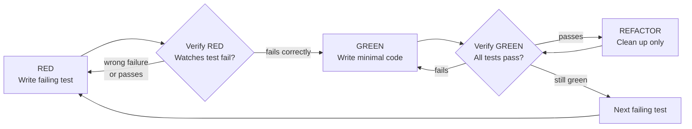
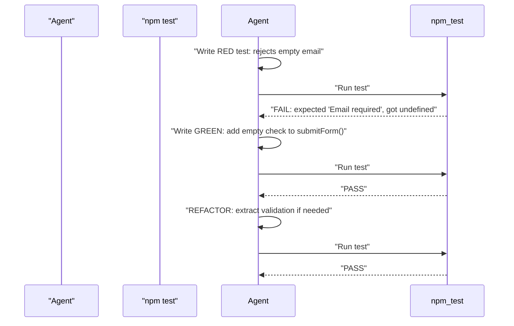
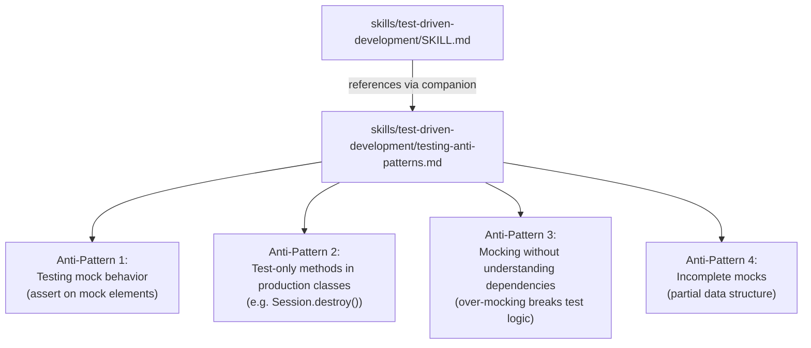
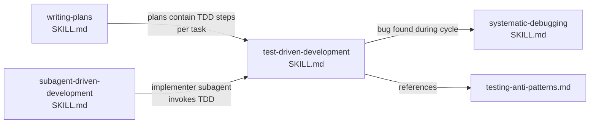

# test-driven-development

<details>
<summary>Relevant source files</summary>

The following files were used as context for generating this wiki page:

- [skills/systematic-debugging/SKILL.md](https://github.com/obra/superpowers/blob/HEAD/skills/systematic-debugging/SKILL.md)
- [skills/test-driven-development/SKILL.md](https://github.com/obra/superpowers/blob/HEAD/skills/test-driven-development/SKILL.md)
- [skills/test-driven-development/testing-anti-patterns.md](https://github.com/obra/superpowers/blob/HEAD/skills/test-driven-development/testing-anti-patterns.md)

</details>


This page documents the `test-driven-development` skill: its Iron Law, the RED/GREEN/REFACTOR cycle with mandatory verification gates, rationalization patterns to reject, and the companion `testing-anti-patterns.md` reference. This skill governs how agents write code during plan execution.

For how TDD fits into the broader development pipeline, see the **Complete Workflow Pipeline (6.1)**. For applying TDD when authoring new skills (not production code), see **Test-Driven Development for Skills (8.1)**. For the debugging counterpart, see **systematic-debugging (7.6)**.

---

## Skill Metadata

| Field | Value |
|---|---|
| **File** | `skills/test-driven-development/SKILL.md` |
| **Name** | `test-driven-development` |
| **Description trigger** | `Use when implementing any feature or bugfix, before writing implementation code` |
| **Companion reference** | `skills/test-driven-development/testing-anti-patterns.md` |

Sources: [skills/test-driven-development/SKILL.md:1-4](https://github.com/obra/superpowers/blob/HEAD/skills/test-driven-development/SKILL.md#L1-L4)

---

## The Iron Law

[skills/test-driven-development/SKILL.md:31-45](https://github.com/obra/superpowers/blob/HEAD/skills/test-driven-development/SKILL.md#L31-L45)

```
NO PRODUCTION CODE WITHOUT A FAILING TEST FIRST
```

If production code was written before its test exists and was observed failing, the code must be deleted. There are no exceptions:

- Do not keep it as a "reference" [skills/test-driven-development/SKILL.md:40-40](https://github.com/obra/superpowers/blob/HEAD/skills/test-driven-development/SKILL.md#L40)
- Do not "adapt" it while writing tests alongside [skills/test-driven-development/SKILL.md:41-41](https://github.com/obra/superpowers/blob/HEAD/skills/test-driven-development/SKILL.md#L41)
- Do not look at it while writing the test [skills/test-driven-development/SKILL.md:42-42](https://github.com/obra/superpowers/blob/HEAD/skills/test-driven-development/SKILL.md#L42)
- **Delete means delete.** Implement fresh from the tests only. [skills/test-driven-development/SKILL.md:43-45](https://github.com/obra/superpowers/blob/HEAD/skills/test-driven-development/SKILL.md#L43-L45)

---

## RED / GREEN / REFACTOR Cycle

The three phases form a strict loop. Each phase has a mandatory verification step that must not be skipped.

**Diagram: RED/GREEN/REFACTOR Cycle with Verification Gates**



Sources: [skills/test-driven-development/SKILL.md:47-68](https://github.com/obra/superpowers/blob/HEAD/skills/test-driven-development/SKILL.md#L47-L68)

---

### Phase 1 — RED: Write the Failing Test

[skills/test-driven-development/SKILL.md:71-112](https://github.com/obra/superpowers/blob/HEAD/skills/test-driven-development/SKILL.md#L71-L112)

Write one minimal test that describes the expected behavior. Requirements:

| Requirement | Good | Bad |
|---|---|---|
| **One behavior per test** | Single `expect` on one outcome [skills/test-driven-development/SKILL.md:87-88](https://github.com/obra/superpowers/blob/HEAD/skills/test-driven-development/SKILL.md#L87-L88) | Test verifies email AND domain AND whitespace [skills/test-driven-development/SKILL.md:202-202](https://github.com/obra/superpowers/blob/HEAD/skills/test-driven-development/SKILL.md#L202) |
| **Clear name** | `'retries failed operations 3 times'` [skills/test-driven-development/SKILL.md:77-77](https://github.com/obra/superpowers/blob/HEAD/skills/test-driven-development/SKILL.md#L77) | `'retry works'` [skills/test-driven-development/SKILL.md:96-106](https://github.com/obra/superpowers/blob/HEAD/skills/test-driven-development/SKILL.md#L96-L106) or `'test1'` [skills/test-driven-development/SKILL.md:203-203](https://github.com/obra/superpowers/blob/HEAD/skills/test-driven-development/SKILL.md#L203) |
| **Real code, not mocks** | Calls the real function under test [skills/test-driven-development/SKILL.md:85-85](https://github.com/obra/superpowers/blob/HEAD/skills/test-driven-development/SKILL.md#L85) | Asserts that a mock was called N times [skills/test-driven-development/SKILL.md:102-102](https://github.com/obra/superpowers/blob/HEAD/skills/test-driven-development/SKILL.md#L102) |

Tests should demonstrate the desired API as if writing a usage example. The name should describe behavior, not the mechanism.

---

### Phase 2 — Verify RED (Mandatory)

[skills/test-driven-development/SKILL.md:113-129](https://github.com/obra/superpowers/blob/HEAD/skills/test-driven-development/SKILL.md#L113-L129)

Run the test suite and confirm three things:

1. The test **fails** (not errors out due to a typo or missing import) [skills/test-driven-development/SKILL.md:122-122](https://github.com/obra/superpowers/blob/HEAD/skills/test-driven-development/SKILL.md#L122)
2. The failure message is the **expected** one [skills/test-driven-development/SKILL.md:123-123](https://github.com/obra/superpowers/blob/HEAD/skills/test-driven-development/SKILL.md#L123)
3. The test fails because the **feature is missing**, not because of a test bug [skills/test-driven-development/SKILL.md:124-124](https://github.com/obra/superpowers/blob/HEAD/skills/test-driven-development/SKILL.md#L124)

```bash
npm test path/to/test.test.ts
```

| Outcome | Action |
|---|---|
| Test passes immediately | You are testing existing behavior. Fix the test. [skills/test-driven-development/SKILL.md:126-126](https://github.com/obra/superpowers/blob/HEAD/skills/test-driven-development/SKILL.md#L126) |
| Test errors (syntax/import) | Fix the error, re-run. Do not proceed to GREEN. [skills/test-driven-development/SKILL.md:128-128](https://github.com/obra/superpowers/blob/HEAD/skills/test-driven-development/SKILL.md#L128) |
| Test fails correctly | Proceed to GREEN. |

---

### Phase 3 — GREEN: Minimal Code

[skills/test-driven-development/SKILL.md:130-166](https://github.com/obra/superpowers/blob/HEAD/skills/test-driven-development/SKILL.md#L130-L166)

Write the **simplest code** that makes the test pass. Do not:

- Add optional parameters or configuration not required by the test [skills/test-driven-development/SKILL.md:152-164](https://github.com/obra/superpowers/blob/HEAD/skills/test-driven-development/SKILL.md#L152-L164)
- Refactor other code [skills/test-driven-development/SKILL.md:166-166](https://github.com/obra/superpowers/blob/HEAD/skills/test-driven-development/SKILL.md#L166)
- Implement features the test does not yet demand (YAGNI) [skills/test-driven-development/SKILL.md:160-160](https://github.com/obra/superpowers/blob/HEAD/skills/test-driven-development/SKILL.md#L160)

The implementation exists only to pass the current test. Nothing more.

---

### Phase 4 — Verify GREEN (Mandatory)

[skills/test-driven-development/SKILL.md:168-184](https://github.com/obra/superpowers/blob/HEAD/skills/test-driven-development/SKILL.md#L168-L184)

Run the full test suite:

```bash
npm test path/to/test.test.ts
```

Confirm:

- The new test passes [skills/test-driven-development/SKILL.md:177-177](https://github.com/obra/superpowers/blob/HEAD/skills/test-driven-development/SKILL.md#L177)
- All previously passing tests still pass [skills/test-driven-development/SKILL.md:178-178](https://github.com/obra/superpowers/blob/HEAD/skills/test-driven-development/SKILL.md#L178)
- Output is pristine: no errors, no warnings [skills/test-driven-development/SKILL.md:179-179](https://github.com/obra/superpowers/blob/HEAD/skills/test-driven-development/SKILL.md#L179)

| Outcome | Action |
|---|---|
| New test fails | Fix code, not test [skills/test-driven-development/SKILL.md:181-181](https://github.com/obra/superpowers/blob/HEAD/skills/test-driven-development/SKILL.md#L181) |
| Other tests fail | Fix regressions before continuing [skills/test-driven-development/SKILL.md:183-183](https://github.com/obra/superpowers/blob/HEAD/skills/test-driven-development/SKILL.md#L183) |
| All pass, clean output | Proceed to REFACTOR |

---

### Phase 5 — REFACTOR: Clean Up

[skills/test-driven-development/SKILL.md:185-196](https://github.com/obra/superpowers/blob/HEAD/skills/test-driven-development/SKILL.md#L185-L196)

Only after GREEN, improve the code's internal quality:

- Remove duplication [skills/test-driven-development/SKILL.md:188-188](https://github.com/obra/superpowers/blob/HEAD/skills/test-driven-development/SKILL.md#L188)
- Improve names [skills/test-driven-development/SKILL.md:189-189](https://github.com/obra/superpowers/blob/HEAD/skills/test-driven-development/SKILL.md#L189)
- Extract helpers [skills/test-driven-development/SKILL.md:190-190](https://github.com/obra/superpowers/blob/HEAD/skills/test-driven-development/SKILL.md#L190)

**Do not add behavior.** After every change, re-run the suite to confirm all tests remain green [skills/test-driven-development/SKILL.md:192-192](https://github.com/obra/superpowers/blob/HEAD/skills/test-driven-development/SKILL.md#L192).

---

## Scope: When TDD Applies

[skills/test-driven-development/SKILL.md:16-30](https://github.com/obra/superpowers/blob/HEAD/skills/test-driven-development/SKILL.md#L16-L30)

| Category | TDD Required |
|---|---|
| New features | Always [skills/test-driven-development/SKILL.md:19-19](https://github.com/obra/superpowers/blob/HEAD/skills/test-driven-development/SKILL.md#L19) |
| Bug fixes | Always [skills/test-driven-development/SKILL.md:20-20](https://github.com/obra/superpowers/blob/HEAD/skills/test-driven-development/SKILL.md#L20) |
| Refactoring | Always [skills/test-driven-development/SKILL.md:21-21](https://github.com/obra/superpowers/blob/HEAD/skills/test-driven-development/SKILL.md#L21) |
| Behavior changes | Always [skills/test-driven-development/SKILL.md:22-22](https://github.com/obra/superpowers/blob/HEAD/skills/test-driven-development/SKILL.md#L22) |
| Throwaway prototypes | Ask human partner [skills/test-driven-development/SKILL.md:25-25](https://github.com/obra/superpowers/blob/HEAD/skills/test-driven-development/SKILL.md#L25) |
| Generated code | Ask human partner [skills/test-driven-development/SKILL.md:26-26](https://github.com/obra/superpowers/blob/HEAD/skills/test-driven-development/SKILL.md#L26) |
| Configuration files | Ask human partner [skills/test-driven-development/SKILL.md:27-27](https://github.com/obra/superpowers/blob/HEAD/skills/test-driven-development/SKILL.md#L27) |

The urge to skip TDD "just this once" is a rationalization signal, not a legitimate exception [skills/test-driven-development/SKILL.md:29-29](https://github.com/obra/superpowers/blob/HEAD/skills/test-driven-development/SKILL.md#L29).

---

## Rationalization Table

[skills/test-driven-development/SKILL.md:257-270](https://github.com/obra/superpowers/blob/HEAD/skills/test-driven-development/SKILL.md#L257-L270)

The skill explicitly catalogs common rationalizations and their rebuttals:

| Rationalization | Reality |
|---|---|
| "Too simple to test" | Simple code breaks. Test takes 30 seconds. [skills/test-driven-development/SKILL.md:260-260](https://github.com/obra/superpowers/blob/HEAD/skills/test-driven-development/SKILL.md#L260) |
| "I'll test after" | Tests passing immediately prove nothing. [skills/test-driven-development/SKILL.md:261-261](https://github.com/obra/superpowers/blob/HEAD/skills/test-driven-development/SKILL.md#L261) |
| "Tests after achieve same goals" | Tests-after = "what does this do?" Tests-first = "what should this do?" [skills/test-driven-development/SKILL.md:262-262](https://github.com/obra/superpowers/blob/HEAD/skills/test-driven-development/SKILL.md#L262) |
| "Already manually tested" | Ad-hoc ≠ systematic. No record, can't re-run. [skills/test-driven-development/SKILL.md:263-263](https://github.com/obra/superpowers/blob/HEAD/skills/test-driven-development/SKILL.md#L263) |
| "Deleting X hours is wasteful" | Sunk cost fallacy. Keeping unverified code is technical debt. [skills/test-driven-development/SKILL.md:264-264](https://github.com/obra/superpowers/blob/HEAD/skills/test-driven-development/SKILL.md#L264) |

---

## Red Flags — Stop and Start Over

[skills/test-driven-development/SKILL.md:272-288](https://github.com/obra/superpowers/blob/HEAD/skills/test-driven-development/SKILL.md#L272-L288)

Any of the following means: **Delete the code. Start over.**

- Code written before test [skills/test-driven-development/SKILL.md:273-273](https://github.com/obra/superpowers/blob/HEAD/skills/test-driven-development/SKILL.md#L273)
- Test written after implementation [skills/test-driven-development/SKILL.md:274-274](https://github.com/obra/superpowers/blob/HEAD/skills/test-driven-development/SKILL.md#L274)
- Test passes immediately without code changes [skills/test-driven-development/SKILL.md:275-275](https://github.com/obra/superpowers/blob/HEAD/skills/test-driven-development/SKILL.md#L275)
- Cannot explain why the test failed [skills/test-driven-development/SKILL.md:276-276](https://github.com/obra/superpowers/blob/HEAD/skills/test-driven-development/SKILL.md#L276)
- Rationalizing "just this once" [skills/test-driven-development/SKILL.md:278-278](https://github.com/obra/superpowers/blob/HEAD/skills/test-driven-development/SKILL.md#L278)
- "It's about spirit not ritual" [skills/test-driven-development/SKILL.md:281-281](https://github.com/obra/superpowers/blob/HEAD/skills/test-driven-development/SKILL.md#L281)
- "Keep as reference" or "adapt existing code" [skills/test-driven-development/SKILL.md:282-282](https://github.com/obra/superpowers/blob/HEAD/skills/test-driven-development/SKILL.md#L282)

---

## Bug Fix Example

[skills/test-driven-development/SKILL.md:291-325](https://github.com/obra/superpowers/blob/HEAD/skills/test-driven-development/SKILL.md#L291-L325)

The skill includes a concrete walkthrough for fixing a bug (empty email accepted):

**Diagram: Bug Fix TDD Flow**



Sources: [skills/test-driven-development/SKILL.md:291-325](https://github.com/obra/superpowers/blob/HEAD/skills/test-driven-development/SKILL.md#L291-L325)

---

## Verification Checklist

[skills/test-driven-development/SKILL.md:327-340](https://github.com/obra/superpowers/blob/HEAD/skills/test-driven-development/SKILL.md#L327-L340)

Before marking any task complete:

- [ ] Every new function/method has a test [skills/test-driven-development/SKILL.md:330-330](https://github.com/obra/superpowers/blob/HEAD/skills/test-driven-development/SKILL.md#L330)
- [ ] Watched each test fail before implementing [skills/test-driven-development/SKILL.md:331-331](https://github.com/obra/superpowers/blob/HEAD/skills/test-driven-development/SKILL.md#L331)
- [ ] Each test failed for the expected reason (feature missing, not typo) [skills/test-driven-development/SKILL.md:332-332](https://github.com/obra/superpowers/blob/HEAD/skills/test-driven-development/SKILL.md#L332)
- [ ] Wrote minimal code to pass each test [skills/test-driven-development/SKILL.md:333-333](https://github.com/obra/superpowers/blob/HEAD/skills/test-driven-development/SKILL.md#L333)
- [ ] All tests pass [skills/test-driven-development/SKILL.md:334-334](https://github.com/obra/superpowers/blob/HEAD/skills/test-driven-development/SKILL.md#L334)
- [ ] Output pristine (no errors, warnings) [skills/test-driven-development/SKILL.md:335-335](https://github.com/obra/superpowers/blob/HEAD/skills/test-driven-development/SKILL.md#L335)
- [ ] Tests use real code (mocks only if unavoidable) [skills/test-driven-development/SKILL.md:336-336](https://github.com/obra/superpowers/blob/HEAD/skills/test-driven-development/SKILL.md#L336)
- [ ] Edge cases and errors covered [skills/test-driven-development/SKILL.md:337-337](https://github.com/obra/superpowers/blob/HEAD/skills/test-driven-development/SKILL.md#L337)

Failure to check all boxes means TDD was skipped. Start over.

---

## Testing Anti-Patterns Reference

[skills/test-driven-development/testing-anti-patterns.md:1-20](https://github.com/obra/superpowers/blob/HEAD/skills/test-driven-development/testing-anti-patterns.md#L1-L20)

The companion file `testing-anti-patterns.md` provides critical guardrails against low-quality testing habits. It focuses on ensuring tests verify real behavior rather than implementation details or mock configurations.

**Diagram: Anti-Pattern Reference — Code Entity Map**



Sources: [skills/test-driven-development/testing-anti-patterns.md:1-20](https://github.com/obra/superpowers/blob/HEAD/skills/test-driven-development/testing-anti-patterns.md#L1-L20), [skills/test-driven-development/SKILL.md:357-363](https://github.com/obra/superpowers/blob/HEAD/skills/test-driven-development/SKILL.md#L357-L363)

### Anti-Pattern Summary Table

| Anti-Pattern | Violation Example | Fix |
|---|---|---|
| **Testing Mock Behavior** | `expect(screen.getByTestId('sidebar-mock')).toBeInTheDocument()` [skills/test-driven-development/testing-anti-patterns.md:25-30](https://github.com/obra/superpowers/blob/HEAD/skills/test-driven-development/testing-anti-patterns.md#L25-L30) | Test real component behavior or don't mock it [skills/test-driven-development/testing-anti-patterns.md:40-49](https://github.com/obra/superpowers/blob/HEAD/skills/test-driven-development/testing-anti-patterns.md#L40-L49) |
| **Test-Only Methods** | `class Session { async destroy() { ... } }` [skills/test-driven-development/testing-anti-patterns.md:66-73](https://github.com/obra/superpowers/blob/HEAD/skills/test-driven-development/testing-anti-patterns.md#L66-L73) | Move cleanup to `test-utils/` helpers [skills/test-driven-development/testing-anti-patterns.md:86-100](https://github.com/obra/superpowers/blob/HEAD/skills/test-driven-development/testing-anti-patterns.md#L86-L100) |
| **Mocking Without Understanding** | Mocking a method that has side effects the test needs (e.g. `discoverAndCacheTools`) [skills/test-driven-development/testing-anti-patterns.md:121-132](https://github.com/obra/superpowers/blob/HEAD/skills/test-driven-development/testing-anti-patterns.md#L121-L132) | Mock at the correct level (e.g., slow external operation) [skills/test-driven-development/testing-anti-patterns.md:140-149](https://github.com/obra/superpowers/blob/HEAD/skills/test-driven-development/testing-anti-patterns.md#L140-L149) |
| **Incomplete Mocks** | `const mockResponse = { status: 'success' }` (missing fields like `metadata`) [skills/test-driven-development/testing-anti-patterns.md:180-189](https://github.com/obra/superpowers/blob/HEAD/skills/test-driven-development/testing-anti-patterns.md#L180-L189) | Mirror full real API response schema [skills/test-driven-development/testing-anti-patterns.md:200-208](https://github.com/obra/superpowers/blob/HEAD/skills/test-driven-development/testing-anti-patterns.md#L200-L208) |

### Iron Laws of Testing

[skills/test-driven-development/testing-anti-patterns.md:13-19](https://github.com/obra/superpowers/blob/HEAD/skills/test-driven-development/testing-anti-patterns.md#L13-L19)

```
1. NEVER test mock behavior
2. NEVER add test-only methods to production classes
3. NEVER mock without understanding dependencies
```

---

## Relationship to Other Skills

**Diagram: TDD Skill in the Development Pipeline**



Sources: [skills/test-driven-development/SKILL.md:327-340](https://github.com/obra/superpowers/blob/HEAD/skills/test-driven-development/SKILL.md#L327-L340), [skills/test-driven-development/SKILL.md:357-363](https://github.com/obra/superpowers/blob/HEAD/skills/test-driven-development/SKILL.md#L357-L363), [skills/systematic-debugging/SKILL.md:179-180](https://github.com/obra/superpowers/blob/HEAD/skills/systematic-debugging/SKILL.md#L179-L180)

- **`writing-plans`** (see **Writing Implementation Plans (6.5)**) structures each task with explicit RED/GREEN/REFACTOR steps.
- **`subagent-driven-development`** (see **Subagent-Driven Development (6.6)**) dispatches an implementer subagent that is required to follow TDD.
- **`systematic-debugging`** (see **systematic-debugging (7.6)**) explicitly references the TDD skill for writing proper failing tests during Phase 4 of the debugging process [skills/systematic-debugging/SKILL.md:179-180](https://github.com/obra/superpowers/blob/HEAD/skills/systematic-debugging/SKILL.md#L179-L180).41:T2ed0,# syste