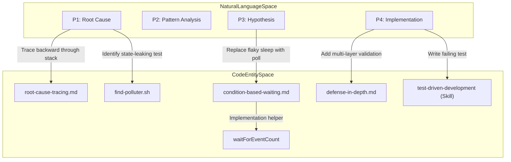
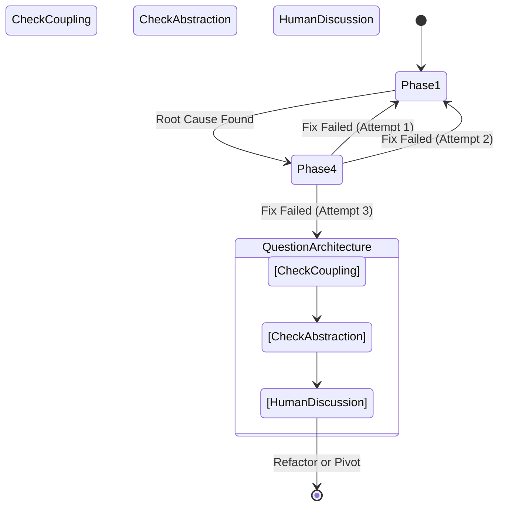

# systematic-debugging

<details>
<summary>Relevant source files</summary>

The following files were used as context for generating this wiki page:

- [skills/systematic-debugging/SKILL.md](https://github.com/obra/superpowers/blob/HEAD/skills/systematic-debugging/SKILL.md)
- [skills/systematic-debugging/condition-based-waiting-example.ts](https://github.com/obra/superpowers/blob/HEAD/skills/systematic-debugging/condition-based-waiting-example.ts)
- [skills/systematic-debugging/condition-based-waiting.md](https://github.com/obra/superpowers/blob/HEAD/skills/systematic-debugging/condition-based-waiting.md)
- [skills/systematic-debugging/defense-in-depth.md](https://github.com/obra/superpowers/blob/HEAD/skills/systematic-debugging/defense-in-depth.md)
- [skills/systematic-debugging/find-polluter.sh](https://github.com/obra/superpowers/blob/HEAD/skills/systematic-debugging/find-polluter.sh)
- [skills/systematic-debugging/root-cause-tracing.md](https://github.com/obra/superpowers/blob/HEAD/skills/systematic-debugging/root-cause-tracing.md)
- [skills/test-driven-development/SKILL.md](https://github.com/obra/superpowers/blob/HEAD/skills/test-driven-development/SKILL.md)
- [skills/test-driven-development/testing-anti-patterns.md](https://github.com/obra/superpowers/blob/HEAD/skills/test-driven-development/testing-anti-patterns.md)

</details>


This page documents the `systematic-debugging` skill: its Iron Law, four mandatory phases, supporting techniques, and integration with the TDD and verification workflows. This skill governs how an agent approaches any bug, test failure, or unexpected behavior — it defines the *investigation process*, not the fix itself.

---

## Purpose

The `systematic-debugging` skill enforces a structured, evidence-first approach to resolving technical issues. Its premise: random fixes waste time, mask root causes, and introduce new bugs. The skill replaces guess-and-check behavior with a four-phase protocol that must be completed in order. [skills/systematic-debugging/SKILL.md:8-14](https://github.com/obra/superpowers/blob/HEAD/skills/systematic-debugging/SKILL.md#L8-L14)

**Skill location:** [skills/systematic-debugging/SKILL.md:1-4](https://github.com/obra/superpowers/blob/HEAD/skills/systematic-debugging/SKILL.md#L1-L4)

**Trigger description:** `Use when encountering any bug, test failure, or unexpected behavior, before proposing fixes` [skills/systematic-debugging/SKILL.md:2-3](https://github.com/obra/superpowers/blob/HEAD/skills/systematic-debugging/SKILL.md#L2-L3)

---

## The Iron Law

[skills/systematic-debugging/SKILL.md:16-20](https://github.com/obra/superpowers/blob/HEAD/skills/systematic-debugging/SKILL.md#L16-L20)

```
NO FIXES WITHOUT ROOT CAUSE INVESTIGATION FIRST
```

Phase 1 (Root Cause Investigation) is a hard gate. An agent cannot propose any fix until Phase 1 is complete. Violating the letter of the process is defined as violating the spirit of it. [skills/systematic-debugging/SKILL.md:14-22](https://github.com/obra/superpowers/blob/HEAD/skills/systematic-debugging/SKILL.md#L14-L22)

---

## When the Skill Applies

This skill applies to **any** technical issue, including test failures, production bugs, performance problems, and build failures. [skills/systematic-debugging/SKILL.md:26-32](https://github.com/obra/superpowers/blob/HEAD/skills/systematic-debugging/SKILL.md#L26-L32)

### High-Pressure Scenarios
The skill is explicitly required when the temptation to skip is greatest:

| Situation | Why Skipping Is Tempting | Why You Must Not |
|---|---|---|
| Time pressure / emergency | Guessing feels faster | Systematic is faster than thrashing [skills/systematic-debugging/SKILL.md:44-44](https://github.com/obra/superpowers/blob/HEAD/skills/systematic-debugging/SKILL.md#L44) |
| "Just one quick fix" | Fix seems obvious | Simple bugs have root causes too [skills/systematic-debugging/SKILL.md:42-42](https://github.com/obra/superpowers/blob/HEAD/skills/systematic-debugging/SKILL.md#L42) |
| Already tried multiple fixes | Exhaustion / sunk cost | Signals architectural problem [skills/systematic-debugging/SKILL.md:199-205](https://github.com/obra/superpowers/blob/HEAD/skills/systematic-debugging/SKILL.md#L199-L205) |
| Previous fix didn't work | Frustration | New info requires re-analysis [skills/systematic-debugging/SKILL.md:195-195](https://github.com/obra/superpowers/blob/HEAD/skills/systematic-debugging/SKILL.md#L195) |
| Don't fully understand issue | Uncertainty | Rushing guarantees rework [skills/systematic-debugging/SKILL.md:43-43](https://github.com/obra/superpowers/blob/HEAD/skills/systematic-debugging/SKILL.md#L43) |

Sources: [skills/systematic-debugging/SKILL.md:34-45](https://github.com/obra/superpowers/blob/HEAD/skills/systematic-debugging/SKILL.md#L34-L45)

---

## The Four Phases

Agents MUST complete each phase before proceeding to the next. [skills/systematic-debugging/SKILL.md:48-48](https://github.com/obra/superpowers/blob/HEAD/skills/systematic-debugging/SKILL.md#L48)

### Phase 1: Root Cause Investigation
**Goal:** Understand the failure before touching code. [skills/systematic-debugging/SKILL.md:50-50](https://github.com/obra/superpowers/blob/HEAD/skills/systematic-debugging/SKILL.md#L50)

1.  **Read Error Messages Carefully:** Don't skip past errors; they often contain the exact solution. Read stack traces completely, noting line numbers and file paths. [skills/systematic-debugging/SKILL.md:54-58](https://github.com/obra/superpowers/blob/HEAD/skills/systematic-debugging/SKILL.md#L54-L58)
2.  **Reproduce Consistently:** Identify exact steps to trigger the issue reliably. If not reproducible, gather more data rather than guessing. [skills/systematic-debugging/SKILL.md:60-64](https://github.com/obra/superpowers/blob/HEAD/skills/systematic-debugging/SKILL.md#L60-L64)
3.  **Check Recent Changes:** Review `git diff` and recent commits for code, dependency, or configuration changes. [skills/systematic-debugging/SKILL.md:66-70](https://github.com/obra/superpowers/blob/HEAD/skills/systematic-debugging/SKILL.md#L66-L70)
4.  **Gather Evidence in Multi-Component Systems:** Before proposing fixes in complex systems (e.g., CI → build → signing), add diagnostic instrumentation at component boundaries to log entering/exiting data and verify environment propagation. [skills/systematic-debugging/SKILL.md:72-88](https://github.com/obra/superpowers/blob/HEAD/skills/systematic-debugging/SKILL.md#L72-L88)
5.  **Trace Data Flow:** Use the backward tracing technique to find where a bad value originates. [skills/systematic-debugging/SKILL.md:110-120](https://github.com/obra/superpowers/blob/HEAD/skills/systematic-debugging/SKILL.md#L110-L120)

### Phase 2: Pattern Analysis
**Goal:** Identify the delta between working and broken states. [skills/systematic-debugging/SKILL.md:122-122](https://github.com/obra/superpowers/blob/HEAD/skills/systematic-debugging/SKILL.md#L122)

*   **Find Working Examples:** Locate similar code in the codebase that functions correctly. [skills/systematic-debugging/SKILL.md:126-128](https://github.com/obra/superpowers/blob/HEAD/skills/systematic-debugging/SKILL.md#L126-L128)
*   **Compare Against References:** Read reference implementations completely; do not skim. [skills/systematic-debugging/SKILL.md:130-133](https://github.com/obra/superpowers/blob/HEAD/skills/systematic-debugging/SKILL.md#L130-L133)
*   **Identify Differences:** List every difference, no matter how small, and don't assume they "can't matter." [skills/systematic-debugging/SKILL.md:135-138](https://github.com/obra/superpowers/blob/HEAD/skills/systematic-debugging/SKILL.md#L135-L138)

### Phase 3: Hypothesis and Testing
**Goal:** Verify the theory with minimal intervention. [skills/systematic-debugging/SKILL.md:145-145](https://github.com/obra/superpowers/blob/HEAD/skills/systematic-debugging/SKILL.md#L145)

*   **Form Single Hypothesis:** State clearly: "I think X is the root cause because Y." [skills/systematic-debugging/SKILL.md:149-152](https://github.com/obra/superpowers/blob/HEAD/skills/systematic-debugging/SKILL.md#L149-L152)
*   **Test Minimally:** Make the smallest possible change to test the hypothesis (one variable at a time). [skills/systematic-debugging/SKILL.md:154-157](https://github.com/obra/superpowers/blob/HEAD/skills/systematic-debugging/SKILL.md#L154-L157)
*   **Verify:** If it fails, form a NEW hypothesis; do not layer fixes on top of each other. [skills/systematic-debugging/SKILL.md:159-162](https://github.com/obra/superpowers/blob/HEAD/skills/systematic-debugging/SKILL.md#L159-L162)

### Phase 4: Implementation
**Goal:** Apply the permanent fix. [skills/systematic-debugging/SKILL.md:170-170](https://github.com/obra/superpowers/blob/HEAD/skills/systematic-debugging/SKILL.md#L170)

1.  **Create Failing Test Case:** Use `superpowers:test-driven-development` to write a reproduction test. [skills/systematic-debugging/SKILL.md:174-179](https://github.com/obra/superpowers/blob/HEAD/skills/systematic-debugging/SKILL.md#L174-L179)
2.  **Implement Single Fix:** Address the root cause; no "while I'm here" refactoring or bundled improvements. [skills/systematic-debugging/SKILL.md:181-185](https://github.com/obra/superpowers/blob/HEAD/skills/systematic-debugging/SKILL.md#L181-L185)
3.  **Verify Fix:** Ensure the test passes and no other tests are broken. [skills/systematic-debugging/SKILL.md:187-190](https://github.com/obra/superpowers/blob/HEAD/skills/systematic-debugging/SKILL.md#L187-L190)

---

## Code Entity Mapping: Debugging Workflow

This diagram maps the natural language phases to specific code-level actions and utility scripts provided in the skill directory.



Sources: [skills/systematic-debugging/SKILL.md:114-114](https://github.com/obra/superpowers/blob/HEAD/skills/systematic-debugging/SKILL.md#L114), [skills/systematic-debugging/root-cause-tracing.md:1-8](https://github.com/obra/superpowers/blob/HEAD/skills/systematic-debugging/root-cause-tracing.md#L1-L8), [skills/systematic-debugging/find-polluter.sh:1-4](https://github.com/obra/superpowers/blob/HEAD/skills/systematic-debugging/find-polluter.sh#L1-L4), [skills/systematic-debugging/defense-in-depth.md:7-8](https://github.com/obra/superpowers/blob/HEAD/skills/systematic-debugging/defense-in-depth.md#L7-L8), [skills/systematic-debugging/condition-based-waiting-example.ts:152-152](https://github.com/obra/superpowers/blob/HEAD/skills/systematic-debugging/condition-based-waiting-example.ts#L152)

---

## Advanced Techniques

### Root Cause Tracing
When errors appear deep in the call stack (e.g., `git init` in the wrong directory), agents must trace backward through the call chain until the original trigger is found. [skills/systematic-debugging/root-cause-tracing.md:5-7](https://github.com/obra/superpowers/blob/HEAD/skills/systematic-debugging/root-cause-tracing.md#L5-L7)

**Instrumentation Pattern:**
```typescript
// Add to problematic operation to see call chain
const stack = new Error().stack;
console.error('DEBUG context:', { 
  directory, 
  cwd: process.cwd(),
  stack 
});
```
Sources: [skills/systematic-debugging/root-cause-tracing.md:72-79](https://github.com/obra/superpowers/blob/HEAD/skills/systematic-debugging/root-cause-tracing.md#L72-L79)

### Defense-in-Depth
Instead of a single validation check, the skill encourages "Defense-in-Depth" by validating at every layer data passes through to make bugs structurally impossible. [skills/systematic-debugging/defense-in-depth.md:7-8](https://github.com/obra/superpowers/blob/HEAD/skills/systematic-debugging/defense-in-depth.md#L7-L8)

1.  **Layer 1: Entry Point Validation:** Reject invalid input at API boundaries (e.g., checking if `workingDirectory` exists). [skills/systematic-debugging/defense-in-depth.md:22-38](https://github.com/obra/superpowers/blob/HEAD/skills/systematic-debugging/defense-in-depth.md#L22-L38)
2.  **Layer 2: Business Logic Validation:** Ensure data makes sense for the specific operation. [skills/systematic-debugging/defense-in-depth.md:40-49](https://github.com/obra/superpowers/blob/HEAD/skills/systematic-debugging/defense-in-depth.md#L40-L49)
3.  **Layer 3: Environment Guards:** Prevent dangerous operations in specific contexts (e.g., refusing `git init` outside temp dirs in `NODE_ENV === 'test'`). [skills/systematic-debugging/defense-in-depth.md:52-70](https://github.com/obra/superpowers/blob/HEAD/skills/systematic-debugging/defense-in-depth.md#L52-L70)
4.  **Layer 4: Debug Instrumentation:** Capture context for forensics via logging or stack traces. [skills/systematic-debugging/defense-in-depth.md:72-84](https://github.com/obra/superpowers/blob/HEAD/skills/systematic-debugging/defense-in-depth.md#L72-L84)

Sources: [skills/systematic-debugging/defense-in-depth.md:20-86](https://github.com/obra/superpowers/blob/HEAD/skills/systematic-debugging/defense-in-depth.md#L20-L86)

### Condition-Based Waiting
To eliminate flaky tests, agents must replace arbitrary `setTimeout` or `sleep` calls with polling for specific conditions. [skills/systematic-debugging/condition-based-waiting.md:5-7](https://github.com/obra/superpowers/blob/HEAD/skills/systematic-debugging/condition-based-waiting.md#L5-L7)

**Code Pattern:**
```typescript
// Use domain-specific helpers from condition-based-waiting-example.ts
await waitForEventCount(threadManager, threadId, 'TOOL_CALL', 2);
```
Sources: [skills/systematic-debugging/condition-based-waiting-example.ts:152-152](https://github.com/obra/superpowers/blob/HEAD/skills/systematic-debugging/condition-based-waiting-example.ts#L152), [skills/systematic-debugging/condition-based-waiting.md:61-80](https://github.com/obra/superpowers/blob/HEAD/skills/systematic-debugging/condition-based-waiting.md#L61-L80)

### Identifying Test Pollution
When tests fail due to side effects from previous tests, the `find-polluter.sh` script can be used to isolate the specific file causing the issue by running tests one-by-one and checking for the appearance of "pollution" (unwanted files/state). [skills/systematic-debugging/find-polluter.sh:1-5](https://github.com/obra/superpowers/blob/HEAD/skills/systematic-debugging/find-polluter.sh#L1-L5)

---

## Architectural Escalation: The 3-Fix Rule

If three or more fix attempts fail, the agent MUST stop and question the fundamental architecture. [skills/systematic-debugging/SKILL.md:192-198](https://github.com/obra/superpowers/blob/HEAD/skills/systematic-debugging/SKILL.md#L192-L198)



**Signals of Architectural Failure:**
*   Each fix reveals new shared state or coupling issues. [skills/systematic-debugging/SKILL.md:202-202](https://github.com/obra/superpowers/blob/HEAD/skills/systematic-debugging/SKILL.md#L202)
*   Fixes require "massive refactoring" just to apply. [skills/systematic-debugging/SKILL.md:203-203](https://github.com/obra/superpowers/blob/HEAD/skills/systematic-debugging/SKILL.md#L203)
*   Each fix creates new symptoms elsewhere. [skills/systematic-debugging/SKILL.md:204-204](https://github.com/obra/superpowers/blob/HEAD/skills/systematic-debugging/SKILL.md#L204)

Sources: [skills/systematic-debugging/SKILL.md:199-213](https://github.com/obra/superpowers/blob/HEAD/skills/systematic-debugging/SKILL.md#L199-L213)

---

## Red Flags

Agents must immediately STOP and return to Phase 1 if they detect these behaviors:
*   "Quick fix for now, investigate later." [skills/systematic-debugging/SKILL.md:218-218](https://github.com/obra/superpowers/blob/HEAD/skills/systematic-debugging/SKILL.md#L218)
*   "Just try changing X and see if it works." [skills/systematic-debugging/SKILL.md:219-219](https://github.com/obra/superpowers/blob/HEAD/skills/systematic-debugging/SKILL.md#L219)
*   "I don't fully understand but this might work." [skills/systematic-debugging/SKILL.md:223-223](https://github.com/obra/superpowers/blob/HEAD/skills/systematic-debugging/SKILL.md#L223)
*   Proposing solutions before tracing data flow. [skills/systematic-debugging/SKILL.md:226-226](https://github.com/obra/superpowers/blob/HEAD/skills/systematic-debugging/SKILL.md#L226)
*   Attempting a 4th fix without architectural discussion. [skills/systematic-debugging/SKILL.md:196-198](https://github.com/obra/superpowers/blob/HEAD/skills/systematic-debugging/SKILL.md#L196-L198)

Sources: [skills/systematic-debugging/SKILL.md:215-230](https://github.com/obra/superpowers/blob/HEAD/skills/systematic-debugging/SKILL.md#L215-L230)42:T1e