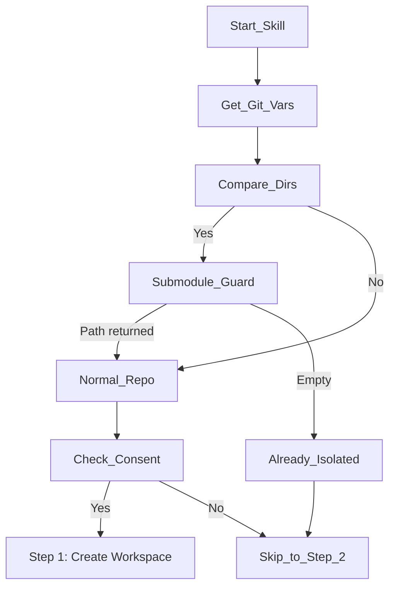
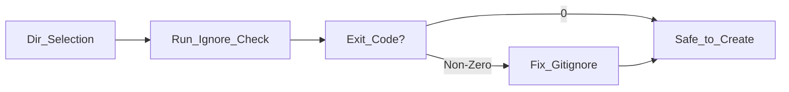

# using-git-worktrees

<details>
<summary>Relevant source files</summary>

The following files were used as context for generating this wiki page:

- [skills/finishing-a-development-branch/SKILL.md](https://github.com/obra/superpowers/blob/HEAD/skills/finishing-a-development-branch/SKILL.md)
- [skills/using-git-worktrees/SKILL.md](https://github.com/obra/superpowers/blob/HEAD/skills/using-git-worktrees/SKILL.md)

</details>


## Purpose and Scope

This page documents the `using-git-worktrees` skill, which provides systematic worktree creation with isolation guarantees for feature development. The skill enforces directory selection priorities, safety verification, and clean baseline testing before implementation begins. [skills/using-git-worktrees/SKILL.md:1-4](https://github.com/obra/superpowers/blob/HEAD/skills/using-git-worktrees/SKILL.md#L1-L4)

The skill ensures that development work happens in an isolated workspace, protecting the user's current branch from unintended changes. It is designed to work across multiple AI platforms by preferring native platform tools over raw `git worktree` commands. [skills/using-git-worktrees/SKILL.md:10-12](https://github.com/obra/superpowers/blob/HEAD/skills/using-git-worktrees/SKILL.md#L10-L12)

**Sources:** [skills/using-git-worktrees/SKILL.md:1-15](https://github.com/obra/superpowers/blob/HEAD/skills/using-git-worktrees/SKILL.md#L1-L15)

---

## Core Principle: Detect and Defer

The skill operates on a "Detect state, not platform" strategy. It uses stable git primitives to determine isolation status rather than sniffing environment variables.

```
Detect Existing Isolation -> Prefer Native Tools -> Fallback to Git Worktrees
```

This prevents "fighting the harness" by creating nested worktrees or phantom states that the AI platform cannot manage. [skills/using-git-worktrees/SKILL.md:12-13](https://github.com/obra/superpowers/blob/HEAD/skills/using-git-worktrees/SKILL.md#L12-L13), [skills/using-git-worktrees/SKILL.md:55-56](https://github.com/obra/superpowers/blob/HEAD/skills/using-git-worktrees/SKILL.md#L55-L56)

**Sources:** [skills/using-git-worktrees/SKILL.md:8-13](https://github.com/obra/superpowers/blob/HEAD/skills/using-git-worktrees/SKILL.md#L8-L13)

---

## Workspace Detection and Consent

Before any creation occurs, the skill must verify the current environment to avoid redundant worktrees. [skills/using-git-worktrees/SKILL.md:16-18](https://github.com/obra/superpowers/blob/HEAD/skills/using-git-worktrees/SKILL.md#L16-L18)

### Detection Logic (Natural Language to Code)

This diagram bridges the intent of "Checking for isolation" to the specific shell commands and logic used in the `using-git-worktrees` skill.



**Sources:** [skills/using-git-worktrees/SKILL.md:16-46](https://github.com/obra/superpowers/blob/HEAD/skills/using-git-worktrees/SKILL.md#L16-L46), [skills/finishing-a-development-branch/SKILL.md:45-56](https://github.com/obra/superpowers/blob/HEAD/skills/finishing-a-development-branch/SKILL.md#L45-L56)

---

## Creation Mechanisms

The skill prioritizes native harness tools to ensure the platform remains aware of the workspace state. [skills/using-git-worktrees/SKILL.md:47-50](https://github.com/obra/superpowers/blob/HEAD/skills/using-git-worktrees/SKILL.md#L47-L50)

### 1a. Native Tools (Preferred)
If the harness provides tools like `EnterWorktree`, `WorktreeCreate`, or a `/worktree` command, these MUST be used first. [skills/using-git-worktrees/SKILL.md:51-54](https://github.com/obra/superpowers/blob/HEAD/skills/using-git-worktrees/SKILL.md#L51-L54) Using `git worktree add` when a native tool is available creates "phantom state" that the harness cannot see or manage. [skills/using-git-worktrees/SKILL.md:55-56](https://github.com/obra/superpowers/blob/HEAD/skills/using-git-worktrees/SKILL.md#L55-L56)

### 1b. Git Worktree Fallback
Only if no native tool exists does the skill fall back to manual creation. [skills/using-git-worktrees/SKILL.md:59-62](https://github.com/obra/superpowers/blob/HEAD/skills/using-git-worktrees/SKILL.md#L59-L62)

#### Directory Selection Priority
1. **Instruction Preference:** Explicit user paths in instructions. [skills/using-git-worktrees/SKILL.md:67-68](https://github.com/obra/superpowers/blob/HEAD/skills/using-git-worktrees/SKILL.md#L67-L68)
2. **Project-Local Existing:** `.worktrees/` (preferred) or `worktrees/`. [skills/using-git-worktrees/SKILL.md:69-74](https://github.com/obra/superpowers/blob/HEAD/skills/using-git-worktrees/SKILL.md#L69-L74)
3. **Default:** `.worktrees/` at project root. [skills/using-git-worktrees/SKILL.md:76](https://github.com/obra/superpowers/blob/HEAD/skills/using-git-worktrees/SKILL.md#L76)

**Sources:** [skills/using-git-worktrees/SKILL.md:47-78](https://github.com/obra/superpowers/blob/HEAD/skills/using-git-worktrees/SKILL.md#L47-L78)

---

## Safety and Verification Protocol

For project-local worktrees, the skill mandates a safety check to prevent committing worktree data into the main repository. [skills/using-git-worktrees/SKILL.md:78-81](https://github.com/obra/superpowers/blob/HEAD/skills/using-git-worktrees/SKILL.md#L78-L81)

### Verification Logic (Code Entity Mapping)

This diagram maps the safety requirements to the specific `git` commands and file entities managed by the skill.



**Sources:** [skills/using-git-worktrees/SKILL.md:82-98](https://github.com/obra/superpowers/blob/HEAD/skills/using-git-worktrees/SKILL.md#L82-L98)

---

## Project Setup and Baseline

Once the workspace is created (or detected), the skill ensures it is functional by installing dependencies and running tests. [skills/using-git-worktrees/SKILL.md:102-105](https://github.com/obra/superpowers/blob/HEAD/skills/using-git-worktrees/SKILL.md#L102-L105)

### Setup Command Matrix
| File Marker | Command |
| :--- | :--- |
| `package.json` | `npm install` |
| `Cargo.toml` | `cargo build` |
| `requirements.txt` | `pip install -r requirements.txt` |
| `pyproject.toml` | `poetry install` |
| `go.mod` | `go mod download` |

[skills/using-git-worktrees/SKILL.md:106-119](https://github.com/obra/superpowers/blob/HEAD/skills/using-git-worktrees/SKILL.md#L106-L119)

### Baseline Verification
The skill runs the project's test suite (e.g., `npm test`, `cargo test`) before any code is changed. [skills/using-git-worktrees/SKILL.md:121-128](https://github.com/obra/superpowers/blob/HEAD/skills/using-git-worktrees/SKILL.md#L121-L128)
*   **If tests pass:** Report ready with test count. [skills/using-git-worktrees/SKILL.md:132-140](https://github.com/obra/superpowers/blob/HEAD/skills/using-git-worktrees/SKILL.md#L132-L140)
*   **If tests fail:** Report failures and ask whether to proceed or investigate. [skills/using-git-worktrees/SKILL.md:130](https://github.com/obra/superpowers/blob/HEAD/skills/using-git-worktrees/SKILL.md#L130)

**Sources:** [skills/using-git-worktrees/SKILL.md:102-140](https://github.com/obra/superpowers/blob/HEAD/skills/using-git-worktrees/SKILL.md#L102-L140)

---

## Integration with Lifecycle Cleanup

The `using-git-worktrees` skill is paired with `finishing-a-development-branch` for lifecycle management. [skills/finishing-a-development-branch/SKILL.md:1-12](https://github.com/obra/superpowers/blob/HEAD/skills/finishing-a-development-branch/SKILL.md#L1-L12)

### Provenance-Based Cleanup
The cleanup skill (Step 6) uses logic to avoid destroying worktrees it doesn't own:
*   **Superpowers-owned:** Worktrees inside `.worktrees/` or `worktrees/` are removed via `git worktree remove` and `git worktree prune`. [skills/finishing-a-development-branch/SKILL.md:173-180](https://github.com/obra/superpowers/blob/HEAD/skills/finishing-a-development-branch/SKILL.md#L173-L180)
*   **Harness-owned:** If the worktree is outside these paths, the skill defers to the platform or leaves it alone. [skills/finishing-a-development-branch/SKILL.md:182](https://github.com/obra/superpowers/blob/HEAD/skills/finishing-a-development-branch/SKILL.md#L182)

**Sources:** [skills/finishing-a-development-branch/SKILL.md:161-183](https://github.com/obra/superpowers/blob/HEAD/skills/finishing-a-development-branch/SKILL.md#L161-L183)

---

## Common Patterns and Red Flags

### Situation / Action Summary
| Situation | Action |
| :--- | :--- |
| Already in linked worktree | Skip creation (Step 0) [skills/using-git-worktrees/SKILL.md:146](https://github.com/obra/superpowers/blob/HEAD/skills/using-git-worktrees/SKILL.md#L146) |
| In a submodule | Treat as normal repo (Step 0 guard) [skills/using-git-worktrees/SKILL.md:147](https://github.com/obra/superpowers/blob/HEAD/skills/using-git-worktrees/SKILL.md#L147) |
| Native worktree tool available | Use it (Step 1a) [skills/using-git-worktrees/SKILL.md:148](https://github.com/obra/superpowers/blob/HEAD/skills/using-git-worktrees/SKILL.md#L148) |
| Permission error on create | Sandbox fallback, work in place [skills/using-git-worktrees/SKILL.md:155](https://github.com/obra/superpowers/blob/HEAD/skills/using-git-worktrees/SKILL.md#L155) |

### Red Flags
*   **Never** create a worktree when Step 0 detects existing isolation. [skills/using-git-worktrees/SKILL.md:189](https://github.com/obra/superpowers/blob/HEAD/skills/using-git-worktrees/SKILL.md#L189)
*   **Never** run `git worktree remove` from inside the worktree directory; always `cd` to main repo root first. [skills/finishing-a-development-branch/SKILL.md:211-213](https://github.com/obra/superpowers/blob/HEAD/skills/finishing-a-development-branch/SKILL.md#L211-L213)
*   **Never** skip the `git check-ignore` check for project-local directories. [skills/using-git-worktrees/SKILL.md:172-175](https://github.com/obra/superpowers/blob/HEAD/skills/using-git-worktrees/SKILL.md#L172-L175)
*   **Never** clean up worktrees you didn't create (provenance check). [skills/finishing-a-development-branch/SKILL.md:231](https://github.com/obra/superpowers/blob/HEAD/skills/finishing-a-development-branch/SKILL.md#L231)

**Sources:** [skills/using-git-worktrees/SKILL.md:142-192](https://github.com/obra/superpowers/blob/HEAD/skills/using-git-worktrees/SKILL.md#L142-L192), [skills/finishing-a-development-branch/SKILL.md:193-233](https://github.com/obra/superpowers/blob/HEAD/skills/finishing-a-development-branch/SKILL.md#L193-L233)