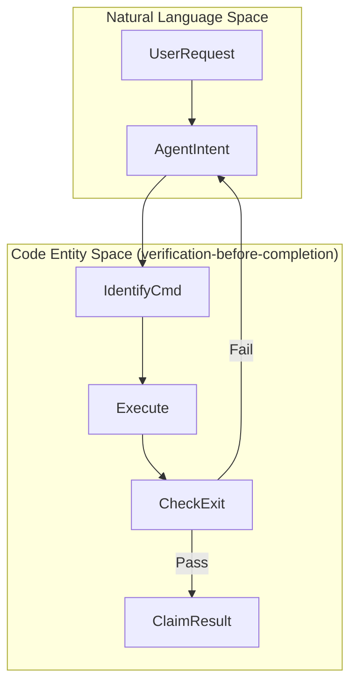
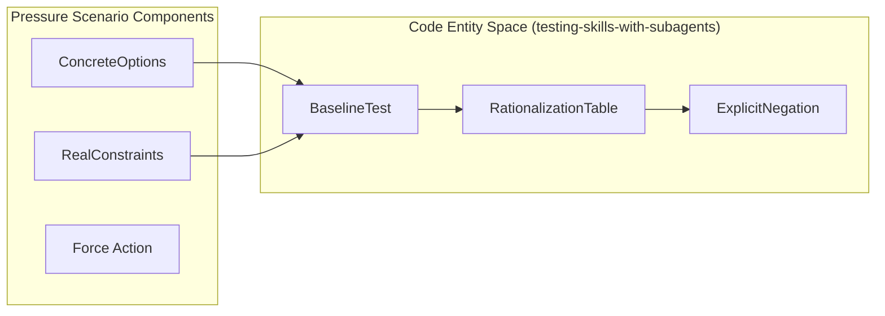
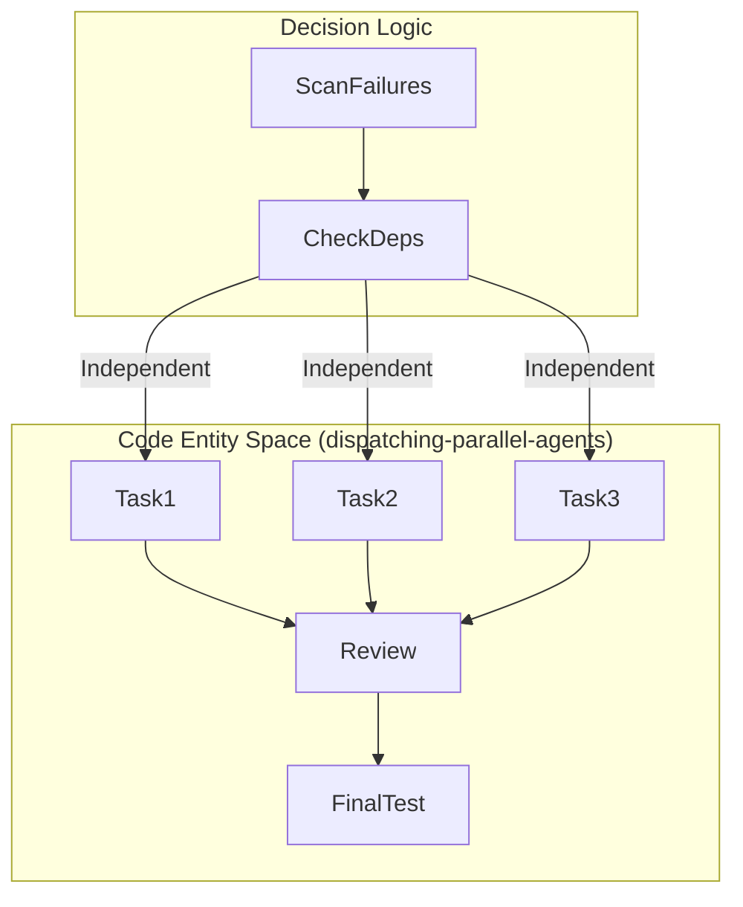

# Other Essential Skills

Relevant source files

The following files were used as context for generating this wiki page:

- [docs/superpowers/specs/2026-05-05-platform-neutral-prose-design.md](https://github.com/obra/superpowers/blob/HEAD/docs/superpowers/specs/2026-05-05-platform-neutral-prose-design.md)
- [skills/dispatching-parallel-agents/SKILL.md](https://github.com/obra/superpowers/blob/HEAD/skills/dispatching-parallel-agents/SKILL.md)
- [skills/requesting-code-review/SKILL.md](https://github.com/obra/superpowers/blob/HEAD/skills/requesting-code-review/SKILL.md)
- [skills/verification-before-completion/SKILL.md](https://github.com/obra/superpowers/blob/HEAD/skills/verification-before-completion/SKILL.md)
- [skills/writing-skills/examples/CLAUDE_MD_TESTING.md](https://github.com/obra/superpowers/blob/HEAD/skills/writing-skills/examples/CLAUDE_MD_TESTING.md)
- [skills/writing-skills/testing-skills-with-subagents.md](https://github.com/obra/superpowers/blob/HEAD/skills/writing-skills/testing-skills-with-subagents.md)

This page documents essential skills that complement the core workflow skills. These skills support quality assurance (`verification-before-completion`), testing methodology (`testing-skills-with-subagents`), feedback handling (`requesting-code-review`), and specialized delegation (`dispatching-parallel-agents`).

## verification-before-completion

**Purpose:** Prevents premature task completion by enforcing a "fresh evidence" rule before any success claims are made [skills/verification-before-completion/SKILL.md:1-4](https://github.com/obra/superpowers/blob/HEAD/skills/verification-before-completion/SKILL.md#L1-L4).

**Core Principle:** Evidence before claims, always. Claiming work is complete without verification is considered dishonesty [skills/verification-before-completion/SKILL.md:8-12](https://github.com/obra/superpowers/blob/HEAD/skills/verification-before-completion/SKILL.md#L8-L12).

### The Iron Law of Verification
The system enforces a strict gate function before any status is reported [skills/verification-before-completion/SKILL.md:24-38](https://github.com/obra/superpowers/blob/HEAD/skills/verification-before-completion/SKILL.md#L24-L38):
1. **IDENTIFY**: Determine which command proves the claim (e.g., `npm test`, `build.sh`).
2. **RUN**: Execute the **FULL** command (fresh, complete).
3. **READ**: Analyze the full output, check exit codes, and count failures.
4. **VERIFY**: Confirm the output matches the claim.
5. **ONLY THEN**: Make the claim with the evidence attached.

### Verification Standards
| Claim Type | Required Evidence | Forbidden Shortcuts |
| :--- | :--- | :--- |
| **Tests Pass** | Test command output showing 0 failures | "Should pass", "passed previously" [skills/verification-before-completion/SKILL.md:44](https://github.com/obra/superpowers/blob/HEAD/skills/verification-before-completion/SKILL.md#L44) |
| **Linter Clean** | Linter output showing 0 errors | Partial checks, "looks clean" [skills/verification-before-completion/SKILL.md:45](https://github.com/obra/superpowers/blob/HEAD/skills/verification-before-completion/SKILL.md#L45) |
| **Bug Fixed** | Original symptom test passes | Code changed but not re-tested [skills/verification-before-completion/SKILL.md:47](https://github.com/obra/superpowers/blob/HEAD/skills/verification-before-completion/SKILL.md#L47) |
| **Red-Green TDD** | Verified failure (RED), then verified pass (GREEN) | Test only passing once [skills/verification-before-completion/SKILL.md:84-88](https://github.com/obra/superpowers/blob/HEAD/skills/verification-before-completion/SKILL.md#L84-L88) |

### Data Flow: Verification Gate

Sources: [skills/verification-before-completion/SKILL.md:16-51](https://github.com/obra/superpowers/blob/HEAD/skills/verification-before-completion/SKILL.md#L16-L51), [skills/verification-before-completion/SKILL.md:76-107](https://github.com/obra/superpowers/blob/HEAD/skills/verification-before-completion/SKILL.md#L76-L107)

---

## testing-skills-with-subagents

**Purpose:** Applies TDD principles to the creation and maintenance of skills themselves, ensuring they resist agent rationalization under pressure [skills/writing-skills/testing-skills-with-subagents.md:1-11](https://github.com/obra/superpowers/blob/HEAD/skills/writing-skills/testing-skills-with-subagents.md#L1-L11).

### TDD for Documentation
Testing skills follows a specific mapping of the RED-GREEN-REFACTOR cycle [skills/writing-skills/testing-skills-with-subagents.md:32-41](https://github.com/obra/superpowers/blob/HEAD/skills/writing-skills/testing-skills-with-subagents.md#L32-L41):
- **RED (Baseline)**: Run a scenario WITHOUT the skill and watch the agent fail/rationalize [skills/writing-skills/testing-skills-with-subagents.md:43-56](https://github.com/obra/superpowers/blob/HEAD/skills/writing-skills/testing-skills-with-subagents.md#L43-L56).
- **GREEN (Write Skill)**: Author minimal instructions to address the observed failures and verify compliance [skills/writing-skills/testing-skills-with-subagents.md:82-90](https://github.com/obra/superpowers/blob/HEAD/skills/writing-skills/testing-skills-with-subagents.md#L82-L90).
- **REFACTOR (Plug Holes)**: Identify new excuses ("rationalizations") and add explicit counters or negations to the skill [skills/writing-skills/testing-skills-with-subagents.md:163-176](https://github.com/obra/superpowers/blob/HEAD/skills/writing-skills/testing-skills-with-subagents.md#L163-L176).

### Pressure Scenarios
To be valid, a test must use "Pressure Scenarios" that combine 3+ types of pressure (Time, Sunk Cost, Authority, Exhaustion) to force an agent to choose between compliance and convenience [skills/writing-skills/testing-skills-with-subagents.md:96-140](https://github.com/obra/superpowers/blob/HEAD/skills/writing-skills/testing-skills-with-subagents.md#L96-L140).

**Pressure Testing Mapping:**

Sources: [skills/writing-skills/testing-skills-with-subagents.md:144-151](https://github.com/obra/superpowers/blob/HEAD/skills/writing-skills/testing-skills-with-subagents.md#L144-L151), [skills/writing-skills/testing-skills-with-subagents.md:178-202](https://github.com/obra/superpowers/blob/HEAD/skills/writing-skills/testing-skills-with-subagents.md#L178-L202), [skills/writing-skills/examples/CLAUDE_MD_TESTING.md:7-62](https://github.com/obra/superpowers/blob/HEAD/skills/writing-skills/examples/CLAUDE_MD_TESTING.md#L7-L62)

---

## requesting-code-review

**Purpose:** Dispatches a code reviewer subagent to verify work product against requirements before completion [skills/requesting-code-review/SKILL.md:1-8](https://github.com/obra/superpowers/blob/HEAD/skills/requesting-code-review/SKILL.md#L1-L8).

### Review Protocol
1. **Context Isolation**: The reviewer never receives the current session's history; it only gets the specific work product and requirements [skills/requesting-code-review/SKILL.md:8-10](https://github.com/obra/superpowers/blob/HEAD/skills/requesting-code-review/SKILL.md#L8-L10).
2. **Git Integration**: The agent identifies `BASE_SHA` and `HEAD_SHA` to define the diff for review [skills/requesting-code-review/SKILL.md:26-30](https://github.com/obra/superpowers/blob/HEAD/skills/requesting-code-review/SKILL.md#L26-L30).
3. **Template Usage**: A `general-purpose` subagent is dispatched using the `code-reviewer.md` template [skills/requesting-code-review/SKILL.md:32-41](https://github.com/obra/superpowers/blob/HEAD/skills/requesting-code-review/SKILL.md#L32-L41).
4. **Feedback Loop**:
    - **Critical/Important**: Fix immediately before proceeding [skills/requesting-code-review/SKILL.md:43-44](https://github.com/obra/superpowers/blob/HEAD/skills/requesting-code-review/SKILL.md#L43-L44).
    - **Minor**: Note for later [skills/requesting-code-review/SKILL.md:45](https://github.com/obra/superpowers/blob/HEAD/skills/requesting-code-review/SKILL.md#L45).
    - **Push Back**: If the reviewer is technically wrong, the agent must provide reasoning or tests to prove the fix works [skills/requesting-code-review/SKILL.md:46-47](https://github.com/obra/superpowers/blob/HEAD/skills/requesting-code-review/SKILL.md#L46-L47), [skills/requesting-code-review/SKILL.md:98-102](https://github.com/obra/superpowers/blob/HEAD/skills/requesting-code-review/SKILL.md#L98-L102).

### Mandatory Checkpoints
Review is mandatory after **each task** in subagent-driven development, after major features, and before merging to main [skills/requesting-code-review/SKILL.md:14-18](https://github.com/obra/superpowers/blob/HEAD/skills/requesting-code-review/SKILL.md#L14-L18).

Sources: [skills/requesting-code-review/SKILL.md:5-47](https://github.com/obra/superpowers/blob/HEAD/skills/requesting-code-review/SKILL.md#L5-L47), [skills/requesting-code-review/SKILL.md:75-103](https://github.com/obra/superpowers/blob/HEAD/skills/requesting-code-review/SKILL.md#L75-L103)

---

## dispatching-parallel-agents

**Purpose:** Parallelizes investigation of independent failures by delegating to specialized subagents with isolated context [skills/dispatching-parallel-agents/SKILL.md:1-4](https://github.com/obra/superpowers/blob/HEAD/skills/dispatching-parallel-agents/SKILL.md#L1-L4).

### Selection Logic
Agents are dispatched in parallel only if the problems are independent (e.g., different test files or subsystems) and lack shared state that would cause interference [skills/dispatching-parallel-agents/SKILL.md:16-46](https://github.com/obra/superpowers/blob/HEAD/skills/dispatching-parallel-agents/SKILL.md#L16-L46). Each agent is provided with a specific scope, clear goals, and constraints to prevent over-refactoring [skills/dispatching-parallel-agents/SKILL.md:58-65](https://github.com/obra/superpowers/blob/HEAD/skills/dispatching-parallel-agents/SKILL.md#L58-L65).

### Entity Mapping: Parallel Dispatch

Sources: [skills/dispatching-parallel-agents/SKILL.md:49-83](https://github.com/obra/superpowers/blob/HEAD/skills/dispatching-parallel-agents/SKILL.md#L49-L83), [skills/dispatching-parallel-agents/SKILL.md:167-174](https://github.com/obra/superpowers/blob/HEAD/skills/dispatching-parallel-agents/SKILL.md#L167-L174)

---

## Platform-Neutral Prose (SDO)

The repository maintains a standard for documentation known as **Skill Discovery Optimization (SDO)** (formerly Claude Search Optimization) [docs/superpowers/specs/2026-05-05-platform-neutral-prose-design.md:17-18](https://github.com/obra/superpowers/blob/HEAD/docs/superpowers/specs/2026-05-05-platform-neutral-prose-design.md#L17-L18). This ensures that skill descriptions and prose are written to be discoverable by any agent runtime (Claude Code, Codex, Cursor, etc.) by using generic terms like "your agent" or "the agent" instead of platform-specific identifiers in general documentation [docs/superpowers/specs/2026-05-05-platform-neutral-prose-design.md:30-41](https://github.com/obra/superpowers/blob/HEAD/docs/superpowers/specs/2026-05-05-platform-neutral-prose-design.md#L30-L41).

Sources: [docs/superpowers/specs/2026-05-05-platform-neutral-prose-design.md:1-53](https://github.com/obra/superpowers/blob/HEAD/docs/superpowers/specs/2026-05-05-platform-neutral-prose-design.md#L1-L53)