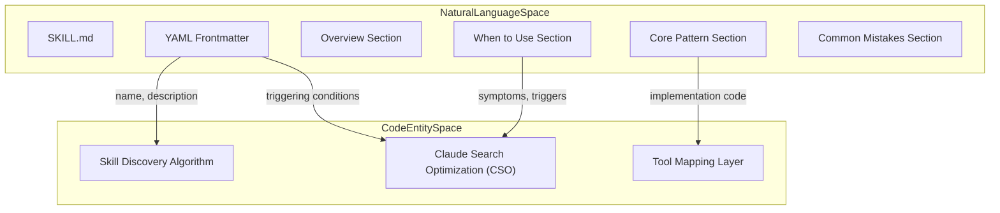
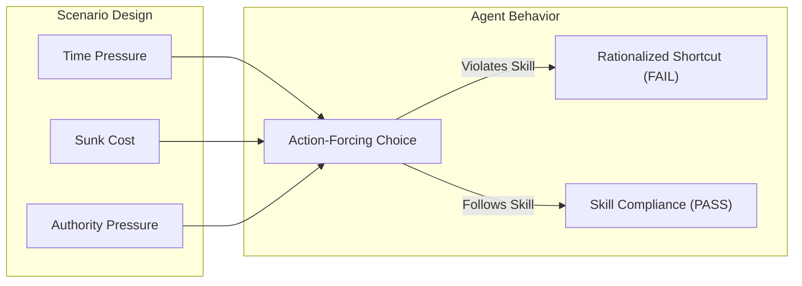

# Creating Skills

<details>
<summary>Relevant source files</summary>

The following files were used as context for generating this wiki page:

- [skills/executing-plans/SKILL.md](https://github.com/obra/superpowers/blob/HEAD/skills/executing-plans/SKILL.md)
- [skills/writing-skills/SKILL.md](https://github.com/obra/superpowers/blob/HEAD/skills/writing-skills/SKILL.md)
- [skills/writing-skills/anthropic-best-practices.md](https://github.com/obra/superpowers/blob/HEAD/skills/writing-skills/anthropic-best-practices.md)

</details>


This page documents the complete methodology for creating new skills in the Superpowers system. Skills are markdown-based process documentation that AI agents discover and follow when working on tasks. The creation process follows Test-Driven Development (TDD) principles adapted for documentation: you must observe agent failures before writing guidance, then iteratively bulletproof against rationalization.

For information about the skills system architecture and how skills are discovered, see [Skills Discovery and Resolution](18_4.5-skills-discovery-and-resolution.md). For details on specific existing skills, see [Key Skills Reference](37_7-key-skills-reference.md).

**Sources:** [skills/writing-skills/SKILL.md:1-18](https://github.com/obra/superpowers/blob/HEAD/skills/writing-skills/SKILL.md#L1-L18), [skills/writing-skills/SKILL.md:30-45](https://github.com/obra/superpowers/blob/HEAD/skills/writing-skills/SKILL.md#L30-L45)

---

## What is a Skill?

A **skill** is a reference guide for proven techniques, patterns, or tools stored as a markdown file (`SKILL.md`) with YAML frontmatter. Skills help AI agents find and apply effective approaches consistently across projects and sessions.

**Skills are:**
- Reusable techniques, patterns, and tools [skills/writing-skills/SKILL.md:26-26](https://github.com/obra/superpowers/blob/HEAD/skills/writing-skills/SKILL.md#L26)
- Reference guides for future AI instances [skills/writing-skills/SKILL.md:24-24](https://github.com/obra/superpowers/blob/HEAD/skills/writing-skills/SKILL.md#L24)
- Concrete methods with steps (Techniques) [skills/writing-skills/SKILL.md:63-65](https://github.com/obra/superpowers/blob/HEAD/skills/writing-skills/SKILL.md#L63-L65)
- Ways of thinking about problems (Patterns) [skills/writing-skills/SKILL.md:66-68](https://github.com/obra/superpowers/blob/HEAD/skills/writing-skills/SKILL.md#L66-L68)

**Skills are NOT:**
- Narratives about solving one specific problem [skills/writing-skills/SKILL.md:28-28](https://github.com/obra/superpowers/blob/HEAD/skills/writing-skills/SKILL.md#L28)
- Project-specific conventions (those go in `CLAUDE.md`) [skills/writing-skills/SKILL.md:58-58](https://github.com/obra/superpowers/blob/HEAD/skills/writing-skills/SKILL.md#L58)
- Mechanical constraints enforceable by automation [skills/writing-skills/SKILL.md:59-59](https://github.com/obra/superpowers/blob/HEAD/skills/writing-skills/SKILL.md#L59)

**Sources:** [skills/writing-skills/SKILL.md:22-71](https://github.com/obra/superpowers/blob/HEAD/skills/writing-skills/SKILL.md#L22-L71)

---

## Skill Structure and Organization

### Directory Structure

Skills follow a flat namespace structure to ensure they are easily searchable [skills/writing-skills/SKILL.md:82-82](https://github.com/obra/superpowers/blob/HEAD/skills/writing-skills/SKILL.md#L82). Personal skills are stored in agent-specific directories like `~/.claude/skills` for Claude Code or `~/.agents/skills/` for Codex [skills/writing-skills/SKILL.md:12-12](https://github.com/obra/superpowers/blob/HEAD/skills/writing-skills/SKILL.md#L12).

```
skills/
  skill-name/
    SKILL.md              # Main reference (required)
    supporting-file.*     # Heavy reference or reusable tools (optional)
```

**Sources:** [skills/writing-skills/SKILL.md:12-12](https://github.com/obra/superpowers/blob/HEAD/skills/writing-skills/SKILL.md#L12), [skills/writing-skills/SKILL.md:72-82](https://github.com/obra/superpowers/blob/HEAD/skills/writing-skills/SKILL.md#L72-L82)

### SKILL.md Format

The `SKILL.md` file must follow a specific structure for discovery and readability. The frontmatter must include a `name` and a `description` field [skills/writing-skills/SKILL.md:95-96](https://github.com/obra/superpowers/blob/HEAD/skills/writing-skills/SKILL.md#L95-L96).

**Diagram: Skill Entity Mapping**



**Sources:** [skills/writing-skills/SKILL.md:93-140](https://github.com/obra/superpowers/blob/HEAD/skills/writing-skills/SKILL.md#L93-L140), [skills/writing-skills/anthropic-best-practices.md:147-153](https://github.com/obra/superpowers/blob/HEAD/skills/writing-skills/anthropic-best-practices.md#L147-L153)

---

## The TDD Methodology for Skills

**Writing skills IS Test-Driven Development applied to process documentation.** The core principle is: "If you didn't watch an agent fail without the skill, you don't know if the skill teaches the right thing" [skills/writing-skills/SKILL.md:10-16](https://github.com/obra/superpowers/blob/HEAD/skills/writing-skills/SKILL.md#L10-L16).

### The RED-GREEN-REFACTOR Cycle

| TDD Concept | Skill Creation Application |
|-------------|----------------------------|
| **Test case** | Pressure scenario with subagent [skills/writing-skills/SKILL.md:34-34](https://github.com/obra/superpowers/blob/HEAD/skills/writing-skills/SKILL.md#L34) |
| **Production code** | The `SKILL.md` document [skills/writing-skills/SKILL.md:35-35](https://github.com/obra/superpowers/blob/HEAD/skills/writing-skills/SKILL.md#L35) |
| **Test fails (RED)** | Agent violates rule without skill (baseline) [skills/writing-skills/SKILL.md:36-36](https://github.com/obra/superpowers/blob/HEAD/skills/writing-skills/SKILL.md#L36) |
| **Test passes (GREEN)** | Agent complies with skill present [skills/writing-skills/SKILL.md:37-37](https://github.com/obra/superpowers/blob/HEAD/skills/writing-skills/SKILL.md#L37) |
| **Refactor** | Close loopholes and rationalizations [skills/writing-skills/SKILL.md:38-38](https://github.com/obra/superpowers/blob/HEAD/skills/writing-skills/SKILL.md#L38) |

For more details on this process, see [Test-Driven Development for Skills](47_8.1-test-driven-development-for-skills.md).

**Sources:** [skills/writing-skills/SKILL.md:30-45](https://github.com/obra/superpowers/blob/HEAD/skills/writing-skills/SKILL.md#L30-L45), [skills/writing-skills/testing-skills-with-subagents.md:32-41](https://github.com/obra/superpowers/blob/HEAD/skills/writing-skills/testing-skills-with-subagents.md#L32-L41)

---

## Claude Search Optimization (CSO)

CSO is critical for discovery. Future AI instances must be able to FIND the skill when they need it. At startup, only metadata (name and description) is pre-loaded; the full `SKILL.md` is only read when it becomes relevant [skills/writing-skills/anthropic-best-practices.md:20-20](https://github.com/obra/superpowers/blob/HEAD/skills/writing-skills/anthropic-best-practices.md#L20).

### The Description Field

The YAML frontmatter `description` field is the primary signal for discovery.

- **Required Format:** Start with "Use when..." to focus on triggering conditions [skills/writing-skills/SKILL.md:148-148](https://github.com/obra/superpowers/blob/HEAD/skills/writing-skills/SKILL.md#L148).
- **Constraint:** The description should ONLY describe triggering conditions. **NEVER summarize the skill's process or workflow** in the description [skills/writing-skills/SKILL.md:150-152](https://github.com/obra/superpowers/blob/HEAD/skills/writing-skills/SKILL.md#L150-L152).
- **Reasoning:** Summarizing workflow creates a "shortcut" that causes the AI to skip reading the full skill body [skills/writing-skills/SKILL.md:158-159](https://github.com/obra/superpowers/blob/HEAD/skills/writing-skills/SKILL.md#L158-L159).
- **Perspective:** Always write in the third person [skills/writing-skills/anthropic-best-practices.md:189-191](https://github.com/obra/superpowers/blob/HEAD/skills/writing-skills/anthropic-best-practices.md#L189-L191).

For detailed optimization principles, see [Claude Search Optimization (CSO)](50_8.4-claude-search-optimization-cso.md).

**Sources:** [skills/writing-skills/SKILL.md:140-182](https://github.com/obra/superpowers/blob/HEAD/skills/writing-skills/SKILL.md#L140-L182), [skills/writing-skills/anthropic-best-practices.md:20-20](https://github.com/obra/superpowers/blob/HEAD/skills/writing-skills/anthropic-best-practices.md#L20), [skills/writing-skills/anthropic-best-practices.md:185-195](https://github.com/obra/superpowers/blob/HEAD/skills/writing-skills/anthropic-best-practices.md#L185-L195)

---

## Testing Skills with Pressure Scenarios

To verify a skill works, you must design "Pressure Scenarios" that force the AI to choose between following the rule or taking a "pragmatic" shortcut [skills/writing-skills/testing-skills-with-subagents.md:92-94](https://github.com/obra/superpowers/blob/HEAD/skills/writing-skills/testing-skills-with-subagents.md#L92-L94).

**Diagram: Pressure Scenario Execution**



**Pressure Scenario Requirements:**
- Combine 3+ pressures (e.g., time, exhaustion, authority) [skills/writing-skills/testing-skills-with-subagents.md:140-140](https://github.com/obra/superpowers/blob/HEAD/skills/writing-skills/testing-skills-with-subagents.md#L140).
- Provide concrete, action-forcing options (A, B, or C) [skills/writing-skills/testing-skills-with-subagents.md:146-146](https://github.com/obra/superpowers/blob/HEAD/skills/writing-skills/testing-skills-with-subagents.md#L146).
- Allow no "easy outs" (e.g., "I would ask the user") [skills/writing-skills/testing-skills-with-subagents.md:150-150](https://github.com/obra/superpowers/blob/HEAD/skills/writing-skills/testing-skills-with-subagents.md#L150).

For details on designing these tests, see [Testing Skills with Pressure Scenarios](49_8.3-testing-skills-with-pressure-scenarios.md).

**Sources:** [skills/writing-skills/testing-skills-with-subagents.md:140-151](https://github.com/obra/superpowers/blob/HEAD/skills/writing-skills/testing-skills-with-subagents.md#L140-L151), [skills/writing-skills/examples/CLAUDE_MD_TESTING.md:7-19](https://github.com/obra/superpowers/blob/HEAD/skills/writing-skills/examples/CLAUDE_MD_TESTING.md#L7-L19)

---

## Contributor Guidelines

The Superpowers project maintains high standards for skill contributions to avoid "AI-generated slop" [RELEASE-NOTES.md:24-24](https://github.com/obra/superpowers/blob/HEAD/RELEASE-NOTES.md#L24).

- **Pre-submission:** Read the PR template, verify the problem exists in core, and confirm it is not project-specific [RELEASE-NOTES.md:26-27](https://github.com/obra/superpowers/blob/HEAD/RELEASE-NOTES.md#L26-L27).
- **Restrictions:** We do not accept third-party dependencies, "compliance" rewrites, or domain-specific skills [RELEASE-NOTES.md:27-27](https://github.com/obra/superpowers/blob/HEAD/RELEASE-NOTES.md#L27).
- **New Harnesses:** Require a session transcript demonstrating the `using-superpowers` bootstrap auto-triggering `brainstorming` [RELEASE-NOTES.md:28-28](https://github.com/obra/superpowers/blob/HEAD/RELEASE-NOTES.md#L28).

For more details, see [Contributing Skills](52_8.6-contributing-skills.md).

**Sources:** [RELEASE-NOTES.md:22-29](https://github.com/obra/superpowers/blob/HEAD/RELEASE-NOTES.md#L22-L29)

---

## Child Pages

- [Test-Driven Development for Skills](47_8.1-test-driven-development-for-skills.md) — Detailed RED-GREEN-REFACTOR cycle for documentation.
- [SKILL.md Format and Structure](48_8.2-skill-md-format-and-structure.md) — Technical specification for the markdown and frontmatter.
- [Testing Skills with Pressure Scenarios](49_8.3-testing-skills-with-pressure-scenarios.md) — How to design scenarios that break weak documentation.
- [Claude Search Optimization (CSO)](50_8.4-claude-search-optimization-cso.md) — Principles for making skills discoverable.
- [Skill Creation Checklist](51_8.5-skill-creation-checklist.md) — Step-by-step guide for authors.
- [Contributing Skills](52_8.6-contributing-skills.md) — Workflow for pull requests and community contributions.

**Sources:** [skills/writing-skills/SKILL.md:1-137](https://github.com/obra/superpowers/blob/HEAD/skills/writing-skills/SKILL.md#L1-L137), [skills/writing-skills/SKILL.md:374-443](https://github.com/obra/superpowers/blob/HEAD/skills/writing-skills/SKILL.md#L374-L443), [RELEASE-NOTES.md:22-29](https://github.com/obra/superpowers/blob/HEAD/RELEASE-NOTES.md#L22-L29)45:T2cc2,# T