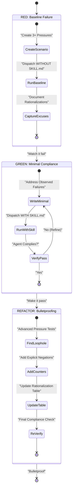
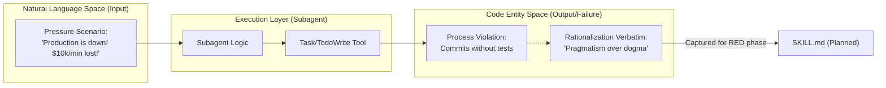
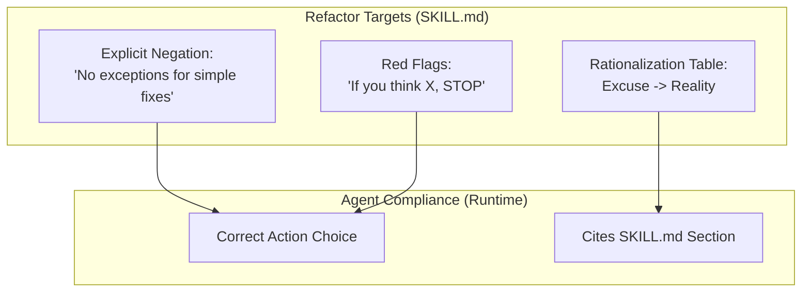

# Test-Driven Development for Skills

Relevant source files

The following files were used as context for generating this wiki page:

- [skills/executing-plans/SKILL.md](https://github.com/obra/superpowers/blob/HEAD/skills/executing-plans/SKILL.md)
- [skills/writing-skills/SKILL.md](https://github.com/obra/superpowers/blob/HEAD/skills/writing-skills/SKILL.md)
- [skills/writing-skills/anthropic-best-practices.md](https://github.com/obra/superpowers/blob/HEAD/skills/writing-skills/anthropic-best-practices.md)
- [skills/writing-skills/examples/CLAUDE_MD_TESTING.md](https://github.com/obra/superpowers/blob/HEAD/skills/writing-skills/examples/CLAUDE_MD_TESTING.md)
- [skills/writing-skills/testing-skills-with-subagents.md](https://github.com/obra/superpowers/blob/HEAD/skills/writing-skills/testing-skills-with-subagents.md)

**Purpose:** This page explains how Test-Driven Development (TDD) principles are adapted for creating and editing skills within the Superpowers system. Skills are process documentation that guides AI agents; creating them follows a structured RED-GREEN-REFACTOR cycle where agent behavior is the "test subject" and skill documentation is the "code under test." [skills/writing-skills/SKILL.md:10-14](https://github.com/obra/superpowers/blob/HEAD/skills/writing-skills/SKILL.md#L10-L14)

**Scope:** This page covers the conceptual framework, the implementation of the three-phase cycle, and the data flow between "Natural Language Space" (instructions) and "Code Entity Space" (agent actions).

**Note:** This methodology is most critical for skills that enforce discipline or rules that agents might rationalize away under pressure, such as `subagent-driven-development` or `systematic-debugging`. [skills/writing-skills/testing-skills-with-subagents.md:19-24](https://github.com/obra/superpowers/blob/HEAD/skills/writing-skills/testing-skills-with-subagents.md#L19-L24)

## Overview: TDD Applied to Documentation

Creating skills is formalized as TDD applied to process documentation [skills/writing-skills/SKILL.md:10-14](https://github.com/obra/superpowers/blob/HEAD/skills/writing-skills/SKILL.md#L10-L14). The system treats **agent behavior** as the runtime environment and **SKILL.md** files as the source code [skills/writing-skills/SKILL.md:32-35](https://github.com/obra/superpowers/blob/HEAD/skills/writing-skills/SKILL.md#L32-L35).

- **Test Case:** A "Pressure Scenario" dispatched to a subagent [skills/writing-skills/SKILL.md:34](https://github.com/obra/superpowers/blob/HEAD/skills/writing-skills/SKILL.md#L34).
- **Production Code:** The `SKILL.md` document [skills/writing-skills/SKILL.md:35](https://github.com/obra/superpowers/blob/HEAD/skills/writing-skills/SKILL.md#L35).
- **Test Failure (RED):** An agent violates a process rule or uses a rationalization (excuse) when the skill is absent [skills/writing-skills/SKILL.md:36](https://github.com/obra/superpowers/blob/HEAD/skills/writing-skills/SKILL.md#L36).
- **Test Pass (GREEN):** The agent complies with the process even under high stress when the skill is present [skills/writing-skills/SKILL.md:37](https://github.com/obra/superpowers/blob/HEAD/skills/writing-skills/SKILL.md#L37).

The core principle is: **If you didn't watch an agent fail without the skill, you don't know if the skill teaches the right thing** [skills/writing-skills/SKILL.md:16-17](https://github.com/obra/superpowers/blob/HEAD/skills/writing-skills/SKILL.md#L16-L17).

**Sources:** [skills/writing-skills/SKILL.md:10-44](https://github.com/obra/superpowers/blob/HEAD/skills/writing-skills/SKILL.md#L10-L44), [skills/writing-skills/testing-skills-with-subagents.md:7-13](https://github.com/obra/superpowers/blob/HEAD/skills/writing-skills/testing-skills-with-subagents.md#L7-L13)

## TDD Concept Mapping

The following table maps software engineering TDD concepts to the Superpowers skill creation workflow:

| TDD Concept | Skill Creation Equivalent | Description |
| :--- | :--- | :--- |
| **Test Case** | Pressure Scenario | Scenario with 3+ combined pressures (Time, Sunk Cost, Authority) [skills/writing-skills/testing-skills-with-subagents.md:140-142](https://github.com/obra/superpowers/blob/HEAD/skills/writing-skills/testing-skills-with-subagents.md#L140-L142) |
| **Production Code** | Skill Document | The `SKILL.md` file containing the instructions [skills/writing-skills/SKILL.md:35](https://github.com/obra/superpowers/blob/HEAD/skills/writing-skills/SKILL.md#L35) |
| **Test Fails (RED)** | Baseline Violation | Agent rationalizes skipping the process during a baseline run [skills/writing-skills/testing-skills-with-subagents.md:34-35](https://github.com/obra/superpowers/blob/HEAD/skills/writing-skills/testing-skills-with-subagents.md#L34-L35) |
| **Test Passes (GREEN)** | Compliance | Agent follows instructions despite the pressure scenario [skills/writing-skills/testing-skills-with-subagents.md:37-39](https://github.com/obra/superpowers/blob/HEAD/skills/writing-skills/testing-skills-with-subagents.md#L37-L39) |
| **Refactor** | Loophole Closure | Adding explicit negations to prevent new rationalizations [skills/writing-skills/SKILL.md:43](https://github.com/obra/superpowers/blob/HEAD/skills/writing-skills/SKILL.md#L43) |

**Sources:** [skills/writing-skills/SKILL.md:30-44](https://github.com/obra/superpowers/blob/HEAD/skills/writing-skills/SKILL.md#L30-L44), [skills/writing-skills/testing-skills-with-subagents.md:30-41](https://github.com/obra/superpowers/blob/HEAD/skills/writing-skills/testing-skills-with-subagents.md#L30-L41)

## The RED-GREEN-REFACTOR Cycle for Skills

The workflow moves from observing natural agent failure to minimal instruction writing, and finally to "bulletproofing" via iterative loophole closure.

**Diagram: The Skill TDD Lifecycle**

**Sources:** [skills/writing-skills/SKILL.md:44-46](https://github.com/obra/superpowers/blob/HEAD/skills/writing-skills/SKILL.md#L44-L46), [skills/writing-skills/testing-skills-with-subagents.md:32-41](https://github.com/obra/superpowers/blob/HEAD/skills/writing-skills/testing-skills-with-subagents.md#L32-L41)

## RED Phase: Baseline Testing (Natural Language Space to Code Entity Space)

The RED phase identifies how an agent behaves in the "Code Entity Space" (executing tools, writing files) when it lacks the constraints of a skill. A valid test requires a **Pressure Scenario** that forces a choice between a "fast/wrong" path and a "slow/right" path [skills/writing-skills/testing-skills-with-subagents.md:111-125](https://github.com/obra/superpowers/blob/HEAD/skills/writing-skills/testing-skills-with-subagents.md#L111-L125).

**Diagram: Mapping Baseline Failures to Skill Requirements**

In this phase, the developer must capture **rationalizations** verbatim. For example, if an agent says "I'm skipping TDD because the fix is simple," this specific excuse becomes a target for the skill's "No Exceptions" section [skills/writing-skills/testing-skills-with-subagents.md:74-80](https://github.com/obra/superpowers/blob/HEAD/skills/writing-skills/testing-skills-with-subagents.md#L74-L80).

**Sources:** [skills/writing-skills/testing-skills-with-subagents.md:43-80](https://github.com/obra/superpowers/blob/HEAD/skills/writing-skills/testing-skills-with-subagents.md#L43-L80), [skills/writing-skills/SKILL.md:40-43](https://github.com/obra/superpowers/blob/HEAD/skills/writing-skills/SKILL.md#L40-L43)

## GREEN Phase: Minimal Skill Writing

Once failures are documented, the developer writes the minimal content required to achieve compliance [skills/writing-skills/testing-skills-with-subagents.md:84-85](https://github.com/obra/superpowers/blob/HEAD/skills/writing-skills/testing-skills-with-subagents.md#L84-L85).

### Data Flow: Instruction Injection
When a skill is active, the system injects the `SKILL.md` content into the subagent's context.

1.  **Frontmatter Parsing:** The `description` field in `SKILL.md` is used for discovery [skills/writing-skills/SKILL.md:95-103](https://github.com/obra/superpowers/blob/HEAD/skills/writing-skills/SKILL.md#L95-L103).
2.  **Claude Search Optimization (CSO):** Descriptions must describe **when to use**, NOT what the skill does. Testing shows summarizing the workflow causes Claude to skip the full skill content and follow the summary instead [skills/writing-skills/SKILL.md:150-158](https://github.com/obra/superpowers/blob/HEAD/skills/writing-skills/SKILL.md#L150-L158).
3.  **Constraint Injection:** The "Core Pattern" and "When to Use" sections are provided as high-priority instructions [skills/writing-skills/SKILL.md:116-124](https://github.com/obra/superpowers/blob/HEAD/skills/writing-skills/SKILL.md#L116-L124).
4.  **Verification:** The subagent is re-run through the same scenario to see if it now chooses the correct action (e.g., deleting code that wasn't TDD'd) [skills/writing-skills/testing-skills-with-subagents.md:86-89](https://github.com/obra/superpowers/blob/HEAD/skills/writing-skills/testing-skills-with-subagents.md#L86-L89).

**Sources:** [skills/writing-skills/SKILL.md:93-138](https://github.com/obra/superpowers/blob/HEAD/skills/writing-skills/SKILL.md#L93-L138), [skills/writing-skills/SKILL.md:140-158](https://github.com/obra/superpowers/blob/HEAD/skills/writing-skills/SKILL.md#L140-L158), [skills/writing-skills/testing-skills-with-subagents.md:82-89](https://github.com/obra/superpowers/blob/HEAD/skills/writing-skills/testing-skills-with-subagents.md#L82-L89)

## REFACTOR Phase: Bulletproofing and Loopholes

The REFACTOR phase is where the skill is hardened against "spirit vs. letter" arguments [skills/writing-skills/testing-skills-with-subagents.md:163-165](https://github.com/obra/superpowers/blob/HEAD/skills/writing-skills/testing-skills-with-subagents.md#L163-L165). This involves adding explicit counters to the `SKILL.md`.

### Implementation of Loophole Closure
Developers use specific code-like structures in documentation to prevent regressions:

1.  **Explicit Negation:** Using bold "No exceptions" lists to block specific rationalizations like "Don't keep it as reference" [skills/writing-skills/testing-skills-with-subagents.md:191-199](https://github.com/obra/superpowers/blob/HEAD/skills/writing-skills/testing-skills-with-subagents.md#L191-L199).
2.  **Rationalization Tables:** A markdown table mapping "Excuse" to "Reality" to provide immediate counter-arguments [skills/writing-skills/testing-skills-with-subagents.md:205-212](https://github.com/obra/superpowers/blob/HEAD/skills/writing-skills/testing-skills-with-subagents.md#L205-L212).
3.  **No Easy Outs:** Ensuring scenarios force a concrete choice (A/B/C) rather than allowing the agent to defer to a human [skills/writing-skills/testing-skills-with-subagents.md:146-151](https://github.com/obra/superpowers/blob/HEAD/skills/writing-skills/testing-skills-with-subagents.md#L146-L151).

**Diagram: Loophole Closure Mechanisms**

**Sources:** [skills/writing-skills/testing-skills-with-subagents.md:163-226](https://github.com/obra/superpowers/blob/HEAD/skills/writing-skills/testing-skills-with-subagents.md#L163-L226), [skills/writing-skills/testing-skills-with-subagents.md:146-151](https://github.com/obra/superpowers/blob/HEAD/skills/writing-skills/testing-skills-with-subagents.md#L146-L151)

## The Iron Law of Skill Creation

The system enforces a strict protocol: **NO SKILL WITHOUT A FAILING TEST FIRST** [skills/writing-skills/SKILL.md:16-17](https://github.com/obra/superpowers/blob/HEAD/skills/writing-skills/SKILL.md#L16-L17).

This applies to:
- **New Skills:** Must have a baseline RED run [skills/writing-skills/testing-skills-with-subagents.md:43-47](https://github.com/obra/superpowers/blob/HEAD/skills/writing-skills/testing-skills-with-subagents.md#L43-L47).
- **Edits:** Adding a section requires a new pressure scenario that proves the section is necessary.
- **Refactoring:** Moving content between files requires re-verifying that agents still comply with the same pressure tests [skills/writing-skills/testing-skills-with-subagents.md:163-165](https://github.com/obra/superpowers/blob/HEAD/skills/writing-skills/testing-skills-with-subagents.md#L163-L165).

**Sources:** [skills/writing-skills/SKILL.md:10-18](https://github.com/obra/superpowers/blob/HEAD/skills/writing-skills/SKILL.md#L10-L18), [skills/writing-skills/testing-skills-with-subagents.md:11-13](https://github.com/obra/superpowers/blob/HEAD/skills/writing-skills/testing-skills-with-subagents.md#L11-L13)

## Summary of TDD Functions and Files

| Component | File Path | Role |
| :--- | :--- | :--- |
| **TDD Logic** | `skills/writing-skills/SKILL.md` | Defines the RED-GREEN-REFACTOR cycle for documentation [skills/writing-skills/SKILL.md:1-46](https://github.com/obra/superpowers/blob/HEAD/skills/writing-skills/SKILL.md#L1-L46). |
| **Testing Helper** | `skills/writing-skills/testing-skills-with-subagents.md` | Provides templates for pressure scenarios and rationalization tables [skills/writing-skills/testing-skills-with-subagents.md:1-16](https://github.com/obra/superpowers/blob/HEAD/skills/writing-skills/testing-skills-with-subagents.md#L1-L16). |
| **Best Practices** | `skills/writing-skills/anthropic-best-practices.md` | Anthropic's official guidance on concise skill authoring [skills/writing-skills/anthropic-best-practices.md:1-20](https://github.com/obra/superpowers/blob/HEAD/skills/writing-skills/anthropic-best-practices.md#L1-L20). |
| **Example Test** | `skills/writing-skills/examples/CLAUDE_MD_TESTING.md` | A reference implementation of a TDD test campaign for documentation variants [skills/writing-skills/examples/CLAUDE_MD_TESTING.md:1-4](https://github.com/obra/superpowers/blob/HEAD/skills/writing-skills/examples/CLAUDE_MD_TESTING.md#L1-L4). |

**Sources:** [skills/writing-skills/SKILL.md:1-46](https://github.com/obra/superpowers/blob/HEAD/skills/writing-skills/SKILL.md#L1-L46), [skills/writing-skills/testing-skills-with-subagents.md:1-16](https://github.com/obra/superpowers/blob/HEAD/skills/writing-skills/testing-skills-with-subagents.md#L1-L16), [skills/writing-skills/anthropic-best-practices.md:1-20](https://github.com/obra/superpowers/blob/HEAD/skills/writing-skills/anthropic-best-practices.md#L1-L20), [skills/writing-skills/examples/CLAUDE_MD_TESTING.md:1-4](https://github.com/obra/superpowers/blob/HEAD/skills/writing-skills/examples/CLAUDE_MD_TESTING.md#L1-L4)