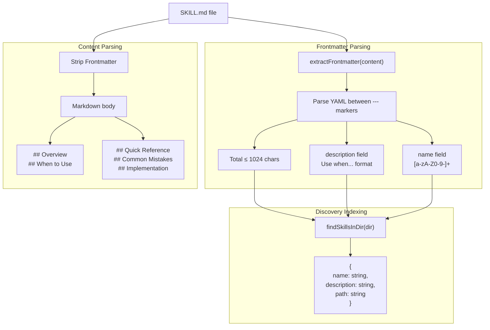
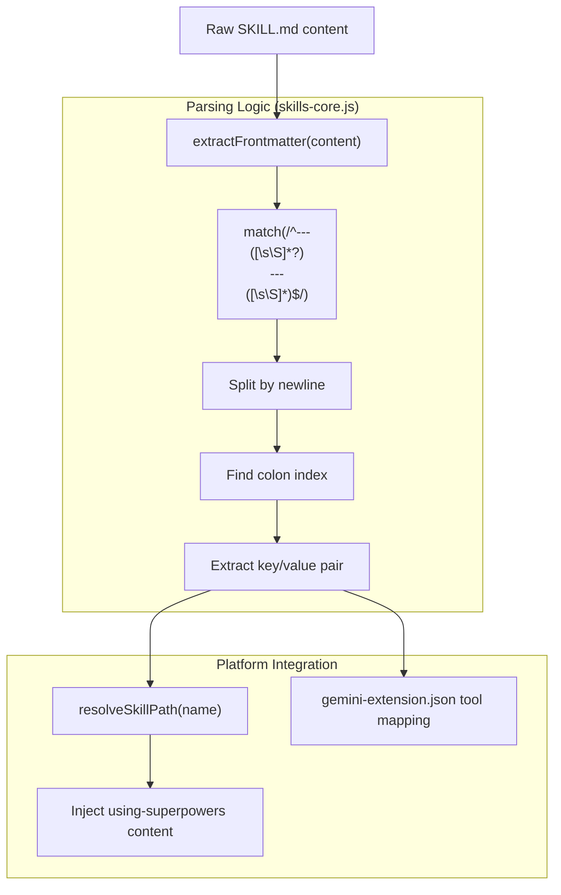
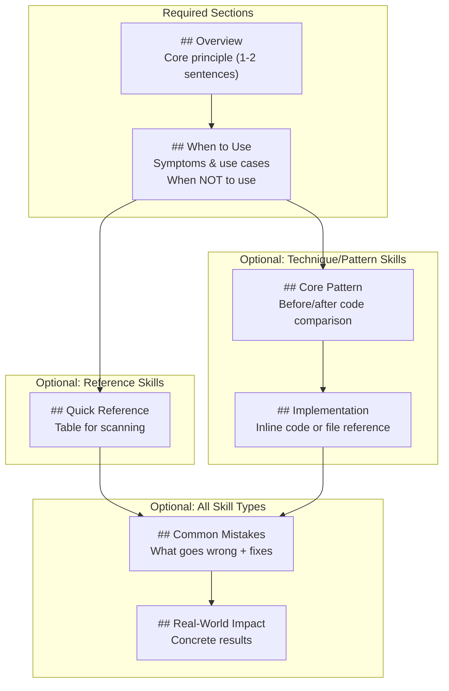

# SKILL.md Format and Structure

<details>
<summary>Relevant source files</summary>

The following files were used as context for generating this wiki page:

- [skills/executing-plans/SKILL.md](https://github.com/obra/superpowers/blob/HEAD/skills/executing-plans/SKILL.md)
- [skills/writing-skills/SKILL.md](https://github.com/obra/superpowers/blob/HEAD/skills/writing-skills/SKILL.md)
- [skills/writing-skills/anthropic-best-practices.md](https://github.com/obra/superpowers/blob/HEAD/skills/writing-skills/anthropic-best-practices.md)

</details>


## Purpose and Scope

This document specifies the technical format and structure requirements for `SKILL.md` files in the Superpowers skills repository. It defines the YAML frontmatter schema, required document sections, and file organization patterns.

For the test-driven development process of creating skills, see [8.1 Test-Driven Development for Skills](47_8.1-test-driven-development-for-skills.md). For optimization techniques to improve skill discoverability, see [8.4 Claude Search Optimization (CSO)](50_8.4-claude-search-optimization-cso.md). For the complete creation workflow and deployment checklist, see [8.5 Skill Creation Checklist](51_8.5-skill-creation-checklist.md).

## File Format Overview

Every skill consists of a `SKILL.md` file with mandatory YAML frontmatter followed by markdown content. The file structure follows a strict schema to enable platform parsing and skill discovery mechanisms.

### SKILL.md Components and Parsing Pipeline

**Diagram: SKILL.md structure and parsing logic**



**Sources:** [skills/writing-skills/SKILL.md:93-137](https://github.com/obra/superpowers/blob/HEAD/skills/writing-skills/SKILL.md#L93-L137), [skills/writing-skills/SKILL.md:72-80](https://github.com/obra/superpowers/blob/HEAD/skills/writing-skills/SKILL.md#L72-L80)

## YAML Frontmatter Specification

The frontmatter contains exactly two required fields: `name` and `description` [skills/writing-skills/SKILL.md:96-96](https://github.com/obra/superpowers/blob/HEAD/skills/writing-skills/SKILL.md#L96). The total frontmatter block must not exceed 1024 characters [skills/writing-skills/SKILL.md:97-97](https://github.com/obra/superpowers/blob/HEAD/skills/writing-skills/SKILL.md#L97).

### Field Requirements

| Field | Type | Constraints | Purpose |
|-------|------|------------|---------|
| `name` | string | Letters, numbers, hyphens only. No parentheses or special characters [skills/writing-skills/SKILL.md:98-98](https://github.com/obra/superpowers/blob/HEAD/skills/writing-skills/SKILL.md#L98). | Unique skill identifier used for skill resolution. Recommended gerund form (e.g., `writing-skills`) [skills/writing-skills/anthropic-best-practices.md:157-164](https://github.com/obra/superpowers/blob/HEAD/skills/writing-skills/anthropic-best-practices.md#L157-L164). |
| `description` | string | Third-person. Starts with "Use when...". Max 500 characters recommended [skills/writing-skills/SKILL.md:99-103](https://github.com/obra/superpowers/blob/HEAD/skills/writing-skills/SKILL.md#L99-L103). | Triggers skill discovery via semantic search. Must focus on triggering conditions [skills/writing-skills/SKILL.md:150-152](https://github.com/obra/superpowers/blob/HEAD/skills/writing-skills/SKILL.md#L150-L152). |

### Frontmatter Validation and Injection Flow

**Diagram: Validation logic for Skill Discovery in Code Entity Space**



**Sources:** [skills/writing-skills/SKILL.md:95-103](https://github.com/obra/superpowers/blob/HEAD/skills/writing-skills/SKILL.md#L95-L103), [skills/writing-skills/anthropic-best-practices.md:147-153](https://github.com/obra/superpowers/blob/HEAD/skills/writing-skills/anthropic-best-practices.md#L147-L153)

### Valid Frontmatter Examples

```yaml
# ✅ Valid: Standard format
---
name: condition-based-waiting
description: Use when tests have race conditions, timing dependencies, or pass/fail inconsistently
---

# ✅ Valid: Technology-specific
---
name: react-router-auth
description: Use when using React Router and handling authentication redirects
---

# ❌ Invalid: Contains parentheses in name
---
name: async-helpers-(node-20)
description: Use when working with async code
---

# ❌ Invalid: First person in description
---
name: debugging-tools
description: I can help you debug issues using systematic approaches
---

# ❌ Invalid: Summarizes workflow instead of triggers
---
name: subagent-driven-dev
description: Use when executing plans - dispatches subagent per task with code review between tasks
---
```

**Sources:** [skills/writing-skills/SKILL.md:95-103](https://github.com/obra/superpowers/blob/HEAD/skills/writing-skills/SKILL.md#L95-L103), [skills/writing-skills/SKILL.md:160-172](https://github.com/obra/superpowers/blob/HEAD/skills/writing-skills/SKILL.md#L160-L172), [skills/writing-skills/anthropic-best-practices.md:189-195](https://github.com/obra/superpowers/blob/HEAD/skills/writing-skills/anthropic-best-practices.md#L189-L195)

## Description Field: Triggering Conditions Only

The `description` field must describe **when** to invoke the skill, not **what** the skill does or **how** it works [skills/writing-skills/SKILL.md:150-152](https://github.com/obra/superpowers/blob/HEAD/skills/writing-skills/SKILL.md#L150-L152). This constraint prevents agents from following description summaries as "shortcuts" instead of reading the full skill content.

### Why Workflow Summaries Break Discovery

Testing revealed that when descriptions summarize workflow steps, agents treat the description as a complete instruction set and skip reading the skill body [skills/writing-skills/SKILL.md:154-159](https://github.com/obra/superpowers/blob/HEAD/skills/writing-skills/SKILL.md#L154-L159). For example, a description saying "code review between tasks" caused an agent to perform only **one** review, even though the skill's flowchart showed a two-stage review process (spec compliance then code quality) [skills/writing-skills/SKILL.md:154-156](https://github.com/obra/superpowers/blob/HEAD/skills/writing-skills/SKILL.md#L154-L156).

**Sources:** [skills/writing-skills/SKILL.md:140-181](https://github.com/obra/superpowers/blob/HEAD/skills/writing-skills/SKILL.md#L140-L181)

## Required Document Sections

Every skill must include specific sections in a defined order to maintain consistency across the library.

### Mandatory Section Structure

**Diagram: Standard SKILL.md section hierarchy**



**Sources:** [skills/writing-skills/SKILL.md:105-137](https://github.com/obra/superpowers/blob/HEAD/skills/writing-skills/SKILL.md#L105-L137)

### Section Content Guidelines

**## Overview**
- Define the core principle in 1-2 sentences [skills/writing-skills/SKILL.md:114-114](https://github.com/obra/superpowers/blob/HEAD/skills/writing-skills/SKILL.md#L114).
- Example: "Writing skills IS Test-Driven Development applied to process documentation" [skills/writing-skills/SKILL.md:10-10](https://github.com/obra/superpowers/blob/HEAD/skills/writing-skills/SKILL.md#L10).

**## When to Use**
- Bullet list of specific **SYMPTOMS** and use cases [skills/writing-skills/SKILL.md:119-119](https://github.com/obra/superpowers/blob/HEAD/skills/writing-skills/SKILL.md#L119).
- Include a "When NOT to use" list to prevent misapplication [skills/writing-skills/SKILL.md:120-120](https://github.com/obra/superpowers/blob/HEAD/skills/writing-skills/SKILL.md#L120).
- Use an inline flowchart if the decision to use the skill is non-obvious [skills/writing-skills/SKILL.md:117-117](https://github.com/obra/superpowers/blob/HEAD/skills/writing-skills/SKILL.md#L117).

**## Quick Reference**
- Use tables or bullets for scanning common operations [skills/writing-skills/SKILL.md:125-126](https://github.com/obra/superpowers/blob/HEAD/skills/writing-skills/SKILL.md#L125-L126).

**## Implementation**
- Use inline code for simple patterns (< 50 lines) [skills/writing-skills/SKILL.md:129-129](https://github.com/obra/superpowers/blob/HEAD/skills/writing-skills/SKILL.md#L129).
- Link to separate files for heavy reference (100+ lines) or reusable tools [skills/writing-skills/SKILL.md:130-130](https://github.com/obra/superpowers/blob/HEAD/skills/writing-skills/SKILL.md#L130).

**## Common Mistakes**
- Document what goes wrong and provide specific fixes [skills/writing-skills/SKILL.md:132-133](https://github.com/obra/superpowers/blob/HEAD/skills/writing-skills/SKILL.md#L132-L133).

**Sources:** [skills/writing-skills/SKILL.md:105-137](https://github.com/obra/superpowers/blob/HEAD/skills/writing-skills/SKILL.md#L105-L137), [skills/writing-skills/SKILL.md:84-91](https://github.com/obra/superpowers/blob/HEAD/skills/writing-skills/SKILL.md#L84-L91)

## File Organization Patterns

Skills follow a flat namespace structure within the `skills/` directory [skills/writing-skills/SKILL.md:82-82](https://github.com/obra/superpowers/blob/HEAD/skills/writing-skills/SKILL.md#L82).

### Directory Layout

```
skills/
  skill-name/
    SKILL.md              # Main reference (required)
    supporting-file.*     # Only if needed (tools, heavy reference)
```

**Separate files are used for:**
1. **Heavy reference** (100+ lines): API docs, comprehensive syntax [skills/writing-skills/SKILL.md:85-85](https://github.com/obra/superpowers/blob/HEAD/skills/writing-skills/SKILL.md#L85).
2. **Reusable tools**: Scripts, utilities, templates [skills/writing-skills/SKILL.md:86-86](https://github.com/obra/superpowers/blob/HEAD/skills/writing-skills/SKILL.md#L86).

**Keep inline:**
- Principles and concepts [skills/writing-skills/SKILL.md:89-89](https://github.com/obra/superpowers/blob/HEAD/skills/writing-skills/SKILL.md#L89).
- Code patterns under 50 lines [skills/writing-skills/SKILL.md:90-90](https://github.com/obra/superpowers/blob/HEAD/skills/writing-skills/SKILL.md#L90).

**Sources:** [skills/writing-skills/SKILL.md:72-92](https://github.com/obra/superpowers/blob/HEAD/skills/writing-skills/SKILL.md#L72-L92)

## Token Efficiency Considerations

Skills must minimize token consumption as they load into the conversation context window [skills/writing-skills/anthropic-best-practices.md:11-13](https://github.com/obra/superpowers/blob/HEAD/skills/writing-skills/anthropic-best-practices.md#L11-L13).

### Token Reduction Techniques

1. **Concise is key:** Challenge every sentence. "Does the agent really need this explanation?" [skills/writing-skills/anthropic-best-practices.md:22-26](https://github.com/obra/superpowers/blob/HEAD/skills/writing-skills/anthropic-best-practices.md#L22-L26).
2. **Assume Intelligence:** Assume agents are already smart. Only add context they don't already have [skills/writing-skills/anthropic-best-practices.md:22-29](https://github.com/obra/superpowers/blob/HEAD/skills/writing-skills/anthropic-best-practices.md#L22-L29).
3. **Avoid Verbosity:** Provide direct instructions or code examples rather than lengthy background narratives [skills/writing-skills/anthropic-best-practices.md:30-58](https://github.com/obra/superpowers/blob/HEAD/skills/writing-skills/anthropic-best-practices.md#L30-L58).
4. **Set Appropriate Degrees of Freedom:** Match the level of specificity to the task's fragility. Use exact scripts for fragile operations (low freedom) and heuristics for context-dependent tasks (high freedom) [skills/writing-skills/anthropic-best-practices.md:59-131](https://github.com/obra/superpowers/blob/HEAD/skills/writing-skills/anthropic-best-practices.md#L59-L131).

**Sources:** [skills/writing-skills/anthropic-best-practices.md:11-131](https://github.com/obra/superpowers/blob/HEAD/skills/writing-skills/anthropic-best-practices.md#L11-L131), [skills/writing-skills/SKILL.md:84-91](https://github.com/obra/superpowers/blob/HEAD/skills/writing-skills/SKILL.md#L84-L91)47:T2cb1,# T