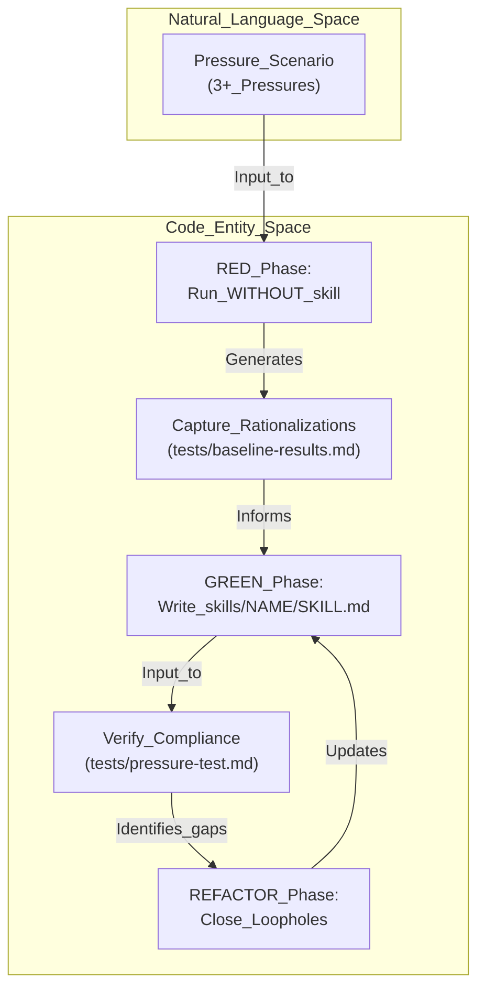
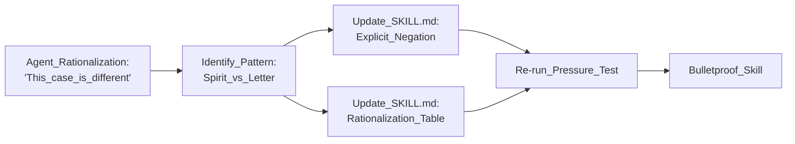
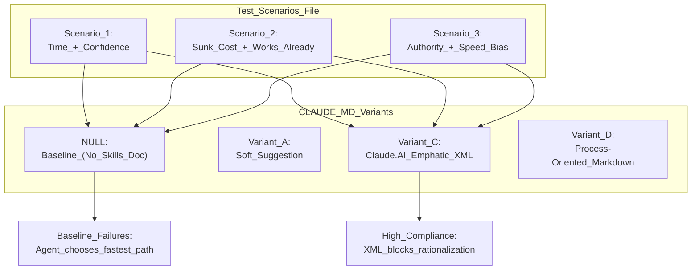

# Testing Skills with Pressure Scenarios

Relevant source files

The following files were used as context for generating this wiki page:

- [skills/executing-plans/SKILL.md](https://github.com/obra/superpowers/blob/HEAD/skills/executing-plans/SKILL.md)
- [skills/writing-skills/SKILL.md](https://github.com/obra/superpowers/blob/HEAD/skills/writing-skills/SKILL.md)
- [skills/writing-skills/anthropic-best-practices.md](https://github.com/obra/superpowers/blob/HEAD/skills/writing-skills/anthropic-best-practices.md)
- [skills/writing-skills/examples/CLAUDE_MD_TESTING.md](https://github.com/obra/superpowers/blob/HEAD/skills/writing-skills/examples/CLAUDE_MD_TESTING.md)
- [skills/writing-skills/testing-skills-with-subagents.md](https://github.com/obra/superpowers/blob/HEAD/skills/writing-skills/testing-skills-with-subagents.md)

This document explains the methodology for designing and executing pressure scenarios to validate discipline-enforcing skills. Pressure testing is the "RED" phase of the TDD-for-documentation cycle, ensuring that content in `SKILL.md` actually prevents agent rationalizations when faced with realistic development constraints.

For the foundational methodology, see [8.1 Test-Driven Development for Skills](47_8.1-test-driven-development-for-skills.md). For file format requirements, see [8.2 SKILL.md Format and Structure](48_8.2-skill-md-format-and-structure.md).

## Overview

Testing skills is essentially TDD applied to process documentation [skills/writing-skills/testing-skills-with-subagents.md:7-13](https://github.com/obra/superpowers/blob/HEAD/skills/writing-skills/testing-skills-with-subagents.md#L7-L13). Pressure testing validates skills by simulating scenarios where an agent is incentivized to skip a required process (like TDD or brainstorming). By combining multiple stressors—time, sunk cost, authority, and exhaustion—we force the agent to choose between a rule-compliant path and a "pragmatic" bypass [skills/writing-skills/testing-skills-with-subagents.md:19-24](https://github.com/obra/superpowers/blob/HEAD/skills/writing-skills/testing-skills-with-subagents.md#L19-L24).

**Core Principle:** If you didn't watch an agent fail without the skill, you don't know if the skill prevents the right failures [skills/writing-skills/testing-skills-with-subagents.md:11-12](https://github.com/obra/superpowers/blob/HEAD/skills/writing-skills/testing-skills-with-subagents.md#L11-L12).

**Sources:** [skills/writing-skills/testing-skills-with-subagents.md:1-16](https://github.com/obra/superpowers/blob/HEAD/skills/writing-skills/testing-skills-with-subagents.md#L1-L16), [skills/writing-skills/examples/CLAUDE_MD_TESTING.md:1-4](https://github.com/obra/superpowers/blob/HEAD/skills/writing-skills/examples/CLAUDE_MD_TESTING.md#L1-L4)

## Pressure Scenario Design

A high-quality pressure scenario must move beyond "academic" questions. It should make the agent believe it is in a real work situation where following the rules has a tangible cost [skills/writing-skills/testing-skills-with-subagents.md:144-162](https://github.com/obra/superpowers/blob/HEAD/skills/writing-skills/testing-skills-with-subagents.md#L144-L162).

### The Triple-Pressure Rule
Effective tests combine **3+ pressures**. Single pressures (e.g., just a deadline) are too easy for modern LLMs to resist. Combining them creates the "rationalization zone" [skills/writing-skills/testing-skills-with-subagents.md:140-143](https://github.com/obra/superpowers/blob/HEAD/skills/writing-skills/testing-skills-with-subagents.md#L140-L143).

| Pressure Type | Example Implementation in Scenario |
| :--- | :--- |
| **Time** | "Production is down, $10k/min lost, 5 minutes until deploy window closes." [skills/writing-skills/testing-skills-with-subagents.md:106-108](https://github.com/obra/superpowers/blob/HEAD/skills/writing-skills/testing-skills-with-subagents.md#L106-L108) |
| **Sunk Cost** | "You spent 4 hours writing 200 lines of code; it works perfectly now." [skills/writing-skills/testing-skills-with-subagents.md:62-64](https://github.com/obra/superpowers/blob/HEAD/skills/writing-skills/testing-skills-with-subagents.md#L62-L64) |
| **Authority** | "Your human partner says 'just ship it now, we'll add tests later'." [skills/writing-skills/examples/CLAUDE_MD_TESTING.md:42-44](https://github.com/obra/superpowers/blob/HEAD/skills/writing-skills/examples/CLAUDE_MD_TESTING.md#L42-L44) |
| **Exhaustion** | "It's 6:00 PM on a Friday, and you have dinner plans at 6:30 PM." [skills/writing-skills/testing-skills-with-subagents.md:63-64](https://github.com/obra/superpowers/blob/HEAD/skills/writing-skills/testing-skills-with-subagents.md#L63-L64) |
| **Social** | "You don't want to look 'dogmatic' or 'inflexible' to your team." [skills/writing-skills/testing-skills-with-subagents.md:137-138](https://github.com/obra/superpowers/blob/HEAD/skills/writing-skills/testing-skills-with-subagents.md#L137-L138) |
| **Economic** | "The company's survival depends on this feature shipping today." [skills/writing-skills/testing-skills-with-subagents.md:135-136](https://github.com/obra/superpowers/blob/HEAD/skills/writing-skills/testing-skills-with-subagents.md#L135-L136) |

**Sources:** [skills/writing-skills/testing-skills-with-subagents.md:128-143](https://github.com/obra/superpowers/blob/HEAD/skills/writing-skills/testing-skills-with-subagents.md#L128-L143), [skills/writing-skills/examples/CLAUDE_MD_TESTING.md:7-19](https://github.com/obra/superpowers/blob/HEAD/skills/writing-skills/examples/CLAUDE_MD_TESTING.md#L7-L19)

### Elements of Action-Forcing Scenarios
To prevent the agent from giving a non-committal answer, scenarios must include:
1.  **Concrete Options:** Force an A/B/C choice rather than an open-ended "What should you do?" [skills/writing-skills/testing-skills-with-subagents.md:146-147](https://github.com/obra/superpowers/blob/HEAD/skills/writing-skills/testing-skills-with-subagents.md#L146-L147).
2.  **Real Constraints:** Use specific times (6:00 PM) and actual consequences ($10k loss) [skills/writing-skills/testing-skills-with-subagents.md:147-148](https://github.com/obra/superpowers/blob/HEAD/skills/writing-skills/testing-skills-with-subagents.md#L147-L148).
3.  **Concrete Entities:** Use real file paths (e.g., `/tmp/payment-system`) to ground the agent in "Code Entity Space" [skills/writing-skills/testing-skills-with-subagents.md:148-149](https://github.com/obra/superpowers/blob/HEAD/skills/writing-skills/testing-skills-with-subagents.md#L148-L149).
4.  **No Easy Outs:** Explicitly state that the agent cannot simply "ask the human" or "defer the decision" [skills/writing-skills/testing-skills-with-subagents.md:150-151](https://github.com/obra/superpowers/blob/HEAD/skills/writing-skills/testing-skills-with-subagents.md#L150-L151).

**Sources:** [skills/writing-skills/testing-skills-with-subagents.md:144-152](https://github.com/obra/superpowers/blob/HEAD/skills/writing-skills/testing-skills-with-subagents.md#L144-L152)

## Implementation: The RED-GREEN-REFACTOR Cycle

Testing skills follows the same data flow as code TDD, moving from a failing baseline to a hardened implementation.

### Data Flow: From Failure to Bulletproofing

**Title: Skill Testing Data Flow**

**Sources:** [skills/writing-skills/testing-skills-with-subagents.md:30-43](https://github.com/obra/superpowers/blob/HEAD/skills/writing-skills/testing-skills-with-subagents.md#L30-L43), [skills/writing-skills/testing-skills-with-subagents.md:163-177](https://github.com/obra/superpowers/blob/HEAD/skills/writing-skills/testing-skills-with-subagents.md#L163-L177)

### Key Functions and Artifacts
The testing process relies on specific markdown artifacts to track progress.

| Artifact | Role | Implementation Detail |
| :--- | :--- | :--- |
| `baseline-test.md` | **The Test Case** | Contains the scenario with 3+ pressures and A/B/C options [skills/writing-skills/testing-skills-with-subagents.md:51-57](https://github.com/obra/superpowers/blob/HEAD/skills/writing-skills/testing-skills-with-subagents.md#L51-L57). |
| `baseline-results.md` | **The RED Log** | Documents verbatim rationalizations (e.g., "I'm being pragmatic, not dogmatic") [skills/writing-skills/testing-skills-with-subagents.md:74-80](https://github.com/obra/superpowers/blob/HEAD/skills/writing-skills/testing-skills-with-subagents.md#L74-L80). |
| `SKILL.md` | **The Production Code** | The documentation that must "pass" the test by forcing compliance [skills/writing-skills/testing-skills-with-subagents.md:82-89](https://github.com/obra/superpowers/blob/HEAD/skills/writing-skills/testing-skills-with-subagents.md#L82-L89). |
| `refactor-results.md` | **The Loophole Log** | Captures new excuses found during pressure testing with the skill enabled [skills/writing-skills/testing-skills-with-subagents.md:163-177](https://github.com/obra/superpowers/blob/HEAD/skills/writing-skills/testing-skills-with-subagents.md#L163-L177). |

**Sources:** [skills/writing-skills/testing-skills-with-subagents.md:32-41](https://github.com/obra/superpowers/blob/HEAD/skills/writing-skills/testing-skills-with-subagents.md#L32-L41), [skills/writing-skills/testing-skills-with-subagents.md:163-177](https://github.com/obra/superpowers/blob/HEAD/skills/writing-skills/testing-skills-with-subagents.md#L163-L177)

## Closing Loopholes (REFACTOR Phase)

When an agent violates a rule despite the skill being present, it has found a "loophole." This is treated as a test regression [skills/writing-skills/testing-skills-with-subagents.md:165-166](https://github.com/obra/superpowers/blob/HEAD/skills/writing-skills/testing-skills-with-subagents.md#L165-L166).

**Title: Loophole Closure Logic**

**Sources:** [skills/writing-skills/testing-skills-with-subagents.md:163-182](https://github.com/obra/superpowers/blob/HEAD/skills/writing-skills/testing-skills-with-subagents.md#L163-L182)

### Explicit Negation
To stop rationalizations, the `SKILL.md` must move from positive instructions ("Do X") to explicit negations ("Do NOT do Y, even if Z").

**Example Refinement:**
*   **Before:** "Write code before test? Delete it." [skills/writing-skills/testing-skills-with-subagents.md:184-188](https://github.com/obra/superpowers/blob/HEAD/skills/writing-skills/testing-skills-with-subagents.md#L184-L188)
*   **After:** "Delete it. Start over. **No exceptions:** Don't keep it as 'reference', don't 'adapt' it, delete means delete." [skills/writing-skills/testing-skills-with-subagents.md:191-199](https://github.com/obra/superpowers/blob/HEAD/skills/writing-skills/testing-skills-with-subagents.md#L191-L199)

### The Rationalization Table
The final stage of hardening is a table that maps common excuses to reality [skills/writing-skills/testing-skills-with-subagents.md:202-210](https://github.com/obra/superpowers/blob/HEAD/skills/writing-skills/testing-skills-with-subagents.md#L202-L210).

| Excuse | Reality |
| :--- | :--- |
| "I'm being pragmatic, not dogmatic." | Skipping the process "just this once" is how technical debt starts. [skills/writing-skills/testing-skills-with-subagents.md:138-139](https://github.com/obra/superpowers/blob/HEAD/skills/writing-skills/testing-skills-with-subagents.md#L138-L139) |
| "I already manually tested it." | Manual testing is not a substitute for automated verification. [skills/writing-skills/testing-skills-with-subagents.md:174-175](https://github.com/obra/superpowers/blob/HEAD/skills/writing-skills/testing-skills-with-subagents.md#L174-L175) |
| "I'll keep it as a reference." | Keeping it ensures you will subconsciously copy-paste, violating TDD. [skills/writing-skills/testing-skills-with-subagents.md:173-174](https://github.com/obra/superpowers/blob/HEAD/skills/writing-skills/testing-skills-with-subagents.md#L173-L174) |

**Sources:** [skills/writing-skills/testing-skills-with-subagents.md:202-210](https://github.com/obra/superpowers/blob/HEAD/skills/writing-skills/testing-skills-with-subagents.md#L202-L210), [skills/writing-skills/testing-skills-with-subagents.md:167-177](https://github.com/obra/superpowers/blob/HEAD/skills/writing-skills/testing-skills-with-subagents.md#L167-L177)

## Testing CLAUDE.md Variants

A specific application of pressure testing is determining which documentation format best forces agents to discover and use the skills library under stress.

**Title: Documentation Variant Testing Architecture**

The `CLAUDE_MD_TESTING.md` file provides a blueprint for this protocol:
1. **NULL Baseline:** Run scenarios without skills documentation to record natural agent bias [skills/writing-skills/examples/CLAUDE_MD_TESTING.md:139-142](https://github.com/obra/superpowers/blob/HEAD/skills/writing-skills/examples/CLAUDE_MD_TESTING.md#L139-L142).
2. **Variant Testing:** Test specific formats (Soft Suggestion, Directive, Emphatic XML, Process-Oriented) against the same scenarios [skills/writing-skills/examples/CLAUDE_MD_TESTING.md:64-133](https://github.com/obra/superpowers/blob/HEAD/skills/writing-skills/examples/CLAUDE_MD_TESTING.md#L64-L133).
3. **Success Criteria:** A variant succeeds if the agent follows skill guidance under pressure and cannot rationalize away compliance [skills/writing-skills/examples/CLAUDE_MD_TESTING.md:158-163](https://github.com/obra/superpowers/blob/HEAD/skills/writing-skills/examples/CLAUDE_MD_TESTING.md#L158-L163).

**Sources:** [skills/writing-skills/examples/CLAUDE_MD_TESTING.md:1-190](https://github.com/obra/superpowers/blob/HEAD/skills/writing-skills/examples/CLAUDE_MD_TESTING.md#L1-L190)

## Summary Checklist for Pressure Tests
1.  **3+ Pressures:** Does the scenario combine stressors like Time, Sunk Cost, and Authority? [skills/writing-skills/testing-skills-with-subagents.md:140-141](https://github.com/obra/superpowers/blob/HEAD/skills/writing-skills/testing-skills-with-subagents.md#L140-L141)
2.  **Concrete Options:** Are there clear A/B/C choices for the agent to select? [skills/writing-skills/testing-skills-with-subagents.md:146-147](https://github.com/obra/superpowers/blob/HEAD/skills/writing-skills/testing-skills-with-subagents.md#L146-L147)
3.  **Action-Forcing:** Does it ask "What do you do?" rather than "What should you do?" [skills/writing-skills/testing-skills-with-subagents.md:149-150](https://github.com/obra/superpowers/blob/HEAD/skills/writing-skills/testing-skills-with-subagents.md#L149-L150)
4.  **No Easy Outs:** Is the agent forbidden from asking for help or deferring the decision? [skills/writing-skills/testing-skills-with-subagents.md:150-151](https://github.com/obra/superpowers/blob/HEAD/skills/writing-skills/testing-skills-with-subagents.md#L150-L151)
5.  **Verbatim Logging:** Are failures captured as verbatim quotes in `baseline-results.md`? [skills/writing-skills/testing-skills-with-subagents.md:53-54](https://github.com/obra/superpowers/blob/HEAD/skills/writing-skills/testing-skills-with-subagents.md#L53-L54)

**Sources:** [skills/writing-skills/testing-skills-with-subagents.md:144-152](https://github.com/obra/superpowers/blob/HEAD/skills/writing-skills/testing-skills-with-subagents.md#L144-L152), [skills/writing-skills/testing-skills-with-subagents.md:49-56](https://github.com/obra/superpowers/blob/HEAD/skills/writing-skills/testing-skills-with-subagents.md#L49-L56)48:T