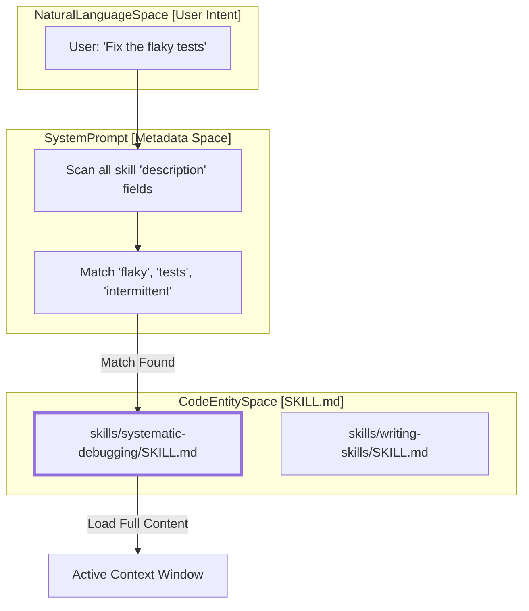
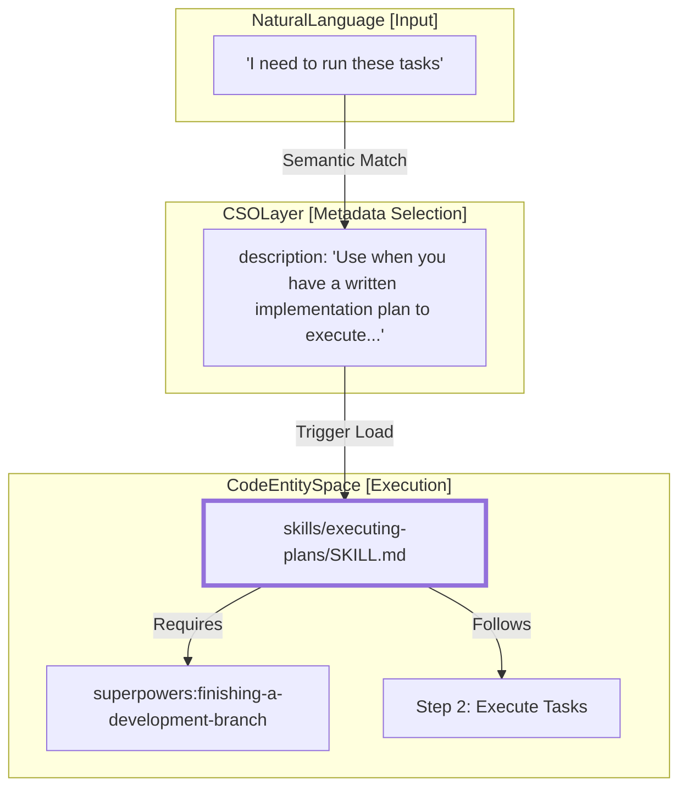

# Claude Search Optimization (CSO)

Relevant source files

The following files were used as context for generating this wiki page:

- [skills/executing-plans/SKILL.md](https://github.com/obra/superpowers/blob/HEAD/skills/executing-plans/SKILL.md)
- [skills/writing-skills/SKILL.md](https://github.com/obra/superpowers/blob/HEAD/skills/writing-skills/SKILL.md)
- [skills/writing-skills/anthropic-best-practices.md](https://github.com/obra/superpowers/blob/HEAD/skills/writing-skills/anthropic-best-practices.md)

Claude Search Optimization (CSO) is the technical discipline of structuring skill metadata and content to ensure AI agents correctly discover, load, and execute specialized workflows. CSO primarily focuses on the `description` field in the `SKILL.md` frontmatter, as this field acts as the gatekeeper for the entire skill.

## How Agents Discover Skills

Agents do not ingest every skill in the repository at the start of a session. Instead, they perform a multi-stage discovery process. At startup, only the metadata (name and description) of all skills is pre-loaded into the system prompt [skills/writing-skills/anthropic-best-practices.md:13-20](https://github.com/obra/superpowers/blob/HEAD/skills/writing-skills/anthropic-best-practices.md#L13-L20). The full content of a `SKILL.md` is only pulled into the active context window when the agent determines the skill is relevant based on its description [skills/writing-skills/anthropic-best-practices.md:20-21](https://github.com/obra/superpowers/blob/HEAD/skills/writing-skills/anthropic-best-practices.md#L20-L21).

### The Discovery Data Flow

Sources: [skills/writing-skills/SKILL.md:140-150](https://github.com/obra/superpowers/blob/HEAD/skills/writing-skills/SKILL.md#L140-L150), [skills/writing-skills/anthropic-best-practices.md:13-20](https://github.com/obra/superpowers/blob/HEAD/skills/writing-skills/anthropic-best-practices.md#L13-L20)

---

## The Description Field Requirements

The `description` field is the most critical component of CSO. It must follow strict formatting and conceptual rules to prevent "description short-circuiting."

### Technical Constraints
* **Format:** Must be valid YAML frontmatter [skills/writing-skills/SKILL.md:95-96](https://github.com/obra/superpowers/blob/HEAD/skills/writing-skills/SKILL.md#L95-L96).
* **Size:** Total frontmatter (`name` + `description`) must be under 1024 characters [skills/writing-skills/SKILL.md:97-98](https://github.com/obra/superpowers/blob/HEAD/skills/writing-skills/SKILL.md#L97-L98).
* **Prefix:** Must start with "Use when..." to focus the agent on triggering conditions [skills/writing-skills/SKILL.md:100-101](https://github.com/obra/superpowers/blob/HEAD/skills/writing-skills/SKILL.md#L100-L101).
* **Voice:** Must be written in the **third person** because it is injected into the system prompt [skills/writing-skills/anthropic-best-practices.md:189-195](https://github.com/obra/superpowers/blob/HEAD/skills/writing-skills/anthropic-best-practices.md#L189-L195).

### The "No Workflow" Rule
The description must define **triggering conditions** (symptoms, situations, contexts) and **never** summarize the workflow or steps of the skill [skills/writing-skills/SKILL.md:102-103](https://github.com/obra/superpowers/blob/HEAD/skills/writing-skills/SKILL.md#L102-L103).

**Why this matters:** Testing revealed that if a description summarizes the process (e.g., "Use when executing plans by dispatching subagents"), the agent may follow that one-sentence summary as its instruction set and skip reading the complex logic, flowcharts, and constraints inside the `SKILL.md` body [skills/writing-skills/SKILL.md:154-158](https://github.com/obra/superpowers/blob/HEAD/skills/writing-skills/SKILL.md#L154-L158).

| Aspect | Requirement | Example |
| :--- | :--- | :--- |
| **Trigger** | Specific symptoms/situations | `Use when encountering any bug or test failure` [skills/writing-skills/SKILL.md:171-172](https://github.com/obra/superpowers/blob/HEAD/skills/writing-skills/SKILL.md#L171-L172) |
| **Constraint** | No process summaries | ❌ `...and then fix it using TDD` [skills/writing-skills/SKILL.md:165-166](https://github.com/obra/superpowers/blob/HEAD/skills/writing-skills/SKILL.md#L165-L166) |
| **Perspective** | Third person | ❌ `I can help you debug...` [skills/writing-skills/anthropic-best-practices.md:193-194](https://github.com/obra/superpowers/blob/HEAD/skills/writing-skills/anthropic-best-practices.md#L193-L194) |

Sources: [skills/writing-skills/SKILL.md:150-180](https://github.com/obra/superpowers/blob/HEAD/skills/writing-skills/SKILL.md#L150-L180), [skills/writing-skills/anthropic-best-practices.md:189-200](https://github.com/obra/superpowers/blob/HEAD/skills/writing-skills/anthropic-best-practices.md#L189-L200)

---

## Keyword Coverage and Token Efficiency

Effective CSO requires balancing "findability" with "token frugality."

### Keyword Strategy
Since agents use semantic search and keyword matching to find skills, descriptions should include:
1.  **Technical Synonyms:** (e.g., "race condition", "timing dependency", "flaky") [skills/writing-skills/SKILL.md:175-177](https://github.com/obra/superpowers/blob/HEAD/skills/writing-skills/SKILL.md#L175-L177).
2.  **Actionable Triggers:** Words like "implementing", "refactoring", "debugging" [skills/writing-skills/SKILL.md:168-172](https://github.com/obra/superpowers/blob/HEAD/skills/writing-skills/SKILL.md#L168-L172).
3.  **Specific Symptoms:** Concrete issues like "test failure" or "unexpected behavior" [skills/writing-skills/SKILL.md:101-102](https://github.com/obra/superpowers/blob/HEAD/skills/writing-skills/SKILL.md#L101-L102).

### Token Efficiency Patterns
The context window is a limited resource. Every token in a loaded skill competes with conversation history [skills/writing-skills/anthropic-best-practices.md:13-20](https://github.com/obra/superpowers/blob/HEAD/skills/writing-skills/anthropic-best-practices.md#L13-L20).
* **Assume Intelligence:** Do not explain basic concepts (e.g., what a PDF is) [skills/writing-skills/anthropic-best-practices.md:22-29](https://github.com/obra/superpowers/blob/HEAD/skills/writing-skills/anthropic-best-practices.md#L22-L29).
* **Reference Help:** Use external files for heavy reference data (100+ lines) instead of inlining it [skills/writing-skills/SKILL.md:84-86](https://github.com/obra/superpowers/blob/HEAD/skills/writing-skills/SKILL.md#L84-L86).
* **Concise Examples:** Use minimal code snippets for "Before/After" comparisons [skills/writing-skills/SKILL.md:122-123](https://github.com/obra/superpowers/blob/HEAD/skills/writing-skills/SKILL.md#L122-L123).

Sources: [skills/writing-skills/anthropic-best-practices.md:9-29](https://github.com/obra/superpowers/blob/HEAD/skills/writing-skills/anthropic-best-practices.md#L9-L29), [skills/writing-skills/SKILL.md:84-130](https://github.com/obra/superpowers/blob/HEAD/skills/writing-skills/SKILL.md#L84-L130)

---

## Persuasion Principles in Skill Design

Beyond search optimization, the content of the skill must be optimized for agent compliance using persuasion principles. These patterns ensure that once a skill is loaded, the agent adheres to its constraints even under pressure.

### High vs. Low Degrees of Freedom
* **High Freedom:** Use for context-dependent tasks like code reviews [skills/writing-skills/anthropic-best-practices.md:63-80](https://github.com/obra/superpowers/blob/HEAD/skills/writing-skills/anthropic-best-practices.md#L63-L80).
* **Low Freedom:** Use for fragile operations like database migrations where specific sequences must be followed [skills/writing-skills/anthropic-best-practices.md:105-125](https://github.com/obra/superpowers/blob/HEAD/skills/writing-skills/anthropic-best-practices.md#L105-L125).

### Implementation Discipline
Skills like `executing-plans` enforce strict compliance by requiring the agent to announce usage: "I'm using the executing-plans skill to implement this plan" [skills/executing-plans/SKILL.md:12](https://github.com/obra/superpowers/blob/HEAD/skills/executing-plans/SKILL.md#L12). This verbal commitment prevents the agent from deviating from the bite-sized steps defined in the plan [skills/executing-plans/SKILL.md:28](https://github.com/obra/superpowers/blob/HEAD/skills/executing-plans/SKILL.md#L28).

Sources: [skills/writing-skills/anthropic-best-practices.md:59-131](https://github.com/obra/superpowers/blob/HEAD/skills/writing-skills/anthropic-best-practices.md#L59-L131), [skills/executing-plans/SKILL.md:10-30](https://github.com/obra/superpowers/blob/HEAD/skills/executing-plans/SKILL.md#L10-L30)

---

## Bridging Natural Language to Code Entities

The following diagram illustrates how CSO principles transform a vague user request into the execution of specific code entities within the Superpowers system.

Sources: [skills/executing-plans/SKILL.md:1-4](https://github.com/obra/superpowers/blob/HEAD/skills/executing-plans/SKILL.md#L1-L4), [skills/executing-plans/SKILL.md:35-37](https://github.com/obra/superpowers/blob/HEAD/skills/executing-plans/SKILL.md#L35-L37)

---

## CSO Implementation Checklist

When creating or auditing a skill for search optimization, verify against these criteria:

1.  **Name Format:** Letters, numbers, and hyphens only (e.g., `writing-skills`) [skills/writing-skills/SKILL.md:98](https://github.com/obra/superpowers/blob/HEAD/skills/writing-skills/SKILL.md#L98).
2.  **Gerund Naming:** Use "-ing" forms for process-oriented skills (e.g., `executing-plans`) [skills/writing-skills/anthropic-best-practices.md:157-166](https://github.com/obra/superpowers/blob/HEAD/skills/writing-skills/anthropic-best-practices.md#L157-L166).
3.  **Trigger Focus:** Description starts with "Use when..." [skills/writing-skills/SKILL.md:100](https://github.com/obra/superpowers/blob/HEAD/skills/writing-skills/SKILL.md#L100).
4.  **No "How":** Description contains zero information about the steps inside the skill [skills/writing-skills/SKILL.md:152-153](https://github.com/obra/superpowers/blob/HEAD/skills/writing-skills/SKILL.md#L152-L153).
5.  **Technology Scope:** Triggers are technology-agnostic unless the skill is specifically for a library [skills/writing-skills/SKILL.md:177-178](https://github.com/obra/superpowers/blob/HEAD/skills/writing-skills/SKILL.md#L177-L178).

Sources: [skills/writing-skills/SKILL.md:96-103](https://github.com/obra/superpowers/blob/HEAD/skills/writing-skills/SKILL.md#L96-L103), [skills/writing-skills/anthropic-best-practices.md:155-170](https://github.com/obra/superpowers/blob/HEAD/skills/writing-skills/anthropic-best-practices.md#L155-L170)49:T