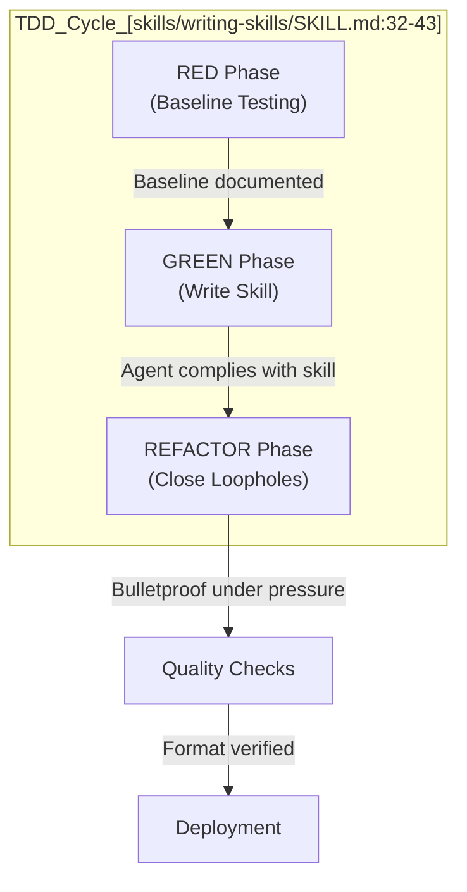
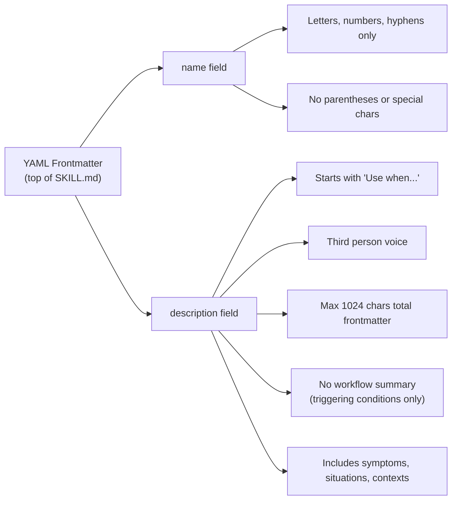
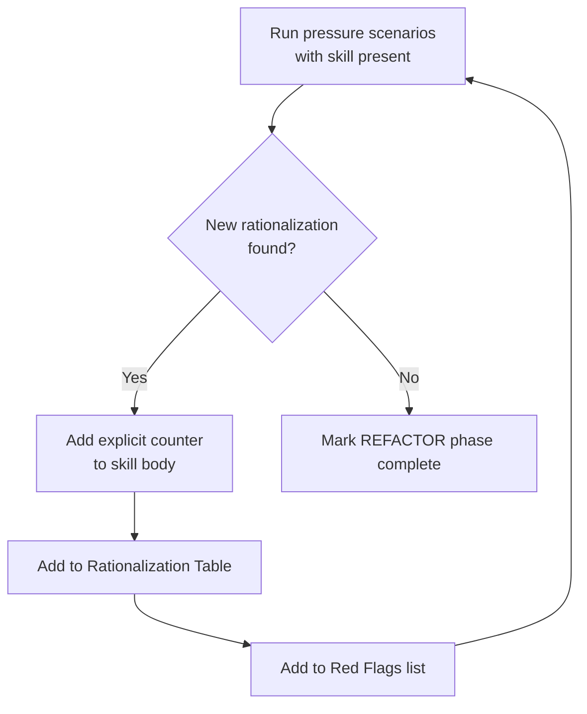
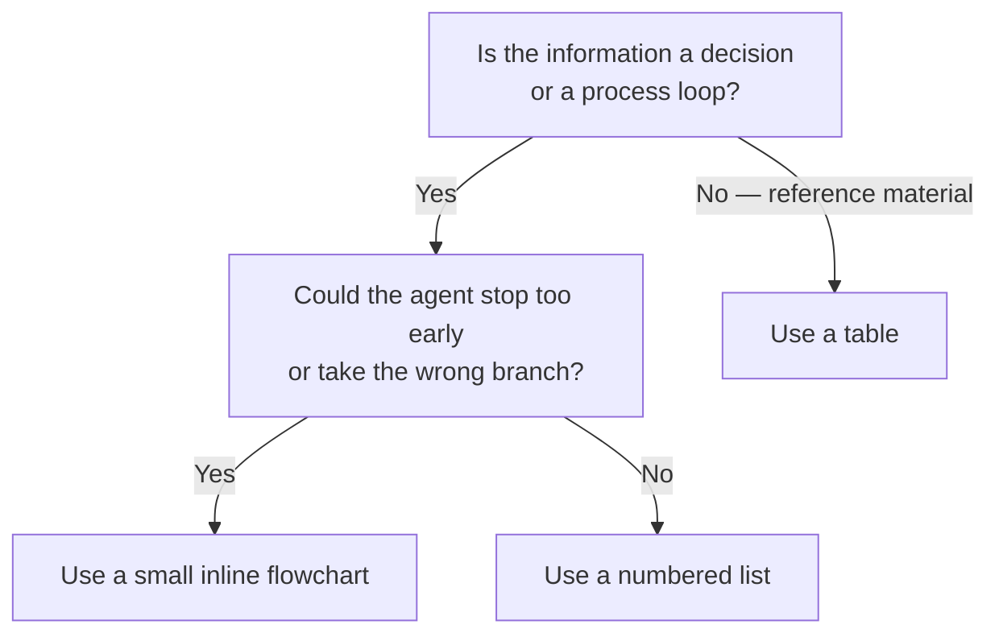
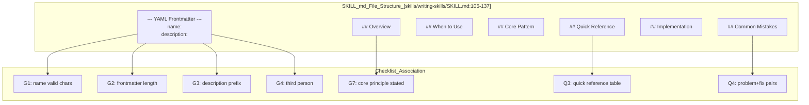

# Skill Creation Checklist

Relevant source files

The following files were used as context for generating this wiki page:

- [skills/executing-plans/SKILL.md](https://github.com/obra/superpowers/blob/HEAD/skills/executing-plans/SKILL.md)
- [skills/writing-skills/SKILL.md](https://github.com/obra/superpowers/blob/HEAD/skills/writing-skills/SKILL.md)
- [skills/writing-skills/anthropic-best-practices.md](https://github.com/obra/superpowers/blob/HEAD/skills/writing-skills/anthropic-best-practices.md)
- [skills/writing-skills/examples/CLAUDE_MD_TESTING.md](https://github.com/obra/superpowers/blob/HEAD/skills/writing-skills/examples/CLAUDE_MD_TESTING.md)
- [skills/writing-skills/testing-skills-with-subagents.md](https://github.com/obra/superpowers/blob/HEAD/skills/writing-skills/testing-skills-with-subagents.md)

This page is the mandatory deployment checklist for every new skill. It consolidates the verification gates from the RED-GREEN-REFACTOR cycle into a sequential list of pass/fail checks that must be completed before a skill is committed. For the underlying rationale behind each check, see the related pages:

- TDD methodology for skills: [8.1](https://github.com/obra/superpowers/blob/HEAD/8.1)
- `SKILL.md` file structure: [8.2](https://github.com/obra/superpowers/blob/HEAD/8.2)
- Pressure scenario construction: [8.3](https://github.com/obra/superpowers/blob/HEAD/8.3)
- Claude Search Optimization (CSO): [8.4](https://github.com/obra/superpowers/blob/HEAD/8.4)

---

## Overview

The checklist is divided into four sequential phases. **No phase may be skipped.** The Iron Law from [skills/writing-skills/SKILL.md:16-17](https://github.com/obra/superpowers/blob/HEAD/skills/writing-skills/SKILL.md#L16-L17) applies unconditionally: "If you didn't watch an agent fail without the skill, you don't know if the skill teaches the right thing."

All checklist items must be tracked so that progress is visible and cannot be silently abandoned.

**Skill Creation Checklist — Phase Summary**

Sources: [skills/writing-skills/SKILL.md:32-43](https://github.com/obra/superpowers/blob/HEAD/skills/writing-skills/SKILL.md#L32-L43), [skills/writing-skills/SKILL.md:16-17](https://github.com/obra/superpowers/blob/HEAD/skills/writing-skills/SKILL.md#L16-L17)

---

## RED Phase — Write the Failing Test

These checks confirm that baseline behavior was observed **before** the skill was written. A skill written without a failing baseline is an untested skill [skills/writing-skills/SKILL.md:16-17](https://github.com/obra/superpowers/blob/HEAD/skills/writing-skills/SKILL.md#L16-L17).

| # | Check | Pass Criteria |
|---|-------|---------------|
| R1 | Pressure scenarios created | ≥ 3 combined pressures for discipline skills [skills/writing-skills/testing-skills-with-subagents.md:140](https://github.com/obra/superpowers/blob/HEAD/skills/writing-skills/testing-skills-with-subagents.md#L140) |
| R2 | Scenarios run **without** skill present | Agent behavior documented verbatim [skills/writing-skills/testing-skills-with-subagents.md:53](https://github.com/obra/superpowers/blob/HEAD/skills/writing-skills/testing-skills-with-subagents.md#L53) |
| R3 | Rationalization patterns identified | Specific excuses recorded for later countering [skills/writing-skills/testing-skills-with-subagents.md:54](https://github.com/obra/superpowers/blob/HEAD/skills/writing-skills/testing-skills-with-subagents.md#L54) |

The scenarios must use combined pressure types (time pressure, sunk cost, authority, economic, exhaustion, social, pragmatic) [skills/writing-skills/testing-skills-with-subagents.md:130-140](https://github.com/obra/superpowers/blob/HEAD/skills/writing-skills/testing-skills-with-subagents.md#L130-L140). Single-pressure scenarios are often insufficient for discipline-enforcing skills [skills/writing-skills/testing-skills-with-subagents.md:140](https://github.com/obra/superpowers/blob/HEAD/skills/writing-skills/testing-skills-with-subagents.md#L140).

**Baseline documentation must capture:**
- Exact choices the agent made [skills/writing-skills/SKILL.md:40](https://github.com/obra/superpowers/blob/HEAD/skills/writing-skills/SKILL.md#L40)
- Verbatim rationalizations used [skills/writing-skills/testing-skills-with-subagents.md:53](https://github.com/obra/superpowers/blob/HEAD/skills/writing-skills/testing-skills-with-subagents.md#L53)
- Which pressure type triggered each violation [skills/writing-skills/testing-skills-with-subagents.md:55](https://github.com/obra/superpowers/blob/HEAD/skills/writing-skills/testing-skills-with-subagents.md#L55)

Sources: [skills/writing-skills/SKILL.md:32-43](https://github.com/obra/superpowers/blob/HEAD/skills/writing-skills/SKILL.md#L32-L43), [skills/writing-skills/testing-skills-with-subagents.md:43-81](https://github.com/obra/superpowers/blob/HEAD/skills/writing-skills/testing-skills-with-subagents.md#L43-L81), [skills/writing-skills/testing-skills-with-subagents.md:130-140](https://github.com/obra/superpowers/blob/HEAD/skills/writing-skills/testing-skills-with-subagents.md#L130-L140)

---

## GREEN Phase — Write the Minimal Skill

These checks verify the `SKILL.md` file is structurally and semantically correct.

### Frontmatter Validation

**Frontmatter Field Constraints**

Sources: [skills/writing-skills/SKILL.md:95-103](https://github.com/obra/superpowers/blob/HEAD/skills/writing-skills/SKILL.md#L95-L103), [skills/writing-skills/SKILL.md:150-172](https://github.com/obra/superpowers/blob/HEAD/skills/writing-skills/SKILL.md#L150-L172), [skills/writing-skills/anthropic-best-practices.md:147-152](https://github.com/obra/superpowers/blob/HEAD/skills/writing-skills/anthropic-best-practices.md#L147-L152)

### GREEN Phase Checklist

| # | Check | Pass Criteria |
|---|-------|---------------|
| G1 | `name` field valid | Letters, numbers, hyphens only — no parentheses or special characters [skills/writing-skills/SKILL.md:98](https://github.com/obra/superpowers/blob/HEAD/skills/writing-skills/SKILL.md#L98) |
| G2 | YAML frontmatter valid | Only `name` and `description` fields; total ≤ 1024 characters [skills/writing-skills/SKILL.md:96-97](https://github.com/obra/superpowers/blob/HEAD/skills/writing-skills/SKILL.md#L96-L97) |
| G3 | Description starts with `Use when...` | Literal string at start of description value [skills/writing-skills/SKILL.md:100](https://github.com/obra/superpowers/blob/HEAD/skills/writing-skills/SKILL.md#L100) |
| G4 | Description is third person | No "I", "we", "you" as subject [skills/writing-skills/SKILL.md:179](https://github.com/obra/superpowers/blob/HEAD/skills/writing-skills/SKILL.md#L179) |
| G5 | Description contains triggering conditions only | No workflow summary or process description [skills/writing-skills/SKILL.md:152-158](https://github.com/obra/superpowers/blob/HEAD/skills/writing-skills/SKILL.md#L152-L158) |
| G6 | Keyword coverage present | Symptoms, situations, and contexts included in description [skills/writing-skills/SKILL.md:101](https://github.com/obra/superpowers/blob/HEAD/skills/writing-skills/SKILL.md#L101) |
| G7 | Overview states core principle | 1–2 sentences; answers "what is this?" [skills/writing-skills/SKILL.md:113-114](https://github.com/obra/superpowers/blob/HEAD/skills/writing-skills/SKILL.md#L113-L114) |
| G8 | Addresses baseline failures | Skill body responds to rationalizations found in RED phase [skills/writing-skills/SKILL.md:41](https://github.com/obra/superpowers/blob/HEAD/skills/writing-skills/SKILL.md#L41) |
| G9 | Code inline or linked to file | No orphaned references to non-existent files [skills/writing-skills/SKILL.md:129-130](https://github.com/obra/superpowers/blob/HEAD/skills/writing-skills/SKILL.md#L129-L130) |
| G10 | Scenarios run **with** skill present | Agent complies with all scenarios that previously failed [skills/writing-skills/SKILL.md:37](https://github.com/obra/superpowers/blob/HEAD/skills/writing-skills/SKILL.md#L37) |

The most common failure at G5 is summarizing the skill's workflow in the description. This causes Claude to take shortcuts and skip the full skill content [skills/writing-skills/SKILL.md:154-158](https://github.com/obra/superpowers/blob/HEAD/skills/writing-skills/SKILL.md#L154-L158).

Sources: [skills/writing-skills/SKILL.md:95-137](https://github.com/obra/superpowers/blob/HEAD/skills/writing-skills/SKILL.md#L95-L137), [skills/writing-skills/SKILL.md:150-182](https://github.com/obra/superpowers/blob/HEAD/skills/writing-skills/SKILL.md#L150-L182), [skills/writing-skills/testing-skills-with-subagents.md:82-89](https://github.com/obra/superpowers/blob/HEAD/skills/writing-skills/testing-skills-with-subagents.md#L82-L89)

---

## REFACTOR Phase — Close Loopholes

After the skill passes its initial GREEN verification, re-run scenarios to find new rationalizations the agent produces when the original excuses are blocked [skills/writing-skills/testing-skills-with-subagents.md:163-165](https://github.com/obra/superpowers/blob/HEAD/skills/writing-skills/testing-skills-with-subagents.md#L163-L165).

**Loophole Discovery and Closure Cycle**

Sources: [skills/writing-skills/SKILL.md:38](https://github.com/obra/superpowers/blob/HEAD/skills/writing-skills/SKILL.md#L38), [skills/writing-skills/SKILL.md:43](https://github.com/obra/superpowers/blob/HEAD/skills/writing-skills/SKILL.md#L43), [skills/writing-skills/testing-skills-with-subagents.md:163-203](https://github.com/obra/superpowers/blob/HEAD/skills/writing-skills/testing-skills-with-subagents.md#L163-L203)

### REFACTOR Phase Checklist

| # | Check | Pass Criteria |
|---|-------|---------------|
| RF1 | New rationalizations identified | Document excuses verbatim (e.g., "following spirit not letter") [skills/writing-skills/testing-skills-with-subagents.md:167-174](https://github.com/obra/superpowers/blob/HEAD/skills/writing-skills/testing-skills-with-subagents.md#L167-L174) |
| RF2 | Explicit counters added | Use explicit negation in rules (e.g., "No exceptions") [skills/writing-skills/testing-skills-with-subagents.md:182-200](https://github.com/obra/superpowers/blob/HEAD/skills/writing-skills/testing-skills-with-subagents.md#L182-L200) |
| RF3 | Rationalization Table built | Table covers excuse vs. reality for common violations [skills/writing-skills/testing-skills-with-subagents.md:202-207](https://github.com/obra/superpowers/blob/HEAD/skills/writing-skills/testing-skills-with-subagents.md#L202-L207) |
| RF4 | Re-tested until bulletproof | Skill holds under maximum combined pressure with no violations [skills/writing-skills/testing-skills-with-subagents.md:39](https://github.com/obra/superpowers/blob/HEAD/skills/writing-skills/testing-skills-with-subagents.md#L39) |

For discipline-enforcing skills, the Rationalization Table is **required** to prevent agents from "adapting" the concept while violating the rules [skills/writing-skills/testing-skills-with-subagents.md:169-171](https://github.com/obra/superpowers/blob/HEAD/skills/writing-skills/testing-skills-with-subagents.md#L169-L171).

Sources: [skills/writing-skills/testing-skills-with-subagents.md:163-207](https://github.com/obra/superpowers/blob/HEAD/skills/writing-skills/testing-skills-with-subagents.md#L163-L207)

---

## Quality Checks

These checks are format and content quality gates based on best practices.

| # | Check | Pass Criteria |
|---|-------|---------------|
| Q1 | Concise content | No over-explaining standard concepts (e.g., what a PDF is) [skills/writing-skills/anthropic-best-practices.md:11-29](https://github.com/obra/superpowers/blob/HEAD/skills/writing-skills/anthropic-best-practices.md#L11-L29) |
| Q2 | Flowchart used appropriately | Present only for non-obvious decision points; absent otherwise [skills/writing-skills/SKILL.md:116-117](https://github.com/obra/superpowers/blob/HEAD/skills/writing-skills/SKILL.md#L116-L117) |
| Q3 | Quick Reference table present | Scannable summary of common operations [skills/writing-skills/SKILL.md:125-126](https://github.com/obra/superpowers/blob/HEAD/skills/writing-skills/SKILL.md#L125-L126) |
| Q4 | Common Mistakes section present | What goes wrong + fixes [skills/writing-skills/SKILL.md:132-133](https://github.com/obra/superpowers/blob/HEAD/skills/writing-skills/SKILL.md#L132-L133) |
| Q5 | No narrative storytelling | Skills are reusable patterns, not stories of one-off solutions [skills/writing-skills/SKILL.md:28](https://github.com/obra/superpowers/blob/HEAD/skills/writing-skills/SKILL.md#L28) |
| Q6 | Supporting files justified | Extra files only for tools or heavy reference (100+ lines) [skills/writing-skills/SKILL.md:84-87](https://github.com/obra/superpowers/blob/HEAD/skills/writing-skills/SKILL.md#L84-L87) |

**When to include a flowchart vs. another format:**

Sources: [skills/writing-skills/SKILL.md:116-117](https://github.com/obra/superpowers/blob/HEAD/skills/writing-skills/SKILL.md#L116-L117), [skills/writing-skills/anthropic-best-practices.md:11-29](https://github.com/obra/superpowers/blob/HEAD/skills/writing-skills/anthropic-best-practices.md#L11-L29), [skills/writing-skills/SKILL.md:84-87](https://github.com/obra/superpowers/blob/HEAD/skills/writing-skills/SKILL.md#L84-L87)

---

## Deployment

| # | Check | Pass Criteria |
|---|-------|---------------|
| D1 | Committed to git | Skill is in version control in the `skills/` directory [skills/writing-skills/SKILL.md:76-80](https://github.com/obra/superpowers/blob/HEAD/skills/writing-skills/SKILL.md#L76-L80) |
| D2 | Documentation complete | Checklist completed and verified before final merge |

Do not commit until all prior phases are complete. Do not batch-create skills and commit them together — each skill must complete the full checklist before work on the next skill begins [skills/writing-skills/SKILL.md:45](https://github.com/obra/superpowers/blob/HEAD/skills/writing-skills/SKILL.md#L45).

Sources: [skills/writing-skills/SKILL.md:76-80](https://github.com/obra/superpowers/blob/HEAD/skills/writing-skills/SKILL.md#L76-L80), [skills/writing-skills/SKILL.md:45](https://github.com/obra/superpowers/blob/HEAD/skills/writing-skills/SKILL.md#L45)

---

## `SKILL.md` Structure Map

The following diagram associates each checklist check with the section of the `SKILL.md` file it validates.

Sources: [skills/writing-skills/SKILL.md:95-137](https://github.com/obra/superpowers/blob/HEAD/skills/writing-skills/SKILL.md#L95-L137), [skills/writing-skills/SKILL.md:150-182](https://github.com/obra/superpowers/blob/HEAD/skills/writing-skills/SKILL.md#L150-L182)4a:T2908,# Contribut