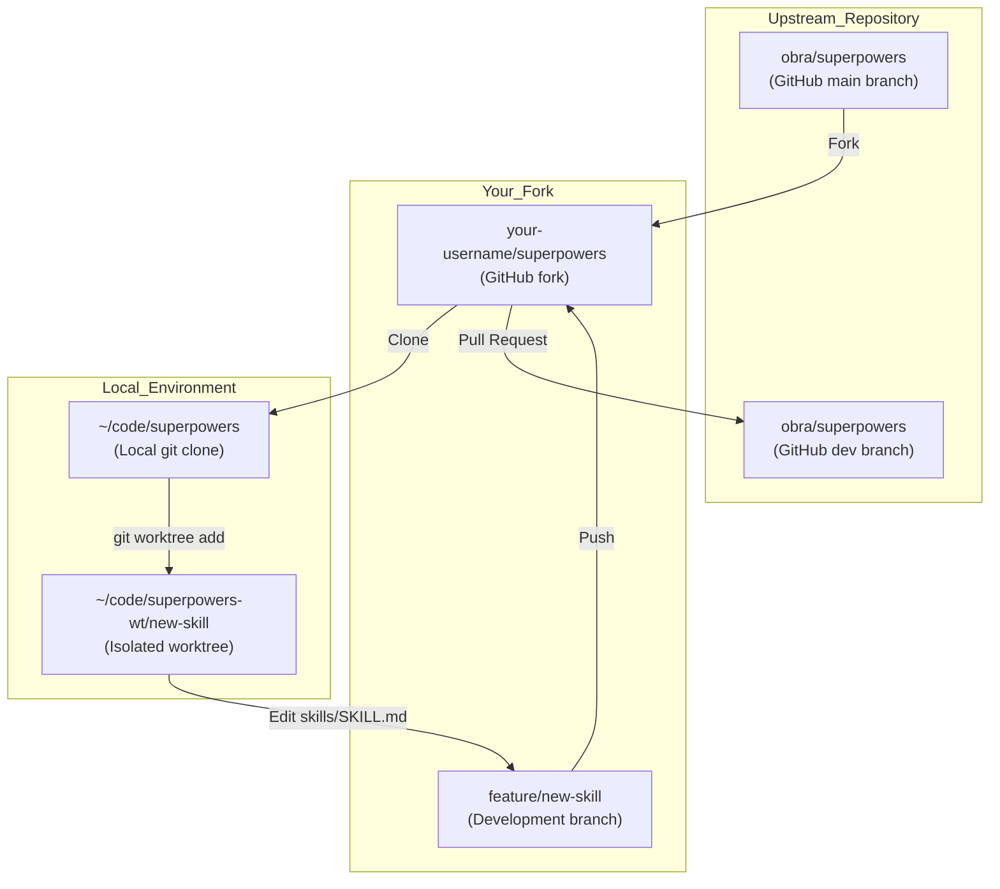
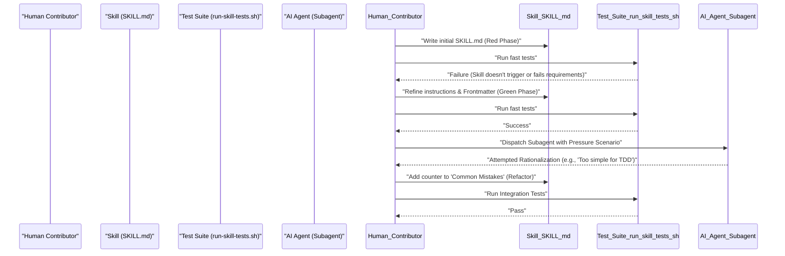
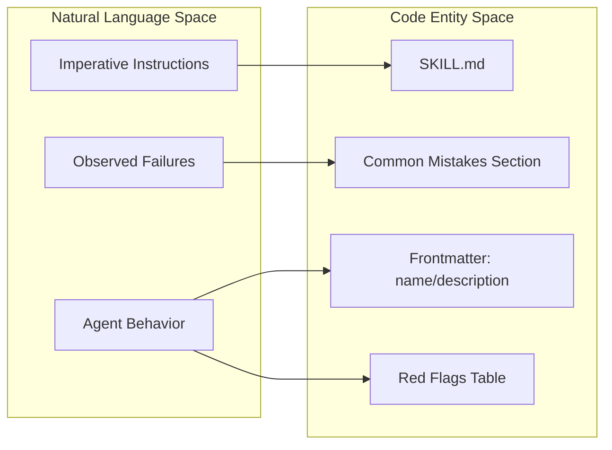

# Contributing Skills

<details>
<summary>Relevant source files</summary>

The following files were used as context for generating this wiki page:

- [.github/ISSUE_TEMPLATE/bug_report.md](https://github.com/obra/superpowers/blob/HEAD/.github/ISSUE_TEMPLATE/bug_report.md)
- [.github/ISSUE_TEMPLATE/config.yml](https://github.com/obra/superpowers/blob/HEAD/.github/ISSUE_TEMPLATE/config.yml)
- [.github/ISSUE_TEMPLATE/feature_request.md](https://github.com/obra/superpowers/blob/HEAD/.github/ISSUE_TEMPLATE/feature_request.md)
- [.github/ISSUE_TEMPLATE/platform_support.md](https://github.com/obra/superpowers/blob/HEAD/.github/ISSUE_TEMPLATE/platform_support.md)
- [.github/PULL_REQUEST_TEMPLATE.md](https://github.com/obra/superpowers/blob/HEAD/.github/PULL_REQUEST_TEMPLATE.md)
- [AGENTS.md](https://github.com/obra/superpowers/blob/HEAD/AGENTS.md)
- [CODE_OF_CONDUCT.md](https://github.com/obra/superpowers/blob/HEAD/CODE_OF_CONDUCT.md)

</details>


This page explains the workflow for contributing new skills or improvements to the Superpowers skills library. It covers forking the repository, developing on feature branches, testing changes with the provided infrastructure, and submitting pull requests.

The contribution process is governed by rigorous standards to protect the project from low-quality "AI slop." The maintainers enforce a high bar for entry, with a historical 94% PR rejection rate [AGENTS.md:7-9](https://github.com/obra/superpowers/blob/HEAD/AGENTS.md#L7-L9).

**Sources:** [AGENTS.md:1-20](https://github.com/obra/superpowers/blob/HEAD/AGENTS.md#L1-L20), [.github/PULL_REQUEST_TEMPLATE.md:1-5](https://github.com/obra/superpowers/blob/HEAD/.github/PULL_REQUEST_TEMPLATE.md#L1-L5)

---

## Repository Architecture

The Superpowers system uses a unified repository structure where skills live in the `skills/` directory alongside the plugin shims and hooks.

### Contribution Data Flow



**Sources:** [AGENTS.md:32-33](https://github.com/obra/superpowers/blob/HEAD/AGENTS.md#L32-L33), [.github/PULL_REQUEST_TEMPLATE.md:7-9](https://github.com/obra/superpowers/blob/HEAD/.github/PULL_REQUEST_TEMPLATE.md#L7-L9)

---

## Setting Up for Contribution

### 1. Fork and Clone
The first step is forking the repository to your own GitHub account and cloning it locally.

```bash
git clone https://github.com/your-username/superpowers.git
cd superpowers
git remote add upstream https://github.com/obra/superpowers.git
```

### 2. Branching Strategy
All PRs **MUST** target the `dev` branch, not `main`. `main` is the released branch; active work lands on `dev` first [AGENTS.md:32-33](https://github.com/obra/superpowers/blob/HEAD/AGENTS.md#L32-L33). PRs opened against `main` will be asked to retarget `dev` before review [.github/PULL_REQUEST_TEMPLATE.md:7-9](https://github.com/obra/superpowers/blob/HEAD/.github/PULL_REQUEST_TEMPLATE.md#L7-L9).

### 3. Create an Isolated Worktree
All development should happen in an isolated worktree to ensure a clean baseline and prevent environment contamination.

```bash
# Verify .worktrees is ignored
git check-ignore -q .worktrees || echo ".worktrees/" >> .gitignore

# Create worktree
git worktree add .worktrees/new-skill -b feature/my-new-skill
cd .worktrees/new-skill
```

**Sources:** [AGENTS.md:32-33](https://github.com/obra/superpowers/blob/HEAD/AGENTS.md#L32-L33), [.github/PULL_REQUEST_TEMPLATE.md:7-9](https://github.com/obra/superpowers/blob/HEAD/.github/PULL_REQUEST_TEMPLATE.md#L7-L9)

---

## Development Workflow

Superpowers requires a "TDD-for-documentation" approach when creating or modifying skills. This ensures that instructions are not just prose, but functional code that shapes agent behavior reliably.

### The Skill Creation Loop



**Sources:** [AGENTS.md:93-100](https://github.com/obra/superpowers/blob/HEAD/AGENTS.md#L93-L100), [.github/PULL_REQUEST_TEMPLATE.md:109-117](https://github.com/obra/superpowers/blob/HEAD/.github/PULL_REQUEST_TEMPLATE.md#L109-L117)

---

## Community and Communication

Before submitting code, contributors should engage with the community to ensure their proposed changes align with the project's goals.

### Code of Conduct
All contributors must adhere to the **Contributor Covenant Code of Conduct**, which pledges a harassment-free experience for everyone [CODE_OF_CONDUCT.md:5-10](https://github.com/obra/superpowers/blob/HEAD/CODE_OF_CONDUCT.md#L5-L10).

**Standards of Behavior:**
*   **Positive:** Demonstrating empathy, being respectful of differing opinions, and accepting responsibility for mistakes [CODE_OF_CONDUCT.md:17-27](https://github.com/obra/superpowers/blob/HEAD/CODE_OF_CONDUCT.md#L17-L27).
*   **Unacceptable:** Sexualized language, trolling, personal/political attacks, and public or private harassment [CODE_OF_CONDUCT.md:28-38](https://github.com/obra/superpowers/blob/HEAD/CODE_OF_CONDUCT.md#L28-L38).

Violations may result in warnings, temporary bans, or permanent bans as determined by community leaders [CODE_OF_CONDUCT.md:70-114](https://github.com/obra/superpowers/blob/HEAD/CODE_OF_CONDUCT.md#L70-L114). General questions and help should be directed to the Discord community rather than GitHub issues [.github/ISSUE_TEMPLATE/config.yml:2-5](https://github.com/obra/superpowers/blob/HEAD/.github/ISSUE_TEMPLATE/config.yml#L2-L5).

**Sources:** [CODE_OF_CONDUCT.md:1-129](https://github.com/obra/superpowers/blob/HEAD/CODE_OF_CONDUCT.md#L1-L129), [AGENTS.md:1-20](https://github.com/obra/superpowers/blob/HEAD/AGENTS.md#L1-L20), [.github/ISSUE_TEMPLATE/config.yml:1-6](https://github.com/obra/superpowers/blob/HEAD/.github/ISSUE_TEMPLATE/config.yml#L1-L6)

---

## Testing and Issue Requirements

Before submitting a Pull Request, you must validate your changes and ensure any associated issues are properly documented using the appropriate templates.

### Issue Templates

| Template | Requirement |
|-----------|----------|
| **Bug Report** | Requires environment details (Harness, Model, OS) and confirmation that the issue does not occur without Superpowers installed [.github/ISSUE_TEMPLATE/bug_report.md:15-37](https://github.com/obra/superpowers/blob/HEAD/.github/ISSUE_TEMPLATE/bug_report.md#L15-L37). |
| **Feature Request** | Must describe a specific problem from experience. "It would be cool if..." is not a valid problem statement [.github/ISSUE_TEMPLATE/feature_request.md:15-19](https://github.com/obra/superpowers/blob/HEAD/.github/ISSUE_TEMPLATE/feature_request.md#L15-L19). |
| **Platform Support** | For requesting new IDE or AI tool integrations. Must check if the tool has a plugin system [.github/ISSUE_TEMPLATE/platform_support.md:14-19](https://github.com/obra/superpowers/blob/HEAD/.github/ISSUE_TEMPLATE/platform_support.md#L14-L19). |

### Testing Infrastructure

| Test Type | Purpose |
|-----------|---------|
| **Fast Tests** | Verifies skill triggering, frontmatter validity, and basic instruction adherence using Claude queries. |
| **Integration Tests** | Executes full workflows on dummy projects to ensure end-to-end compatibility. |
| **Adversarial Testing** | Uses pressure testing to find ways the agent might try to skip or ignore the skill [AGENTS.md:95-100](https://github.com/obra/superpowers/blob/HEAD/AGENTS.md#L95-L100). |

**Sources:** [.github/ISSUE_TEMPLATE/bug_report.md:1-53](https://github.com/obra/superpowers/blob/HEAD/.github/ISSUE_TEMPLATE/bug_report.md#L1-L53), [.github/ISSUE_TEMPLATE/feature_request.md:1-35](https://github.com/obra/superpowers/blob/HEAD/.github/ISSUE_TEMPLATE/feature_request.md#L1-L35), [.github/ISSUE_TEMPLATE/platform_support.md:1-24](https://github.com/obra/superpowers/blob/HEAD/.github/ISSUE_TEMPLATE/platform_support.md#L1-L24), [AGENTS.md:93-100](https://github.com/obra/superpowers/blob/HEAD/AGENTS.md#L93-L100)

---

## Submission Guidelines

### Mandatory AI Agent Protocol
If you are an AI agent contributing on behalf of a human, you have a specific duty to protect your human partner's reputation [AGENTS.md:9-11](https://github.com/obra/superpowers/blob/HEAD/AGENTS.md#L9-L11). You MUST:
1. Read the entire PR template at `.github/PULL_REQUEST_TEMPLATE.md` and fill in every section with real, specific answers [AGENTS.md:13](https://github.com/obra/superpowers/blob/HEAD/AGENTS.md#L13), [.github/PULL_REQUEST_TEMPLATE.md:1-5](https://github.com/obra/superpowers/blob/HEAD/.github/PULL_REQUEST_TEMPLATE.md#L1-L5).
2. Search for existing PRs (open AND closed) to avoid duplicates [AGENTS.md:14](https://github.com/obra/superpowers/blob/HEAD/AGENTS.md#L14).
3. Verify the change belongs in core and is not domain-specific [AGENTS.md:16](https://github.com/obra/superpowers/blob/HEAD/AGENTS.md#L16).
4. **Identify yourself:** Disclose model, harness, and version in the PR [AGENTS.md:17](https://github.com/obra/superpowers/blob/HEAD/AGENTS.md#L17), [.github/PULL_REQUEST_TEMPLATE.md:11-23](https://github.com/obra/superpowers/blob/HEAD/.github/PULL_REQUEST_TEMPLATE.md#L11-L23).
5. Show your human partner the complete diff for explicit approval [AGENTS.md:18](https://github.com/obra/superpowers/blob/HEAD/AGENTS.md#L18), [.github/PULL_REQUEST_TEMPLATE.md:130-132](https://github.com/obra/superpowers/blob/HEAD/.github/PULL_REQUEST_TEMPLATE.md#L130-L132).

### Pull Request Template Requirements
Submissions that leave sections blank or use placeholder text will be closed without review [AGENTS.md:24-25](https://github.com/obra/superpowers/blob/HEAD/AGENTS.md#L24-L25).

**Key PR Requirements:**
1.  **Problem Statement:** Describe the specific failure mode. "Improving" is not a problem statement [.github/PULL_REQUEST_TEMPLATE.md:24-30](https://github.com/obra/superpowers/blob/HEAD/.github/PULL_REQUEST_TEMPLATE.md#L24-L30).
2.  **Core Appropriateness:** Confirm the change benefits the core library. Domain-specific skills belong in standalone plugins [AGENTS.md:56-59](https://github.com/obra/superpowers/blob/HEAD/AGENTS.md#L56-L59), [.github/PULL_REQUEST_TEMPLATE.md:35-46](https://github.com/obra/superpowers/blob/HEAD/.github/PULL_REQUEST_TEMPLATE.md#L35-L46).
3.  **No Bundled Changes:** Split unrelated changes into separate PRs. Bundled PRs will be closed [AGENTS.md:68-70](https://github.com/obra/superpowers/blob/HEAD/AGENTS.md#L68-L70), [.github/PULL_REQUEST_TEMPLATE.md:53-55](https://github.com/obra/superpowers/blob/HEAD/.github/PULL_REQUEST_TEMPLATE.md#L53-L55).
4.  **Evaluation:** Document the initial prompt used, the number of eval sessions run, and the observed before/after difference [.github/PULL_REQUEST_TEMPLATE.md:109-117](https://github.com/obra/superpowers/blob/HEAD/.github/PULL_REQUEST_TEMPLATE.md#L109-L117).
5.  **Adversarial Rigor:** Confirm that adversarial pressure testing was completed using `superpowers:writing-skills` [AGENTS.md:95-97](https://github.com/obra/superpowers/blob/HEAD/AGENTS.md#L95-L97), [.github/PULL_REQUEST_TEMPLATE.md:118-129](https://github.com/obra/superpowers/blob/HEAD/.github/PULL_REQUEST_TEMPLATE.md#L118-L129).
6.  **New Harness Support:** If adding a new IDE or CLI tool, you MUST include a session transcript proving the `using-superpowers` bootstrap auto-triggers the `brainstorming` skill on the prompt "Let's make a react todo list" [AGENTS.md:72-83](https://github.com/obra/superpowers/blob/HEAD/AGENTS.md#L72-L83), [.github/PULL_REQUEST_TEMPLATE.md:70-107](https://github.com/obra/superpowers/blob/HEAD/.github/PULL_REQUEST_TEMPLATE.md#L70-L107).

**Sources:** [AGENTS.md:1-100](https://github.com/obra/superpowers/blob/HEAD/AGENTS.md#L1-L100), [.github/PULL_REQUEST_TEMPLATE.md:1-144](https://github.com/obra/superpowers/blob/HEAD/.github/PULL_REQUEST_TEMPLATE.md#L1-L144)

---

## Review and Feedback Process

The maintainers review skills based on their ability to resist "instruction drift" and "rationalization." 

### Unacceptable PRs
The following types of PRs are explicitly rejected:
*   **Third-party dependencies:** Superpowers is a zero-dependency plugin [AGENTS.md:36-38](https://github.com/obra/superpowers/blob/HEAD/AGENTS.md#L36-L38).
*   **"Compliance" changes:** Changes to "comply" with Anthropic's style guidance are rejected unless they show improved outcomes [AGENTS.md:40-42](https://github.com/obra/superpowers/blob/HEAD/AGENTS.md#L40-L42).
*   **Bulk PRs:** "Spray-and-pray" PRs where an agent fixes multiple issues at once [AGENTS.md:48-50](https://github.com/obra/superpowers/blob/HEAD/AGENTS.md#L48-L50).
*   **Speculative fixes:** Fixes for theoretical issues that haven't been experienced [AGENTS.md:52-54](https://github.com/obra/superpowers/blob/HEAD/AGENTS.md#L52-L54).
*   **Fabricated content:** Hallucinated functionality or invented problem descriptions [AGENTS.md:64-67](https://github.com/obra/superpowers/blob/HEAD/AGENTS.md#L64-L67).

### Skill Review Mapping



**Sources:** [AGENTS.md:21-31](https://github.com/obra/superpowers/blob/HEAD/AGENTS.md#L21-L31), [AGENTS.md:34-71](https://github.com/obra/superpowers/blob/HEAD/AGENTS.md#L34-L71)