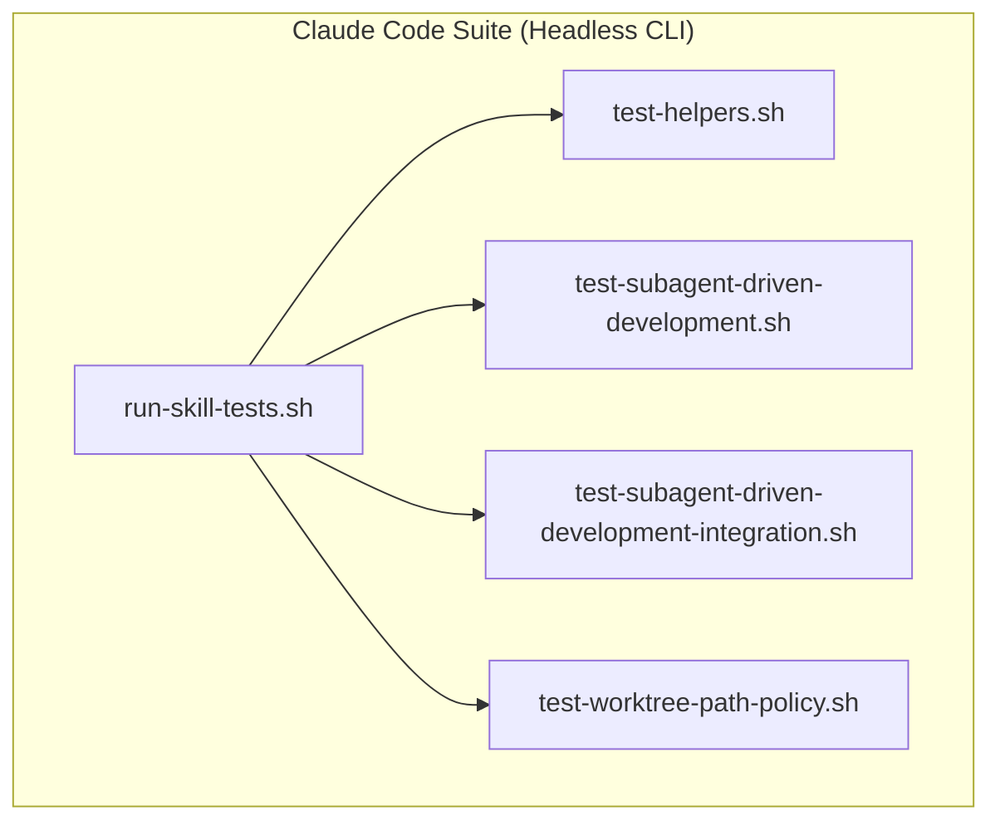
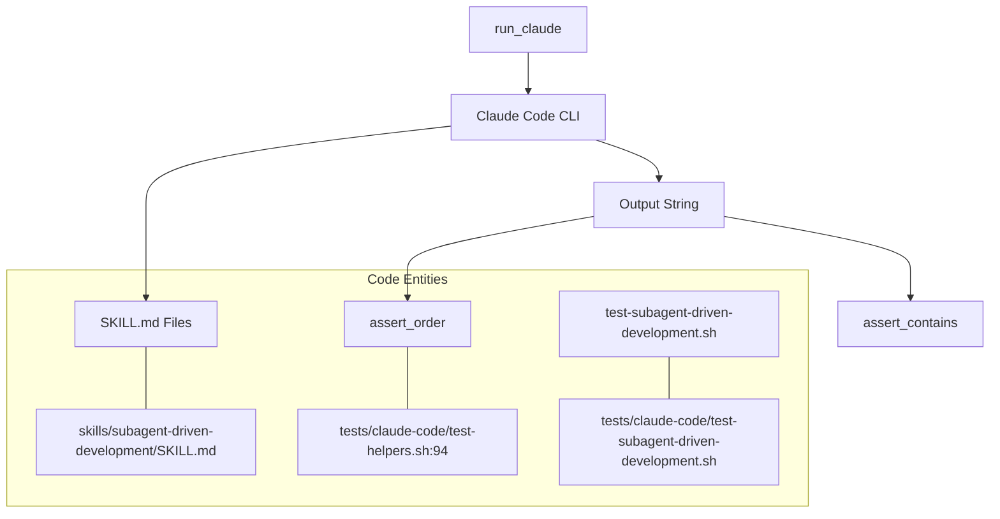

# Testing Infrastructure

<details>
<summary>Relevant source files</summary>

The following files were used as context for generating this wiki page:

- [tests/claude-code/README.md](https://github.com/obra/superpowers/blob/HEAD/tests/claude-code/README.md)
- [tests/claude-code/run-skill-tests.sh](https://github.com/obra/superpowers/blob/HEAD/tests/claude-code/run-skill-tests.sh)
- [tests/claude-code/test-helpers.sh](https://github.com/obra/superpowers/blob/HEAD/tests/claude-code/test-helpers.sh)
- [tests/claude-code/test-subagent-driven-development.sh](https://github.com/obra/superpowers/blob/HEAD/tests/claude-code/test-subagent-driven-development.sh)

</details>


This page describes the automated test suites and supporting tooling used to verify Superpowers behavior. The infrastructure validates that skills are correctly loaded, instructions are followed by the AI, and complex multi-agent workflows execute successfully across different platforms.

For background on what skills contain and how they are loaded, see [Core Concepts](08_3-core-concepts.md).

---

## Test Suite Organization

The tests are located in the `tests/` directory and are categorized by testing methodology. The suite distinguishes between "fast" unit-like tests that query the AI about its instructions and "integration" tests that perform full file-system operations and real tool execution.

```
tests/
└── claude-code/
    ├── run-skill-tests.sh                             # Main test runner for Claude Code
    ├── test-helpers.sh                                # Shared Bash utilities and assertions
    ├── test-subagent-driven-development.sh            # Fast skill verification
    ├── test-subagent-driven-development-integration.sh # Full workflow execution
    ├── test-worktree-path-policy.sh                   # Fast policy check
    └── test-sdd-workspace.sh                          # Fast workspace check
```

**Test Infrastructure Overview:**



Sources: [tests/claude-code/run-skill-tests.sh:74-88](https://github.com/obra/superpowers/blob/HEAD/tests/claude-code/run-skill-tests.sh#L74-L88), [tests/claude-code/README.md:81-129](https://github.com/obra/superpowers/blob/HEAD/tests/claude-code/README.md#L81-L129)

---

## Claude Code Test Suite

For details, see [Test Suite Overview](54_9.1-test-suite-overview.md).

### Runner: `run-skill-tests.sh`

`run-skill-tests.sh` is the primary entry point for validating skills within the Claude Code environment [tests/claude-code/run-skill-tests.sh:2](https://github.com/obra/superpowers/blob/HEAD/tests/claude-code/run-skill-tests.sh#L2). It executes Claude in headless mode to ensure that the `Skill` tool and individual skill files are functioning as expected.

| Flag | Default | Description |
|---|---|---|
| `--verbose` / `-v` | `false` | Displays full stdout/stderr from Claude sessions [tests/claude-code/run-skill-tests.sh:33-36](https://github.com/obra/superpowers/blob/HEAD/tests/claude-code/run-skill-tests.sh#L33-L36). |
| `--test` / `-t` | all | Runs a specific test file instead of the full suite [tests/claude-code/run-skill-tests.sh:37-40](https://github.com/obra/superpowers/blob/HEAD/tests/claude-code/run-skill-tests.sh#L37-L40). |
| `--integration` / `-i` | `false` | Enables slow integration tests (10-30 mins) [tests/claude-code/run-skill-tests.sh:45-48](https://github.com/obra/superpowers/blob/HEAD/tests/claude-code/run-skill-tests.sh#L45-L48). |
| `--timeout` | 600 | Sets timeout in seconds per test [tests/claude-code/run-skill-tests.sh:28](https://github.com/obra/superpowers/blob/HEAD/tests/claude-code/run-skill-tests.sh#L28). |

Sources: [tests/claude-code/run-skill-tests.sh:25-72](https://github.com/obra/superpowers/blob/HEAD/tests/claude-code/run-skill-tests.sh#L25-L72), [tests/claude-code/README.md:16-40](https://github.com/obra/superpowers/blob/HEAD/tests/claude-code/README.md#L16-L40)

---

### Shared Helpers: `test-helpers.sh`

For details, see [Testing Tools and Helpers](57_9.4-testing-tools-and-helpers.md).

All Claude Code tests source `test-helpers.sh` to access standardized execution and assertion logic [tests/claude-code/test-helpers.sh:2](https://github.com/obra/superpowers/blob/HEAD/tests/claude-code/test-helpers.sh#L2).

**Core Functions:**

*   **`run_claude`**: Invokes the `claude` CLI with specific prompts and captures the session transcript [tests/claude-code/test-helpers.sh:6-29](https://github.com/obra/superpowers/blob/HEAD/tests/claude-code/test-helpers.sh#L6-L29).
*   **`assert_contains` / `assert_not_contains`**: Validates presence or absence of strings in the AI's output [tests/claude-code/test-helpers.sh:33-67](https://github.com/obra/superpowers/blob/HEAD/tests/claude-code/test-helpers.sh#L33-L67).
*   **`assert_order`**: Ensures the AI performs actions in the correct sequence (e.g., spec compliance review before code quality review) [tests/claude-code/test-helpers.sh:94-123](https://github.com/obra/superpowers/blob/HEAD/tests/claude-code/test-helpers.sh#L94-L123).
*   **`create_test_project`**: Generates a temporary directory for integration testing [tests/claude-code/test-helpers.sh:127-130](https://github.com/obra/superpowers/blob/HEAD/tests/claude-code/test-helpers.sh#L127-L130).
*   **`create_test_plan`**: Generates a sample implementation plan file for workflow tests [tests/claude-code/test-helpers.sh:143-192](https://github.com/obra/superpowers/blob/HEAD/tests/claude-code/test-helpers.sh#L143-L192).

Sources: [tests/claude-code/test-helpers.sh:1-203](https://github.com/obra/superpowers/blob/HEAD/tests/claude-code/test-helpers.sh#L1-L203), [tests/claude-code/README.md:43-51](https://github.com/obra/superpowers/blob/HEAD/tests/claude-code/README.md#L43-L51)

---

### Fast Tests

For details, see [Fast Tests](55_9.2-fast-tests.md).

Fast tests (e.g., `test-subagent-driven-development.sh`) verify that the AI understands the "Hard Gates" and requirements of a skill without actually performing a multi-step coding task [tests/claude-code/README.md:85-94](https://github.com/obra/superpowers/blob/HEAD/tests/claude-code/README.md#L85-L94). These typically complete in ~2 minutes and focus on instruction adherence by querying the AI about its own protocol, such as verifying that it knows to read a plan only once [tests/claude-code/test-subagent-driven-development.sh:78-84](https://github.com/obra/superpowers/blob/HEAD/tests/claude-code/test-subagent-driven-development.sh#L78-L84).

**Fast Test Mapping:**



Sources: [tests/claude-code/test-subagent-driven-development.sh:1-180](https://github.com/obra/superpowers/blob/HEAD/tests/claude-code/test-subagent-driven-development.sh#L1-L180), [tests/claude-code/README.md:85-94](https://github.com/obra/superpowers/blob/HEAD/tests/claude-code/README.md#L85-L94)

---

### Integration Tests

For details, see [Integration Tests](56_9.3-integration-tests.md).

Integration tests execute real implementation plans against a temporary project [tests/claude-code/README.md:98-115](https://github.com/obra/superpowers/blob/HEAD/tests/claude-code/README.md#L98-L115). For example, `test-subagent-driven-development-integration.sh` verifies:
1.  **Workflow Execution**: The AI creates real test projects and implementation plans [tests/claude-code/README.md:99-101](https://github.com/obra/superpowers/blob/HEAD/tests/claude-code/README.md#L99-L101).
2.  **Instruction Adherence**: Verifies that subagents perform self-review before reporting and that the spec reviewer reads code independently [tests/claude-code/README.md:105-107](https://github.com/obra/superpowers/blob/HEAD/tests/claude-code/README.md#L105-L107).
3.  **Result Validation**: Ensures a working implementation is produced and tests pass [tests/claude-code/README.md:108-109](https://github.com/obra/superpowers/blob/HEAD/tests/claude-code/README.md#L108-L109).

Sources: [tests/claude-code/README.md:97-124](https://github.com/obra/superpowers/blob/HEAD/tests/claude-code/README.md#L97-L124)4c:T34b1,# Test Suite Overview

<details>
