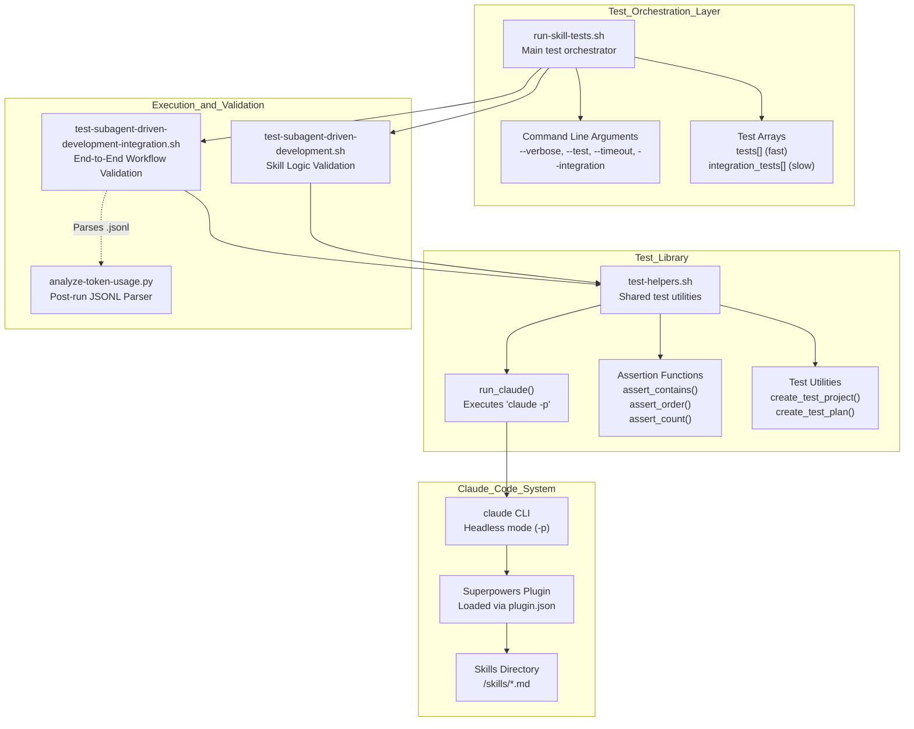

# Test Suite Overview

<details>
<summary>Relevant source files</summary>

The following files were used as context for generating this wiki page:

- [tests/claude-code/README.md](https://github.com/obra/superpowers/blob/HEAD/tests/claude-code/README.md)
- [tests/claude-code/analyze-token-usage.py](https://github.com/obra/superpowers/blob/HEAD/tests/claude-code/analyze-token-usage.py)
- [tests/claude-code/run-skill-tests.sh](https://github.com/obra/superpowers/blob/HEAD/tests/claude-code/run-skill-tests.sh)
- [tests/claude-code/test-helpers.sh](https://github.com/obra/superpowers/blob/HEAD/tests/claude-code/test-helpers.sh)
- [tests/claude-code/test-subagent-driven-development-integration.sh](https://github.com/obra/superpowers/blob/HEAD/tests/claude-code/test-subagent-driven-development-integration.sh)
- [tests/claude-code/test-subagent-driven-development.sh](https://github.com/obra/superpowers/blob/HEAD/tests/claude-code/test-subagent-driven-development.sh)
- [tests/claude-code/test-worktree-native-preference.sh](https://github.com/obra/superpowers/blob/HEAD/tests/claude-code/test-worktree-native-preference.sh)

</details>


## Purpose and Scope

The test suite validates that Superpowers skills are correctly loaded and that AI agents follow their instructions as expected. Tests execute Claude Code CLI in headless mode to verify skill behavior without requiring manual interaction. This infrastructure ensures skill changes maintain consistent behavior across releases. [tests/claude-code/README.md:1-7](https://github.com/obra/superpowers/blob/HEAD/tests/claude-code/README.md#L1-L7), [tests/claude-code/run-skill-tests.sh:1-3](https://github.com/obra/superpowers/blob/HEAD/tests/claude-code/run-skill-tests.sh#L1-L3)

This page covers the test infrastructure architecture, execution flow, and test categories. For creating new skills (which involves TDD-for-documentation methodology), see **8.1 Test-Driven Development for Skills**. For detailed documentation of specific test types, see **9.2 Fast Tests** and **9.3 Integration Tests**. For test helper function reference, see **9.4 Testing Tools and Helpers**.

**Sources:** [tests/claude-code/README.md:1-10](https://github.com/obra/superpowers/blob/HEAD/tests/claude-code/README.md#L1-L10), [tests/claude-code/run-skill-tests.sh:1-16](https://github.com/obra/superpowers/blob/HEAD/tests/claude-code/run-skill-tests.sh#L1-L16)

---

## Test Infrastructure Architecture

The following diagram bridges the Natural Language requirements to the Code Entity space by showing how the test scripts interact with the Claude CLI and the underlying skill system.

**Infrastructure Component Mapping**


The test infrastructure uses a three-layer architecture:

1.  **Test Runner** ([tests/claude-code/run-skill-tests.sh:1-188](https://github.com/obra/superpowers/blob/HEAD/tests/claude-code/run-skill-tests.sh#L1-L188)): Orchestrates test execution, parses arguments, manages timeouts, and tracks results.
2.  **Test Helpers Module** ([tests/claude-code/test-helpers.sh:1-203](https://github.com/obra/superpowers/blob/HEAD/tests/claude-code/test-helpers.sh#L1-L203)): Provides reusable functions for invoking Claude and verifying responses.
3.  **Test Files**: Individual test scripts that source helpers and verify specific skills or workflows. [tests/claude-code/README.md:53-59](https://github.com/obra/superpowers/blob/HEAD/tests/claude-code/README.md#L53-L59)

All tests ultimately invoke the Claude Code CLI (`claude -p`) in headless mode, which loads the Superpowers plugin and skills repository at session start. [tests/claude-code/test-helpers.sh:6-29](https://github.com/obra/superpowers/blob/HEAD/tests/claude-code/test-helpers.sh#L6-L29)

**Sources:** [tests/claude-code/README.md:42-51](https://github.com/obra/superpowers/blob/HEAD/tests/claude-code/README.md#L42-L51), [tests/claude-code/run-skill-tests.sh:74-86](https://github.com/obra/superpowers/blob/HEAD/tests/claude-code/run-skill-tests.sh#L74-L86), [tests/claude-code/test-helpers.sh:6-29](https://github.com/obra/superpowers/blob/HEAD/tests/claude-code/test-helpers.sh#L6-L29)

---

## Test Execution Flow

The following diagram details the internal logic of the `run-skill-tests.sh` script and how it manages test lifecycles.

**Execution Flow Mapping**

```mermaid
stateDiagram-v2
    [*] --> ParseArgs: "run-skill-tests.sh starts"
    
    ParseArgs --> CheckCLI: "Parse flags --verbose, --test, --timeout, --integration"
    
    CheckCLI --> BuildList: "Verify 'claude' command exists"
    
    BuildList --> FilterList: "Build test arrays tests[] + integration_tests[]"
    
    state FilterList {
        [*] --> CheckIntegration: "RUN_INTEGRATION flag?"
        CheckIntegration --> AddIntegration: "true -> add integration_tests[]"
        CheckIntegration --> SkipIntegration: "false -> skip integration tests"
        AddIntegration --> CheckSpecific
        SkipIntegration --> CheckSpecific
        CheckSpecific --> FilterSingle: "SPECIFIC_TEST set?"
        CheckSpecific --> UseAll: "No filter"
        FilterSingle --> [*]
        UseAll --> [*]
    }
    
    FilterList --> TestLoop: "Final test list ready"
    
    state TestLoop {
        [*] --> NextTest: "For each test"
        NextTest --> StartTimer: "start_time=$(date +%s)"
        StartTimer --> RunTest
        
        state RunTest {
            [*] --> VerboseCheck: "VERBOSE flag?"
            VerboseCheck --> RunVerbose: "true -> show all output"
            VerboseCheck --> RunQuiet: "false -> capture output"
            RunVerbose --> Timeout1: "timeout $TIMEOUT bash test.sh"
            RunQuiet --> Timeout2: "timeout $TIMEOUT bash test.sh 2>&1"
            Timeout1 --> CheckExit1
            Timeout2 --> CheckExit2
            CheckExit1 --> [*]: "exit_code"
            CheckExit2 --> [*]: "exit_code"
        }
        
        RunTest --> RecordResult: "end_time=$(date +%s)"
        RecordResult --> UpdateCounters
        
        state UpdateCounters {
            [*] --> CheckCode: "exit_code == 0?"
            CheckCode --> IncPass: "passed=$((passed + 1))"
            CheckCode --> IncFail: "failed=$((failed + 1))"
            IncPass --> [*]
            IncFail --> [*]
        }
        
        UpdateCounters --> NextTest: "Continue loop"
        NextTest --> [*]: "All tests done"
    }
    
    TestLoop --> PrintSummary: "Print counts Passed, Failed, Skipped"
    
    PrintSummary --> CheckFailed: "failed > 0?"
    CheckFailed --> ExitFail: "exit 1"
    CheckFailed --> ExitPass: "exit 0"
```


The execution flow implements:

*   **Argument Parsing** ([tests/claude-code/run-skill-tests.sh:31-72](https://github.com/obra/superpowers/blob/HEAD/tests/claude-code/run-skill-tests.sh#L31-L72)): Processes `--verbose`, `--test`, `--timeout`, and `--integration` flags.
*   **Test Discovery** ([tests/claude-code/run-skill-tests.sh:74-92](https://github.com/obra/superpowers/blob/HEAD/tests/claude-code/run-skill-tests.sh#L74-L92)): Builds a list from the `tests[]` array plus optional `integration_tests[]`.
*   **Test Execution** ([tests/claude-code/run-skill-tests.sh:100-163](https://github.com/obra/superpowers/blob/HEAD/tests/claude-code/run-skill-tests.sh#L100-L163)): Runs each test with a `timeout` wrapper and captures output based on the verbose mode.
*   **Result Tracking** ([tests/claude-code/run-skill-tests.sh:94-97](https://github.com/obra/superpowers/blob/HEAD/tests/claude-code/run-skill-tests.sh#L94-L97)): Maintains `passed`, `failed`, and `skipped` counters.
*   **Exit Code** ([tests/claude-code/run-skill-tests.sh:181-187](https://github.com/obra/superpowers/blob/HEAD/tests/claude-code/run-skill-tests.sh#L181-L187)): Returns 0 only if `failed == 0`.

**Sources:** [tests/claude-code/run-skill-tests.sh:25-187](https://github.com/obra/superpowers/blob/HEAD/tests/claude-code/run-skill-tests.sh#L25-L187)

---

## Test Categories

The test suite divides tests into two categories with different execution characteristics:

| Category | Execution Time | Purpose | Run By Default | Flag |
| :--- | :--- | :--- | :--- | :--- |
| **Fast Tests** | ~2 minutes | Verify skill instructions and requirements through Claude queries | Yes | N/A |
| **Integration Tests** | 10-30 minutes | Execute full workflows with real projects and verify actual behaviors | No | `--integration` |

### Fast Tests

Fast tests query Claude Code about skill content without executing workflows. They verify that:

*   Skills are correctly loaded and accessible. [tests/claude-code/test-subagent-driven-development.sh:20-29](https://github.com/obra/superpowers/blob/HEAD/tests/claude-code/test-subagent-driven-development.sh#L20-L29)
*   Key requirements (like workflow ordering) are documented in the skill. [tests/claude-code/test-subagent-driven-development.sh:39-50](https://github.com/obra/superpowers/blob/HEAD/tests/claude-code/test-subagent-driven-development.sh#L39-L50)
*   Red flags and anti-patterns are explicit (e.g., warning against the main branch). [tests/claude-code/test-subagent-driven-development.sh:166-175](https://github.com/obra/superpowers/blob/HEAD/tests/claude-code/test-subagent-driven-development.sh#L166-L175)
*   Specific tool preferences are maintained, such as native worktree tools. [tests/claude-code/test-worktree-native-preference.sh:1-20](https://github.com/obra/superpowers/blob/HEAD/tests/claude-code/test-worktree-native-preference.sh#L1-L20)

Example: `test-subagent-driven-development.sh` verifies the skill by asking Claude questions like "what comes first: spec compliance review or code quality review?" and validating responses contain expected patterns. [tests/claude-code/test-subagent-driven-development.sh:42-50](https://github.com/obra/superpowers/blob/HEAD/tests/claude-code/test-subagent-driven-development.sh#L42-L50)

**Sources:** [tests/claude-code/README.md:83-93](https://github.com/obra/superpowers/blob/HEAD/tests/claude-code/README.md#L83-L93), [tests/claude-code/run-skill-tests.sh:74-79](https://github.com/obra/superpowers/blob/HEAD/tests/claude-code/run-skill-tests.sh#L74-L79), [tests/claude-code/test-subagent-driven-development.sh:1-180](https://github.com/obra/superpowers/blob/HEAD/tests/claude-code/test-subagent-driven-development.sh#L1-L180), [tests/claude-code/test-worktree-native-preference.sh:1-20](https://github.com/obra/superpowers/blob/HEAD/tests/claude-code/test-worktree-native-preference.sh#L1-L20)

### Integration Tests

Integration tests execute complete workflows end-to-end by:

1.  Creating real test projects with `package.json` and implementation plans. [tests/claude-code/test-subagent-driven-development-integration.sh:35-57](https://github.com/obra/superpowers/blob/HEAD/tests/claude-code/test-subagent-driven-development-integration.sh#L35-L57)
2.  Instructing Claude to execute the workflow using the skill. [tests/claude-code/test-subagent-driven-development-integration.sh:129-158](https://github.com/obra/superpowers/blob/HEAD/tests/claude-code/test-subagent-driven-development-integration.sh#L129-L158)
3.  Verifying actual behaviors by parsing the `.jsonl` session transcript. [tests/claude-code/test-subagent-driven-development-integration.sh:179-198](https://github.com/obra/superpowers/blob/HEAD/tests/claude-code/test-subagent-driven-development-integration.sh#L179-L198)
4.  Validating working implementation, passing tests, and proper git commits. [tests/claude-code/test-subagent-driven-development-integration.sh:8-12](https://github.com/obra/superpowers/blob/HEAD/tests/claude-code/test-subagent-driven-development-integration.sh#L8-L12)

Example: `test-subagent-driven-development-integration.sh` verifies that Claude reads the plan once, provides full task text to subagents, and performs spec compliance review before code quality review. [tests/claude-code/test-subagent-driven-development-integration.sh:24-31](https://github.com/obra/superpowers/blob/HEAD/tests/claude-code/test-subagent-driven-development-integration.sh#L24-L31)

**Sources:** [tests/claude-code/README.md:95-117](https://github.com/obra/superpowers/blob/HEAD/tests/claude-code/README.md#L95-L117), [tests/claude-code/run-skill-tests.sh:81-89](https://github.com/obra/superpowers/blob/HEAD/tests/claude-code/run-skill-tests.sh#L81-L89), [tests/claude-code/test-subagent-driven-development-integration.sh:1-210](https://github.com/obra/superpowers/blob/HEAD/tests/claude-code/test-subagent-driven-development-integration.sh#L1-L210)

---

## Token Analysis Tool

A critical part of the test infrastructure is `analyze-token-usage.py`, which parses Claude Code session transcripts to provide a cost and efficiency breakdown. [tests/claude-code/analyze-token-usage.py:1-5](https://github.com/obra/superpowers/blob/HEAD/tests/claude-code/analyze-token-usage.py#L1-L5)

| Metric | Code Entity / Function | Description |
| :--- | :--- | :--- |
| **Input Tokens** | `main_usage['input_tokens']` | Total prompt tokens sent in main session [tests/claude-code/analyze-token-usage.py:41](https://github.com/obra/superpowers/blob/HEAD/tests/claude-code/analyze-token-usage.py#L41) |
| **Cache Read** | `main_usage['cache_read']` | Tokens served from Claude's prompt cache [tests/claude-code/analyze-token-usage.py:44](https://github.com/obra/superpowers/blob/HEAD/tests/claude-code/analyze-token-usage.py#L44) |
| **Subagent Usage** | `subagent_usage[agent_id]` | Breakdown of tokens used by specific `Task` subagents [tests/claude-code/analyze-token-usage.py:49-51](https://github.com/obra/superpowers/blob/HEAD/tests/claude-code/analyze-token-usage.py#L49-L51) |
| **Cost Calculation** | `calculate_cost()` | Estimates USD cost based on configurable rates [tests/claude-code/analyze-token-usage.py:76-81](https://github.com/obra/superpowers/blob/HEAD/tests/claude-code/analyze-token-usage.py#L76-L81) |

The tool allows developers to see exactly how much context is being passed to subagents and whether the "Read plan once" protocol is being followed (indicated by lower main session input tokens over time). [tests/claude-code/analyze-token-usage.py:108-127](https://github.com/obra/superpowers/blob/HEAD/tests/claude-code/analyze-token-usage.py#L108-L127)

**Sources:** [tests/claude-code/analyze-token-usage.py:1-169](https://github.com/obra/superpowers/blob/HEAD/tests/claude-code/analyze-token-usage.py#L1-L169)

---

## Test Helpers and Utilities

The `test-helpers.sh` module provides reusable functions for all tests: [tests/claude-code/test-helpers.sh:1-3](https://github.com/obra/superpowers/blob/HEAD/tests/claude-code/test-helpers.sh#L1-L3)

| Function | Purpose | Implementation Detail |
| :--- | :--- | :--- |
| `run_claude` | Execute Claude CLI | Uses `timeout` and `claude -p` [tests/claude-code/test-helpers.sh:6-29](https://github.com/obra/superpowers/blob/HEAD/tests/claude-code/test-helpers.sh#L6-L29) |
| `assert_contains` | Pattern matching | Uses `grep -q` [tests/claude-code/test-helpers.sh:33-48](https://github.com/obra/superpowers/blob/HEAD/tests/claude-code/test-helpers.sh#L33-L48) |
| `assert_order` | Sequence verification | Compares line numbers of two patterns [tests/claude-code/test-helpers.sh:94-123](https://github.com/obra/superpowers/blob/HEAD/tests/claude-code/test-helpers.sh#L94-L123) |
| `create_test_project` | Environment setup | Uses `mktemp -d` [tests/claude-code/test-helpers.sh:127-130](https://github.com/obra/superpowers/blob/HEAD/tests/claude-code/test-helpers.sh#L127-L130) |
| `create_test_plan` | Mock data | Generates a standard `implementation-plan.md` [tests/claude-code/test-helpers.sh:143-192](https://github.com/obra/superpowers/blob/HEAD/tests/claude-code/test-helpers.sh#L143-L192) |

**Sources:** [tests/claude-code/README.md:42-51](https://github.com/obra/superpowers/blob/HEAD/tests/claude-code/README.md#L42-L51), [tests/claude-code/test-helpers.sh:1-203](https://github.com/obra/superpowers/blob/HEAD/tests/claude-code/test-helpers.sh#L1-L203)

---

## Running the Test Suite

The test suite is executed via `run-skill-tests.sh` with the following invocation patterns:

### Run All Fast Tests
```bash
./run-skill-tests.sh
```
Executes all tests in the `tests[]` array. [tests/claude-code/run-skill-tests.sh:75-79](https://github.com/obra/superpowers/blob/HEAD/tests/claude-code/run-skill-tests.sh#L75-L79)

### Run Integration Tests
```bash
./run-skill-tests.sh --integration
```
Appends `integration_tests[]` to the execution list. [tests/claude-code/run-skill-tests.sh:87-89](https://github.com/obra/superpowers/blob/HEAD/tests/claude-code/run-skill-tests.sh#L87-L89)

### Run Specific Test
```bash
./run-skill-tests.sh --test test-subagent-driven-development.sh
```
Filters execution to a single file. [tests/claude-code/run-skill-tests.sh:92-94](https://github.com/obra/superpowers/blob/HEAD/tests/claude-code/run-skill-tests.sh#L92-L94)

### Debugging with Verbose Output
```bash
./run-skill-tests.sh --verbose --test test-subagent-driven-development.sh
```
Shows full Claude output during execution. [tests/claude-code/run-skill-tests.sh:122-140](https://github.com/obra/superpowers/blob/HEAD/tests/claude-code/run-skill-tests.sh#L122-L140)

**Sources:** [tests/claude-code/README.md:16-39](https://github.com/obra/superpowers/blob/HEAD/tests/claude-code/README.md#L16-L39), [tests/claude-code/run-skill-tests.sh:25-72](https://github.com/obra/superpowers/blob/HEAD/tests/claude-code/run-skill-tests.sh#L25-L72)