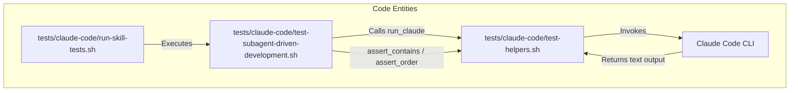
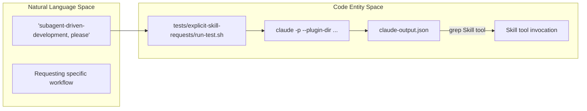

# Fast Tests

<details>
<summary>Relevant source files</summary>

The following files were used as context for generating this wiki page:

- [tests/claude-code/README.md](https://github.com/obra/superpowers/blob/HEAD/tests/claude-code/README.md)
- [tests/claude-code/run-skill-tests.sh](https://github.com/obra/superpowers/blob/HEAD/tests/claude-code/run-skill-tests.sh)
- [tests/claude-code/test-helpers.sh](https://github.com/obra/superpowers/blob/HEAD/tests/claude-code/test-helpers.sh)
- [tests/claude-code/test-subagent-driven-development.sh](https://github.com/obra/superpowers/blob/HEAD/tests/claude-code/test-subagent-driven-development.sh)
- [tests/explicit-skill-requests/run-all.sh](https://github.com/obra/superpowers/blob/HEAD/tests/explicit-skill-requests/run-all.sh)
- [tests/explicit-skill-requests/run-extended-multiturn-test.sh](https://github.com/obra/superpowers/blob/HEAD/tests/explicit-skill-requests/run-extended-multiturn-test.sh)
- [tests/explicit-skill-requests/run-haiku-test.sh](https://github.com/obra/superpowers/blob/HEAD/tests/explicit-skill-requests/run-haiku-test.sh)
- [tests/explicit-skill-requests/run-multiturn-test.sh](https://github.com/obra/superpowers/blob/HEAD/tests/explicit-skill-requests/run-multiturn-test.sh)
- [tests/explicit-skill-requests/run-test.sh](https://github.com/obra/superpowers/blob/HEAD/tests/explicit-skill-requests/run-test.sh)

</details>


## Purpose and Scope

Fast tests verify that skills are properly loaded and contain correct instructions by querying Claude Code CLI in headless mode. These tests run in approximately 2 minutes and focus on validating skill content, instruction ordering, and triggering behavior, rather than full workflow execution. For end-to-end workflow validation involving file system changes and multi-agent coordination, see [Integration Tests](https://github.com/obra/superpowers/blob/HEAD/9.3). For the overall test infrastructure, see [Test Suite Overview](https://github.com/obra/superpowers/blob/HEAD/9.1).

Fast tests address several critical verification requirements:
- **Skill Accessibility**: Is the skill recognized and can Claude describe its purpose? [tests/claude-code/test-subagent-driven-development.sh:20-29](https://github.com/obra/superpowers/blob/HEAD/tests/claude-code/test-subagent-driven-development.sh#L20-L29)
- **Trigger Reliability**: Does Claude invoke the correct skill when requested by name or triggered by natural language intent? [tests/explicit-skill-requests/run-test.sh:81-90](https://github.com/obra/superpowers/blob/HEAD/tests/explicit-skill-requests/run-test.sh#L81-L90)
- **Protocol Adherence**: Does the model attempt to perform work (premature action) before loading the required skill? [tests/explicit-skill-requests/run-test.sh:98-118](https://github.com/obra/superpowers/blob/HEAD/tests/explicit-skill-requests/run-test.sh#L98-L118)
- **Instructional Accuracy**: Does Claude correctly recall the workflow steps, such as performing spec compliance review before code quality review? [tests/claude-code/test-subagent-driven-development.sh:42-50](https://github.com/obra/superpowers/blob/HEAD/tests/claude-code/test-subagent-driven-development.sh#L42-L50)

**Sources:** [tests/claude-code/README.md:83-94](https://github.com/obra/superpowers/blob/HEAD/tests/claude-code/README.md#L83-L94), [tests/claude-code/test-subagent-driven-development.sh:1-180](https://github.com/obra/superpowers/blob/HEAD/tests/claude-code/test-subagent-driven-development.sh#L1-L180), [tests/explicit-skill-requests/run-all.sh:1-71](https://github.com/obra/superpowers/blob/HEAD/tests/explicit-skill-requests/run-all.sh#L1-L71)

---

## Fast Test Architecture

Fast tests utilize the Claude Code CLI (`claude -p`) to query skills and verify JSON or text responses. The architecture is split into logic verification (content checks) and trigger verification (behavioral checks).

### Logic Verification Flow

This flow verifies that the internal logic and requirements of a skill are correctly understood and reported by the model. It uses a helper library `test-helpers.sh` to provide standardized assertions.

Title: Logic Verification Sequence


**Sources:** [tests/claude-code/run-skill-tests.sh:74-79](https://github.com/obra/superpowers/blob/HEAD/tests/claude-code/run-skill-tests.sh#L74-L79), [tests/claude-code/test-helpers.sh:6-29](https://github.com/obra/superpowers/blob/HEAD/tests/claude-code/test-helpers.sh#L6-L29), [tests/claude-code/test-subagent-driven-development.sh:12-15](https://github.com/obra/superpowers/blob/HEAD/tests/claude-code/test-subagent-driven-development.sh#L12-L15)

### Trigger Verification Pipeline

This pipeline verifies that specific natural language prompts correctly trigger the `Skill` tool without premature execution of implementation tools, even across multi-turn conversations.

Title: Trigger Verification Pipeline


**Sources:** [tests/explicit-skill-requests/run-test.sh:71-86](https://github.com/obra/superpowers/blob/HEAD/tests/explicit-skill-requests/run-test.sh#L71-L86), [tests/explicit-skill-requests/run-multiturn-test.sh:89-97](https://github.com/obra/superpowers/blob/HEAD/tests/explicit-skill-requests/run-multiturn-test.sh#L89-L97)

---

## Trigger Testing Categories

The suite distinguishes between **Explicit Requests** (where the user names a skill) and **Multi-Turn Reliability** (ensuring skills trigger after long context).

### Explicit Skill Request Testing

A specialized subset of fast tests ensures that Claude honors direct requests for skills without reverting to generic behavior. The `run-all.sh` script orchestrates these checks.

| Test Case | Prompt File | Target Skill |
|-----------|-------------|--------------|
| Direct Name | `subagent-driven-development-please.txt` | `subagent-driven-development` | [tests/explicit-skill-requests/run-all.sh:19](https://github.com/obra/superpowers/blob/HEAD/tests/explicit-skill-requests/run-all.sh#L19) |
| Verb-based | `use-systematic-debugging.txt` | `systematic-debugging` | [tests/explicit-skill-requests/run-all.sh:30](https://github.com/obra/superpowers/blob/HEAD/tests/explicit-skill-requests/run-all.sh#L30) |
| Politeness | `please-use-brainstorming.txt` | `brainstorming` | [tests/explicit-skill-requests/run-all.sh:41](https://github.com/obra/superpowers/blob/HEAD/tests/explicit-skill-requests/run-all.sh#L41) |
| Mid-Conversation | `mid-conversation-execute-plan.txt` | `subagent-driven-development` | [tests/explicit-skill-requests/run-all.sh:52](https://github.com/obra/superpowers/blob/HEAD/tests/explicit-skill-requests/run-all.sh#L52) |

**Sources:** [tests/explicit-skill-requests/run-all.sh:17-59](https://github.com/obra/superpowers/blob/HEAD/tests/explicit-skill-requests/run-all.sh#L17-L59)

### Multi-Turn and Model-Specific Testing

Advanced fast tests simulate real-world usage where skills might be requested after several turns of conversation, or when using faster models like Haiku.

- **Multi-Turn**: Builds actual conversation history using the `--continue` flag to see if Claude "forgets" to use the Skill tool after extended context. [tests/explicit-skill-requests/run-multiturn-test.sh:46-82](https://github.com/obra/superpowers/blob/HEAD/tests/explicit-skill-requests/run-multiturn-test.sh#L46-L82)
- **Haiku Model**: Tests whether the cheaper/faster Haiku model fails to trigger skills more easily than Sonnet. [tests/explicit-skill-requests/run-haiku-test.sh:54-109](https://github.com/obra/superpowers/blob/HEAD/tests/explicit-skill-requests/run-haiku-test.sh#L54-L109)

**Sources:** [tests/explicit-skill-requests/run-multiturn-test.sh:5-7](https://github.com/obra/superpowers/blob/HEAD/tests/explicit-skill-requests/run-multiturn-test.sh#L5-L7), [tests/explicit-skill-requests/run-haiku-test.sh:3-4](https://github.com/obra/superpowers/blob/HEAD/tests/explicit-skill-requests/run-haiku-test.sh#L3-L4)

---

## Implementation Details

### The test-helpers.sh Library

The `test-helpers.sh` script provides the foundation for logic verification.

| Function | Purpose |
|----------|---------|
| `run_claude` | Invokes `claude -p` with a timeout and optional tool restrictions. [tests/claude-code/test-helpers.sh:6-29](https://github.com/obra/superpowers/blob/HEAD/tests/claude-code/test-helpers.sh#L6-L29) |
| `assert_contains` | Verifies a string or regex exists in the output. [tests/claude-code/test-helpers.sh:33-48](https://github.com/obra/superpowers/blob/HEAD/tests/claude-code/test-helpers.sh#L33-L48) |
| `assert_order` | Ensures pattern A appears before pattern B (critical for workflow steps). [tests/claude-code/test-helpers.sh:94-123](https://github.com/obra/superpowers/blob/HEAD/tests/claude-code/test-helpers.sh#L94-L123) |
| `assert_count` | Verifies the number of occurrences of a pattern. [tests/claude-code/test-helpers.sh:71-90](https://github.com/obra/superpowers/blob/HEAD/tests/claude-code/test-helpers.sh#L71-L90) |

**Sources:** [tests/claude-code/test-helpers.sh:1-203](https://github.com/obra/superpowers/blob/HEAD/tests/claude-code/test-helpers.sh#L1-L203)

### Premature Action Detection

A critical component of the `run-test.sh` logic is detecting if Claude starts performing implementation tasks (like `WriteFile`) before invoking the requested `Skill`. It checks the line number of the first `Skill` tool call against other tool calls. [tests/explicit-skill-requests/run-test.sh:98-121](https://github.com/obra/superpowers/blob/HEAD/tests/explicit-skill-requests/run-test.sh#L98-L121)

---

## Running the Suite

### Run All Fast Logic Tests
```bash
cd tests/claude-code
./run-skill-tests.sh
```
[tests/claude-code/run-skill-tests.sh:1-189](https://github.com/obra/superpowers/blob/HEAD/tests/claude-code/run-skill-tests.sh#L1-L189)

### Run Trigger Reliability Tests
```bash
cd tests/explicit-skill-requests
./run-all.sh
```
[tests/explicit-skill-requests/run-all.sh:1-71](https://github.com/obra/superpowers/blob/HEAD/tests/explicit-skill-requests/run-all.sh#L1-L71)

**Sources:** [tests/claude-code/README.md:16-19](https://github.com/obra/superpowers/blob/HEAD/tests/claude-code/README.md#L16-L19), [tests/explicit-skill-requests/run-all.sh:1-4](https://github.com/obra/superpowers/blob/HEAD/tests/explicit-skill-requests/run-all.sh#L1-L4)