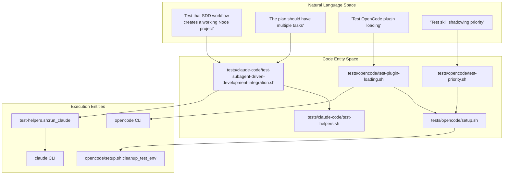
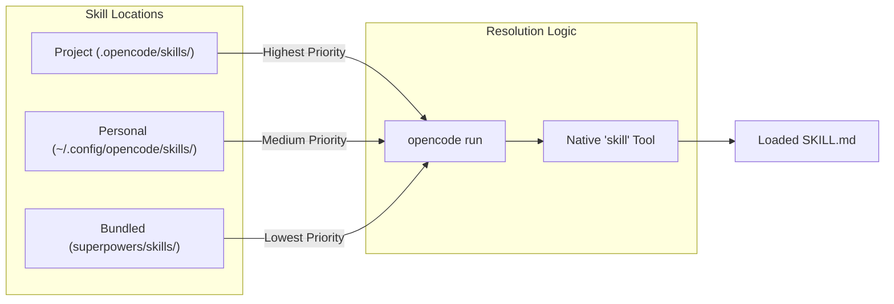

# Integration Tests

Relevant source files

The following files were used as context for generating this wiki page:

- [tests/claude-code/analyze-token-usage.py](https://github.com/obra/superpowers/blob/HEAD/tests/claude-code/analyze-token-usage.py)
- [tests/claude-code/test-subagent-driven-development-integration.sh](https://github.com/obra/superpowers/blob/HEAD/tests/claude-code/test-subagent-driven-development-integration.sh)
- [tests/claude-code/test-worktree-native-preference.sh](https://github.com/obra/superpowers/blob/HEAD/tests/claude-code/test-worktree-native-preference.sh)
- [tests/opencode/run-tests.sh](https://github.com/obra/superpowers/blob/HEAD/tests/opencode/run-tests.sh)
- [tests/opencode/setup.sh](https://github.com/obra/superpowers/blob/HEAD/tests/opencode/setup.sh)
- [tests/opencode/test-plugin-loading.sh](https://github.com/obra/superpowers/blob/HEAD/tests/opencode/test-plugin-loading.sh)
- [tests/opencode/test-priority.sh](https://github.com/obra/superpowers/blob/HEAD/tests/opencode/test-priority.sh)
- [tests/opencode/test-tools.sh](https://github.com/obra/superpowers/blob/HEAD/tests/opencode/test-tools.sh)

## Purpose and Scope

This page documents the end-to-end integration test cases that verify complete workflow execution in Superpowers. These tests scaffold actual projects, execute implementation plans using the `subagent-driven-development` skill, and verify that the resulting code is functional, tested, and follows the specified workflow. Integration tests typically take between 10 and 30 minutes to complete as they involve real AI interactions and multi-step development cycles [tests/claude-code/test-subagent-driven-development-integration.sh:24-32](https://github.com/obra/superpowers/blob/HEAD/tests/claude-code/test-subagent-driven-development-integration.sh#L24-L32).

Additionally, this suite includes platform-specific integration tests for environments like **Claude Code** and **OpenCode**, verifying plugin loading, tool functionality, and skill priority resolution in isolated environments. It also covers the behavior of specific subagents, such as the code reviewer, by planting bugs and verifying detection.

For unit tests of individual skills without full execution, see [9.1 Test Suite Overview](54_9.1-test-suite-overview.md). For the token usage analysis tools used by these tests, see [9.4 Testing Tools and Helpers](57_9.4-testing-tools-and-helpers.md).

---

## Integration Test Architecture

Integration tests differ from unit tests by executing actual AI-driven workflows rather than just verifying skill content. Each integration test follows a pattern: scaffold a project, execute the target logic via the platform CLI (Claude Code or OpenCode), verify results through assertions, and analyze consumption or protocol compliance.

### Test Execution Pipeline

The following diagram bridges the natural language requirements of a test into the code entities that manage the execution flow.

**Natural Language Space to Code Entity Space**

**Sources:** [tests/claude-code/test-subagent-driven-development-integration.sh:1-18](https://github.com/obra/superpowers/blob/HEAD/tests/claude-code/test-subagent-driven-development-integration.sh#L1-L18), [tests/opencode/test-plugin-loading.sh:1-14](https://github.com/obra/superpowers/blob/HEAD/tests/opencode/test-plugin-loading.sh#L1-L14), [tests/opencode/test-priority.sh:1-18](https://github.com/obra/superpowers/blob/HEAD/tests/opencode/test-priority.sh#L1-L18), [tests/opencode/setup.sh:1-14](https://github.com/obra/superpowers/blob/HEAD/tests/opencode/setup.sh#L1-L14)

---

## Claude Code Integration Tests

Claude Code integration tests verify the tool resolution logic and the `subagent-driven-development` (SDD) workflow in an isolated environment.

### Isolated Environment Setup

The `test-subagent-driven-development-integration.sh` script creates a temporary project using `create_test_project` [tests/claude-code/test-subagent-driven-development-integration.sh:36](https://github.com/obra/superpowers/blob/HEAD/tests/claude-code/test-subagent-driven-development-integration.sh#L36).
- **Project Structure**: Initializes a minimal Node.js project with `package.json`, `src/`, `test/`, and `docs/superpowers/plans/` [tests/claude-code/test-subagent-driven-development-integration.sh:45-56](https://github.com/obra/superpowers/blob/HEAD/tests/claude-code/test-subagent-driven-development-integration.sh#L45-L56).
- **Implementation Plan**: Creates a multi-task plan at `docs/superpowers/plans/implementation-plan.md` to test task isolation and subagent dispatch [tests/claude-code/test-subagent-driven-development-integration.sh:59-116](https://github.com/obra/superpowers/blob/HEAD/tests/claude-code/test-subagent-driven-development-integration.sh#L59-L116).
- **Git Initialization**: Configures a local git repository to provide a clean baseline for the AI [tests/claude-code/test-subagent-driven-development-integration.sh:119-123](https://github.com/obra/superpowers/blob/HEAD/tests/claude-code/test-subagent-driven-development-integration.sh#L119-L123).

### Workflow Verification

The test executes `claude` with a specific prompt forcing the use of the SDD skill [tests/claude-code/test-subagent-driven-development-integration.sh:149-158](https://github.com/obra/superpowers/blob/HEAD/tests/claude-code/test-subagent-driven-development-integration.sh#L149-L158). It uses the following flags for automation:
- `--allowed-tools=all`: Enables tool usage in headless mode [tests/claude-code/test-subagent-driven-development-integration.sh:167](https://github.com/obra/superpowers/blob/HEAD/tests/claude-code/test-subagent-driven-development-integration.sh#L167).
- `--permission-mode bypassPermissions`: Prevents interactive prompts during the test run [tests/claude-code/test-subagent-driven-development-integration.sh:167](https://github.com/obra/superpowers/blob/HEAD/tests/claude-code/test-subagent-driven-development-integration.sh#L167).

### Assertion Framework

The `test-helpers.sh` script provides a suite of assertion functions to validate the AI's behavior by analyzing the session transcript [tests/claude-code/test-helpers.sh:1-124](https://github.com/obra/superpowers/blob/HEAD/tests/claude-code/test-helpers.sh#L1-L124).

| Function | Purpose |
| :--- | :--- |
| `run_claude` | Executes Claude CLI with a prompt and optional timeout/tool-access [tests/claude-code/test-helpers.sh:6-29](https://github.com/obra/superpowers/blob/HEAD/tests/claude-code/test-helpers.sh#L6-L29) |
| `assert_contains` | Verifies specific text or patterns exist in the output [tests/claude-code/test-helpers.sh:33-48](https://github.com/obra/superpowers/blob/HEAD/tests/claude-code/test-helpers.sh#L33-L48) |
| `assert_count` | Ensures a tool (like `Task` or `Skill`) was called the expected number of times [tests/claude-code/test-helpers.sh:71-90](https://github.com/obra/superpowers/blob/HEAD/tests/claude-code/test-helpers.sh#L71-L90) |
| `assert_order` | Validates the sequence of events (e.g., spec review before code quality) [tests/claude-code/test-helpers.sh:94-123](https://github.com/obra/superpowers/blob/HEAD/tests/claude-code/test-helpers.sh#L94-L123) |

**Sources:** [tests/claude-code/test-subagent-driven-development-integration.sh:1-167](https://github.com/obra/superpowers/blob/HEAD/tests/claude-code/test-subagent-driven-development-integration.sh#L1-L167), [tests/claude-code/test-helpers.sh:1-124](https://github.com/obra/superpowers/blob/HEAD/tests/claude-code/test-helpers.sh#L1-L124)

---

## OpenCode Integration Tests

OpenCode integration tests focus on plugin lifecycle, tool mapping, and skill priority resolution.

### Environment Isolation (`setup.sh`)

The `tests/opencode/setup.sh` script creates a hermetic environment for testing OpenCode plugins [tests/opencode/setup.sh:1-4](https://github.com/obra/superpowers/blob/HEAD/tests/opencode/setup.sh#L1-L4):
- **Temp Directories**: Sets `HOME`, `XDG_CONFIG_HOME`, and `OPENCODE_CONFIG_DIR` to a temporary directory [tests/opencode/setup.sh:9-14](https://github.com/obra/superpowers/blob/HEAD/tests/opencode/setup.sh#L9-L14).
- **Plugin Layout**: Installs the plugin into the standard OpenCode layout, including symlinking the plugin file to `$OPENCODE_CONFIG_DIR/plugins/superpowers.js` [tests/opencode/setup.sh:16-36](https://github.com/obra/superpowers/blob/HEAD/tests/opencode/setup.sh#L16-L36).
- **Fixture Creation**: Generates "personal" and "project" level skills to verify priority resolution [tests/opencode/setup.sh:40-66](https://github.com/obra/superpowers/blob/HEAD/tests/opencode/setup.sh#L40-L66).

### Skill Priority Resolution (`test-priority.sh`)

This test verifies the three-tier priority system (Project > Personal > Superpowers) by creating duplicate skill names in all three locations and asserting which one is loaded [tests/opencode/test-priority.sh:20-63](https://github.com/obra/superpowers/blob/HEAD/tests/opencode/test-priority.sh#L20-L63).

**Priority Resolution Data Flow**

**Sources:** [tests/opencode/test-priority.sh:20-63](https://github.com/obra/superpowers/blob/HEAD/tests/opencode/test-priority.sh#L20-L63), [tests/opencode/setup.sh:16-36](https://github.com/obra/superpowers/blob/HEAD/tests/opencode/setup.sh#L16-L36)

---

## Token Usage Analysis

To monitor resource consumption and cost of integration tests, the script `analyze-token-usage.py` parses session transcripts [tests/claude-code/analyze-token-usage.py:1-6](https://github.com/obra/superpowers/blob/HEAD/tests/claude-code/analyze-token-usage.py#L1-L6).

### Analysis Metrics

The script distinguishes between:
- **Main Session Usage**: Token counts and messages from the primary coordinator session [tests/claude-code/analyze-token-usage.py:14-20](https://github.com/obra/superpowers/blob/HEAD/tests/claude-code/analyze-token-usage.py#L14-L20).
- **Subagent Usage**: Token counts per dispatched subagent, keyed by `agentId` and including prompt descriptions for identification [tests/claude-code/analyze-token-usage.py:23-30, 49-60](https://github.com/obra/superpowers/blob/HEAD/tests/claude-code/analyze-token-usage.py#L23-L30).
- **Cache Efficiency**: Tracks input tokens devoted to cache creation and cache reads separately [tests/claude-code/analyze-token-usage.py:43-44, 65-66](https://github.com/obra/superpowers/blob/HEAD/tests/claude-code/analyze-token-usage.py#L43-L44).

### Cost Estimation

It computes estimated costs in USD using common rates ($3 per million input tokens, $15 per million output tokens), assisting developers in optimizing test prompt designs [tests/claude-code/analyze-token-usage.py:76-81](https://github.com/obra/superpowers/blob/HEAD/tests/claude-code/analyze-token-usage.py#L76-L81).

**Sources:** [tests/claude-code/analyze-token-usage.py:1-81](https://github.com/obra/superpowers/blob/HEAD/tests/claude-code/analyze-token-usage.py#L1-L81)

---

## Running Integration Tests

### Command Reference

| Command | Purpose |
| :--- | :--- |
| `./tests/claude-code/test-subagent-driven-development-integration.sh` | Executes full SDD workflow integration test [tests/claude-code/test-subagent-driven-development-integration.sh:1-15](https://github.com/obra/superpowers/blob/HEAD/tests/claude-code/test-subagent-driven-development-integration.sh#L1-L15) |
| `./tests/opencode/run-tests.sh --integration` | Runs OpenCode integration tests including tool and priority checks [tests/opencode/run-tests.sh:24-27, 66-75](https://github.com/obra/superpowers/blob/HEAD/tests/opencode/run-tests.sh#L24-L27) |
| `./tests/claude-code/test-worktree-native-preference.sh all` | Verifies preference for native tools in worktree workflows [tests/claude-code/test-worktree-native-preference.sh:143-178](https://github.com/obra/superpowers/blob/HEAD/tests/claude-code/test-worktree-native-preference.sh#L143-L178) |
| `python3 tests/claude-code/analyze-token-usage.py <session.jsonl>` | Analyzes token usage and cost of a session [tests/claude-code/analyze-token-usage.py:84-88](https://github.com/obra/superpowers/blob/HEAD/tests/claude-code/analyze-token-usage.py#L84-L88) |

### Output and Debugging

Integration tests output results to the console, with failures providing snippets of the session logs. For OpenCode, the `run-tests.sh` runner captures output and reports duration per test [tests/opencode/run-tests.sh:123-141](https://github.com/obra/superpowers/blob/HEAD/tests/opencode/run-tests.sh#L123-L141).

**Sources:** 
[tests/claude-code/test-subagent-driven-development-integration.sh:1-32](https://github.com/obra/superpowers/blob/HEAD/tests/claude-code/test-subagent-driven-development-integration.sh#L1-L32), 
[tests/opencode/run-tests.sh:1-166](https://github.com/obra/superpowers/blob/HEAD/tests/opencode/run-tests.sh#L1-L166), 
[tests/claude-code/analyze-token-usage.py:83-168](https://github.com/obra/superpowers/blob/HEAD/tests/claude-code/analyze-token-usage.py#L83-L168), 
[tests/claude-code/test-worktree-native-preference.sh:1-20](https://github.com/obra/superpowers/blob/HEAD/tests/claude-code/test-worktree-native-preference.sh#L1-L20)