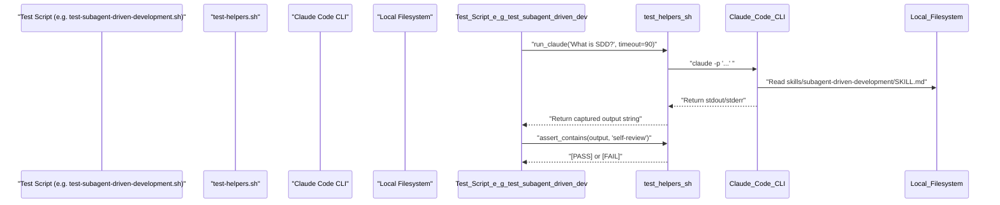
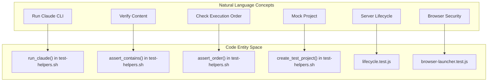

# Testing Tools and Helpers

Relevant source files

The following files were used as context for generating this wiki page:

- [tests/brainstorm-server/browser-launcher.test.js](https://github.com/obra/superpowers/blob/HEAD/tests/brainstorm-server/browser-launcher.test.js)
- [tests/brainstorm-server/lifecycle.test.js](https://github.com/obra/superpowers/blob/HEAD/tests/brainstorm-server/lifecycle.test.js)
- [tests/brainstorm-server/package-lock.json](https://github.com/obra/superpowers/blob/HEAD/tests/brainstorm-server/package-lock.json)
- [tests/brainstorm-server/package.json](https://github.com/obra/superpowers/blob/HEAD/tests/brainstorm-server/package.json)
- [tests/claude-code/README.md](https://github.com/obra/superpowers/blob/HEAD/tests/claude-code/README.md)
- [tests/claude-code/run-skill-tests.sh](https://github.com/obra/superpowers/blob/HEAD/tests/claude-code/run-skill-tests.sh)
- [tests/claude-code/test-helpers.sh](https://github.com/obra/superpowers/blob/HEAD/tests/claude-code/test-helpers.sh)
- [tests/claude-code/test-subagent-driven-development.sh](https://github.com/obra/superpowers/blob/HEAD/tests/claude-code/test-subagent-driven-development.sh)

This page provides a technical reference for the testing utilities found in `test-helpers.sh` and the supporting infrastructure for validating AI skills and workflows. These tools are designed to validate AI skill behavior by executing the Claude Code CLI in a headless environment and performing assertions on the resulting output, as well as providing specialized runners for other components like the Brainstorm server.

## Overview

The testing infrastructure relies on a set of Bash helper functions located at [tests/claude-code/test-helpers.sh](https://github.com/obra/superpowers/blob/HEAD/tests/claude-code/test-helpers.sh). These functions abstract the complexity of invoking the AI model, managing timeouts, and parsing terminal output. By using these helpers, developers can write "Fast Tests" that verify skill instructions or "Integration Tests" that execute full software development workflows.

Sources: [tests/claude-code/test-helpers.sh:1-5](https://github.com/obra/superpowers/blob/HEAD/tests/claude-code/test-helpers.sh#L1-L5), [tests/claude-code/README.md:5-13](https://github.com/obra/superpowers/blob/HEAD/tests/claude-code/README.md#L5-L13)

## Core Helper Functions

### run_claude
The primary entry point for interacting with the AI during tests. It wraps the `claude` CLI command.

| Parameter | Type | Description |
| :--- | :--- | :--- |
| `prompt` | String | The instruction or query sent to Claude. |
| `timeout` | Integer | Maximum seconds to wait (default: 60). |
| `allowed_tools` | String | Comma-separated list of tools Claude is permitted to use. |

**Implementation Detail:** The function creates a temporary file using `mktemp` to capture output, executes `claude -p "$prompt"`, and returns the content of the output file [tests/claude-code/test-helpers.sh:6-16](https://github.com/obra/superpowers/blob/HEAD/tests/claude-code/test-helpers.sh#L6-L16). It runs Claude in headless mode with a timeout; if the command times out or fails, it outputs the captured text to `stderr` and returns the exit code [tests/claude-code/test-helpers.sh:18-28](https://github.com/obra/superpowers/blob/HEAD/tests/claude-code/test-helpers.sh#L18-L28).

Sources: [tests/claude-code/test-helpers.sh:6-29](https://github.com/obra/superpowers/blob/HEAD/tests/claude-code/test-helpers.sh#L6-L29)

### Assertion Functions
These functions validate the strings returned by `run_claude`.

*   **`assert_contains`**: Verifies that a specific regex pattern exists in the output [tests/claude-code/test-helpers.sh:33-48](https://github.com/obra/superpowers/blob/HEAD/tests/claude-code/test-helpers.sh#L33-L48).
*   **`assert_not_contains`**: Verifies that a pattern is absent, useful for checking negative constraints [tests/claude-code/test-helpers.sh:52-67](https://github.com/obra/superpowers/blob/HEAD/tests/claude-code/test-helpers.sh#L52-L67).
*   **`assert_count`**: Counts occurrences of a pattern and compares against an expected integer [tests/claude-code/test-helpers.sh:71-90](https://github.com/obra/superpowers/blob/HEAD/tests/claude-code/test-helpers.sh#L71-L90).
*   **`assert_order`**: Ensures that `pattern_a` appears chronologically before `pattern_b` in the text. This is used in `test-subagent-driven-development.sh` to verify that "Spec compliance" is discussed before "code quality" [tests/claude-code/test-helpers.sh:94-123](https://github.com/obra/superpowers/blob/HEAD/tests/claude-code/test-helpers.sh#L94-L123), [tests/claude-code/test-subagent-driven-development.sh:42-50](https://github.com/obra/superpowers/blob/HEAD/tests/claude-code/test-subagent-driven-development.sh#L42-L50).

Sources: [tests/claude-code/test-helpers.sh:33-123](https://github.com/obra/superpowers/blob/HEAD/tests/claude-code/test-helpers.sh#L33-L123), [tests/claude-code/test-subagent-driven-development.sh:42-50](https://github.com/obra/superpowers/blob/HEAD/tests/claude-code/test-subagent-driven-development.sh#L42-L50)

### Project Lifecycle Helpers
Used primarily in integration tests to simulate real-world development environments.

*   **`create_test_project`**: Generates a unique temporary directory using `mktemp -d` [tests/claude-code/test-helpers.sh:127-130](https://github.com/obra/superpowers/blob/HEAD/tests/claude-code/test-helpers.sh#L127-L130).
*   **`cleanup_test_project`**: Recursively removes the temporary project directory [tests/claude-code/test-helpers.sh:134-139](https://github.com/obra/superpowers/blob/HEAD/tests/claude-code/test-helpers.sh#L134-L139).
*   **`create_test_plan`**: Generates a standard implementation plan inside `docs/superpowers/plans/` to test plan-following behavior [tests/claude-code/test-helpers.sh:143-192](https://github.com/obra/superpowers/blob/HEAD/tests/claude-code/test-helpers.sh#L143-L192).

Sources: [tests/claude-code/test-helpers.sh:127-192](https://github.com/obra/superpowers/blob/HEAD/tests/claude-code/test-helpers.sh#L127-L192)

## Data Flow and Architecture

The following diagram illustrates how a test script uses the helper library to communicate with the Claude CLI and the local filesystem.

### Test Execution Flow

Sources: [tests/claude-code/test-helpers.sh:1-203](https://github.com/obra/superpowers/blob/HEAD/tests/claude-code/test-helpers.sh#L1-L203), [tests/claude-code/test-subagent-driven-development.sh:23-35](https://github.com/obra/superpowers/blob/HEAD/tests/claude-code/test-subagent-driven-development.sh#L23-L35)

## Brainstorm Server Testing

Beyond Claude Code skills, the repository includes a Node.js-based test suite for the Brainstorming Visual Companion server. These tests verify the server lifecycle, authentication, and protocol compliance.

### Lifecycle Testing
The `lifecycle.test.js` file ensures the server correctly handles idle timeouts and clean shutdowns.
*   **`BRAINSTORM_IDLE_TIMEOUT_MS`**: Configures how long the server stays active without activity [tests/brainstorm-server/lifecycle.test.js:132](https://github.com/obra/superpowers/blob/HEAD/tests/brainstorm-server/lifecycle.test.js#L132).
*   **`killAndWait`**: A helper function that attempts a clean `SIGTERM` followed by a `SIGKILL` if the process hangs [tests/brainstorm-server/lifecycle.test.js:37-45](https://github.com/obra/superpowers/blob/HEAD/tests/brainstorm-server/lifecycle.test.js#L37-L45).
*   **WebSocket Cleanup**: Verifies that the server process exits even if a WebSocket connection is still open, provided the idle timeout has been reached [tests/brainstorm-server/lifecycle.test.js:144-167](https://github.com/obra/superpowers/blob/HEAD/tests/brainstorm-server/lifecycle.test.js#L144-L167).

Sources: [tests/brainstorm-server/lifecycle.test.js:12-167](https://github.com/obra/superpowers/blob/HEAD/tests/brainstorm-server/lifecycle.test.js#L12-L167)

### Browser Launcher Verification
The `browser-launcher.test.js` verifies that the server correctly identifies the host OS to open the visual companion in a browser without introducing shell injection vulnerabilities. It specifically checks that the Windows launcher uses `rundll32.exe` and does not route through `cmd.exe /c` [tests/brainstorm-server/browser-launcher.test.js:24-37](https://github.com/obra/superpowers/blob/HEAD/tests/brainstorm-server/browser-launcher.test.js#L24-L37).

Sources: [tests/brainstorm-server/browser-launcher.test.js:1-66](https://github.com/obra/superpowers/blob/HEAD/tests/brainstorm-server/browser-launcher.test.js#L1-L66)

## Natural Language to Code Entity Mapping

This diagram bridges conceptual test requirements to specific code entities in the testing suite.

Sources: [tests/claude-code/test-helpers.sh:6-123](https://github.com/obra/superpowers/blob/HEAD/tests/claude-code/test-helpers.sh#L6-L123), [tests/brainstorm-server/lifecycle.test.js:1-10](https://github.com/obra/superpowers/blob/HEAD/tests/brainstorm-server/lifecycle.test.js#L1-L10), [tests/brainstorm-server/browser-launcher.test.js:1-10](https://github.com/obra/superpowers/blob/HEAD/tests/brainstorm-server/browser-launcher.test.js#L1-L10)

## Test Runners and Configuration

The primary runner for skill tests is `run-skill-tests.sh`. It supports several flags to control execution:

| Flag | Purpose |
| :--- | :--- |
| `--verbose` | Shows full Claude output for debugging [tests/claude-code/run-skill-tests.sh:33-36](https://github.com/obra/superpowers/blob/HEAD/tests/claude-code/run-skill-tests.sh#L33-L36). |
| `--test` | Runs a specific test file instead of the whole suite [tests/claude-code/run-skill-tests.sh:37-40](https://github.com/obra/superpowers/blob/HEAD/tests/claude-code/run-skill-tests.sh#L37-L40). |
| `--integration` | Enables slow, full-workflow execution tests [tests/claude-code/run-skill-tests.sh:45-48](https://github.com/obra/superpowers/blob/HEAD/tests/claude-code/run-skill-tests.sh#L45-L48). |
| `--timeout` | Sets the per-test timeout (default 600s) [tests/claude-code/run-skill-tests.sh:41-44](https://github.com/obra/superpowers/blob/HEAD/tests/claude-code/run-skill-tests.sh#L41-L44). |

Sources: [tests/claude-code/run-skill-tests.sh:26-72](https://github.com/obra/superpowers/blob/HEAD/tests/claude-code/run-skill-tests.sh#L26-L72)