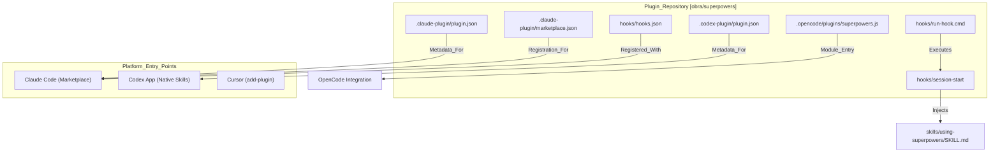
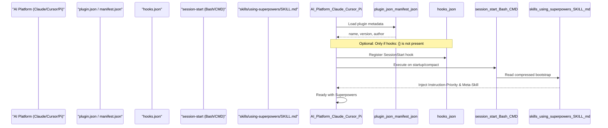

# Technical Reference

<details>
<summary>Relevant source files</summary>

The following files were used as context for generating this wiki page:

- [.claude-plugin/plugin.json](https://github.com/obra/superpowers/blob/HEAD/.claude-plugin/plugin.json)
- [.gitignore](https://github.com/obra/superpowers/blob/HEAD/.gitignore)
- [CLAUDE.md](https://github.com/obra/superpowers/blob/HEAD/CLAUDE.md)
- [README.md](https://github.com/obra/superpowers/blob/HEAD/README.md)
- [RELEASE-NOTES.md](https://github.com/obra/superpowers/blob/HEAD/RELEASE-NOTES.md)

</details>


This section provides low-level technical documentation for the Superpowers plugin infrastructure. It covers file system layout, configuration file formats, integration mechanisms, and version history. This material is intended for plugin developers, contributors implementing platform integrations, and users troubleshooting installation issues.

For information about the skills content and workflows, see [Core Concepts](08_3-core-concepts.md). For platform-specific integration details, see [Platform-Specific Features](20_5-platform-specific-features.md). For testing infrastructure, see [Testing Infrastructure](53_9-testing-infrastructure.md).

---

## Purpose and Scope

The Technical Reference documents the mechanical implementation of the Superpowers plugin system. This includes:

- **Directory structure** and file organization ([Directory Structure](59_10.1-directory-structure.md))
- **Configuration file formats** for plugin metadata, hooks, and commands ([Configuration Files](60_10.2-configuration-files.md))
- **Hook execution system** for session initialization ([Hooks System](61_10.3-hooks-system.md))
- **Deprecated commands** and the migration path to skills ([Deprecated Commands](62_10.4-deprecated-commands.md))
- **Environment variables** used across platforms ([Environment Variables](63_10.5-environment-variables.md))
- **Release history** and release notes ([Release History](64_10.6-release-history.md))

This page serves as a navigational overview. Individual subsections provide detailed specifications for each component.

---

## Repository Architecture

The Superpowers system is designed as a multi-platform plugin that bridges a single skills library across various AI environments. It utilizes a shared `skills/` directory and platform-specific entry points. As of v6.1.0, the architecture has shifted away from external hooks for platforms with native skill discovery (like Codex) to reduce UX friction.

### Diagram: File System Layout and Technical Components



**Sources:** [.claude-plugin/plugin.json:1-20](https://github.com/obra/superpowers/blob/HEAD/.claude-plugin/plugin.json#L1-L20), [RELEASE-NOTES.md:7-9](https://github.com/obra/superpowers/blob/HEAD/RELEASE-NOTES.md#L7-L9), [RELEASE-NOTES.md:25-27](https://github.com/obra/superpowers/blob/HEAD/RELEASE-NOTES.md#L25-L27), [README.md:36-186](https://github.com/obra/superpowers/blob/HEAD/README.md#L36-L186)

---

## Configuration File Relationships

The plugin uses multiple configuration files that interact to provide cross-platform functionality. Recent versions (v6.0.0+) have focused on vendor-neutral tool calls and optimized bootstrap payloads to lower per-session token costs.

### Diagram: Configuration Loading and Integration Flow



**Sources:** [RELEASE-NOTES.md:18-22](https://github.com/obra/superpowers/blob/HEAD/RELEASE-NOTES.md#L18-L22), [RELEASE-NOTES.md:7-8](https://github.com/obra/superpowers/blob/HEAD/RELEASE-NOTES.md#L7-L8), [.claude-plugin/plugin.json:1-4](https://github.com/obra/superpowers/blob/HEAD/.claude-plugin/plugin.json#L1-L4), [README.md:186-186](https://github.com/obra/superpowers/blob/HEAD/README.md#L186)

---

## Key Directories and Their Purposes

The repository layout organizes platform-specific integrations and shared skill logic. Note that scratch files for Subagent-Driven Development (SDD) have moved from `.git/` to `.superpowers/` to avoid protection errors in Claude Code.

| Directory | Purpose | Key Files |
|-----------|---------|-----------|
| `.claude-plugin/` | Claude Code plugin metadata and marketplace info | `plugin.json`, `marketplace.json` |
| `.codex-plugin/` | Codex-specific metadata for native skill discovery | `plugin.json` |
| `.superpowers/sdd/` | SDD scratch files (Task briefs, reports, progress ledger) | `sdd-workspace` helper |
| `hooks/` | Session lifecycle hooks and cross-platform wrappers | `hooks.json`, `run-hook.cmd`, `session-start` |
| `skills/` | The core library of AI workflows and task templates | `using-superpowers/`, `brainstorming/`, `writing-plans/` |
| `tests/` | Test suites for skills and infrastructure | `run-skill-tests.sh`, `test-helpers.sh` |
| `scripts/` | Maintenance and packaging utilities | `package-codex-plugin.sh`, `bump-version.sh` |

For a full breakdown of the repository layout, see [Directory Structure](59_10.1-directory-structure.md).

**Sources:** [RELEASE-NOTES.md:36-38](https://github.com/obra/superpowers/blob/HEAD/RELEASE-NOTES.md#L36-L38), [RELEASE-NOTES.md:12-12](https://github.com/obra/superpowers/blob/HEAD/RELEASE-NOTES.md#L12), [RELEASE-NOTES.md:7-8](https://github.com/obra/superpowers/blob/HEAD/RELEASE-NOTES.md#L7-L8), [.claude-plugin/plugin.json:1-20](https://github.com/obra/superpowers/blob/HEAD/.claude-plugin/plugin.json#L1-L20), [README.md:190-204](https://github.com/obra/superpowers/blob/HEAD/README.md#L190-L204)

---

## Plugin Metadata and Versioning

The `plugin.json` file provides essential metadata for marketplace integration. Superpowers follows semantic versioning. The `readSuperpowersVersion()` function provides a fallback to `.codex-plugin/plugin.json` when `package.json` is absent in packaged environments.

```json
{
  "name": "superpowers",
  "description": "Core skills library for Claude Code...",
  "version": "6.1.1",
  "author": { "name": "Jesse Vincent", ... }
}
```

For details on configuration schemas, see [Configuration Files](60_10.2-configuration-files.md). For the full evolution of the project, see [Release History](64_10.6-release-history.md).

**Sources:** [.claude-plugin/plugin.json:1-20](https://github.com/obra/superpowers/blob/HEAD/.claude-plugin/plugin.json#L1-L20), [RELEASE-NOTES.md:3-4](https://github.com/obra/superpowers/blob/HEAD/RELEASE-NOTES.md#L3-L4), [RELEASE-NOTES.md:48-48](https://github.com/obra/superpowers/blob/HEAD/RELEASE-NOTES.md#L48)

---

## Hooks and Session Lifecycle

The `SessionStart` hook remains the primary entry point for context injection on many platforms, though Codex now uses native discovery with an explicit `hooks: {}` to disable the auto-discovery fallback.

- **Triggering:** Fires on session initialization to inject the `using-superpowers` bootstrap.
- **Optimization:** v6.1.0 compressed the bootstrap by replacing graphviz diagrams with prose and folding sections to lower token costs ([RELEASE-NOTES.md:18-22](https://github.com/obra/superpowers/blob/HEAD/RELEASE-NOTES.md#L18-L22)).
- **Platform Adaptation:** The system has pruned verbose tool-mapping references, retaining only harness-specific notes for subagent dispatch and task tracking ([RELEASE-NOTES.md:21-21](https://github.com/obra/superpowers/blob/HEAD/RELEASE-NOTES.md#L21)).
- **Worktree Isolation:** The `using-git-worktrees` skill now defaults to local `.worktrees/` within the project instead of a global configuration directory ([RELEASE-NOTES.md:62-63](https://github.com/obra/superpowers/blob/HEAD/RELEASE-NOTES.md#L62-L63)).

For a deep dive into the hook lifecycle, see [Hooks System](61_10.3-hooks-system.md).

**Sources:** [RELEASE-NOTES.md:7-8](https://github.com/obra/superpowers/blob/HEAD/RELEASE-NOTES.md#L7-L8), [RELEASE-NOTES.md:18-22](https://github.com/obra/superpowers/blob/HEAD/RELEASE-NOTES.md#L18-L22), [RELEASE-NOTES.md:62-63](https://github.com/obra/superpowers/blob/HEAD/RELEASE-NOTES.md#L62-L63), [README.md:186-186](https://github.com/obra/superpowers/blob/HEAD/README.md#L186)

---

## Environment Variables

The plugin relies on environment variables for path resolution and platform-specific logic:

| Variable | Purpose |
|----------|---------|
| `CLAUDE_PLUGIN_ROOT` | Root directory of the installed plugin in Claude Code. |
| `CURSOR_PLUGIN_ROOT` | Root directory in Cursor; used for platform detection. |
| `SUPERPOWERS_SKILLS_ROOT` | Path to the core skills library used for discovery. |

For a complete reference, see [Environment Variables](63_10.5-environment-variables.md).

**Sources:** [RELEASE-NOTES.md:18-22](https://github.com/obra/superpowers/blob/HEAD/RELEASE-NOTES.md#L18-L22), [README.md:180-184](https://github.com/obra/superpowers/blob/HEAD/README.md#L180-L184)

---

## Deprecated Commands and Platforms

- **Gemini CLI:** Support was removed on 2026-06-18 following Google's EOL of the CLI ([RELEASE-NOTES.md:30-31](https://github.com/obra/superpowers/blob/HEAD/RELEASE-NOTES.md#L30-L31)).
- **Global Worktrees:** The use of `~/.config/superpowers/worktrees/` is deprecated in favor of project-local `.worktrees/` ([RELEASE-NOTES.md:62-63](https://github.com/obra/superpowers/blob/HEAD/RELEASE-NOTES.md#L62-L63)).
- **Reviewer Prompts:** Legacy `spec-reviewer-prompt.md` and `code-quality-reviewer-prompt.md` are replaced by a single `task-reviewer-prompt.md` ([RELEASE-NOTES.md:61-61](https://github.com/obra/superpowers/blob/HEAD/RELEASE-NOTES.md#L61)).

For migration paths and a list of legacy commands, see [Deprecated Commands](62_10.4-deprecated-commands.md).

**Sources:** [RELEASE-NOTES.md:30-31](https://github.com/obra/superpowers/blob/HEAD/RELEASE-NOTES.md#L30-L31), [RELEASE-NOTES.md:61-63](https://github.com/obra/superpowers/blob/HEAD/RELEASE-NOTES.md#L61-L63)

---

## Release History Overview

The project has evolved through several major architectural phases:

- **v6.1.1**: Added deterministic packaging for Codex and fixed hook auto-discovery bugs ([RELEASE-NOTES.md:3-12](https://github.com/obra/superpowers/blob/HEAD/RELEASE-NOTES.md#L3-L12)).
- **v6.1.0**: Compressed bootstrap for lower token costs and removed Gemini CLI support ([RELEASE-NOTES.md:14-31](https://github.com/obra/superpowers/blob/HEAD/RELEASE-NOTES.md#L14-L31)).
- **v6.0.0**: Major SDD rewrite (one reviewer per task), added support for Kimi Code, Pi, and Antigravity ([RELEASE-NOTES.md:51-71](https://github.com/obra/superpowers/blob/HEAD/RELEASE-NOTES.md#L51-L71)).

For the comprehensive log of changes, see [Release History](64_10.6-release-history.md).

**Sources:** [RELEASE-NOTES.md:1-80](https://github.com/obra/superpowers/blob/HEAD/RELEASE-NOTES.md#L1-L80), [.claude-plugin/plugin.json:4-4](https://github.com/obra/superpowers/blob/HEAD/.claude-plugin/plugin.json#L4)