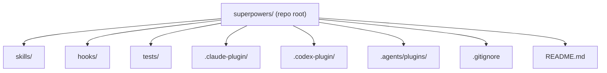
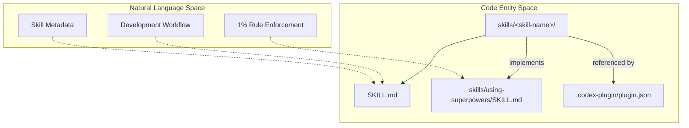
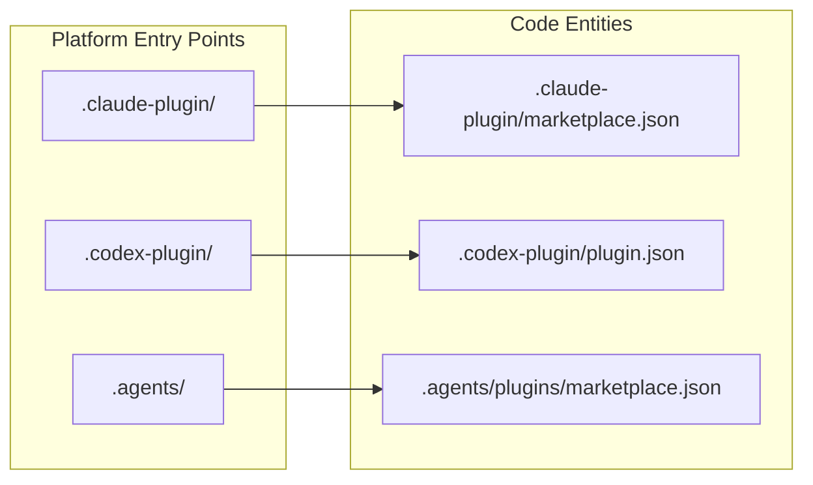

# Directory Structure

Relevant source files

The following files were used as context for generating this wiki page:

- [.agents/plugins/marketplace.json](https://github.com/obra/superpowers/blob/HEAD/.agents/plugins/marketplace.json)
- [.claude-plugin/marketplace.json](https://github.com/obra/superpowers/blob/HEAD/.claude-plugin/marketplace.json)
- [.codex-plugin/plugin.json](https://github.com/obra/superpowers/blob/HEAD/.codex-plugin/plugin.json)
- [.gitignore](https://github.com/obra/superpowers/blob/HEAD/.gitignore)
- [CLAUDE.md](https://github.com/obra/superpowers/blob/HEAD/CLAUDE.md)
- [README.md](https://github.com/obra/superpowers/blob/HEAD/README.md)
- [tests/codex/test-marketplace-manifest.sh](https://github.com/obra/superpowers/blob/HEAD/tests/codex/test-marketplace-manifest.sh)

This page documents the layout of the `obra/superpowers` repository and describes the purpose of each directory. It covers platform integration files, the skills library layout, and development configuration as of version 6.1.1.

---

## Top-Level Layout

The root of the repository is organized around platform-specific plugin directories (prefixed with `.`), the core skills library, and development configuration. The repository uses a multi-platform architecture where a single set of skills is exposed to various AI agents through platform-specific manifests.

**Top-level directory structure**

Sources: [.gitignore:1-8](https://github.com/obra/superpowers/blob/HEAD/.gitignore#L1-L8), [README.md:1-184](https://github.com/obra/superpowers/blob/HEAD/README.md#L1-L184), [.claude-plugin/marketplace.json:1-20](https://github.com/obra/superpowers/blob/HEAD/.claude-plugin/marketplace.json#L1-L20), [.codex-plugin/plugin.json:1-48](https://github.com/obra/superpowers/blob/HEAD/.codex-plugin/plugin.json#L1-L48)

---

## Core Skills Library

The `skills/` directory is the heart of the Superpowers system. It contains the modular units of AI guidance that define the development methodology.

### `skills/`

Each subdirectory within `skills/` represents a specific capability (e.g., `brainstorming`, `test-driven-development`). Every skill directory contains a `SKILL.md` file which acts as the entry point for the AI agent.

**Skill Definition Mapping**

*   **`SKILL.md`**: Contains instructions for the AI agent to execute specific workflows like `brainstorming` or `writing-plans` [README.md:190-194](https://github.com/obra/superpowers/blob/HEAD/README.md#L190-L194).
*   **Skill Discovery**: Platforms like Codex use the `skills` field in their manifest to point to this directory for automatic discovery [ .codex-plugin/plugin.json:23-23](https://github.com/obra/superpowers/blob/HEAD/.codex-plugin/plugin.json#L23).
*   **Meta-Skills**: The `using-superpowers` skill acts as the root of the hierarchy, enforcing the "1% rule" and providing the basic workflow instructions [README.md:186-187](https://github.com/obra/superpowers/blob/HEAD/README.md#L186-L187).

Sources: [README.md:188-204](https://github.com/obra/superpowers/blob/HEAD/README.md#L188-L204), [.codex-plugin/plugin.json:23-23](https://github.com/obra/superpowers/blob/HEAD/.codex-plugin/plugin.json#L23)

---

## Platform Integration Directories

Superpowers integrates with multiple AI platforms using specific configuration files located at the root or in hidden directories.

**Platform Entry Point Mapping**

### `.claude-plugin/`
Contains configuration for the Claude Code marketplace integration. The `marketplace.json` defines the plugin name, version (6.1.1), and source location [ .claude-plugin/marketplace.json:1-20](https://github.com/obra/superpowers/blob/HEAD/.claude-plugin/marketplace.json#L1-L20).

### `.codex-plugin/`
Contains the manifest for Codex App and Codex CLI. It defines capabilities (Interactive, Read, Write), brand assets, and points to the `skills/` directory [ .codex-plugin/plugin.json:1-48](https://github.com/obra/superpowers/blob/HEAD/.codex-plugin/plugin.json#L1-L48). It explicitly declares an empty `hooks` object to suppress default hook auto-discovery in favor of Superpowers' custom logic [tests/codex/test-marketplace-manifest.sh:69-73](https://github.com/obra/superpowers/blob/HEAD/tests/codex/test-marketplace-manifest.sh#L69-L73).

### `.agents/plugins/`
Used for development and testing of marketplace manifests. The `marketplace.json` here defines a "Superpowers Dev" entry used during integration testing [ .agents/plugins/marketplace.json:1-20](https://github.com/obra/superpowers/blob/HEAD/.agents/plugins/marketplace.json#L1-L20).

### `hooks/`
Contains scripts for session initialization. For example, `hooks/hooks.json` tracks the Claude Code `SessionStart` hook [tests/codex/test-marketplace-manifest.sh:65-67](https://github.com/obra/superpowers/blob/HEAD/tests/codex/test-marketplace-manifest.sh#L65-L67).

Sources: [README.md:36-157](https://github.com/obra/superpowers/blob/HEAD/README.md#L36-L157), [.claude-plugin/marketplace.json:1-20](https://github.com/obra/superpowers/blob/HEAD/.claude-plugin/marketplace.json#L1-L20), [.codex-plugin/plugin.json:1-48](https://github.com/obra/superpowers/blob/HEAD/.codex-plugin/plugin.json#L1-L48), [tests/codex/test-marketplace-manifest.sh:1-76](https://github.com/obra/superpowers/blob/HEAD/tests/codex/test-marketplace-manifest.sh#L1-L76)

---

## Development and Environment Configuration

The repository includes standard configuration files to manage the development environment and ensure workflow isolation.

### `.gitignore`
The ignore file is specifically configured to support the `using-git-worktrees` skill, which requires isolated environments for development branches.

| Pattern | Purpose |
|---|---|
| `.worktrees/` | Stores isolated git worktrees used by the `using-git-worktrees` skill [.gitignore:1-1](https://github.com/obra/superpowers/blob/HEAD/.gitignore#L1). |
| `.private-journal/` | Local notes and logs not intended for version control [.gitignore:2-2](https://github.com/obra/superpowers/blob/HEAD/.gitignore#L2). |
| `.claude/` | Local configuration and session data for Claude Code [.gitignore:3-3](https://github.com/obra/superpowers/blob/HEAD/.gitignore#L3). |
| `node_modules/` | Standard Node.js dependency directory [.gitignore:6-6](https://github.com/obra/superpowers/blob/HEAD/.gitignore#L6). |
| `evals/` | Ignored directory for the evaluation harness repository [.gitignore:13-13](https://github.com/obra/superpowers/blob/HEAD/.gitignore#L13). |

Sources: [.gitignore:1-14](https://github.com/obra/superpowers/blob/HEAD/.gitignore#L1-L14), [README.md:192-192](https://github.com/obra/superpowers/blob/HEAD/README.md#L192)

---

## Summary of Directory Roles

| Directory/File | Role | Key Files |
|---|---|---|
| `skills/` | The core library of AI development workflows. | `SKILL.md` |
| `.claude-plugin/` | Claude Code marketplace and plugin configuration. | `marketplace.json` |
| `.codex-plugin/` | Codex-specific manifest and capabilities. | `plugin.json` |
| `hooks/` | Scripts for session initialization and lifecycle management. | `hooks.json` |
| `tests/` | Automated validation of skills and platform integrations. | `test-marketplace-manifest.sh` |
| `.agents/` | Internal agent/marketplace testing configurations. | `plugins/marketplace.json` |
| `.gitignore` | Manages environment isolation (especially for worktrees). | `.gitignore` |

Sources: [README.md:1-204](https://github.com/obra/superpowers/blob/HEAD/README.md#L1-L204), [.gitignore:1-14](https://github.com/obra/superpowers/blob/HEAD/.gitignore#L1-L14), [.codex-plugin/plugin.json:1-48](https://github.com/obra/superpowers/blob/HEAD/.codex-plugin/plugin.json#L1-L48), [.claude-plugin/marketplace.json:1-20](https://github.com/obra/superpowers/blob/HEAD/.claude-plugin/marketplace.json#L1-L20)