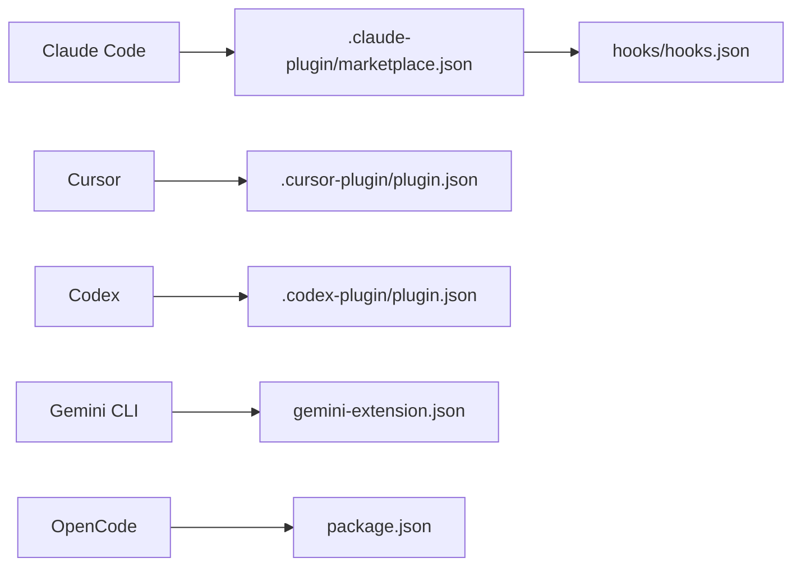
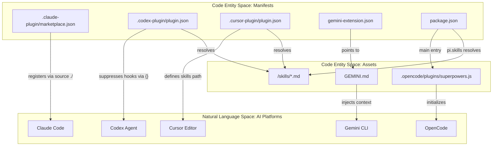

# Configuration Files

Relevant source files

The following files were used as context for generating this wiki page:

- [.agents/plugins/marketplace.json](https://github.com/obra/superpowers/blob/HEAD/.agents/plugins/marketplace.json)
- [.claude-plugin/marketplace.json](https://github.com/obra/superpowers/blob/HEAD/.claude-plugin/marketplace.json)
- [.codex-plugin/plugin.json](https://github.com/obra/superpowers/blob/HEAD/.codex-plugin/plugin.json)
- [.cursor-plugin/plugin.json](https://github.com/obra/superpowers/blob/HEAD/.cursor-plugin/plugin.json)
- [gemini-extension.json](https://github.com/obra/superpowers/blob/HEAD/gemini-extension.json)
- [package.json](https://github.com/obra/superpowers/blob/HEAD/package.json)
- [tests/codex/test-marketplace-manifest.sh](https://github.com/obra/superpowers/blob/HEAD/tests/codex/test-marketplace-manifest.sh)

This page documents the static configuration files that define how the superpowers plugin integrates with each supported AI coding platform. It covers manifest files, marketplace registration, hook wiring, and platform-specific extension definitions for Claude Code, Codex, Cursor, OpenCode, and Gemini CLI.

For the runtime hook execution logic triggered by these configurations, see [10.3 Hooks System](61_10.3-hooks-system.md). For the directory layout that these files live in, see [10.1 Directory Structure](59_10.1-directory-structure.md).

---

## File Map

**Configuration files by role:**

Configuration file relationship to platforms:

Sources: [.cursor-plugin/plugin.json:1-23](https://github.com/obra/superpowers/blob/HEAD/.cursor-plugin/plugin.json#L1-L23), [gemini-extension.json:1-6](https://github.com/obra/superpowers/blob/HEAD/gemini-extension.json#L1-L6), [package.json:1-23](https://github.com/obra/superpowers/blob/HEAD/package.json#L1-L23), [.codex-plugin/plugin.json:1-48](https://github.com/obra/superpowers/blob/HEAD/.codex-plugin/plugin.json#L1-L48), [.claude-plugin/marketplace.json:1-20](https://github.com/obra/superpowers/blob/HEAD/.claude-plugin/marketplace.json#L1-L20)

---

## `.claude-plugin/marketplace.json`

This file serves as the development marketplace manifest for Claude Code. It defines the plugin's metadata for discovery within the Claude environment.

| Field | Value | Purpose |
|---|---|---|
| `name` | `"superpowers-dev"` | Marketplace identifier [[.claude-plugin/marketplace.json:2](https://github.com/obra/superpowers/blob/HEAD/[.claude-plugin/marketplace.json:2)] |
| `plugins[0].name` | `"superpowers"` | The specific plugin name within the marketplace [[.claude-plugin/marketplace.json:10](https://github.com/obra/superpowers/blob/HEAD/[.claude-plugin/marketplace.json:10)] |
| `plugins[0].version` | `"6.1.1"` | Current semantic version [[.claude-plugin/marketplace.json:12](https://github.com/obra/superpowers/blob/HEAD/[.claude-plugin/marketplace.json:12)] |
| `plugins[0].source` | `"./"` | Points to the local directory as the plugin source [[.claude-plugin/marketplace.json:13](https://github.com/obra/superpowers/blob/HEAD/[.claude-plugin/marketplace.json:13)] |

Sources: [.claude-plugin/marketplace.json:1-20](https://github.com/obra/superpowers/blob/HEAD/.claude-plugin/marketplace.json#L1-L20)

---

## `.codex-plugin/plugin.json`

The Codex manifest defines the integration for the Codex agentic framework. A critical implementation detail is the suppression of automatic hook discovery to ensure platform compatibility.

| Field | Value | Purpose |
|---|---|---|
| `name` | `"superpowers"` | Primary identifier [[.codex-plugin/plugin.json:2](https://github.com/obra/superpowers/blob/HEAD/[.codex-plugin/plugin.json:2)] |
| `version` | `"6.1.1"` | Current semantic version [[.codex-plugin/plugin.json:3](https://github.com/obra/superpowers/blob/HEAD/[.codex-plugin/plugin.json:3)] |
| `skills` | `"./skills/"` | Path for Codex to discover agentic skills [[.codex-plugin/plugin.json:23](https://github.com/obra/superpowers/blob/HEAD/[.codex-plugin/plugin.json:23)] |
| `hooks` | `{}` | **Critical**: Empty object to suppress `hooks/hooks.json` auto-discovery [[.codex-plugin/plugin.json:24](https://github.com/obra/superpowers/blob/HEAD/[.codex-plugin/plugin.json:24)] |
| `interface.capabilities` | `["Interactive", "Read", "Write"]` | Declared agent permissions [[.codex-plugin/plugin.json:31-35](https://github.com/obra/superpowers/blob/HEAD/[.codex-plugin/plugin.json:31-35)] |

**Note on Hooks Suppression:** Codex automatically looks for `hooks/hooks.json` if the `hooks` field is absent or null. Because the Claude Code `SessionStart` hook is incompatible with Codex's internal lifecycle, this manifest explicitly defines an empty object `{}` to prevent the fallback [[tests/codex/test-marketplace-manifest.sh:55-73](https://github.com/obra/superpowers/blob/HEAD/[tests/codex/test-marketplace-manifest.sh:55-73)].

Sources: [.codex-plugin/plugin.json:1-48](https://github.com/obra/superpowers/blob/HEAD/.codex-plugin/plugin.json#L1-L48), [tests/codex/test-marketplace-manifest.sh:55-73](https://github.com/obra/superpowers/blob/HEAD/tests/codex/test-marketplace-manifest.sh#L55-L73)

---

## `.cursor-plugin/plugin.json`

This file defines the core plugin metadata for Cursor. It identifies the plugin name, version, and provides the mapping for skills and hooks.

| Field | Value | Purpose |
|---|---|---|
| `name` | `"superpowers"` | Primary identifier for the plugin [[.cursor-plugin/plugin.json:2](https://github.com/obra/superpowers/blob/HEAD/[.cursor-plugin/plugin.json:2)] |
| `version` | `"6.1.1"` | Current semantic version of the library [[.cursor-plugin/plugin.json:5](https://github.com/obra/superpowers/blob/HEAD/[.cursor-plugin/plugin.json:5)] |
| `skills` | `"./skills/"` | Path to the skills directory [[.cursor-plugin/plugin.json:21](https://github.com/obra/superpowers/blob/HEAD/[.cursor-plugin/plugin.json:21)] |
| `hooks` | `"./hooks/hooks-cursor.json"` | Cursor-specific hook definitions in camelCase [[.cursor-plugin/plugin.json:22](https://github.com/obra/superpowers/blob/HEAD/[.cursor-plugin/plugin.json:22)] |

Sources: [.cursor-plugin/plugin.json:1-23](https://github.com/obra/superpowers/blob/HEAD/.cursor-plugin/plugin.json#L1-L23)

---

## `gemini-extension.json`

Gemini CLI integration relies on an extension manifest that points to a context file used for bootstrapping the session.

| Field | Value | Purpose |
|---|---|---|
| `name` | `"superpowers"` | Extension name [[gemini-extension.json:2](https://github.com/obra/superpowers/blob/HEAD/[gemini-extension.json:2)] |
| `version` | `"6.1.1"` | Extension version [[gemini-extension.json:4](https://github.com/obra/superpowers/blob/HEAD/[gemini-extension.json:4)] |
| `contextFileName` | `"GEMINI.md"` | The file Gemini CLI reads for session context [[gemini-extension.json:5](https://github.com/obra/superpowers/blob/HEAD/[gemini-extension.json:5)] |

Sources: [gemini-extension.json:1-6](https://github.com/obra/superpowers/blob/HEAD/gemini-extension.json#L1-L6)

---

## `package.json` (OpenCode & Node.js)

For OpenCode integration and general Node.js package identification, `package.json` defines the entry point and skill locations.

- `version`: `"6.1.1"` [[package.json:3](https://github.com/obra/superpowers/blob/HEAD/[package.json:3)]
- `main`: `".opencode/plugins/superpowers.js"` (The OpenCode plugin logic) [[package.json:6](https://github.com/obra/superpowers/blob/HEAD/[package.json:6)]
- `pi.skills`: `["./skills"]` (OpenCode-specific skill path registration) [[package.json:19-21](https://github.com/obra/superpowers/blob/HEAD/[package.json:19-21)]
- `pi.extensions`: `["./.pi/extensions/superpowers.ts"]` [[package.json:16-18](https://github.com/obra/superpowers/blob/HEAD/[package.json:16-18)]

Sources: [package.json:1-23](https://github.com/obra/superpowers/blob/HEAD/package.json#L1-L23)

---

## Configuration Logic Flow

The following diagram maps how different platforms consume these files to reach the execution layer and skill discovery.

Sources: [.claude-plugin/marketplace.json:13](https://github.com/obra/superpowers/blob/HEAD/.claude-plugin/marketplace.json#L13), [.codex-plugin/plugin.json:24](https://github.com/obra/superpowers/blob/HEAD/.codex-plugin/plugin.json#L24), [.cursor-plugin/plugin.json:21](https://github.com/obra/superpowers/blob/HEAD/.cursor-plugin/plugin.json#L21), [gemini-extension.json:5](https://github.com/obra/superpowers/blob/HEAD/gemini-extension.json#L5), [package.json:6](https://github.com/obra/superpowers/blob/HEAD/package.json#L6), [package.json:20](https://github.com/obra/superpowers/blob/HEAD/package.json#L20), [tests/codex/test-marketplace-manifest.sh:70-73](https://github.com/obra/superpowers/blob/HEAD/tests/codex/test-marketplace-manifest.sh#L70-L73)