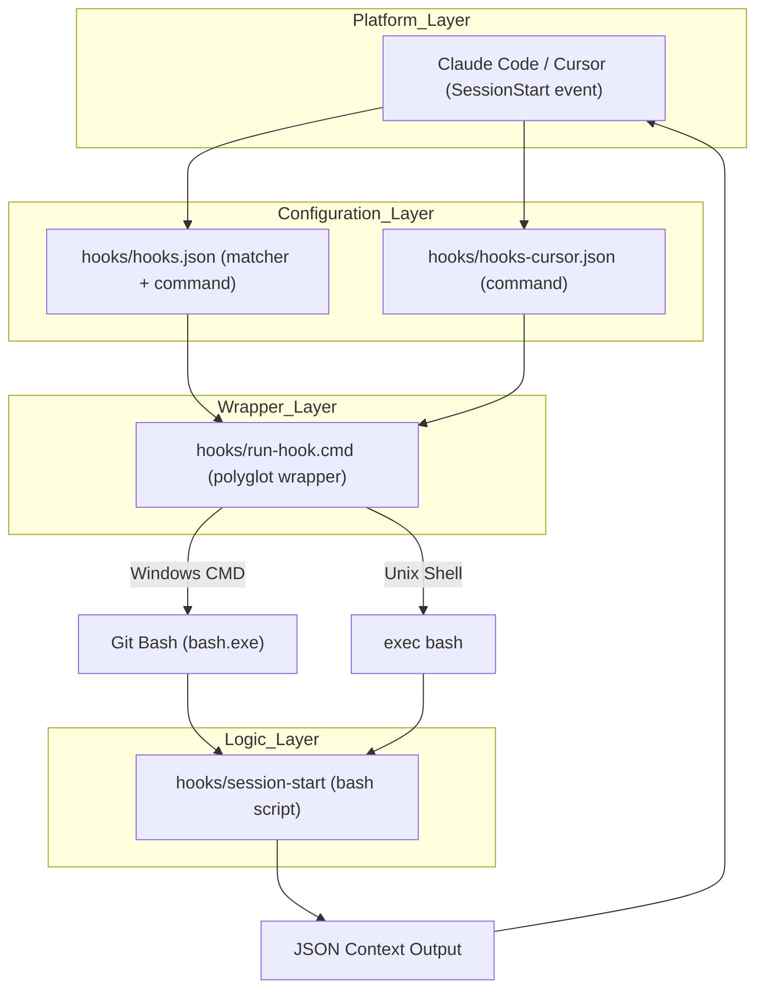
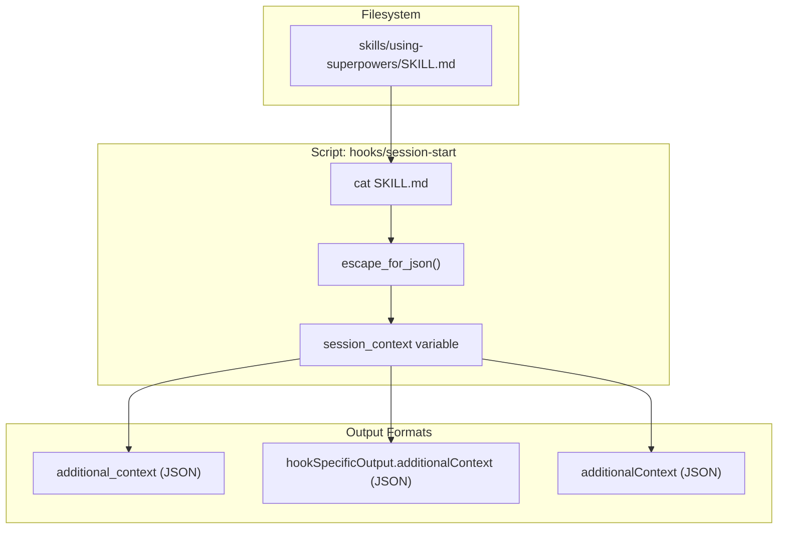

# Hooks System

Relevant source files

The following files were used as context for generating this wiki page:

- [.gitattributes](https://github.com/obra/superpowers/blob/HEAD/.gitattributes)
- [LICENSE](https://github.com/obra/superpowers/blob/HEAD/LICENSE)
- [docs/porting-to-a-new-harness.md](https://github.com/obra/superpowers/blob/HEAD/docs/porting-to-a-new-harness.md)
- [docs/windows/polyglot-hooks.md](https://github.com/obra/superpowers/blob/HEAD/docs/windows/polyglot-hooks.md)
- [hooks/hooks-cursor.json](https://github.com/obra/superpowers/blob/HEAD/hooks/hooks-cursor.json)
- [hooks/hooks.json](https://github.com/obra/superpowers/blob/HEAD/hooks/hooks.json)
- [hooks/run-hook.cmd](https://github.com/obra/superpowers/blob/HEAD/hooks/run-hook.cmd)
- [hooks/session-start](https://github.com/obra/superpowers/blob/HEAD/hooks/session-start)
- [tests/hooks/test-session-start.sh](https://github.com/obra/superpowers/blob/HEAD/tests/hooks/test-session-start.sh)

This page documents the Claude Code and Cursor hooks system as implemented in superpowers: the `hooks.json` configuration files, the `run-hook.cmd` polyglot wrapper, the `session-start` script, and the platform-specific JSON output logic. This covers the mechanism for injecting the `using-superpowers` meta-skill into active sessions.

---

## Overview

Claude Code's plugin hook system allows a plugin to inject context into a session at specific lifecycle events. Superpowers uses this to inject the `using-superpowers` meta-skill at session start. The hooks are defined in `hooks/hooks.json` (for Claude Code) and `hooks/hooks-cursor.json` (for Cursor), dispatched through `hooks/run-hook.cmd` (a polyglot wrapper for cross-platform compatibility), and implemented in `hooks/session-start` (a bash script).

**Hook Execution Lifecycle:**

Sources: [hooks/hooks.json:1-16](https://github.com/obra/superpowers/blob/HEAD/hooks/hooks.json#L1-L16), [hooks/hooks-cursor.json:1-11](https://github.com/obra/superpowers/blob/HEAD/hooks/hooks-cursor.json#L1-L11), [hooks/run-hook.cmd:1-47](https://github.com/obra/superpowers/blob/HEAD/hooks/run-hook.cmd#L1-L47), [hooks/session-start:1-50](https://github.com/obra/superpowers/blob/HEAD/hooks/session-start#L1-L50)

---

## Hook Configuration

Superpowers maintains separate configuration files for Claude Code and Cursor to handle differences in their hook registration schemas.

### Claude Code: hooks.json
The file `hooks/hooks.json` registers a single `SessionStart` hook rule [hooks/hooks.json:1-16](https://github.com/obra/superpowers/blob/HEAD/hooks/hooks.json#L1-L16):

| Field | Value | Description |
|---|---|---|
| `matcher` | `"startup\|clear\|compact"` | Regex matched against session trigger types [hooks/hooks.json:5](https://github.com/obra/superpowers/blob/HEAD/hooks/hooks.json#L5). |
| `type` | `"command"` | Execution mode for the hook [hooks/hooks.json:8](https://github.com/obra/superpowers/blob/HEAD/hooks/hooks.json#L8). |
| `command` | `"\"${CLAUDE_PLUGIN_ROOT}/hooks/run-hook.cmd\" session-start"` | The command string to execute [hooks/hooks.json:9](https://github.com/obra/superpowers/blob/HEAD/hooks/hooks.json#L9). |
| `async` | `false` | Hook runs synchronously to ensure context is injected before the first prompt [hooks/hooks.json:10](https://github.com/obra/superpowers/blob/HEAD/hooks/hooks.json#L10). |

### Cursor: hooks-cursor.json
The file `hooks/hooks-cursor.json` uses a camelCase schema and points directly to the hook script [hooks/hooks-cursor.json:1-11](https://github.com/obra/superpowers/blob/HEAD/hooks/hooks-cursor.json#L1-L11):

| Field | Value | Description |
|---|---|---|
| `version` | `1` | Schema version for Cursor hooks [hooks/hooks-cursor.json:2](https://github.com/obra/superpowers/blob/HEAD/hooks/hooks-cursor.json#L2). |
| `sessionStart` | array | List of commands for the session start event [hooks/hooks-cursor.json:4](https://github.com/obra/superpowers/blob/HEAD/hooks/hooks-cursor.json#L4). |
| `command` | `"./hooks/run-hook.cmd session-start"` | Path to the hook script relative to plugin root [hooks/hooks-cursor.json:6](https://github.com/obra/superpowers/blob/HEAD/hooks/hooks-cursor.json#L6). |

Sources: [hooks/hooks.json:1-16](https://github.com/obra/superpowers/blob/HEAD/hooks/hooks.json#L1-L16), [hooks/hooks-cursor.json:1-11](https://github.com/obra/superpowers/blob/HEAD/hooks/hooks-cursor.json#L1-L11)

---

## run-hook.cmd — Polyglot Wrapper

`hooks/run-hook.cmd` is a "polyglot" file valid in both Windows CMD and Unix bash [hooks/run-hook.cmd:1-47](https://github.com/obra/superpowers/blob/HEAD/hooks/run-hook.cmd#L1-L47). This is necessary because Claude Code on Windows executes hook commands via `cmd.exe`, which cannot natively run bash scripts (`.sh`) [docs/windows/polyglot-hooks.md:9-11](https://github.com/obra/superpowers/blob/HEAD/docs/windows/polyglot-hooks.md#L9-L11).

### The Polyglot Technique
The script uses a heredoc trick to hide bash code from CMD and vice-versa:
1. **Windows CMD**: Sees `: << 'CMDBLOCK'` as a label (`:`) and ignores the rest of the line [hooks/run-hook.cmd:1](https://github.com/obra/superpowers/blob/HEAD/hooks/run-hook.cmd#L1). It then executes the batch commands to find `bash.exe` and exits via `exit /b` [hooks/run-hook.cmd:23-39](https://github.com/obra/superpowers/blob/HEAD/hooks/run-hook.cmd#L23-L39).
2. **Unix Bash**: Sees `:` as a no-op and `<< 'CMDBLOCK'` as the start of a heredoc. It skips everything until the `CMDBLOCK` delimiter [hooks/run-hook.cmd:40](https://github.com/obra/superpowers/blob/HEAD/hooks/run-hook.cmd#L40) and executes the bash logic at the bottom [hooks/run-hook.cmd:42-47](https://github.com/obra/superpowers/blob/HEAD/hooks/run-hook.cmd#L42-L47).

### Windows Bash Discovery Logic
The wrapper attempts to locate `bash.exe` in common Git for Windows locations:
- `C:\Program Files\Git\bin\bash.exe` [hooks/run-hook.cmd:21-24](https://github.com/obra/superpowers/blob/HEAD/hooks/run-hook.cmd#L21-L24)
- `C:\Program Files (x86)\Git\bin\bash.exe` [hooks/run-hook.cmd:25-28](https://github.com/obra/superpowers/blob/HEAD/hooks/run-hook.cmd#L25-L28)
- `where bash` (system PATH) [hooks/run-hook.cmd:31-35](https://github.com/obra/superpowers/blob/HEAD/hooks/run-hook.cmd#L31-L35)

If no bash is found, it exits silently with code 0 to avoid breaking the plugin load [hooks/run-hook.cmd:37-39](https://github.com/obra/superpowers/blob/HEAD/hooks/run-hook.cmd#L37-L39).

Sources: [hooks/run-hook.cmd:1-47](https://github.com/obra/superpowers/blob/HEAD/hooks/run-hook.cmd#L1-L47), [docs/windows/polyglot-hooks.md:58-84](https://github.com/obra/superpowers/blob/HEAD/docs/windows/polyglot-hooks.md#L58-L84)

---

## session-start — Hook Implementation

`hooks/session-start` is the core logic for context injection [hooks/session-start:1-50](https://github.com/obra/superpowers/blob/HEAD/hooks/session-start#L1-L50). It performs three primary tasks: reading the meta-skill, escaping content for JSON, and emitting the correct schema for the host platform.

### JSON Escaping
Because the hook must run in environments where `jq` might not be installed (like a fresh Git Bash on Windows), it uses a pure-bash `escape_for_json` function [hooks/session-start:16-24](https://github.com/obra/superpowers/blob/HEAD/hooks/session-start#L16-L24). This function uses bash parameter substitution `${s//old/new}` to escape backslashes, quotes, and control characters (newlines, tabs, etc.) [hooks/session-start:18-22](https://github.com/obra/superpowers/blob/HEAD/hooks/session-start#L18-L22). This is significantly faster than character-by-character loops [hooks/session-start:14-15](https://github.com/obra/superpowers/blob/HEAD/hooks/session-start#L14-L15).

### Platform-Specific Output Logic
Different platforms expect different JSON structures. To avoid "double injection" (where a platform might read both fields), the script detects the environment via variables:

| Platform | Variable Check | JSON Field Emitted |
|---|---|---|
| **Cursor** | `[ -n "${CURSOR_PLUGIN_ROOT:-}" ]` | `additional_context` [hooks/session-start:38-40](https://github.com/obra/superpowers/blob/HEAD/hooks/session-start#L38-L40) |
| **Claude Code** | `[ -n "${CLAUDE_PLUGIN_ROOT:-}" ]` && `[ -z "${COPILOT_CLI:-}" ]` | `hookSpecificOutput.additionalContext` [hooks/session-start:41-43](https://github.com/obra/superpowers/blob/HEAD/hooks/session-start#L41-L43) |
| **Copilot CLI / Fallback** | Default/Other | `additionalContext` (top-level SDK standard) [hooks/session-start:44-46](https://github.com/obra/superpowers/blob/HEAD/hooks/session-start#L44-L46) |

The script uses `printf` instead of a heredoc for the final JSON output to work around a Bash 5.3+ bug where heredoc variable expansion hangs [hooks/session-start:36-37](https://github.com/obra/superpowers/blob/HEAD/hooks/session-start#L36-L37).

### Content Injection
The script injects the full content of `skills/using-superpowers/SKILL.md` [hooks/session-start:11](https://github.com/obra/superpowers/blob/HEAD/hooks/session-start#L11). This content is wrapped in `<EXTREMELY_IMPORTANT>` tags to ensure the model prioritizes the skill invocation protocol [hooks/session-start:27](https://github.com/obra/superpowers/blob/HEAD/hooks/session-start#L27).

**Data Flow: Skill Content to Platform Context**

Sources: [hooks/session-start:1-50](https://github.com/obra/superpowers/blob/HEAD/hooks/session-start#L1-L50), [docs/windows/polyglot-hooks.md:111-128](https://github.com/obra/superpowers/blob/HEAD/docs/windows/polyglot-hooks.md#L111-L128)

---

## Line Ending Requirements

The hooks system is sensitive to line endings because the polyglot wrapper must be parsed by both CMD (which prefers CRLF) and Bash (which requires LF for heredocs). Superpowers enforces **LF (Unix)** line endings for all hook files via `.gitattributes` to ensure the bash heredoc delimiters in `run-hook.cmd` and `session-start` are correctly recognized on all platforms [.gitattributes:1-7](https://github.com/obra/superpowers/blob/HEAD/.gitattributes#L1-L7).

Sources: [.gitattributes:1-7](https://github.com/obra/superpowers/blob/HEAD/.gitattributes#L1-L7), [docs/windows/polyglot-hooks.md:89-94](https://github.com/obra/superpowers/blob/HEAD/docs/windows/polyglot-hooks.md#L89-L94)54:T