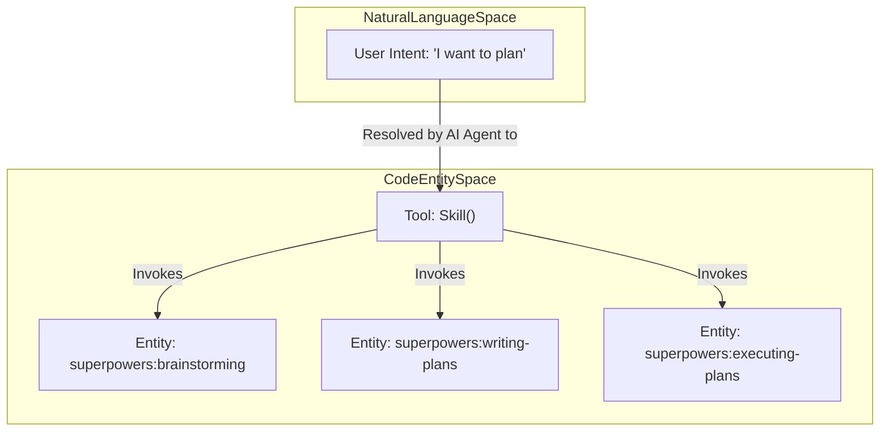
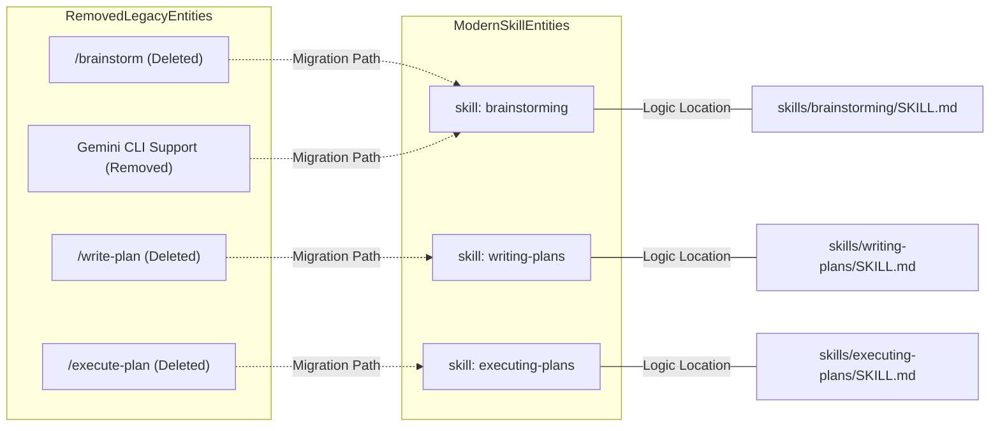

# Deprecated Commands

Relevant source files

The following files were used as context for generating this wiki page:

- [.claude-plugin/plugin.json](https://github.com/obra/superpowers/blob/HEAD/.claude-plugin/plugin.json)
- [RELEASE-NOTES.md](https://github.com/obra/superpowers/blob/HEAD/RELEASE-NOTES.md)

## Purpose and Scope

This page documents the removal of legacy slash commands and the transition to a modular skills-based architecture in Superpowers. As of version 5.1.0, the stub commands (`/brainstorm`, `/write-plan`, `/execute-plan`) were removed from the codebase. Furthermore, as of version 6.1.0, the Gemini CLI harness itself has been deprecated and removed following its end-of-life by Google [RELEASE-NOTES.md:30-31](https://github.com/obra/superpowers/blob/HEAD/RELEASE-NOTES.md#L30-L31). This documentation details the implementation of these removals, the technical rationale for the shift, and the migration path to the current skill-based workflow.

---

## Overview

The Superpowers system originally utilized a set of slash commands to trigger specific workflow phases. These commands were first deprecated (becoming stubs that redirected users) and then removed to streamline the codebase and enforce the use of the skills discovery system. This shift allows for better discovery, versioning, and cross-platform compatibility across Claude Code, Cursor, Codex, OpenCode, and previously Gemini CLI.

**Removed Commands and Replacements:**

| Command | Status | Replacement Skill | Replacement Description |
|:---|:---|:---|:---|
| `/brainstorm` | **REMOVED** | `superpowers:brainstorming` | Refines ideas, explores alternatives, and saves design docs |
| `/write-plan` | **REMOVED** | `superpowers:writing-plans` | Breaks work into bite-sized tasks with exact file paths |
| `/execute-plan` | **REMOVED** | `superpowers:executing-plans` | Batch execution with human checkpoints |

**Sources:** [RELEASE-NOTES.md:7-7](https://github.com/obra/superpowers/blob/HEAD/RELEASE-NOTES.md#L7), [RELEASE-NOTES.md:30-31](https://github.com/obra/superpowers/blob/HEAD/RELEASE-NOTES.md#L30-L31)

---

## Implementation of Removal

In version 5.1.0, the legacy slash commands were deleted. Previously, these existed as files in a `commands/` directory that served as redirection stubs. The removal was part of a larger cleanup effort to eliminate "legacy slash command stubs that did nothing but tell the user to invoke the corresponding skill" [RELEASE-NOTES.md:7-7](https://github.com/obra/superpowers/blob/HEAD/RELEASE-NOTES.md#L7).

### Command-to-Skill Transition Architecture

The following diagram illustrates how the system has moved from a command-file-based architecture to a dynamic skill-invocation model.

**Diagram: Modern Skill Invocation Flow**

**Key Changes in v5.1.0 and v6.1.0:**
*   **Legacy Stubs Deleted**: Files previously located in `commands/` are gone [RELEASE-NOTES.md:7-7](https://github.com/obra/superpowers/blob/HEAD/RELEASE-NOTES.md#L7).
*   **Direct Skill Invocation**: Agents are now required to invoke skills directly (e.g., `superpowers:brainstorming`) instead of relying on slash command aliases [RELEASE-NOTES.md:7-7](https://github.com/obra/superpowers/blob/HEAD/RELEASE-NOTES.md#L7).
*   **Harness Deprecation**: Support for Gemini CLI was removed in v6.1.0; its tool-mapping reference and extension manifests were deleted [RELEASE-NOTES.md:30-31](https://github.com/obra/superpowers/blob/HEAD/RELEASE-NOTES.md#L30-L31).
*   **Named Agent Removal**: Alongside command removal, the `superpowers:code-reviewer` named agent was removed in favor of `Task(general-purpose)` with a specific prompt template [RELEASE-NOTES.md:61-62](https://github.com/obra/superpowers/blob/HEAD/RELEASE-NOTES.md#L61-L62).

**Sources:** [RELEASE-NOTES.md:7-8](https://github.com/obra/superpowers/blob/HEAD/RELEASE-NOTES.md#L7-L8), [RELEASE-NOTES.md:30-31](https://github.com/obra/superpowers/blob/HEAD/RELEASE-NOTES.md#L30-L31), [RELEASE-NOTES.md:61-62](https://github.com/obra/superpowers/blob/HEAD/RELEASE-NOTES.md#L61-L62)

---

## Migration Path to Skills

The migration replaces static slash commands with dynamic skill invocation. This transition is essential for the system's modular architecture and mandatory workflow enforcement.

### Mapping Legacy Entities to Modern Entities

The following diagram maps the removed file-based commands and deprecated platforms to their modern functional equivalents in the skills library.

**Diagram: Legacy Entity Mapping**

### Detailed Migration Steps for Users and Agents

1.  **Brainstorming**: Instead of `/brainstorm`, invoke `superpowers:brainstorming` [RELEASE-NOTES.md:7-7](https://github.com/obra/superpowers/blob/HEAD/RELEASE-NOTES.md#L7). This skill handles scope assessment and design documentation.
2.  **Planning**: Instead of `/write-plan`, invoke `superpowers:writing-plans` [RELEASE-NOTES.md:7-7](https://github.com/obra/superpowers/blob/HEAD/RELEASE-NOTES.md#L7). This skill decomposes work into structured tasks.
3.  **Execution**: Instead of `/execute-plan`, invoke `superpowers:executing-plans` [RELEASE-NOTES.md:7-7](https://github.com/obra/superpowers/blob/HEAD/RELEASE-NOTES.md#L7). This skill manages batch execution and parallel session logic.
4.  **Code Review**: Any logic previously calling `Task (superpowers:code-reviewer)` must now switch to `Task (general-purpose)` using the template `task-reviewer-prompt.md` which replaced the separate spec and quality reviewer prompts in v6.0.0 [RELEASE-NOTES.md:53-62](https://github.com/obra/superpowers/blob/HEAD/RELEASE-NOTES.md#L53-L62).

**Sources:** [RELEASE-NOTES.md:7-8](https://github.com/obra/superpowers/blob/HEAD/RELEASE-NOTES.md#L7-L8), [RELEASE-NOTES.md:30-31](https://github.com/obra/superpowers/blob/HEAD/RELEASE-NOTES.md#L30-L31), [RELEASE-NOTES.md:53-62](https://github.com/obra/superpowers/blob/HEAD/RELEASE-NOTES.md#L53-L62)

---

## Rationale for Removal

The move from slash commands to skills was driven by the need for a more robust and extensible architecture:

*   **Platform Agnostic**: Skills are invoked via discovery mechanisms (like the `Skill` tool) that work across multiple platforms (Claude Code, Cursor, Codex, etc.) rather than relying on platform-specific slash command implementations [RELEASE-NOTES.md:18-22](https://github.com/obra/superpowers/blob/HEAD/RELEASE-NOTES.md#L18-L22).
*   **Reduced Overhead**: Removing the `commands/` directory stubs reduces cognitive load for the AI agent and prevents confusion between command-based and skill-based triggering [RELEASE-NOTES.md:7-7](https://github.com/obra/superpowers/blob/HEAD/RELEASE-NOTES.md#L7).
*   **Unified Tooling**: By consolidating named agents into skill-based task templates, the system ensures a single source of truth for personas and checklists [RELEASE-NOTES.md:61-62](https://github.com/obra/superpowers/blob/HEAD/RELEASE-NOTES.md#L61-L62).
*   **Maintenance**: Removing EOL platforms like Gemini CLI reduces the maintenance burden and prevents users from attempting to install non-functional extensions [RELEASE-NOTES.md:30-31](https://github.com/obra/superpowers/blob/HEAD/RELEASE-NOTES.md#L30-L31).

**Sources:** [RELEASE-NOTES.md:7-7](https://github.com/obra/superpowers/blob/HEAD/RELEASE-NOTES.md#L7), [RELEASE-NOTES.md:18-22](https://github.com/obra/superpowers/blob/HEAD/RELEASE-NOTES.md#L18-L22), [RELEASE-NOTES.md:30-31](https://github.com/obra/superpowers/blob/HEAD/RELEASE-NOTES.md#L30-L31), [RELEASE-NOTES.md:61-62](https://github.com/obra/superpowers/blob/HEAD/RELEASE-NOTES.md#L61-L62)