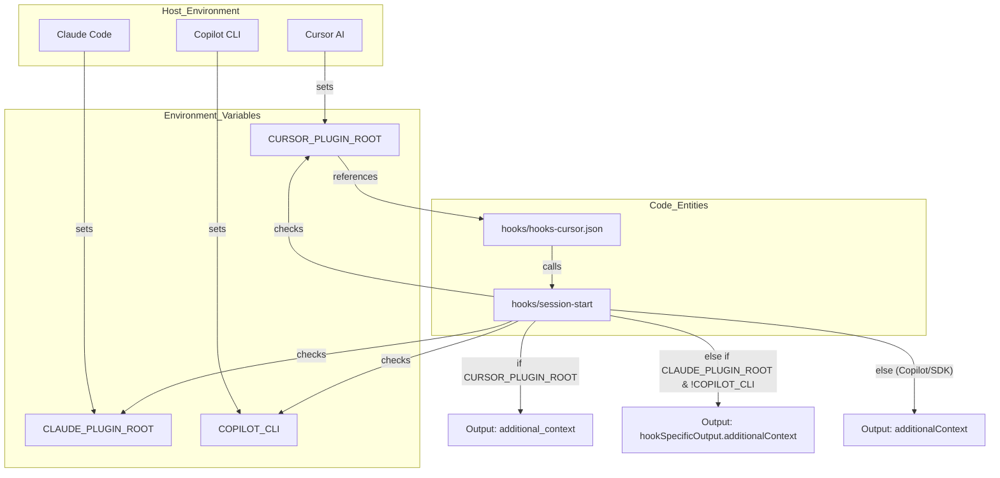
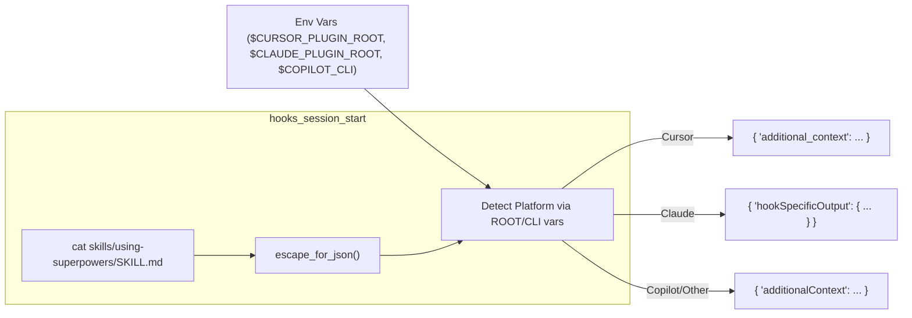

# Environment Variables

Relevant source files

The following files were used as context for generating this wiki page:

- [.gitignore](https://github.com/obra/superpowers/blob/HEAD/.gitignore)
- [CLAUDE.md](https://github.com/obra/superpowers/blob/HEAD/CLAUDE.md)
- [README.md](https://github.com/obra/superpowers/blob/HEAD/README.md)
- [hooks/hooks-cursor.json](https://github.com/obra/superpowers/blob/HEAD/hooks/hooks-cursor.json)
- [hooks/session-start](https://github.com/obra/superpowers/blob/HEAD/hooks/session-start)
- [skills/brainstorming/scripts/server.cjs](https://github.com/obra/superpowers/blob/HEAD/skills/brainstorming/scripts/server.cjs)
- [skills/brainstorming/scripts/start-server.sh](https://github.com/obra/superpowers/blob/HEAD/skills/brainstorming/scripts/start-server.sh)

This page documents every environment variable that the Superpowers system reads, sets, or depends on. It covers variables used at runtime by hook scripts, platform plugins, the skill discovery system, and the visual brainstorming companion.

---

## Runtime Variables

These variables are set by the host platform or the user's shell and are read by the plugin at runtime to determine paths, execution context, and output formats.

### `CLAUDE_PLUGIN_ROOT`

| Property | Value |
|---|---|
| **Set by** | Claude Code (automatically, when executing hooks) |
| **Read by** | `hooks/hooks-cursor.json`, `hooks/session-start` |
| **Type** | Absolute filesystem path |
| **Required** | Yes, when running under Claude Code |

Claude Code sets `CLAUDE_PLUGIN_ROOT` to the absolute path of the installed plugin directory before executing any hook command. The `session-start` script uses this variable as a detection for the Claude Code platform [hooks/session-start:41-43](https://github.com/obra/superpowers/blob/HEAD/hooks/session-start#L41-L43).

**Sources:** [hooks/session-start:41-43](https://github.com/obra/superpowers/blob/HEAD/hooks/session-start#L41-L43)

---

### `CURSOR_PLUGIN_ROOT`

| Property | Value |
|---|---|
| **Set by** | Cursor (automatically, when executing hooks) |
| **Read by** | `hooks/session-start` |
| **Type** | Absolute filesystem path |
| **Required** | No; used for platform detection |

The `hooks/session-start` script checks for the presence of `CURSOR_PLUGIN_ROOT` to determine if it is running within the Cursor environment [hooks/session-start:38](https://github.com/obra/superpowers/blob/HEAD/hooks/session-start#L38). If detected, the script emits the context injection in the `additional_context` (snake_case) format required by Cursor [hooks/session-start:38-40](https://github.com/obra/superpowers/blob/HEAD/hooks/session-start#L38-L40).

**Sources:** [hooks/session-start:38-40](https://github.com/obra/superpowers/blob/HEAD/hooks/session-start#L38-L40)

---

### `COPILOT_CLI`

| Property | Value |
|---|---|
| **Set by** | Copilot CLI (v1.0.11+) |
| **Read by** | `hooks/session-start` |
| **Type** | Boolean/String (e.g., "1") |
| **Required** | No; used for platform detection |

The `hooks/session-start` script uses this variable to identify Copilot CLI environments. When `COPILOT_CLI` is set, the script follows the SDK standard format by outputting a top-level `additionalContext` field [hooks/session-start:41-46](https://github.com/obra/superpowers/blob/HEAD/hooks/session-start#L41-L46).

**Sources:** [hooks/session-start:41-46](https://github.com/obra/superpowers/blob/HEAD/hooks/session-start#L41-L46)

---

## Brainstorming Companion Variables

The visual brainstorming companion (`skills/brainstorming/scripts/server.cjs`) uses several environment variables to configure its network binding, security, and lifecycle.

### Network and Binding

| Variable | Description | Default |
|---|---|---|
| `BRAINSTORM_HOST` | Interface to bind the server to [skills/brainstorming/scripts/server.cjs:100](https://github.com/obra/superpowers/blob/HEAD/skills/brainstorming/scripts/server.cjs#L100). | `127.0.0.1` |
| `BRAINSTORM_PORT` | Explicit port for the WebSocket/HTTP server [skills/brainstorming/scripts/server.cjs:90](https://github.com/obra/superpowers/blob/HEAD/skills/brainstorming/scripts/server.cjs#L90). | Random high port |
| `BRAINSTORM_URL_HOST` | Hostname used when generating the access URL [skills/brainstorming/scripts/server.cjs:101](https://github.com/obra/superpowers/blob/HEAD/skills/brainstorming/scripts/server.cjs#L101). | `localhost` (if 127.0.0.1) |

### Security and State

| Variable | Description |
|---|---|
| `BRAINSTORM_TOKEN` | Per-session secret key for authentication [skills/brainstorming/scripts/server.cjs:134](https://github.com/obra/superpowers/blob/HEAD/skills/brainstorming/scripts/server.cjs#L134). | Generated randomly |
| `BRAINSTORM_DIR` | Directory for session content and state files [skills/brainstorming/scripts/server.cjs:102](https://github.com/obra/superpowers/blob/HEAD/skills/brainstorming/scripts/server.cjs#L102). | `/tmp/brainstorm` |
| `BRAINSTORM_PORT_FILE` | Path to persist the bound port for session reconnection [skills/brainstorming/scripts/server.cjs:85](https://github.com/obra/superpowers/blob/HEAD/skills/brainstorming/scripts/server.cjs#L85). | `null` |
| `BRAINSTORM_TOKEN_FILE` | Path to persist the session token [skills/brainstorming/scripts/server.cjs:123](https://github.com/obra/superpowers/blob/HEAD/skills/brainstorming/scripts/server.cjs#L123). | `null` |

### Lifecycle Control

| Variable | Description |
|---|---|
| `BRAINSTORM_OWNER_PID` | PID of the parent harness. Server self-terminates if this PID disappears [skills/brainstorming/scripts/server.cjs:113](https://github.com/obra/superpowers/blob/HEAD/skills/brainstorming/scripts/server.cjs#L113). | `null` |
| `BRAINSTORM_IDLE_TIMEOUT_MS` | Shutdown trigger if no activity is detected [skills/brainstorming/scripts/start-server.sh:79](https://github.com/obra/superpowers/blob/HEAD/skills/brainstorming/scripts/start-server.sh#L79). | 4 hours (240m) |

**Sources:** [skills/brainstorming/scripts/server.cjs:85-113](https://github.com/obra/superpowers/blob/HEAD/skills/brainstorming/scripts/server.cjs#L85-L113), [skills/brainstorming/scripts/start-server.sh:79-80](https://github.com/obra/superpowers/blob/HEAD/skills/brainstorming/scripts/start-server.sh#L79-L80)

---

## Telemetry Control

Superpowers respects privacy settings through the following variables. If any are set to a truthy value, telemetry is disabled [skills/brainstorming/scripts/server.cjs:112](https://github.com/obra/superpowers/blob/HEAD/skills/brainstorming/scripts/server.cjs#L112).

- `SUPERPOWERS_DISABLE_TELEMETRY`
- `DISABLE_TELEMETRY`
- `CLAUDE_CODE_DISABLE_NONESSENTIAL_TRAFFIC`

**Sources:** [skills/brainstorming/scripts/server.cjs:107-112](https://github.com/obra/superpowers/blob/HEAD/skills/brainstorming/scripts/server.cjs#L107-L112)

---

## Platform Detection and Logic Flow

Environment variables drive the logic for context injection during session startup. The system must differentiate between platforms to provide the correct JSON output schema.

**Diagram: Runtime Variable Resolution and Hook Execution**

**Sources:** [hooks/hooks-cursor.json:4-9](https://github.com/obra/superpowers/blob/HEAD/hooks/hooks-cursor.json#L4-L9), [hooks/session-start:38-47](https://github.com/obra/superpowers/blob/HEAD/hooks/session-start#L38-L47)

---

## Data Flow: Variable to Context Injection

The following diagram illustrates how environment variables determine the final payload sent back to the AI assistant during the `SessionStart` event.

**Diagram: Environment-Driven Context Injection Flow**

**Sources:** [hooks/session-start:11-27](https://github.com/obra/superpowers/blob/HEAD/hooks/session-start#L11-L27), [hooks/session-start:38-47](https://github.com/obra/superpowers/blob/HEAD/hooks/session-start#L38-L47)

---

## Variable Summary Table

| Variable | Platform | Set by | Purpose |
|---|---|---|---|
| `CLAUDE_PLUGIN_ROOT` | Claude Code | Host App | Defines base path for plugin assets [hooks/session-start:41](https://github.com/obra/superpowers/blob/HEAD/hooks/session-start#L41). |
| `CURSOR_PLUGIN_ROOT` | Cursor | Host App | Triggers Cursor-specific JSON output format [hooks/session-start:38](https://github.com/obra/superpowers/blob/HEAD/hooks/session-start#L38). |
| `COPILOT_CLI` | Copilot CLI | Host App | Triggers SDK-standard JSON output format [hooks/session-start:41](https://github.com/obra/superpowers/blob/HEAD/hooks/session-start#L41). |
| `BRAINSTORM_DIR` | Brainstorming | Script/User | Root for visual companion session data [skills/brainstorming/scripts/server.cjs:102](https://github.com/obra/superpowers/blob/HEAD/skills/brainstorming/scripts/server.cjs#L102). |
| `BRAINSTORM_TOKEN` | Brainstorming | Script/User | Authenticates WebSocket/HTTP requests [skills/brainstorming/scripts/server.cjs:134](https://github.com/obra/superpowers/blob/HEAD/skills/brainstorming/scripts/server.cjs#L134). |

**Sources:** [hooks/session-start:38-47](https://github.com/obra/superpowers/blob/HEAD/hooks/session-start#L38-L47), [skills/brainstorming/scripts/server.cjs:100-134](https://github.com/obra/superpowers/blob/HEAD/skills/brainstorming/scripts/server.cjs#L100-L134)