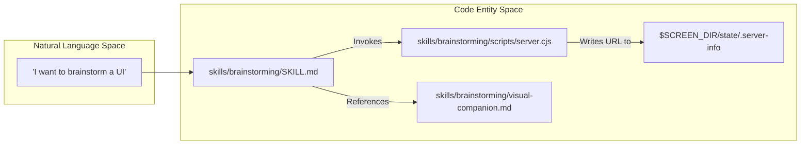
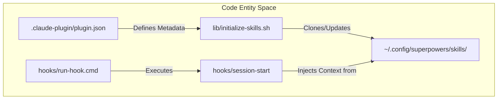

# Release History

Relevant source files

The following files were used as context for generating this wiki page:

- [.claude-plugin/plugin.json](https://github.com/obra/superpowers/blob/HEAD/.claude-plugin/plugin.json)
- [RELEASE-NOTES.md](https://github.com/obra/superpowers/blob/HEAD/RELEASE-NOTES.md)
- [scripts/bump-version.sh](https://github.com/obra/superpowers/blob/HEAD/scripts/bump-version.sh)

This page documents the complete version history of the Superpowers plugin from v1.0.0 through v6.1.1. Each release includes breaking changes, new features, architectural shifts, and technical bug fixes.

**Sources:** [RELEASE-NOTES.md:1-125](https://github.com/obra/superpowers/blob/HEAD/RELEASE-NOTES.md#L1-L125), [.claude-plugin/plugin.json:4-4](https://github.com/obra/superpowers/blob/HEAD/.claude-plugin/plugin.json#L4)

---

## v6.1.x Series (July 2026)

The v6.1.x series focuses on optimizing per-session token overhead, streamlining harness support, and hardening the Codex distribution package.

### v6.1.1 (2026-07-02)

**Codex Hook Resolution:**
- **Explicit Hook Declaration** — v6.1.0 previously removed the Codex hook configuration. However, Codex's auto-discovery mechanism fell back to `hooks/hooks.json` (the Claude Code manifest) and re-registered the `SessionStart` hook. The Codex manifest now explicitly declares `hooks: {}` to prevent this fallback. [RELEASE-NOTES.md:7-7](https://github.com/obra/superpowers/blob/HEAD/RELEASE-NOTES.md#L7)
- **Dead Code Removal** — `hooks/session-start-codex` and its associated tests were deleted as Codex now uses native skill discovery. [RELEASE-NOTES.md:8-8](https://github.com/obra/superpowers/blob/HEAD/RELEASE-NOTES.md#L8)

**Packaging Automation:**
- **`package-codex-plugin.sh`** — A new maintainer script for building deterministic Codex "portal" archives. It normalizes timestamps, preserves executable bits, and verifies OpenAI metadata for every skill. [RELEASE-NOTES.md:12-12](https://github.com/obra/superpowers/blob/HEAD/RELEASE-NOTES.md#L12)

**Sources:** [RELEASE-NOTES.md:3-13](https://github.com/obra/superpowers/blob/HEAD/RELEASE-NOTES.md#L3-L13)

### v6.1.0 (2026-06-30)

**Token Cost Optimization:**
- **Bootstrap Compression** — The `using-superpowers` bootstrap was trimmed to reduce per-session costs. The Graphviz skill-flow diagram was replaced with prose, and platform-specific "How to Access Skills" walkthroughs were removed. [RELEASE-NOTES.md:20-20](https://github.com/obra/superpowers/blob/HEAD/RELEASE-NOTES.md#L20)
- **Tool-Mapping Pruning** — Redundant action-to-tool tables were removed from harness references. `claude-code-tools.md` and `copilot-tools.md` were deleted as they contained no harness-specific logic. [RELEASE-NOTES.md:21-21](https://github.com/obra/superpowers/blob/HEAD/RELEASE-NOTES.md#L21)

**Harness Changes:**
- **Gemini CLI EOL** — Following Google's EOL of Gemini CLI on 2026-06-18, all support, documentation, and tool-mapping references for Gemini were removed. [RELEASE-NOTES.md:30-31](https://github.com/obra/superpowers/blob/HEAD/RELEASE-NOTES.md#L30-L31)
- **Codex Marketplace** — Added a repo-local `.agents/plugins/marketplace.json` to allow Codex to install the plugin directly from the marketplace. [RELEASE-NOTES.md:25-25](https://github.com/obra/superpowers/blob/HEAD/RELEASE-NOTES.md#L25)

**Sources:** [RELEASE-NOTES.md:14-31](https://github.com/obra/superpowers/blob/HEAD/RELEASE-NOTES.md#L14-L31)

---

## v6.0.x Series (June 2026)

The v6.0.x series introduced a major rewrite of the review process and expanded support to several new AI harnesses.

### v6.0.0 (2026-06-16)

**Subagent-Driven Development (SDD) Rewrite:**
- **Consolidated Reviewers** — The separate `spec-reviewer-prompt.md` and `code-quality-reviewer-prompt.md` were merged into a single `task-reviewer-prompt.md`. This change reduced token usage by ~50% in evaluation benchmarks. [RELEASE-NOTES.md:53-56](https://github.com/obra/superpowers/blob/HEAD/RELEASE-NOTES.md#L53-L56), [RELEASE-NOTES.md:61-61](https://github.com/obra/superpowers/blob/HEAD/RELEASE-NOTES.md#L61)
- **SDD Scratch Space** — To avoid Claude Code's protection of the `.git/` directory, SDD scratch files (task briefs, reports, progress ledgers) moved to a git-ignored `.superpowers/sdd/` directory. [RELEASE-NOTES.md:36-36](https://github.com/obra/superpowers/blob/HEAD/RELEASE-NOTES.md#L36)

**New Harness Support:**
- **Kimi Code**: Added plugin manifest and marketplace support. [RELEASE-NOTES.md:68-68](https://github.com/obra/superpowers/blob/HEAD/RELEASE-NOTES.md#L68)
- **Pi**: Implemented a session-start extension for native skill injection. [RELEASE-NOTES.md:69-69](https://github.com/obra/superpowers/blob/HEAD/RELEASE-NOTES.md#L69)
- **Antigravity (`agy`)**: Direct plugin installation with first-message bootstrapping. [RELEASE-NOTES.md:70-70](https://github.com/obra/superpowers/blob/HEAD/RELEASE-NOTES.md#L70)

**Breaking Changes:**
- **Worktree Location** — The global worktree directory `~/.config/superpowers/worktrees/` was removed. Worktrees now default to a project-local `.worktrees/` directory. [RELEASE-NOTES.md:62-62](https://github.com/obra/superpowers/blob/HEAD/RELEASE-NOTES.md#L62)

**Sources:** [RELEASE-NOTES.md:32-71](https://github.com/obra/superpowers/blob/HEAD/RELEASE-NOTES.md#L32-L71)

---

## v5.1.x Series (April 2026)

### v5.1.0 (2026-04-30)

**Removals and Consolidation:**
- **Legacy slash commands removed** — Removed stubs for `/brainstorm`, `/execute-plan`, and `/write-plan`. [RELEASE-NOTES.md:7-7](https://github.com/obra/superpowers/blob/HEAD/RELEASE-NOTES.md#L7)
- **Code Reviewer Agent Consolidation** — Merged `superpowers:code-reviewer` persona into `skills/requesting-code-review/code-reviewer.md`. [RELEASE-NOTES.md:8-8](https://github.com/obra/superpowers/blob/HEAD/RELEASE-NOTES.md#L8)

**Worktree Skills Rewrite:**
- **Environment Detection** — Added `GIT_DIR != GIT_COMMON` checks to detect linked worktrees. [RELEASE-NOTES.md:15-15](https://github.com/obra/superpowers/blob/HEAD/RELEASE-NOTES.md#L15)
- **Consent-based Workflow** — Explicit user consent now required for worktree creation. [RELEASE-NOTES.md:16-16](https://github.com/obra/superpowers/blob/HEAD/RELEASE-NOTES.md#L16)

**Sources:** [RELEASE-NOTES.md:3-66](https://github.com/obra/superpowers/blob/HEAD/RELEASE-NOTES.md#L3-L66)

---

## v5.0.0 (2026-03-09)

### Visual Brainstorming Companion
Introduced a browser-based companion for brainstorming sessions to display mockups and diagrams.

**Visual Companion Architecture:**

**Sources:** [RELEASE-NOTES.md:137-145](https://github.com/obra/superpowers/blob/HEAD/RELEASE-NOTES.md#L137-L145), [RELEASE-NOTES.md:29-29](https://github.com/obra/superpowers/blob/HEAD/RELEASE-NOTES.md#L29)

---

## v2.0.0 (2025-10-12)

### Repository Separation
Transformed Superpowers into a lightweight shim that clones a dedicated skills repository into `~/.config/superpowers/skills/`.

**Plugin Bootstrapping Flow:**

**Sources:** [RELEASE-NOTES.md:774-915](https://github.com/obra/superpowers/blob/HEAD/RELEASE-NOTES.md#L774-L915), [.claude-plugin/plugin.json:1-13](https://github.com/obra/superpowers/blob/HEAD/.claude-plugin/plugin.json#L1-L13), [hooks/run-hook.cmd:1-47](https://github.com/obra/superpowers/blob/HEAD/hooks/run-hook.cmd#L1-L47)

---

## Version Metadata Summary

| Version | Release Date | Primary Focus |
|---------|--------------|---------------|
| v6.1.1  | 2026-07-02   | Codex Hook Fixes & Packaging |
| v6.1.0  | 2026-06-30   | Token Optimization & Gemini EOL |
| v6.0.0  | 2026-06-16   | SDD Rewrite & New Harnesses |
| v5.1.0  | 2026-04-30   | Legacy Removal & Worktree Safety |
| v5.0.0  | 2026-03-09   | Visual Companion & Review Loops |
| v2.0.0  | 2025-10-12   | Repository Separation |

**Sources:** [RELEASE-NOTES.md:1-125](https://github.com/obra/superpowers/blob/HEAD/RELEASE-NOTES.md#L1-L125), [.claude-plugin/plugin.json:4-4](https://github.com/obra/superpowers/blob/HEAD/.claude-plugin/plugin.json#L4)57:T2381,# Glossary

<detail