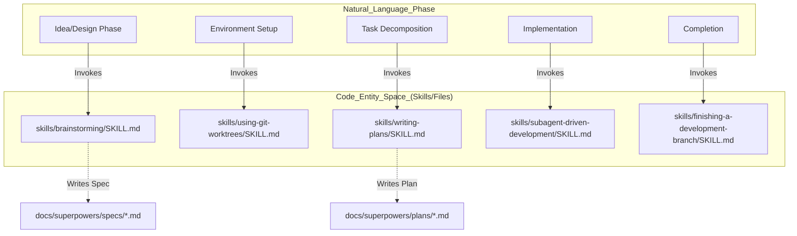
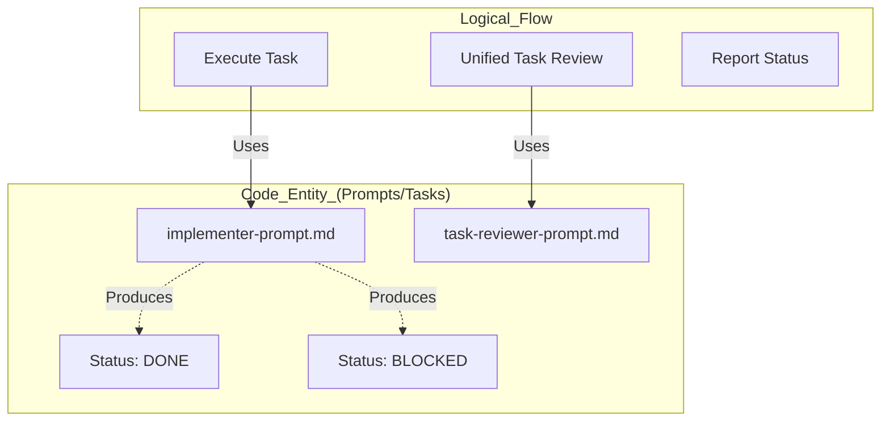

# Glossary

Relevant source files

The following files were used as context for generating this wiki page:

- [.claude-plugin/plugin.json](https://github.com/obra/superpowers/blob/HEAD/.claude-plugin/plugin.json)
- [.gitignore](https://github.com/obra/superpowers/blob/HEAD/.gitignore)
- [CLAUDE.md](https://github.com/obra/superpowers/blob/HEAD/CLAUDE.md)
- [README.md](https://github.com/obra/superpowers/blob/HEAD/README.md)
- [RELEASE-NOTES.md](https://github.com/obra/superpowers/blob/HEAD/RELEASE-NOTES.md)
- [docs/superpowers/specs/2026-06-09-sdd-task-scoped-review-dispatch-design.md](https://github.com/obra/superpowers/blob/HEAD/docs/superpowers/specs/2026-06-09-sdd-task-scoped-review-dispatch-design.md)
- [skills/brainstorming/SKILL.md](https://github.com/obra/superpowers/blob/HEAD/skills/brainstorming/SKILL.md)
- [skills/executing-plans/SKILL.md](https://github.com/obra/superpowers/blob/HEAD/skills/executing-plans/SKILL.md)
- [skills/subagent-driven-development/SKILL.md](https://github.com/obra/superpowers/blob/HEAD/skills/subagent-driven-development/SKILL.md)
- [skills/subagent-driven-development/implementer-prompt.md](https://github.com/obra/superpowers/blob/HEAD/skills/subagent-driven-development/implementer-prompt.md)
- [skills/subagent-driven-development/task-reviewer-prompt.md](https://github.com/obra/superpowers/blob/HEAD/skills/subagent-driven-development/task-reviewer-prompt.md)
- [skills/writing-plans/SKILL.md](https://github.com/obra/superpowers/blob/HEAD/skills/writing-plans/SKILL.md)
- [skills/writing-skills/SKILL.md](https://github.com/obra/superpowers/blob/HEAD/skills/writing-skills/SKILL.md)
- [skills/writing-skills/anthropic-best-practices.md](https://github.com/obra/superpowers/blob/HEAD/skills/writing-skills/anthropic-best-practices.md)

This page provides definitions for codebase-specific terms, jargon, and domain concepts used within the Superpowers system. It serves as a technical reference for onboarding engineers to understand the relationships between high-level workflow concepts and their underlying code implementations.

## Core System Terms

### Skill
A **Skill** is a modular, reusable unit of AI guidance. Unlike standard prompts, skills are structured documentation following a specific lifecycle (TDD for documentation) and are stored as `SKILL.md` files within the `skills/` directory [README.md:188-202](https://github.com/obra/superpowers/blob/HEAD/README.md#L188-L202). Each skill contains frontmatter for discovery and a body defining the process flow [skills/brainstorming/SKILL.md:1-4](https://github.com/obra/superpowers/blob/HEAD/skills/brainstorming/SKILL.md#L1-L4).

*   **Implementation:** Defined by the existence of a `SKILL.md` file in a subdirectory of `skills/` [README.md:188-202](https://github.com/obra/superpowers/blob/HEAD/README.md#L188-L202).
*   **Discovery:** The system uses platform-specific tools like the Claude Code `Skill` tool, or the `activate_skill` tool in other harnesses, to search and load these files [skills/subagent-driven-development/SKILL.md:66-66](https://github.com/obra/superpowers/blob/HEAD/skills/subagent-driven-development/SKILL.md#L66).

### The 1% Rule (Mandatory Skill Check)
A core behavioral protocol requiring the AI agent to invoke the `Skill` tool if there is even a "1% chance" a skill might apply to the current task. This is enforced by the `using-superpowers` meta-skill.

*   **Logic:** Enforced via the `using-superpowers` skill which shapes all subsequent agent behavior [README.md:186-186](https://github.com/obra/superpowers/blob/HEAD/README.md#L186).
*   **Enforcement:** This rule ensures that the agent checks for relevant skills before every major action [README.md:204-204](https://github.com/obra/superpowers/blob/HEAD/README.md#L204).

### Subagent-Driven Development (SDD)
A workflow where a "coordinator" agent delegates individual tasks from an implementation plan to "fresh" subagents. Each subagent has an isolated context to prevent "context pollution" (token bloat and memory interference) [skills/subagent-driven-development/SKILL.md:10-12](https://github.com/obra/superpowers/blob/HEAD/skills/subagent-driven-development/SKILL.md#L10-L12).

*   **Implementation:** Orchestrated via the `subagent-driven-development` skill [skills/subagent-driven-development/SKILL.md:6-8](https://github.com/obra/superpowers/blob/HEAD/skills/subagent-driven-development/SKILL.md#L6-L8).
*   **Review Loop:** v6.0.0 replaced the two-reviewer flow with a single task reviewer that provides two verdicts: spec compliance and code quality [RELEASE-NOTES.md:53-61](https://github.com/obra/superpowers/blob/HEAD/RELEASE-NOTES.md#L53-L61).

### Hard-Gate
A synchronization point in the workflow that prevents the agent from proceeding to the next phase (e.g., from design to coding) without explicit user approval or a successful automated check [skills/brainstorming/SKILL.md:12-14](https://github.com/obra/superpowers/blob/HEAD/skills/brainstorming/SKILL.md#L12-L14).

*   **Example:** The `brainstorming` skill contains a `<HARD-GATE>` that forbids implementation until a design is approved [skills/brainstorming/SKILL.md:12-14](https://github.com/obra/superpowers/blob/HEAD/skills/brainstorming/SKILL.md#L12-L14).

### Spec/Plan Self-Review
The system utilizes inline self-review checklists for specs and plans to catch placeholders and inconsistencies.

*   **Brainstorming:** Uses a "Spec Self-Review" checklist (placeholder scan, consistency, scope, ambiguity) [skills/brainstorming/SKILL.md:111-119](https://github.com/obra/superpowers/blob/HEAD/skills/brainstorming/SKILL.md#L111-L119).
*   **Writing Plans:** Uses a "Self-Review" checklist (spec coverage, placeholder scan, type consistency) [skills/writing-plans/SKILL.md:144-155](https://github.com/obra/superpowers/blob/HEAD/skills/writing-plans/SKILL.md#L144-L155).

---

## Technical Entities & Components

### Brainstorm Server (Visual Companion)
A browser-based companion for agents to present complex design questions or diagrams to the user [skills/brainstorming/SKILL.md:25-25](https://github.com/obra/superpowers/blob/HEAD/skills/brainstorming/SKILL.md#L25).

*   **Implementation:** Offered during the `brainstorming` checklist when a question would be clearer shown than described [skills/brainstorming/SKILL.md:22-25](https://github.com/obra/superpowers/blob/HEAD/skills/brainstorming/SKILL.md#L22-L25).
*   **Version Fallback:** In packaged Codex plugins, it falls back to `.codex-plugin/plugin.json` to determine its version [RELEASE-NOTES.md:47-48](https://github.com/obra/superpowers/blob/HEAD/RELEASE-NOTES.md#L47-L48).

### Tool Mapping Layer
A translation layer that allows skills written with Claude Code tool names to function on other platforms.

*   **Evolution:** v6.1.0 pruned many per-harness tool-mapping references as modern agents have become better at following generic guidance [RELEASE-NOTES.md:21-21](https://github.com/obra/superpowers/blob/HEAD/RELEASE-NOTES.md#L21).
*   **Platform Specifics:** Kimi Code, Pi, and Antigravity each ship their own bootstrap and tool-mapping references [RELEASE-NOTES.md:65-71](https://github.com/obra/superpowers/blob/HEAD/RELEASE-NOTES.md#L65-L71).

### Session-Start Hook
A script or extension that runs at the beginning of an AI session to inject the Superpowers context (specifically the `using-superpowers` instructions) into the conversation history.

*   **Pi Integration:** Registers skills and injects the bootstrap at session startup and after compaction [README.md:186-186](https://github.com/obra/superpowers/blob/HEAD/README.md#L186).
*   **Codex Change:** As of v6.1.0, Codex no longer ships a SessionStart hook, relying instead on native skill discovery [RELEASE-NOTES.md:26-26](https://github.com/obra/superpowers/blob/HEAD/RELEASE-NOTES.md#L26).
*   **Hook Discovery:** Codex uses an explicit `hooks: {}` in its manifest to avoid falling back to auto-discovering Claude Code hooks [RELEASE-NOTES.md:7-7](https://github.com/obra/superpowers/blob/HEAD/RELEASE-NOTES.md#L7).

---

## Conceptual Architecture Diagrams

### From Workflow Phase to Code Entity
This diagram maps the natural language phases of development to the specific skills and files that govern them.

Title: Workflow Phase to Code Mapping

Sources: [README.md:190-202](https://github.com/obra/superpowers/blob/HEAD/README.md#L190-L202), [skills/brainstorming/SKILL.md:106-106](https://github.com/obra/superpowers/blob/HEAD/skills/brainstorming/SKILL.md#L106), [skills/writing-plans/SKILL.md:18-18](https://github.com/obra/superpowers/blob/HEAD/skills/writing-plans/SKILL.md#L18)

### Subagent Lifecycle and Review Flow
This diagram maps the logical "Review" concept to the specific prompt files and status codes used during Subagent-Driven Development.

Title: SDD Review Logic to File Mapping

Sources: [RELEASE-NOTES.md:61-61](https://github.com/obra/superpowers/blob/HEAD/RELEASE-NOTES.md#L61), [skills/subagent-driven-development/implementer-prompt.md:1-127](https://github.com/obra/superpowers/blob/HEAD/skills/subagent-driven-development/implementer-prompt.md#L1-L127), [skills/subagent-driven-development/task-reviewer-prompt.md:1-10](https://github.com/obra/superpowers/blob/HEAD/skills/subagent-driven-development/task-reviewer-prompt.md#L1-L10)

---

## Table of Domain Abbreviations

| Abbreviation | Full Term | Definition | Code/Context |
| :--- | :--- | :--- | :--- |
| **SDO** | Skill Discovery Optimization | Techniques to ensure the AI finds the correct skill via the `description` field. | [skills/writing-skills/SKILL.md:140-142](https://github.com/obra/superpowers/blob/HEAD/skills/writing-skills/SKILL.md#L140-L142) |
| **SDD** | Subagent-Driven Development | Delegating tasks to isolated sub-processes with unified per-task review. | [skills/subagent-driven-development/SKILL.md:6-12](https://github.com/obra/superpowers/blob/HEAD/skills/subagent-driven-development/SKILL.md#L6-L12), [RELEASE-NOTES.md:53-55](https://github.com/obra/superpowers/blob/HEAD/RELEASE-NOTES.md#L53-L55) |
| **TDD** | Test-Driven Development | Red-Green-Refactor cycle applied to code and skill documentation. | [README.md:198-198](https://github.com/obra/superpowers/blob/HEAD/README.md#L198), [skills/writing-skills/SKILL.md:10-18](https://github.com/obra/superpowers/blob/HEAD/skills/writing-skills/SKILL.md#L10-L18) |
| **YAGNI** | You Aren't Gonna Need It | Principle of avoiding over-engineering and building only what is requested. | [README.md:22-22](https://github.com/obra/superpowers/blob/HEAD/README.md#L22), [skills/subagent-driven-development/implementer-prompt.md:95-96](https://github.com/obra/superpowers/blob/HEAD/skills/subagent-driven-development/implementer-prompt.md#L95-L96) |
| **DRY** | Don't Repeat Yourself | Principle of reducing repetition in plans and code. | [README.md:22-22](https://github.com/obra/superpowers/blob/HEAD/README.md#L22), [skills/writing-plans/SKILL.md:10-10](https://github.com/obra/superpowers/blob/HEAD/skills/writing-plans/SKILL.md#L10) |

Sources: [README.md:22-22](https://github.com/obra/superpowers/blob/HEAD/README.md#L22), [skills/writing-plans/SKILL.md:10-10](https://github.com/obra/superpowers/blob/HEAD/skills/writing-plans/SKILL.md#L10), [skills/subagent-driven-development/SKILL.md:6-12](https://github.com/obra/superpowers/blob/HEAD/skills/subagent-driven-development/SKILL.md#L6-L12), [skills/writing-skills/SKILL.md:140-142](https://github.com/obra/superpowers/blob/HEAD/skills/writing-skills/SKILL.md#L140-L142)